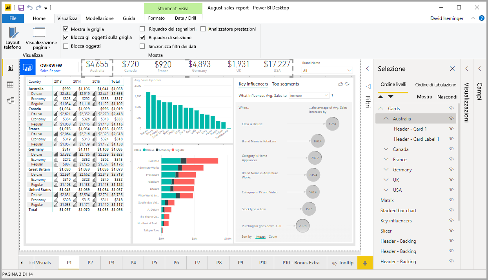
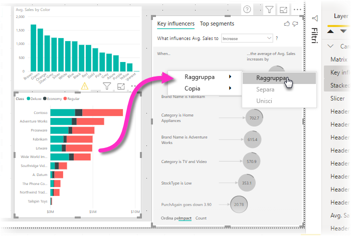
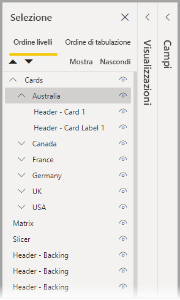
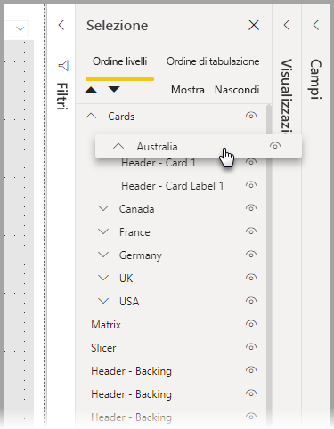
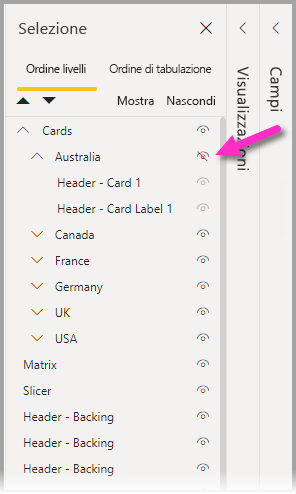
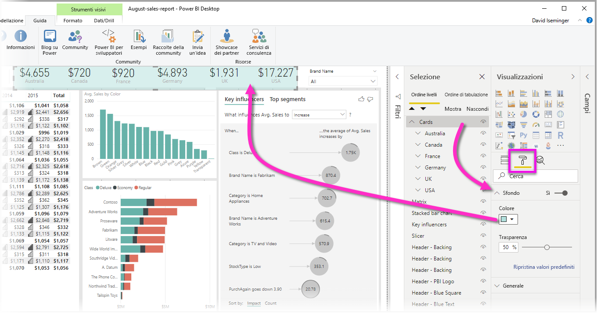

# Usare il raggruppamento in Power BI Desktop
Con il **raggruppamento** in **Power BI Desktop**, è possibile raggruppare nel report gli oggetti visivi, ad esempio pulsanti, caselle di testo, immagini di forme e qualsiasi oggetto visivo creato, proprio come si raggruppano gli elementi in PowerPoint. Il raggruppamento di oggetti visivi in un report consente di trattare il gruppo come un oggetto singolo, rendendo più semplici, rapidi e intuitivi lo spostamento, il ridimensionamento e la gestione dei livelli nel report.

## Creazione di gruppi

Per creare un gruppo di oggetti visivi in Power BI Desktop, selezionare il primo oggetto visivo dall'area di disegno, quindi tenere premuto CTRL e fare clic su uno o più oggetti visivi da aggiungere al gruppo e infine fare clic con il pulsante destro del mouse sulla raccolta di oggetti visivi e selezionare **Gruppo** dal menu visualizzato.

I gruppi vengono visualizzati nel riquadro **Selezione**. È possibile definire un numero qualsiasi di gruppi di oggetti visivi, a seconda delle esigenze del proprio report, ed è anche possibile annidare i gruppi di oggetti visivi. Nell'immagine seguente il gruppo *Australia* è annidato nel gruppo *Cards*. È possibile espandere un gruppo selezionando la freccia rivolta verso l'alto accanto al nome del gruppo e comprimerlo selezionando di nuovo tale freccia. 

All'interno del riquadro **Selezione** è inoltre possibile trascinare e rilasciare singoli oggetti visivi in modo da includerli in un gruppo, rimuoverli da un gruppo, annidare un gruppo oppure rimuovere un gruppo o un singolo oggetto visivo da un annidamento. È sufficiente trascinare l'oggetto visivo che si vuole modificare e spostarlo nella posizione desiderata. La sovrapposizione degli oggetti visivi, se presente, viene determinata in base al relativo ordine nell'elenco *Ordine dei livelli*.

Per rimuovere il raggruppamento, è sufficiente selezionare il gruppo, fare clic con il pulsante destro del mouse e scegliere **Separa** dal menu visualizzato.

## Nascondere e mostrare oggetti visivi o gruppi

È possibile nascondere o mostrare facilmente i gruppi usando il riquadro **Selezione**. Per nascondere un gruppo, selezionare il pulsante con l'occhio accanto al nome del gruppo (o di qualsiasi oggetto visivo singolo) per indicare se l'oggetto visivo o il gruppo è nascosto o visualizzato. Nell'immagine seguente il gruppo *Australia* è nascosto e viene visualizzata la parte restante dei gruppi annidati in *Cards*.

Quando si nasconde un gruppo, tutti gli oggetti visivi all'interno di tale gruppo vengono nascosti, come indicato dal colore grigio del pulsante dell'occhio (non disponibile per attivare o disattivare il gruppo perché l'intero gruppo è nascosto). Per nascondere solo determinati oggetti visivi all'interno di un gruppo, è sufficiente disattivare il pulsante con l'occhio accanto all'oggetto visivo. In questo modo, solo tale oggetto visivo viene nascosto.

## Selezione di oggetti visivi in un gruppo

Esistono diversi modi per spostarsi tra gli elementi all'interno di un gruppo di oggetti visivi e selezionarli. L'elenco seguente descrive questo comportamento:

* Quando si fa clic su uno spazio vuoto all'interno di un gruppo, ad esempio uno spazio vuoto tra gli oggetti visivi, non viene effettuata alcuna selezione
* Quando si fa clic su un oggetto visivo in un gruppo, viene selezionato l'intero gruppo, mentre un secondo clic ha l'effetto di selezionare il singolo oggetto visivo
* Quando si seleziona un gruppo, quindi si seleziona un altro oggetto nell'area di disegno del report e infine si seleziona **Gruppo** dal menu di scelta rapida, viene creato un gruppo annidato
* Quando si selezionano due gruppi e si fa clic con il pulsante destro del mouse, viene visualizzata un'opzione per unire i gruppi selezionati, invece di annidarli

## Applicare un colore di sfondo

È anche possibile applicare un colore di sfondo a un gruppo usando la sezione **Formattazione** del riquadro **Visualizzazioni**, come illustrato nell'immagine seguente. 

Dopo aver applicato un colore di sfondo, è possibile fare clic sullo spazio tra gli oggetti visivi nel gruppo per selezionare il gruppo. Confrontare questo comportamento con la selezione dello spazio vuoto tra gli oggetti visivi in un gruppo, che non ha l'effetto di selezionare il gruppo. 

## Passaggi successivi
Per altre informazioni sul raggruppamento, guardare il video seguente:

* [Raggruppamento in Power BI Desktop - video](https://youtu.be/sf4n7VXoQHY?t=10)

Potrebbero essere interessanti anche gli articoli seguenti:

* [Usare il drill-through tra report in Power BI Desktop](desktop-cross-report-drill-through.md)
* [Uso dei filtri dei dati in Power BI Desktop](visuals/power-bi-visualization-slicers.md)

