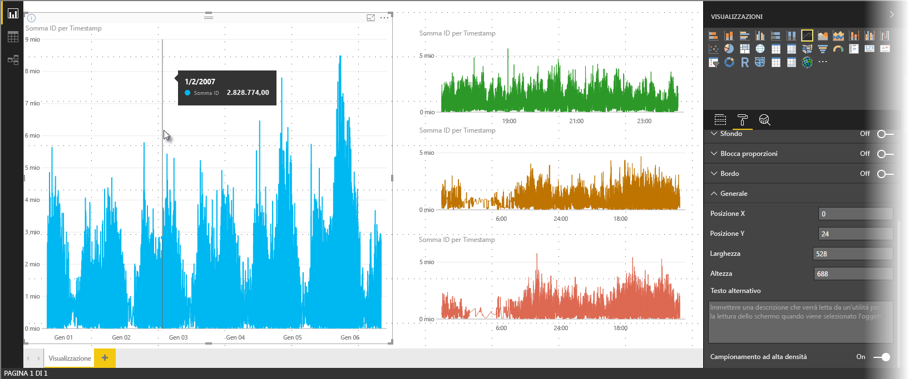
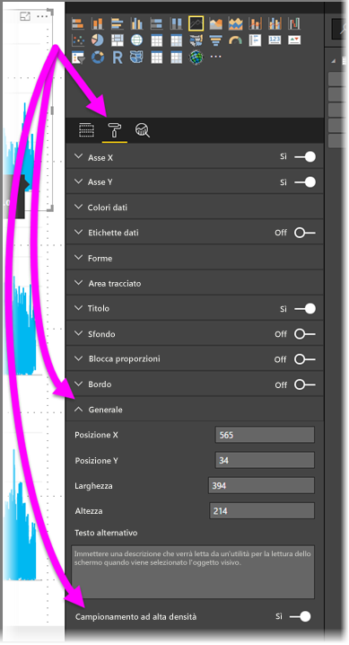

# Campionamento di linee ad alta densità in Power BI
A partire dalla versione di giugno 2017 di **Power BI Desktop** e dagli aggiornamenti del **servizio Power BI**, è disponibile un nuovo algoritmo di campionamento che migliora gli oggetti visivi che campionano i dati ad alta densità. Ad esempio, è possibile creare un grafico a linee dai risultati delle vendite dei negozi, ciascuno dei quali con più di diecimila ricevute di vendita all'anno. Un grafico a linee di tali informazioni di vendita campionerebbe i dati (selezionerebbe cioè una rappresentazione significativa dei dati, per illustrare come le vendite variano nel tempo) dai dati di ogni negozio, creando un grafico a linee multiserie che quindi rappresenta i dati sottostanti. Si tratta di una pratica comune nella visualizzazione dei dati ad alta densità. Power BI Desktop ha migliorato il campionamento dei dati ad alta densità, come descritto dettagliatamente in questo articolo.

> [!NOTE]
> L'**algoritmo di campionamento ad alta densità** descritto in questo articolo è disponibile sia in **Power BI Desktop** che nel **servizio Power BI**.
> 
> 

## Come funziona il campionamento di linee ad alta densità
In precedenza, **Power BI** selezionava una raccolta di punti dati di esempio nell'intero intervallo di dati sottostanti in modo deterministico. Ad esempio, per i dati ad alta densità su un oggetto visivo che si estendeva su un anno di calendario, potevano esserci 350 punti dati di esempio visualizzati nell'oggetto visivo, ognuno dei quali era stato selezionato per verificare che l'intera gamma di dati (la serie complessiva dei dati sottostanti) fosse rappresentata nell'oggetto visivo. Per comprenderne il funzionamento, si immagini di tracciare il prezzo di un'azione nel periodo di un anno e di selezionare 365 punti dati in un oggetto visivo di grafico a linee (cioè un punto dati per ogni giorno).

In tal caso, esistono molti valori per un prezzo azionario nell'ambito di ogni giorno. Naturalmente esistono un valore massimo e minimo giornaliero, ma questi possono verificarsi in qualsiasi momento del giorno quando il mercato azionario è aperto. Per il campionamento di linee ad alta densità, se il campione di dati sottostante è stato acquisto alle 10:30 e alle 12:00 di ogni giorno, si potrebbe ottenere un'istantanea rappresentativa dei dati sottostanti (il prezzo alle 10:30 e alle 12:00), ma si potrebbe non catturare i prezzi massimo e minimo effettivi della quotazione per tale punto dati rappresentativo (tale giornata). In questa e in altre situazioni, il campionamento è rappresentativo dei dati sottostanti, ma non sempre acquisisce i punti importanti, che in questo caso sarebbero i valori massimi e minimi del prezzo azionario giornaliero.

Per definizione, verranno campionati i dati ad alta densità per creare abbastanza rapidamente le visualizzazioni disponibili all'interattività. Troppi punti dati su un oggetto visivo possono bloccarlo e possono comportare una riduzione della visibilità delle tendenze. Il modo in cui i dati verranno campionati è quindi ciò che comporta la creazione dell'algoritmo di campionamento per offrire la migliore esperienza di visualizzazione. In Power BI Desktop ora l'algoritmo è migliorato per fornire la combinazione migliore della velocità di risposta, della rappresentazione e della conservazione dei punti importanti in ogni intervallo di tempo.

## Funzionamento del nuovo algoritmo di campionamento di linee
Il nuovo algoritmo per il campionamento di linee ad alta densità è disponibile per gli oggetti visivi di grafico a linee e grafico ad aree con un asse x continuo.

Per un oggetto visivo ad alta densità, **Power BI** suddivide in modo intelligente i dati in blocchi ad alta risoluzione e quindi rileva punti importanti per rappresentare ogni blocco. Questo processo di suddivisione dei dati ad alta risoluzione è ottimizzato per assicurarsi che il grafico risultante sia visivamente distinguibile dal rendering di tutti i punti dati sottostanti, ma molto più veloce e più interattivo.

### Valori minimo e massimo per oggetti visivi a linee ad alta densità
Per qualsiasi visualizzazione specificata, si applicano le seguenti limitazioni visive:

* **3.500** è il numero massimo di punti dati *visualizzati* sull'oggetto visivo, indipendentemente dal numero di serie o punti dati sottostante. Di conseguenza, se si hanno 10 serie con 350 punti dati ciascuna, l'oggetto visivo ha raggiunto il limite di punti dati complessivo massimo. Se si ha una sola serie, essa può contenere fino a 3.500 punti dati se il nuovo algoritmo lo ritiene il miglior campionamento per i dati sottostanti.
* Esiste un massimo di **60 serie** per qualsiasi oggetto visivo. Se si hanno più di 60 serie, suddividere i dati e creare più oggetti visivi con massimo 60 serie ciascuno. È consigliabile usare un **filtro dei dati** per mostrare solo i segmenti dei dati (solo alcune serie). Ad esempio, se tutte le sottocategorie sono visualizzate nella legenda, è possibile usare un filtro dei dati per filtrare in base alla categoria generale nella stessa pagina del report.

Questi parametri garantiscono che il rendering degli oggetti visivi in Power BI Desktop avvenga molto rapidamente, che gli oggetti rispondano all'interazione con gli utenti e non comportino un overhead di elaborazione superfluo nel computer di rendering dell'oggetto visivo.

### Valutazione di punti dati rappresentativi per gli oggetti visivi a linee ad alta densità
Quando il numero di punti dati sottostanti supera i punti dati massimi che possono essere rappresentati nell'oggetto visivo (oltre 3.500), inizia un processo denominato *binning*, che suddivide i dati sottostanti in gruppi denominati *bin* e quindi li perfeziona in modo iterativo.

L'algoritmo crea tanti contenitori quanti sono possibili in modo creare la granularità maggiore per l'oggetto visivo. All'interno di ogni contenitore, l'algoritmo rileva il valore di dati minimo e massimo, per assicurarsi che i valori importanti e significativi (ad esempio, outlier) vengano acquisiti e visualizzati nell'oggetto visivo. In base ai risultati del binning e alla valutazione successiva dei dati da parte di Power BI, viene determinata la risoluzione minima per l'asse x per l'oggetto visivo, per poter garantire la massima granularità per l'oggetto visivo.

Come accennato in precedenza, la granularità minima per ogni serie è 350 punti, la massima è 3.500.

Ogni contenitore è rappresentato da due punti dati, che diventano i punti dati rappresentativi del contenitore nell'oggetto visivo. I punti dati sono semplicemente il valore alto e basso per tale contenitore e, selezionandoli, il processo di creazione contenitori garantisce che qualsiasi importante valore alto o significativo valore basso sia acquisito e che ne venga eseguito il rendering nell'oggetto visivo.

Se tutto ciò suggerisce una gran quantità di analisi per assicurarsi di acquisire occasionalmente un outlier e di visualizzarlo correttamente nell'oggetto visivo, è proprio così: ma questo è l'esatto motivo alla base del nuovo algoritmo e del processo di binning.

## Descrizioni comandi e campionamento di linee ad alta densità
È importante notare che è il processo di binning, che restituisce il valore minimo e massimo in un determinato bin acquisito e visualizzato, può influire sul modo in cui le descrizioni comandi mostrano i dati quando si passa il mouse sui punti dati. Per illustrare come e perché ciò accade, rivediamo l'esempio dei prezzi delle azioni.

Si supponga che si stia creando un oggetto visivo in base al prezzo azionario e che si stia eseguendo il confronto di due azioni diverse, che usano entrambe **il campionamento ad alta densità**. I dati sottostanti per ogni serie contengono molti punti dati (è possibile acquisire il prezzo azionario ogni secondo del giorno). L'algoritmo di campionamento di linee ad alta densità esegue il binning per ogni serie indipendentemente dall'altra.

Ora si supponga che il prezzo della prima azione aumenti improvvisamente alle 12:02, quindi diminuisca rapidamente dieci secondi dopo. Si tratta di un punto dati importante. Durante la creazione di contenitori per tale azione, il valore alto delle 12:02 sarà un punto dati rappresentativo per tale contenitore.

Per la seconda azione, tuttavia, le 12:02 non corrispondevano a un valore alto né a un valore basso nel bin che includeva tale orario. Forse il valore alto e basso per il bin che include le 12:02 si è registrato tre minuti dopo. In tale situazione, quando si crea il grafico a linee e si passa il mouse sulle ore 12:02, verrà visualizzato un valore nella descrizione comando per la prima azione (perché è aumentata alle 12:02 e tale valore è stato selezionato come punto dati alto di tale contenitore), ma *non* si vedrà alcun valore nella descrizione comandi alle 12:02 per la seconda azione. Ciò avviene perché la seconda azione non aveva né un valore alto né un valore basso per il contenitore che includeva le 12:02. Non sono quindi presenti dati da visualizzare per la seconda azione alle 12:02 e, di conseguenza, non verranno visualizzati dati di descrizione comandi.

Questa situazione si verifica frequentemente con le descrizioni comandi. I valori alto e basso per un determinato contenitore potrebbero non corrispondere perfettamente ai punti di valore dell'asse x ridimensionati in modo uniforme e, di conseguenza, la descrizione comando non visualizzerà alcun valore.  

## Come attivare il campionamento di linee ad alta densità
Per impostazione predefinita, il nuovo algoritmo è **attivato**. Per modificare questa impostazione, passare al riquadro **Formattazione** nella scheda **Generale** e nella parte inferiore sarà visibile un interruttore denominato **Campionamento ad alta densità**. Per disattivarlo, scorrere verso **Disattiva**.

## Considerazioni e limitazioni
Il nuovo algoritmo per il campionamento di linee ad alta densità è un miglioramento importante per Power BI, ma è necessario tenere conto di alcuni aspetti quando si elaborano dati e valori ad alta densità.

* A causa di una maggiore granularità e del processo di creazione di contenitori, **le descrizioni comandi** potrebbero visualizzare un valore solo se i dati rappresentativi sono allineati con il cursore. Per altre informazioni, vedere la sezione *Descrizioni comandi e campionamento di linee ad alta densità* in questo articolo.
* Quando le dimensioni di un'origine di dati complessiva sono troppo grande, il nuovo algoritmo elimina le serie (gli elementi della legenda) per soddisfare il vincolo massimo di importazione di dati.
  
  * In questo caso, il nuovo algoritmo ordina la legenda delle serie alfabeticamente, inizia dal basso l'elenco di elementi della legenda in ordine alfabetico fino a quando non viene raggiunto il massimo di importazione di dati e non importa serie aggiuntive.
* Quando un set di dati sottostante contiene più di 60 serie (il numero massimo di serie, come descritto in precedenza), il nuovo algoritmo ordina la serie alfabeticamente ed elimina le serie oltre la sessantesima in ordine alfabetico.
* Se i valori nei dati non sono di tipo *numerico* o *data/ora*, Power BI non userà il nuovo algoritmo e ripristinerà l'algoritmo precedente (campionamento non ad alta densità).
* L'impostazione **Mostra elementi senza dati** non è supportata con il nuovo algoritmo.
* Il nuovo algoritmo non è supportato quando si usa una connessione dinamica a un modello ospitato in SQL Server Analysis Services (versione 2016 o precedenti). È supportato nei modelli ospitati in **Power BI** o Azure Analysis Services.

## Passaggi successivi
Per informazioni sul campionamento ad alta densità nei grafici a dispersione, vedere l'articolo seguente.

* [Campionamento ad alta densità nei grafici a dispersione di Power BI](desktop-high-density-scatter-charts.md)

