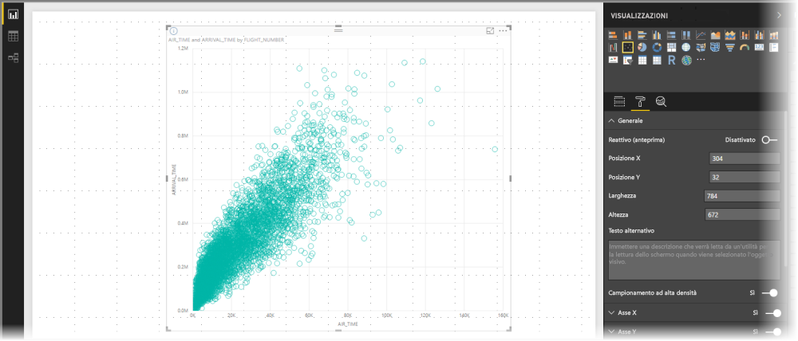
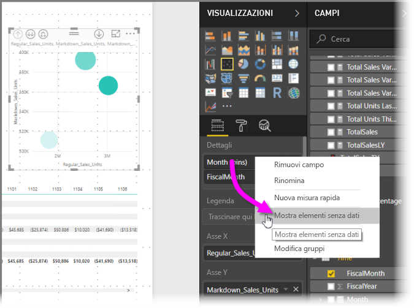
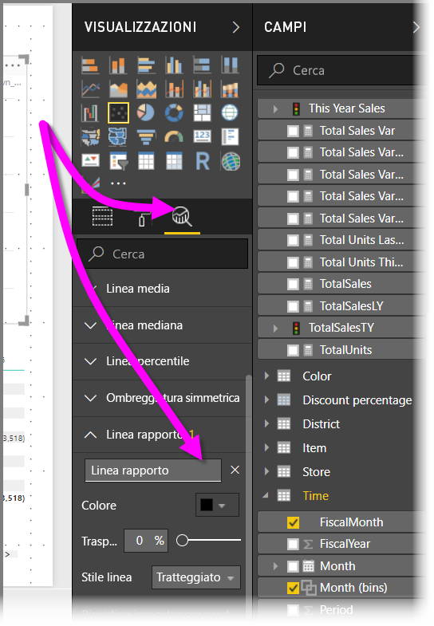
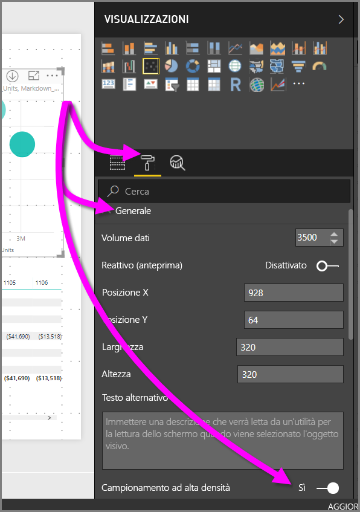

# Campionamento ad alta densità nei grafici a dispersione di Power BI
A partire dalla versione di settembre 2017 di **Power BI Desktop** e dagli aggiornamenti del **servizio Power BI**, è disponibile un nuovo algoritmo di campionamento che migliora il modo in cui i grafici a dispersione rappresentano i dati ad alta densità.

È ad esempio possibile creare un grafico a dispersione dall'attività di vendita dell'organizzazione, in cui ogni negozio ha decine di migliaia di punti dati ogni anno. Un grafico a dispersione di tali informazioni campionerebbe i dati (selezionerebbe cioè una rappresentazione significativa dei dati, per illustrare come le vendite procedono nel tempo) dai dati disponibili, creando un grafico a dispersione che rappresenta i dati sottostanti. Si tratta di una pratica comune nei grafici a dispersione ad alta densità. Power BI ha migliorato il campionamento dei dati ad alta densità, come descritto dettagliatamente in questo articolo.

> [!NOTE]
> L'algoritmo di **campionamento ad alta densità** descritto in questo articolo è disponibile nei grafici a dispersione sia per **Power BI Desktop** che per il **servizio Power BI**.
> 
> 

## Funzionamento dei grafici a dispersione ad alta densità
In precedenza, **Power BI** selezionava una raccolta di punti dati di esempio nell'intero intervallo di dati sottostanti in modo deterministico per cerare un grafico a dispersione. In particolare, Power BI seleziona la prima e l'ultima riga di dati nella serie del grafico a dispersione, quindi divide uniformemente le righe restanti in modo che un totale di 3.500 punti dati venga tracciato nel grafico a dispersione. Se ad esempio il campione ha 35.000 righe, la prima e l'ultima riga vengono selezionate per il tracciato, quindi viene tracciata anche una riga ogni dieci (35.000 / 10 = una riga ogni dieci = 3.500 punti dati). Sempre in precedenza, i punti o i valori Null che non potevano essere tracciati (ad esempio, i valori di testo) nella serie di dati non venivano visualizzati e quindi non tenuti in considerazione durante la generazione dell'oggetto visivo. Con tale campionamento, anche la densità percepita del grafico a dispersione si basava sui punti dati rappresentativi, quindi la densità implicita degli oggetti visivi era il risultato dei punti campionati, non della raccolta completa dei dati sottostanti.

Quando si abilita **Campionamento ad alta densità**, Power BI implementa un algoritmo che elimina la sovrapposizione dei punti e assicura che i punti sull'oggetto visivo siano raggiungibili quando si interagisce con l'oggetto visivo. L'algoritmo assicura anche che tutti i punti del set di dati vengano rappresentati nell'oggetto visivo, fornendo contesto al significato dei punti selezionati, invece di limitarsi a tracciare un campione rappresentativo.

Per definizione, verranno campionati i dati ad alta densità per creare abbastanza rapidamente le visualizzazioni disponibili all'interattività. Troppi punti dati su un oggetto visivo possono bloccarlo e possono comportare una riduzione della visibilità delle tendenze. Il modo in cui i dati verranno campionati è quindi ciò che comporta la creazione dell'algoritmo di campionamento per offrire la migliore esperienza di visualizzazione e assicurare che tutti i dati vengano rappresentati. In Power BI ora l'algoritmo è migliorato per fornire la combinazione migliore della velocità di risposta, della rappresentazione e della conservazione dei punti importanti nel set di dati completo.

> [!NOTE]
> Il modo migliore per tracciare i grafici a dispersione che usano l'algoritmo di **campionamento ad alta densità** è usare oggetti visivi quadrati, come per tutti i grafici a dispersione.
> 
> 

## Funzionamento del nuovo algoritmo di campionamento dei grafici a dispersione
Il nuovo algoritmo per il **campionamento ad alta densità** per i grafici a dispersione usa metodi che acquisiscono e rappresentano i dati sottostanti in modo più efficace ed elimina la sovrapposizione dei punti. Ciò avviene a partire da un raggio di piccole dimensioni per ogni punto dati (le dimensioni del cerchio dell'oggetto visivo per un determinato punto della visualizzazione). Il raggio di tutti i punti dati viene quindi aumentato. Quando due (o più) punti dati si sovrappongono, un singolo cerchio (con le dimensioni del raggio aumentate) rappresenta tali punti dati sovrapposti. L'algoritmo continua ad aumentare il raggio dei punti dati, finché il valore del raggio non restituisce un numero ragionevole di punti dati, 3.500, visualizzati nel grafico a dispersione.

I metodi di questo algoritmo assicurano che gli outlier vengano rappresentati nell'oggetto visivo risultante. L'algoritmo rispetta anche la scala quando determina la sovrapposizione, in modo che vengano visualizzate scale esponenziali fedeli ai punti visualizzati sottostanti.

L'algoritmo mantiene anche la forma complessiva del grafico a dispersione.

> [!NOTE]
> Quando si usa l'algoritmo di **campionamento ad alta densità** per i grafici a dispersione, l'obiettivo è un'*accurata distribuzione* dei dati e *non* la densità implicita degli oggetti visivi. È ad esempio possibile visualizzare un grafico a dispersione con molti cerchi che si sovrappongono (densità) in una determinata area, in cui è necessario il clustering di più punti dati. Poiché l'algoritmo di **campionamento ad alta densità** può usare un cerchio per rappresentare più punti dati, tale densità implicita degli oggetti visivi (o "clustering") non verrà visualizzata. Per ottenere maggiori dettagli in una determinata area, è possibile usare i filtri dei dati per fare zoom avanti.
> 
> 

Inoltre i punti dati che non possono essere tracciati (ad esempio, i valori Null o di testo) vengono ignorati, quindi viene selezionato un altro valore che può essere tracciato, per assicurare che venga mantenuta la vera forma del grafico a dispersione.

### Quando viene usato l'algoritmo standard per i grafici a dispersione
In alcuni casi non è possibile applicare il **campionamento ad alta densità** a un grafico a dispersione e viene quindi usato l'algoritmo originale. Questi casi sono i seguenti:

* Se si fa clic con il pulsante destro del mouse su un valore in **Dettagli** e lo si imposta su **Mostra elementi senza dati** nel menu, il grafico a dispersione tornerà all'algoritmo originale.
  
  
* Se sono presenti valori sull'asse di **riproduzione**, il grafico a dispersione ripristinerà l'algoritmo originale.
* Se in un grafico a dispersione mancano sia l'asse X che l'asse Y, il grafico ripristina l'algoritmo originale.
* Se si usa una **riga del rapporto** nel riquadro **Analisi**, il grafico ripristina l'algoritmo originale.
  
  

## Attivazione del campionamento ad alta densità per un grafico a dispersione
Per attivare **Campionamento ad alta densità**, selezionare un grafico a dispersione, andare al riquadro **Formattazione**, espandere la scheda **Generale** e nella parte inferiore della scheda posizionare il dispositivo di scorrimento **Campionamento ad alta densità** su **Sì**.

> [!NOTE]
> Dopo che il dispositivo di scorrimento è stato attivato, Power BI proverà a usare l'algoritmo di **campionamento ad alta densità** quando possibile. Quando l'algoritmo non può essere usato (ad esempio, quando si inserisce un valore nell'asse di *riproduzione*), il dispositivo di scorrimento rimane impostato su **Attiva** anche se il grafico ha ripristinato l'algoritmo standard. Se quindi si rimuove un valore dall'asse di *riproduzione* (o cambiano le condizioni per abilitare l'uso dell'algoritmo di campionamento ad alta densità), il grafico userà automaticamente il campionamento ad alta densità per tale grafico, perché il dispositivo di scorrimento è attivo.
> 
> [!NOTE]
> I punti dati vengono raggruppati o selezionati dall'indice. La presenza di una legenda non influisce sul campionamento per l'algoritmo, ma solo sull'ordinamento dell'oggetto visivo.
> 
> 

## Considerazioni e limitazioni
L'algoritmo per il campionamento ad alta densità è un miglioramento importante per Power BI, ma esistono alcune considerazioni da fare quando si elaborano valori e grafici a dispersione ad alta densità.

* L'algoritmo di **campionamento ad alta densità** funziona solo con le connessioni in tempo reale ai modelli basati sul servizio Power BI, ai modelli importati o a DirectQuery.

## Passaggi successivi
Per altre informazioni sul campionamento ad alta densità in altri grafici, vedere l'articolo seguente.

* [Campionamento di linee ad alta densità in Power BI](desktop-high-density-sampling.md)

