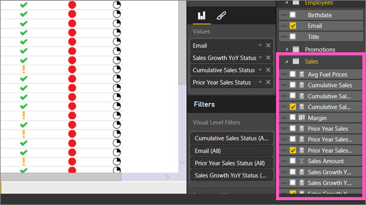

# Importare e visualizzare indicatori KPI in Power BI
Con **Power BI Desktop** è possibile importare e visualizzare gli indicatori KPI nelle tabelle, nelle matrici e nelle schede.

Seguire questa procedura per importare e visualizzare gli indicatori KPI.

1. Iniziare con una cartella di lavoro di Excel che contiene un modello di Power Pivot e gli indicatori KPI. Questo esercizio usa una cartella di lavoro denominata *KPI*. È anche possibile ottenere [informazioni su come importare cartelle di lavoro](desktop-import-excel-workbooks.md).  
2. Aprire il report e selezionare la scheda **Top Performers** .  La matrice *Top Performers* contiene gli indicatori KPI per tre diverse misure relative alle vendite in base all'indirizzo di posta elettronica del dipendente.  
   
    

Tutto qui. Gli indicatori KPI possono essere usati per evidenziare tendenze importanti, lo stato di avanzamento o altri indicatori importanti.

