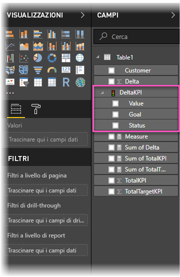
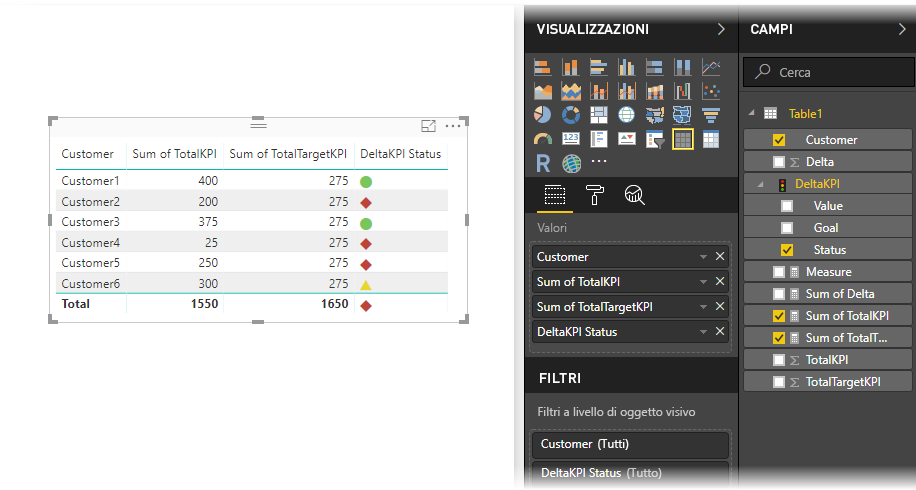

# Importare e visualizzare indicatori KPI in Power BI
Con **Power BI Desktop** è possibile importare e visualizzare gli indicatori KPI nelle tabelle, nelle matrici e nelle schede.

Seguire questa procedura per importare e visualizzare gli indicatori KPI.

1. Iniziare con una cartella di lavoro di Excel che contiene un modello di Power Pivot e gli indicatori KPI. Questo esercizio usa una cartella di lavoro denominata *KPI*.

1. Importare la cartella di lavoro di Excel in Power BI tramite **File -> Importa -> Contenuto della cartella di lavoro di Excel**. È anche possibile ottenere [informazioni su come importare cartelle di lavoro](desktop-import-excel-workbooks.md). 

1. Dopo l'importazione in Power BI, l'indicatore KPI verrà visualizzato nel riquadro **Campi** contrassegnato con l'icona di . Per usare un indicatore KPI nel report, assicurarsi di espandere il relativo contenuto, esponendo i campi **Valore**, **Obiettivo** e **Stato**.

    

1. L'uso degli indicatori KPI importati è ottimale nei tipi di visualizzazione standard, ad esempio il tipo **Tabella**. Power BI include anche il tipo di visualizzazione **KPI**, che deve essere usato solo per creare nuovi indicatori KPI.
   
    

Tutto qui. Gli indicatori KPI possono essere usati per evidenziare tendenze, lo stato di avanzamento o altri indicatori importanti.
