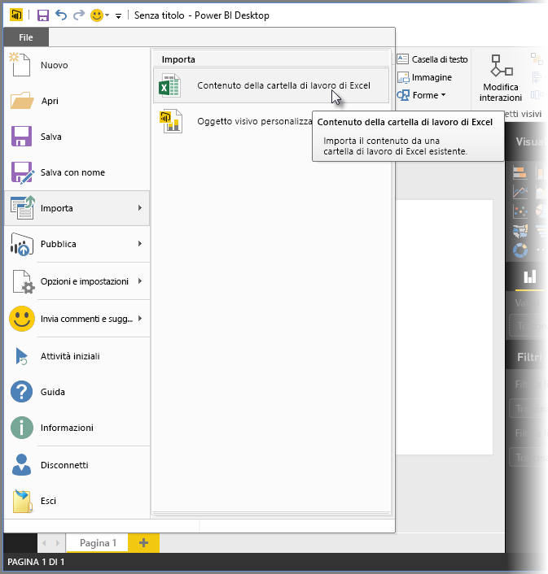
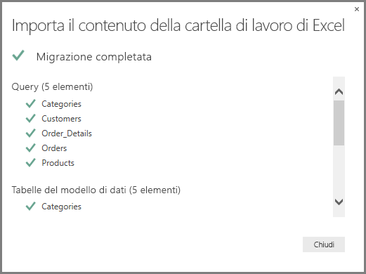
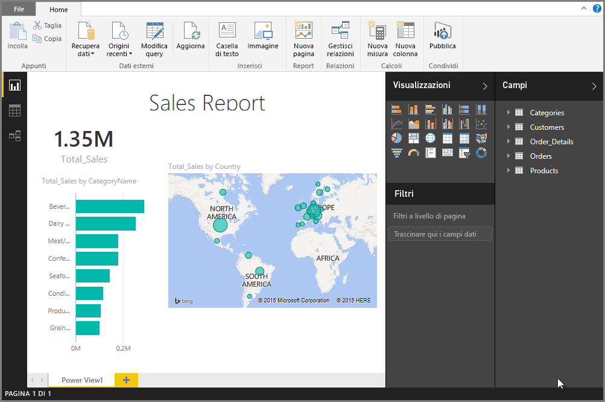

# Importare le cartelle di lavoro di Excel in Power BI Desktop
Con Power BI Desktop è possibile importare facilmente in Power BI Desktop cartelle di lavoro di Excel che contengono query di Power Query, modelli di Power Pivot e fogli di lavoro di Power View. Power BI Desktop crea automaticamente report e visualizzazioni in base alla cartella di lavoro di Excel. Dopo aver importato i report, è possibile continuare a migliorarli e perfezionarli usando Power BI Desktop e le funzionalità esistenti e nuove rilasciate a ogni aggiornamento mensile di Power BI Desktop.

## Come è possibile importare una cartella di lavoro di Excel?
1. Per importare una cartella di lavoro di Excel in Power BI Desktop, selezionare **File** > **Importa** > **Power Query Power Pivot, Power View**.

   

2. Nella finestra **Apri** selezionare una cartella di lavoro di Excel da importare. 

   Anche se attualmente non esiste alcuna limitazione per le dimensioni o il numero di oggetti nella cartella di lavoro, l'analisi e l'importazione di cartelle di lavoro di dimensioni maggiori in Power BI Desktop richiedono più tempo.

   > [!NOTE]
   > Per caricare o importare file di Excel dalle cartelle di OneDrive for Business condivise o dalle cartelle del gruppo di Office 365, usare l'URL del file di Excel e immetterlo nell'origine dati Web in Power BI Desktop. Per formattare correttamente l'URL di OneDrive for Business è necessario seguire alcuni passaggi. Per informazioni e per la serie di passaggi corretta, vedere [Usare collegamenti OneDrive for Business in Power BI Desktop](desktop-use-onedrive-business-links.md).
   > 
   > 

3. Nella finestra di dialogo di importazione visualizzata selezionare **Avvia**.

   

   Power BI Desktop analizza la cartella di lavoro e la converte in un file di Power BI Desktop (con estensione pbix). Si tratta di un evento singolo. Dopo essere stato creato con questi passaggi, il file di Power BI Desktop non ha alcuna dipendenza dalla cartella di lavoro di Excel originale e può essere modificato, salvato e condiviso senza influire sulla cartella di lavoro originale.

   Al termine dell'importazione, viene visualizzata una pagina di riepilogo che descrive gli elementi convertiti, oltre a elencare gli elementi che non è stato possibile importare.

   

4. Selezionare **Chiudi**. 

   Power BI Desktop importa la cartella di lavoro di Excel e carica un report in base al contenuto della cartella di lavoro.

   

Dopo aver importato la cartella di lavoro, è possibile continuare a modificare il report. È possibile creare nuove visualizzazioni, aggiungere dati o creare nuove pagine del report usando le caratteristiche e le funzionalità incluse in Power BI Desktop.

## Quali elementi della cartella di lavoro vengono importati?
Power BI Desktop può importare gli elementi seguenti, comunemente definiti *oggetti*, in Excel.

| Oggetto nella cartella di lavoro di Excel | Risultato finale nel file di Power BI Desktop |
| --- | --- |
| Query di Power Query |Tutte le query di Power Query da Excel vengono convertite in query in Power BI Desktop. Se sono stati definiti dei gruppi di query nella cartella di lavoro di Excel, la stessa organizzazione viene replicata in Power BI Desktop. Vengono caricate tutte le query, a meno che non siano state impostate su **Crea solo connessione** nella finestra di dialogo **Importa dati** di Excel. Per personalizzare il comportamento di caricamento, selezionare **Proprietà** dalla scheda **Home** dell'editor di Power Query in Power BI Desktop. |
| Connessioni dati esterne di Power Pivot |Tutte le connessioni dati esterne di Power Pivot vengono convertite in query in Power BI Desktop. |
| Tabelle collegate o tabelle della cartella di lavoro corrente |Se una tabella del foglio di lavoro in Excel è collegata al modello di dati oppure a una query (tramite il comando *Da tabella* oppure la funzione *Excel.CurrentWorkbook()* in M), sono disponibili le opzioni seguenti: <ol><li><b>Importare la tabella nel file di Power BI Desktop</b>. La tabella è un singolo snapshot dei dati. Dopo la creazione dello snapshot, i dati nella tabella di Power BI Desktop sono di sola lettura. Esiste un limite di dimensione di 1 milione di caratteri (in totale, include tutte le intestazioni di colonna e le celle) per le tabelle create con questa opzione.</li><li><b>Mantenere una connessione alla cartella di lavoro originale</b>. In alternativa, è possibile mantenere una connessione alla cartella di lavoro di Excel originale; Power BI Desktop recupera il contenuto più recente in questa tabella con ogni aggiornamento, proprio come qualsiasi altra query creata in base a una cartella di lavoro di Excel in Power BI Desktop.</li></ul> |
| Colonne calcolate, misure, indicatori KPI, categorie di dati e relazioni del modello di dati |Questi oggetti del modello di dati vengono convertiti negli oggetti equivalenti in Power BI Desktop. Si noti che alcune categorie di dati non sono disponibili in Power BI Desktop, ad esempio la categoria Immagine. In questi casi, vengono ripristinate le informazioni sulle categorie di dati per le colonne in questione. |
| Fogli di lavoro di Power View |Per ogni foglio di lavoro di Power View in Excel viene creata una nuova pagina del report. Il nome e l'ordine di queste pagine del report corrispondono a quelli della cartella di lavoro originale. |

## Sono presenti limitazioni per l'importazione di una cartella di lavoro?
Esistono alcune limitazioni relative all'importazione di una cartella di lavoro in Power BI Desktop:

* **Connessioni esterne ai modelli tabulari di SQL Server Analysis Services:** in Excel 2013 è possibile creare una connessione ai modelli tabulari di SQL Server Analysis Services e creare report di Power View in base a questi modelli, senza dover importare i dati. Questo tipo di connessione non è attualmente supportato come parte dell'importazione di cartelle di lavoro di Excel in Power BI Desktop. Come soluzione alternativa, è necessario ricreare tali connessioni esterne in Power BI Desktop.
* **Gerarchie:** questo tipo di oggetto del modello di dati non è al momento supportato in Power BI Desktop. Di conseguenza, le gerarchie vengono ignorate durante l'importazione di una cartella di lavoro di Excel in Power BI Desktop.
* **Colonne di dati binari:** questo tipo di colonna del modello di dati non è al momento supportato in Power BI Desktop. Le colonne di dati binari vengono rimosse dalla tabella risultante in Power BI Desktop.
* **Elementi di Power View non supportati:** alcune funzionalità di Power View non sono ancora disponibili in Power BI Desktop, ad esempio i temi o determinati tipi di visualizzazioni (grafico a dispersione con asse di riproduzione, comportamenti di drill-down e così via). Queste visualizzazioni non supportate generano messaggi di *Visualizzazione non supportata* nei percorsi corrispondenti nel report di Power BI Desktop, che è possibile eliminare o riconfigurare in base alle esigenze.
* **Intervalli denominati che usano** ***From Table*** **in Power Query oppure** ***Excel.CurrentEorkbook*** **in M:** L'importazione dei dati di questi intervalli denominati in Power BI Desktop non è attualmente supportata, ma si tratta di un aggiornamento previsto. Attualmente, questi intervalli denominati vengono caricati in Power BI Desktop come connessione alla cartella di lavoro di Excel esterna.
* **Da Power Pivot a SSRS:** le connessioni esterne di Power Pivot a SQL Server Reporting Services (SSRS) non sono attualmente supportate, perché tale origine dati non è al momento disponibile in Power BI Desktop.

