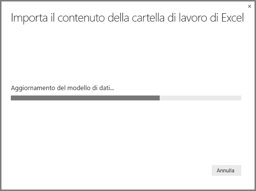

# Importare le cartelle di lavoro di Excel in Power BI Desktop
Con **Power BI Desktop**, è possibile importare cartelle di lavoro di Excel che contengono query di Power Query, modelli Power Pivot e fogli di lavoro di Power View in Power BI Desktop. Report e visualizzazioni vengono creati automaticamente in base a una cartella di lavoro di Excel e, una volta importati, è possibile continuare a migliorarli e perfezionarli usando Power BI Desktop e le funzionalità esistenti e nuove rilasciate a ogni aggiornamento mensile di Power BI Desktop.

In futuro si prevede di fornire un'ulteriore comunicazione tra Excel e Power BI Desktop (ad esempio, importazione/esportazione). L'attuale funzionalità di importazione delle cartelle di lavoro in Power BI Desktop consente agli utenti di Excel esistenti di iniziare a usare Power BI Desktop.

## Come è possibile importare una cartella di lavoro di Excel?
Per importare una cartella di lavoro, da Power BI Desktop selezionare **File -\> Importa -\> Contenuto della cartella di lavoro di Excel**.

Viene visualizzata una finestra in cui è possibile selezionare la cartella di lavoro da importare. Non esiste attualmente alcuna limitazione per le dimensioni o il numero di oggetti nella cartella di lavoro, ma l'analisi e l'importazione delle cartelle di lavoro di dimensioni maggiori in Power BI Desktop richiedono più tempo.

> [!NOTE]
> Per caricare o importare file di Excel dalle **cartelle OneDrive for Business condivise** o dalle cartelle del **gruppo Office 365**, usare l'URL del file di Excel e immetterlo nell'origine dati **Web** in Power BI Desktop. Per formattare correttamente l'URL di **OneDrive for Business** sono necessari pochi passaggi. Vedere [Use OneDrive for Business links in Power BI Desktop](desktop-use-onedrive-business-links.md) (Usare i collegamenti di OneDrive for Business in Power BI Desktop) per altre informazioni e per la serie di passaggi corretta.
> 
> 

Dopo aver selezionato una cartella di lavoro, Power BI Desktop analizza la cartella di lavoro e la converte in un file di Power BI Desktop (.pbix). Si tratta di un evento singolo; una volta creato con questi passaggi, il file di Power BI Desktop non ha alcuna dipendenza dalla cartella di lavoro di Excel originale e può essere modificato o cambiato (oltre che salvato e condiviso) senza influire sulla cartella di lavoro originale.

Al termine dell'importazione, verrà visualizzata una pagina di **riepilogo** che descrive gli elementi convertiti, oltre a elencare tutti gli elementi che non è stato possibile importare.

Quando si seleziona **Chiudi**, il report viene caricato in Power BI Desktop. L'immagine seguente mostra che, dopo aver importato una cartella di lavoro di Excel, Power BI Desktop ha caricato automaticamente il report in base al contenuto della cartella di lavoro.

Ora che la cartella di lavoro è stata importata, è possibile continuare a elaborare il report, ad esempio creando nuove visualizzazioni, aggiungendo dati oppure creando nuove pagine, usando tutte le funzionalità incluse in Power BI Desktop.

## Quali elementi della cartella di lavoro vengono importati?
Power BI Desktop può importare gli elementi seguenti, comunemente definiti *oggetti*, in Excel.

| Oggetto nella cartella di lavoro di Excel | Risultato finale nel file di Power BI Desktop |
| --- | --- |
| Query di Power Query |Tutte le query di Power Query da Excel vengono convertite in query in Power BI Desktop. Se sono stati definiti dei gruppi di query nella cartella di lavoro di Excel, la stessa organizzazione verrà replicata in Power BI Desktop. A meno che non sia stata impostata su "Crea solo connessione" in Excel, vengono caricate tutte le query. Il comportamento di caricamento può essere personalizzato nella finestra di dialogo **Proprietà** della scheda **Home** di **Editor di Query** in Power BI Desktop. |
| Connessione dati esterni di Power Pivot |Tutte le connessioni dati esterni di Power Pivot verranno convertite in query in Power BI Desktop. |
| Tabelle collegate o tabelle Cartella di lavoro corrente |Se una tabella del foglio di lavoro in Excel è collegata al modello di dati oppure a una query (usando il comando *Da tabella* oppure la funzione *Excel.CurrentWorkbook()* in M), sono disponibili le opzioni seguenti.     1. Importare la tabella nel file di Power BI Desktop. Si tratta di una singola istantanea dei dati, dopo la quale non è possibile modificare i dati nella tabella in Power BI Desktop. Esiste un limite di dimensione di 1 milione di caratteri (in totale, che combina tutte le intestazioni di colonna e le celle) per le tabelle create con questa opzione.    2. Mantenere una connessione alla cartella di lavoro originale. In alternativa, è possibile mantenere una connessione alla cartella di lavoro di Excel originale; Power BI Desktop recupera il contenuto più recente in questa tabella con ogni aggiornamento, proprio come qualsiasi altra query creata in base a una cartella di lavoro di Excel in Power BI Desktop. |
| Colonne calcolate, misure, categorie di dati e relazioni del modello di dati |Questi oggetti del modello di dati vengono convertiti negli oggetti equivalenti in Power BI Desktop. Si noti che determinate categorie di dati non sono disponibili ancora in Power BI Desktop, ad esempio **Immagine**. In questi casi, verranno ripristinate le informazioni sulle categorie di dati per le colonne in questione. |
| Fogli di lavoro di Power View |Per ogni foglio di lavoro di Power View in Excel viene creata una nuova pagina del report. Il nome e l'ordine di queste pagine del report corrispondono a quelli della cartella di lavoro originale. |

## Sono presenti limitazioni per l'importazione di una cartella di lavoro?
Esistono alcune limitazioni per l'importazione di una cartella di lavoro in Power BI Desktop, che sono i seguenti:

1. **Connessioni esterne ai modelli tabulari di Analysis Services:** in Excel 2013, è possibile creare una connessione ai modelli tabulari di Analysis Services e creare report di Power View in base a questi modelli, senza dover importare i dati. Questo tipo di connessione non è supportato come parte dell'importazione di cartelle di lavoro di Excel in Power BI Desktop, ma sarà disponibile in un aggiornamento futuro. Nel frattempo, è necessario ricreare tali connessioni esterne in Power BI Desktop.
2. **Indicatori KPI:** questo tipo di oggetto del modello di dati non è al momento supportato in Power BI Desktop. Di conseguenza, gli indicatori KPI vengono ignorati durante l'importazione di una cartella di lavoro di Excel in Power BI Desktop.
3. **Gerarchie:** questo tipo di oggetto del modello di dati non è al momento supportato in Power BI Desktop. Di conseguenza, le gerarchie vengono ignorate durante l'importazione di una cartella di lavoro di Excel in Power BI Desktop.
4. **Colonne di dati binari:** questo tipo di colonna del modello di dati non è al momento supportato in Power BI Desktop. Le colonne di dati binari vengono rimosse dalla tabella risultante in Power BI Desktop.
5. **Elementi di Power View non supportati:** alcune funzionalità di Power View non sono ancora disponibili in Power BI Desktop, ad esempio i temi o determinati tipi di visualizzazioni (grafico a dispersione con asse di riproduzione, comportamenti di drill-down, ecc.). Queste visualizzazioni non supportate generano messaggi di *Visualizzazione non supportata* nei percorsi corrispondenti nel report di Power BI Desktop, che è possibile eliminare o riconfigurare in base alle esigenze.
6. **Intervalli denominati che usano** ***From Table*****in Power Query o*****Excel.CurrentWorkbook*****n M:** l'importazione dei dati dell'intervallo denominato in Power BI Desktop non è attualmente supportato, ma è un aggiornamento previsto. Attualmente, questi intervalli denominati vengono caricati in Power BI Desktop come connessione alla cartella di lavoro di Excel esterna.
7. **Da Power Pivot a SSRS:** le connessioni esterne di Power Pivot a SQL Server Reporting Services (SSRS) non sono attualmente supportate, perché tale origine dati non è al momento disponibile in Power BI Desktop.

