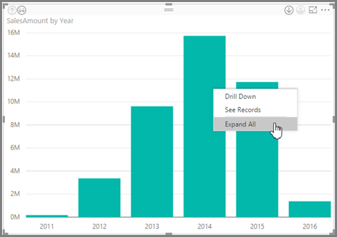
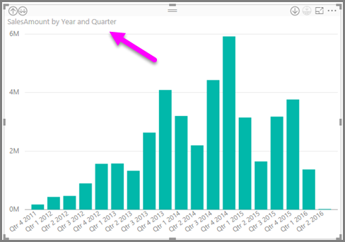
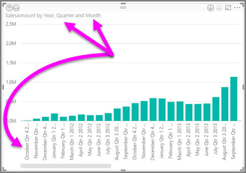
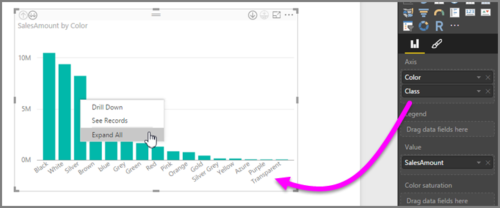
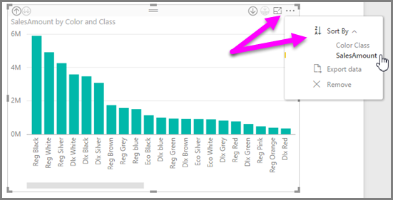
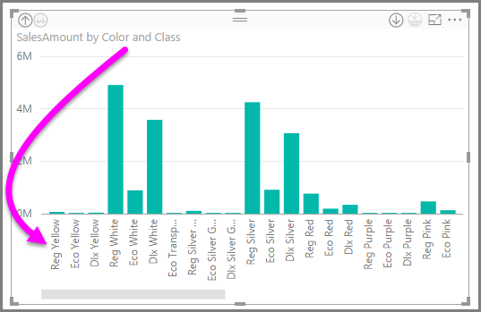

# Usare le etichette di gerarchia inline in Power BI Desktop
**Power BI Desktop** supporta l'uso di **etichette di gerarchia inline**, ovvero la prima di due funzionalità che consentono di ottimizzare l'esplorazione gerarchica. La seconda funzionalità, che è attualmente in fase di sviluppo, è la possibilità di usare le etichette di gerarchia annidate (a breve disponibile: gli aggiornamenti avvengono di frequente).   

## Funzionamento delle etichette di gerarchia inline
Le etichette di gerarchia inline permettono di visualizzare le etichette di gerarchia quando si espandono gli oggetti visivi usando la funzionalità **Espandi tutto**. Un grande vantaggio offerto dalla visualizzazione di queste etichette di gerarchia è che è anche possibile scegliere di eseguire l'**ordinamento** in base alle diverse etichette di gerarchia quando si espandono i dati gerarchici.

### Uso della funzionalità Espandi tutto predefinita (senza l'ordinamento in base alle etichette di gerarchia)
Prima di passare al funzionamento delle etichette di gerarchia inline verrà preso in esame il comportamento della funzionalità **Espandi tutto** predefinita. In tal modo sarà possibile comprendere (e apprezzare) quanto siano utili le etichette di gerarchia inline.

L'immagine seguente mostra un grafico a barre per le vendite annuali. Quando si fa clic con il pulsante destro del mouse, è possibile scegliere **Espandi tutto**.

Dopo aver selezionato **Espandi tutto** l'oggetto visivo espande la gerarchia di dati da *Anno* a *Trimestre*, come illustrato nella figura seguente.

Come si può notare, le etichette *Anno* e *Trimestre* sono mostrate inline insieme. Questo schema di etichettatura continua mentre si **espande tutto** fino al termine della gerarchia.

Questo è il comportamento della gerarchia *Data* predefinita, che è associata ai campi con un tipo di dati *Data/ora*. Passando alla sezione successiva verranno prese in esame le differenze della nuova funzionalità di etichette di gerarchia inline.

### Uso delle etichette di gerarchia inline
Prima di tutto verrà preso in esame un grafico differente, che usa dati con gerarchia informali. Nella figura seguente è rappresentato un grafico a barre con il valore **SalesAmount**, che usa *Colore* come asse. In questi dati, *Colore* e *Classe* formano una gerarchia informale. A questo punto, è possibile selezionare nuovamente *Espandi tutto* per eseguire il drill-down nella gerarchia.

Selezione **Espandi tutto** per mostrare il livello successivo con la visualizzazione inline delle etichette di gerarchia. Per impostazione predefinita, le gerarchie inline vengono ordinate in base il valore della misura: in questo caso, **SalesAmount**. Con le etichette di gerarchia inline abilitate, è possibile scegliere di ordinare i dati anche in base alla gerarchia, selezionando i puntini di sospensione nell'angolo superiore destro (**...**), quindi selezionando **Ordina per > Colore Classe** come illustrato nella figura seguente.

Dopo aver selezionato **Colore Classe**, i dati vengono ordinati in base alla selezione di gerarchia informale, come illustrato nella figura seguente.

> [!NOTE]
> La funzionalità di etichetta gerarchia inline non consente ancora di ordinare la gerarchia temporale predefinita in base al valore, ma solo in ordine gerarchico.
> 
> 

## Risoluzione dei problemi
Gli oggetti visivi potrebbero rimanere bloccati in uno stato espanso al livello di gerarchia inline. In alcuni casi, alcuni oggetti visivi potrebbero rimanere bloccati nella modalità in cui sono stati espansi, nel qual caso il drill-up non funziona. Questa situazione può verificarsi se è stata eseguita la procedura seguente (la soluzione per questo problema è indicata *dopo* questi passaggi):

Passaggi che potrebbero determinare il blocco degli oggetti visivi in uno stato espanso:

1. Si abilita la funzionalità di **etichetta di gerarchia inline**.
2. Si creano alcuni oggetti visivi con gerarchie.
3. Si seleziona **Espandi tutto** e si salva il file.
4. Si *disabilita* quindi la funzionalità di **etichetta di gerarchia inline** e si riavvia Power BI Desktop.
5. A questo punto, si riapre il file.

Se per caso sono stati eseguiti questi passaggi e gli oggetti visivi restano bloccati in modalità espansa, seguire questa procedura per risolvere il problema:

1. Abilitare nuovamente la funzionalità di **etichetta di gerarchia inline**, quindi riavviare Power BI Desktop.
2. Aprire nuovamente il file ed eseguire il drill-up fino all'oggetto visivo interessato.
3. Salvare il file.
4. Disabilitare la funzionalità di **etichetta di gerarchia inline**, quindi riavviare Power BI Desktop.
5. Aprire di nuovo il file.

In alternativa, è sufficiente eliminare l'oggetto visivo e ricrearlo.

