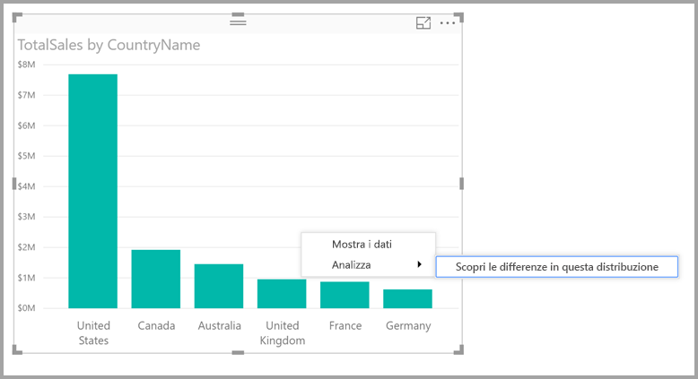
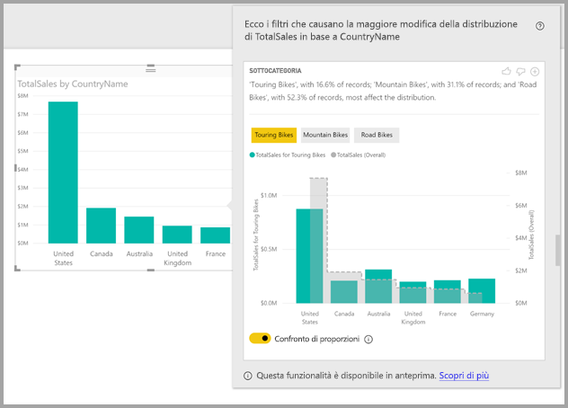

# Usare informazioni dettagliate in Power BI Desktop per determinare dove la distribuzione è diversa (anteprima)

Negli oggetti visivi è spesso visibile un punto dati ma non è possibile determinare se la distribuzione differisce per le diverse categorie. Le **informazioni dettagliate** in **Power BI Desktop** consentono di determinarlo con soli pochi clic del mouse.

Si consideri l'oggetto visivo seguente che visualizza le *Vendite totali* per *Paese*. Il grafico mostra che la maggior parte delle vendite proviene dagli Stati Uniti per un totale del 57% delle vendite totali con contributi minori provenienti da altri paesi. In casi come questi è spesso interessante determinare se la stessa distribuzione è presente per le diverse sottopopolazioni. Ad esempio, è la stessa per tutti gli anni, per tutti i canali di vendita e tutte le categorie di prodotti?  Sebbene sia possibile applicare filtri diversi e confrontare visivamente i risultati, queste operazioni possono richiedere molto tempo ed essere soggette a errori. 

È possibile richiedere a **Power BI Desktop** di individuare dove la distribuzione è diversa e ottenere un'analisi dei dati rapida, automatica e dettagliata. È sufficiente fare clic con il pulsante destro del mouse su un punto dati e selezionare **Analizza > Find where the distribution is different (Individua dove la distribuzione è diversa)** per visualizzare informazioni dettagliate in una finestra facile da usare.

Nell'esempio l'analisi automatica mostra immediatamente che per le *Touring Bikes* (Biciclette da turismo) la percentuale delle vendite negli Stati Uniti e in Canada è più bassa, mentre la percentuale degli altri paesi è più alta.   

> [!NOTE]
> Questa funzionalità è in anteprima e soggetta a modifiche. Per impostazione predefinita, la funzionalità delle informazioni dettagliate è abilitata e attiva (non è necessario selezionare una casella Anteprima per abilitarla) a partire dalla versione di settembre 2017 di **Power BI Desktop**.
> 
> 

## Uso delle informazioni dettagliate
Per usare le informqzioni dettagliate per determinare dove le distribuzioni visualizzate nei grafici sono diverse, fare clic con il pulsante destro del mouse su un punto dati o sull'oggetto visivo e selezionare **Analizza > Find where the distribution is different (Individua dove la distribuzione è diversa)**.

**Power BI Desktop** esegue quindi gli algoritmi di apprendimento automatico sui dati e popola una finestra con un oggetto visivo e una descrizione che illustra le categorie (colonne) e i valori delle colonne con la differenza più significativa della distribuzione. Le informazioni dettagliate sono visualizzate sotto forma di istogramma, come mostra l'immagine seguente. 

I valori a cui è applicato il filtro selezionato sono visualizzati con il colore predefinito normale. I valori complessivi, come appaiono nell'oggetto visivo originale, sono visualizzati in grigio per facilitare il confronto. È possibile includere fino a tre filtri diversi (nell'esempio *Touring Bikes* (Bici da turismo), *Mountain Bikes* (Mountain bike), *Road Bikes* (Bici da strada)) e scegliere i filtri facendo clic su di essi oppure facendo clic e premendo CTRL per la selezione multipla.

Per le misure aggiuntive semplici, ad esempio *Total Sales* (Vendite totali) nell'esempio, il confronto è basato su valori relativi anziché assoluti. Di conseguenza mentre le vendite relative a Touring Bikes (Bici da turismo) sono sicuramente inferiori alle vendite totali di tutte le categorie, per impostazione predefinita l'oggetto visivo usa un doppio asse per consentire il confronto tra la percentuale di vendite nei diversi paesi, per Touring Bikes (Bici da turismo) rispetto a tutte le categorie di biciclette.  Attivando o disattivando l'interruttore sotto l'oggetto visivo è possibile visualizzare i due valori sullo stesso asse e confrontare in modo facile i valori assoluti (come mostra l'immagine seguente).    

Il testo descrittivo offre anche alcune indicazioni del livello di importanza che può essere collegato a un valore di filtro, dato il numero di record corrispondenti al filtro. Nell'esempio è possibile osservare che mentre la distribuzione di *Touring Bikes* (Bici da turismo) può essere molto diversa rappresenta solo il 16,6% dei record.

Le icone del *pollice in su* e del *pollice in giù* nella parte superiore della pagina consentono di fornire commenti e suggerimenti sull'oggetto visivo e sulla funzionalità. Questa operazione restituisce feedback, ma attualmente non esegue il training dell'algoritmo per influenzare i risultati restituiti alla successiva esecuzione della funzionalità.

È importante tenere presente che il pulsante **+** nella parte superiore dell'oggetto visivo consente di aggiungere l'oggetto visivo selezionato al report, proprio come se l'oggetto visivo fosse stato creato manualmente. È quindi possibile formattare o modificare in altro modo l'oggetto visivo aggiunto proprio come qualsiasi altro oggetto visivo del report. È possibile aggiungere un oggetto visivo informazioni dettagliate selezionato solo quando si modifica un report in **Power BI Desktop**.

È possibile usare le informazioni dettagliate quando il report è in modalità di lettura o di modifica. Questa funzionalità è quindi adatta sia all'analisi dei dati che alla creazione di oggetti visivi che è facilmente possibile aggiungere ai report.

## Dettagli dei risultati restituiti
Si può presupporre che l'algoritmo prenda in considerazione tutte le altre colonne del modello e tutti i valori delle colonne e li applichi come filtri dell'oggetto visivo originale individuando i valori di filtro che producono il risultato più *diverso* rispetto all'originale.

Naturalmente è possibile che a questo punto ci si interroghi sul significato della *differenza*. Si supponga, ad esempio, che la differenza complessiva delle vendite tra Stati Uniti e Canada sia la seguente:

|Paese  |Vendite ($ mio)|
|---------|----------|
|USA      |15        |
|Canada   |5         |

Per una specifica categorie di prodotti *“Road Bike*) (Bici da strada) la differenza delle vendite potrebbe essere:

|Paese  |Vendite ($ mio)|
|---------|----------|
|USA      |3        |
|Canada   |1         |

Sebbene i numeri siano diversi in ciascuna di queste tabelle, i valori relativi degli Stati Uniti rispetto al Canada sono uguali (75% e 25% complessive e per Road Bikes (Bici da strada)). Per questo motivo, non vengono considerati diversi. Per questo tipo di misure aggiuntive semplici, l'algoritmo ricerca le differenze nel valore *relativo*.  

Si consideri invece una misura come il margine, calcolato come Profitto/Costo e si supponga che i margini complessivi per gli Stati Uniti e il Canada siano i seguenti

|Paese  |Margine (%)|
|---------|----------|
|USA      |15        |
|Canada   |5         |

Per una specifica categorie di prodotti *“Road Bike*) (Bici da strada) la differenza delle vendite potrebbe essere:

|Paese  |Margine (%)|
|---------|----------|
|USA      |3        |
|Canada   |1         |

Considerata la natura di questo tipo di misure, è interessante notare che questa misura *viene considerata* diversa. Di conseguenza, per le misure non aggiuntive come questo esempio di margine, l'algoritmo ricerca le differenze nel valore assoluto.

Gli oggetti visivi visualizzati hanno quindi lo scopo di illustrare chiaramente le differenze individuate tra la distribuzione complessiva (come appare nell'oggetto visivo originale) e il valore a cui è applicato un filtro specifico.  

Pertanto, per le misure aggiuntive, come *Vendite* nell'esempio precedente, vengono usati un istogramma e un grafico a linee dove l'uso di un doppio asse con la scala appropriata consente di confrontare facilmente i valori relativi. Le colonne mostrano il valore a cui viene applicato il filtro, mentre la linea mostra il valore complessivo (con l'asse della colonna a sinistra e l'asse della linea a destra). La linea è visualizzata con uno stile *a gradini*, tratteggiata, con un riempimento di colore grigio. Nell'esempio precedente se il valore massimo dell'asse della colonna è 4 e il valore massimo dell'asse della linea è 20, è possibile confrontare facilmente i valori relativi degli Stati Uniti rispetto al Canada per i valori filtrati e complessivi. 

Analogamente, per le misure non aggiuntive, come *Margine* nell'esempio precedente, vengono usati un istogramma e un grafico a linee dove l'uso di un singolo asse consente di confrontare facilmente i valori assoluti. La linea (con riempimento grigio) mostra anche in questo caso il valore complessivo. Nel confronto di valori effettivi o relativi, l'individuazione del grado di differenza di due distribuzioni non consiste semplicemente nel calcolo della differenza tra i valori. Ad esempio:

* La dimensione della popolazione è presa in considerazione poiché una differenza è meno significativa statisticamente e meno interessante se applicata a una percentuale più piccola della popolazione complessiva. Ad esempio, anche se la distribuzione delle vendite per un prodotto specifico nei vari paesi varia considerevolmente, questo aspetto potrebbe non essere considerato interessante in presenza di migliaia di prodotti poiché il prodotto specifico rappresenta solo una piccola percentuale delle vendite complessive.

* Le differenze per le categorie in cui i valori originali erano molto elevati o molto vicini allo zero vengono ponderate con un valore superiore a quelle di altre categorie. Ad esempio, se il valore complessivo di un paese contribuisce solo all'1% delle vendite mentre per un tipo di prodotto specifico contribuisce al 6%, ciò potrebbe essere considerato statisticamente significativo e quindi più interessante rispetto a un paese il cui contributo è passato dal 50% al 55%. 

* Vengono usate varie funzioni euristiche per selezionare i risultati più significativi, ad esempio considerando altre relazioni tra i dati.
     
Dopo aver esaminato le diverse colonne e i valori di ciascuna colonna, vengono scelti i valori che offrono le differenze maggiori. Per facilitare la comprensione, i valori sono raggruppati per colonna, con la colonna i cui valori indicano la differenza maggiore elencata per prima. Per ogni colonna vengono visualizzati un massimo di tre valori o meno se sono presenti meno di tre valori con grande impatto o se alcuni valori hanno un impatto di gran lunga maggiore rispetto ad altri. 

Poiché non tutte le colonne del modello vengono esaminate necessariamente nel tempo disponibile, non è garantito che vengano visualizzati le colonne e i valori con maggiore impatto. Vengono tuttavia usate diverse funzioni euristiche per garantire che vengano esaminate per prime le colonne più probabili. Si supponga ad esempio che dopo aver esaminato tutte le colonne, si determini che le colonne o i valori seguenti hanno l'impatto maggiore sulla distribuzione, in ordine di impatto:

    Subcategory = Touring Bikes
    Channel = Direct
    Subcategory = Mountain Bikes
    Subcategory = Road Bikes
    Subcategory = Kids Bikes
    Channel = Store

L'ordine delle colonne sarà il seguente:

    Subcategory: Touring Bikes, Mountain Bikes, Road Bikes (only three listed, with the text including “...amongst others” to indicate that more than three have a significant impact) 

    Channel = Direct (only Direct listed, if it’s level of impact was much greater than Store)

## Considerazioni e limitazioni
L'elenco seguente è una raccolta degli scenari attualmente non supportati per le **informazioni dettagliate**:

* Filtri PrimiN
* Filtri per le misure
* Misure non numeriche
* Uso di "Mostra valore come"
* Misure filtrate: calcoli a livello visuale ai quali viene applicato un filtro specifico (ad esempio *Total Sales for France* (Vendite totali per la Francia)) e che vengono usati in alcuni oggetti visivi creati dalla funzionalità delle informazioni dettagliate

Neppure i tipi di modelli e le origini dati seguenti sono attualmente supportati per le informazioni dettagliate:

* DirectQuery
* Live Connect
* Reporting Services locale
* Incorporamento

## Passaggi successivi
Per altre informazioni su **Power BI Desktop** e su come iniziare, vedere gli articoli seguenti.

* [Che cos'è Power BI Desktop?](desktop-what-is-desktop.md)
* [Panoramica delle query con Power BI Desktop](desktop-query-overview.md)
* [Origini dati in Power BI Desktop](desktop-data-sources.md)
* [Connettersi ai dati in Power BI Desktop](desktop-connect-to-data.md)
* [Effettuare il data shaping e combinare i dati con Power BI Desktop](desktop-shape-and-combine-data.md)
* [Attività di query comuni in Power BI Desktop](desktop-common-query-tasks.md)   

