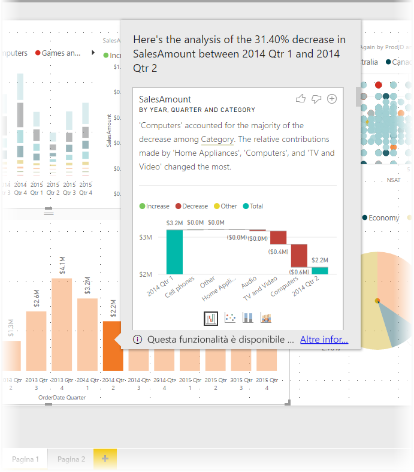
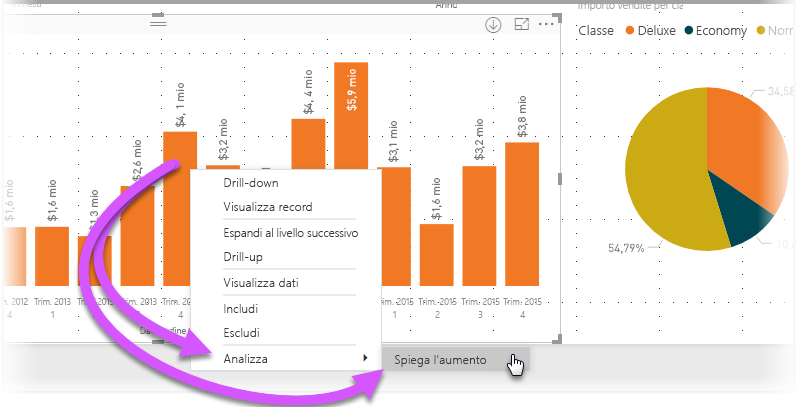
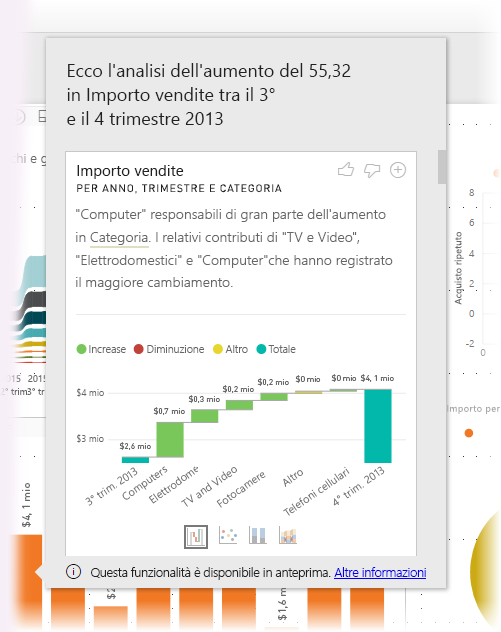
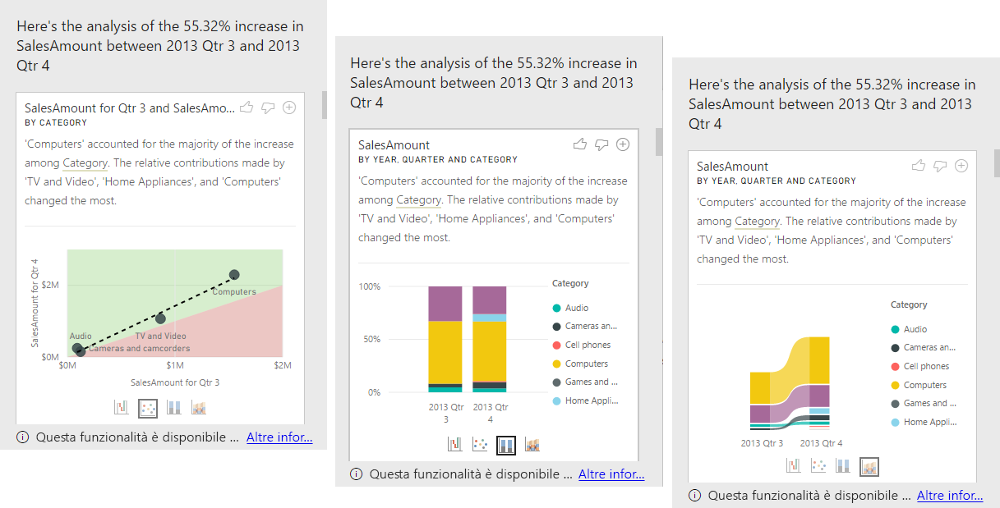

# Usare le informazioni dettagliate in Power BI Desktop (anteprima)
È possibile indicare a **Power BI Desktop** di spiegare gli aumenti o le diminuzioni nei grafici per ottenere un'analisi approfondita, rapida e automatizzata dei dati. È sufficiente fare clic con il pulsante destro del mouse su un punto dati e scegliere **Analizza > Spiega la diminuzione** (o l'aumento, se la barra precedente era più bassa) per visualizzare informazioni dettagliate in una finestra facile da usare.

La funzionalità delle informazioni dettagliate è contestuale e si basa sul punto dati immediatamente precedente, ad esempio la barra o la colonna precedente.

> [!NOTE]
> Questa funzionalità è in anteprima e soggetta a modifiche. Per impostazione predefinita, la funzionalità delle informazioni dettagliate è abilitata e attiva (non è necessario selezionare una casella Anteprima per abilitarla) a partire dalla versione di settembre 2017 di **Power BI Desktop**.
> 
> 

## Uso delle informazioni dettagliate
Per usare le informazioni dettagliate, fare clic con il pulsante destro del mouse su un punto dati in un oggetto visivo barra o linea e scegliere **Analizza > Spiega l'aumento** (o *Spiega la diminuzione*, perché tutte le informazioni dettagliate si basano sulla modifica rispetto al punto dati precedente).

**Power BI Desktop** esegue quindi gli algoritmi di apprendimento automatico sui dati e popola una finestra con un oggetto visivo e una descrizione che illustra le categorie che più hanno influito sull'aumento o sulla diminuzione. Per impostazione predefinita, le informazioni dettagliate vengono fornite come oggetto visivo *a cascata*, come illustrato nell'immagine seguente.

Selezionando le piccole icone nella parte inferiore dell'oggetto visivo a cascata, è possibile scegliere di visualizzate le informazioni dettagliate come grafico a dispersione, istogramma in pila o grafico a nastri.

Le icone del *pollice in su* e del *pollice in giù* nella parte superiore della pagina consentono di fornire commenti e suggerimenti sull'oggetto visivo e sulla funzionalità.

È importante tenere presente che il pulsante **+** nella parte superiore dell'oggetto visivo consente di aggiungere l'oggetto visivo selezionato al report, proprio come se l'oggetto visivo fosse stato creato manualmente. È quindi possibile formattare o modificare in altro modo l'oggetto visivo aggiunto proprio come qualsiasi altro oggetto visivo del report. È possibile aggiungere un oggetto visivo informazioni dettagliate selezionato solo quando si modifica un report in **Power BI Desktop**.

È possibile usare le informazioni dettagliate quando il report è in modalità di lettura o di modifica. Questa funzionalità è quindi adatta sia all'analisi dei dati che alla creazione di oggetti visivi che è facilmente possibile aggiungere ai report.

## Considerazioni e limitazioni
Poiché le informazioni dettagliate sono basate sulle modifiche rispetto al punto dati precedente, non sono disponibili quando si seleziona il primo punto dati in un oggetto visivo. 

L'elenco seguente è una raccolta degli scenari attualmente non supportati per le **informazioni dettagliate**:

* Filtri PrimiN
* Filtri di inclusione/esclusione
* Filtri per le misure
* Misure non additive e aggregati
* Mostra valore come
* Misure filtrate (novità usata per il grafico a dispersione nelle informazioni dettagliate)
* Colonne categoriche sull'asse X a meno che non definisca un ordine scalare per colonna. Se si usa una gerarchia, ogni colonna nella gerarchia attiva deve corrispondere a questa condizione
* Misure non numeriche

Neppure i tipi di modelli e le origini dati seguenti sono attualmente supportati per le informazioni dettagliate:

* DirectQuery
* Live Connect
* Reporting Services locale
* Incorporamento

## Passaggi successivi
Per altre informazioni su **Power BI Desktop** e su come iniziare, vedere gli articoli seguenti.

* [Introduzione a Power BI Desktop](desktop-getting-started.md)
* [Panoramica delle query con Power BI Desktop](desktop-query-overview.md)
* [Origini dati in Power BI Desktop](desktop-data-sources.md)
* [Connettersi ai dati in Power BI Desktop](desktop-connect-to-data.md)
* [Effettuare il data shaping e combinare i dati con Power BI Desktop](desktop-shape-and-combine-data.md)
* [Attività di query comuni in Power BI Desktop](desktop-common-query-tasks.md)   

