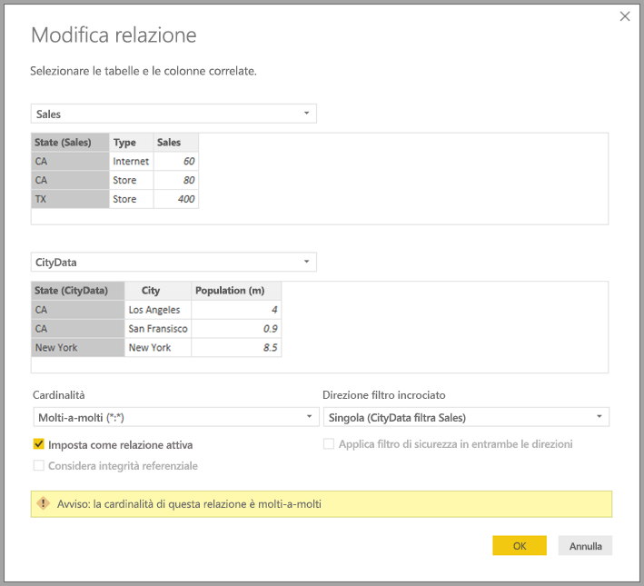

# Applicare relazioni molti-a-molti in Power BI Desktop

Con le *relazioni con cardinalità molti-a-molti* di Power BI Desktop è possibile unire le tabelle che usano la cardinalità *Molti-a-molti*. Ciò consente di creare in modo più semplice e intuitivo modelli di dati che contengono due o più origini dati. Le *relazioni con cardinalità molti-a-molti* fanno parte delle funzionalità dei *modelli compositi*, più ampie, di Power BI Desktop.

In Power BI Desktop, una *relazione con cardinalità molti-a-molti* è costituita da una delle tre funzionalità correlate seguenti:

* **Modelli compositi**: Un *modello composito* consente a un report di avere due o più connessioni dati, tra cui connessioni DirectQuery o di importazione, in qualsiasi combinazione. Per altre informazioni, vedere [Usare modelli compositi in Power BI Desktop](desktop-composite-models.md).

* **Relazioni con cardinalità molti-a-molti**: con i modelli compositi è possibile stabilire *relazioni con cardinalità molti-a-molti* tra le tabelle. Questo approccio consente di rimuovere i requisiti per i valori univoci nelle tabelle. Annulla anche le soluzioni alternative precedenti, ad esempio l'introduzione di nuove tabelle solo per stabilire relazioni. La funzionalità è descritta più dettagliatamente in questo articolo.

* **Modalità di archiviazione**: è ora possibile specificare gli oggetti visivi che richiedono una query per origini dati back-end. Quelli che non la richiedono vengono importati anche se basati su DirectQuery, con conseguente miglioramento delle prestazioni e riduzione del carico per il back-end. In precedenza, anche oggetti visivi semplici, come i filtri dei dati, iniziavano le query che venivano inviate alle origini di back-end. Per altre informazioni, vedere [Modalità di archiviazione in Power BI Desktop](desktop-storage-mode.md).

## Problemi risolti dalle relazioni con cardinalità molti-a-molti

Prima che le *relazioni con cardinalità molti-a-molti* fossero disponibili, la relazione tra due tabelle era definita in Power BI. Almeno una delle colonne della tabella interessate dalla relazione doveva contenere valori univoci. Spesso, tuttavia, nessuna colonna conteneva valori univoci.

Ad esempio, due tabelle potevano includere una colonna Country, ma i valori di Country non erano univoci in nessuna delle due tabelle. Per unire queste tabelle, era necessario escogitare una soluzione alternativa, che potevano consistere nell'introduzione di tabelle aggiuntive con i valori univoci necessari. Grazie alle *relazioni con cardinalità molti-a-molti*, è ora possibile unire direttamente le tabelle usando una relazione con cardinalità *molti a molti*.

## Usare relazioni con cardinalità molti-a-molti

Quando si definisce una relazione tra due tabelle in Power BI, è necessario specificare la cardinalità della relazione. Ad esempio, la relazione tra ProductSales e Product usando le colonne ProductSales[ProductCode] e Product [ProductCode] verrebbe definita come *molti-a-uno*. La relazione viene definita in questo modo perché per ogni prodotto sono presenti molti valori Sales e la colonna della tabella Product (ProductCode) è univoca. Quando si definisce una relazione con cardinalità *molti-a-uno*, *uno-a-molti* o *uno-a-uno*, Power BI la convalida per verificare che la cardinalità selezionata corrisponda effettivamente ai dati.

Esaminare ad esempio il modello semplice nell'immagine seguente:

Ora, si supponga che la tabella **Product** contenga solo due righe, come illustrato:

Si immagini anche che la tabella Sales includa solo quattro righe, con una riga per un prodotto C e che, a causa di un errore di integrità referenziale, il prodotto C non esiste nella tabella **Product**.

**ProductName** e **Price**, della tabella **Product**, insieme al valore totale di **Qty** per ogni prodotto, della tabella ProductSales, verrebbe visualizzato come segue:

Come si vede nella figura precedente, una riga **ProductName** vuota è associata alle vendite per il prodotto C. Questa riga vuota corrisponde agli elementi seguenti:

* Tutte le righe della tabella **ProductSales** per le quali non esistono righe corrispondenti nella tabella **Product**. Si verifica un problema di integrità referenziale, come illustrato per il prodotto C in questo esempio.

* Tutte le righe della tabella **ProductSales** per cui la colonna chiave esterna è Null.

Per questi motivi, in entrambi i casi, la riga vuota corrisponde alle vendite per cui sono sconosciuti i valori **ProductName** e **Price**.

In alcuni casi, le tabelle sono unite in join da due colonne, ma nessuna delle colonne è univoca. Considerare ad esempio queste due tabelle:

* La tabella **Sales** contiene dati di vendita per **State**, con ogni riga che contiene l'importo delle vendite per il tipo di vendita in tale stato, inclusi gli stati CA, WA e TX.

    

* La tabella **CityData** contiene i dati sulle città, inclusi popolazione e stato (ad esempio, gli stati CA, WA e New York).

    

Una colonna **State** si trova ora in entrambe le tabelle ed è ragionevole voler creare un report sulle vendite totali per stato e sulla popolazione totale di ogni stato. Esiste tuttavia un problema: la colonna **State** non è univoca in nessuna delle due tabelle.

## La soluzione alternativa precedente

Nelle versioni di Power BI Desktop precedenti a luglio 2018, gli utenti non potevano creare una relazione diretta tra queste tabelle. Una soluzione comune a questo problema prevedeva di:

* Creare una terza tabella contenente solo gli ID di State univoci. La tabella potrebbe avere una o tutte le caratteristiche seguenti:
  * Una tabella calcolata, definita tramite il linguaggio DAX (Data Analysis Expressions).
  * Una tabella basata su una query definita nell'Editor di query che potrebbe visualizzare gli ID univoci prelevati da una delle tabelle.
  * Il set completo combinato.

* Correlare quindi le due tabelle originali nella nuova tabella usando relazioni *molti-a-uno* comuni.

La tabella della soluzione alternativa può essere lasciata visibile o essere nascosta in modo che non venga visualizzata nell'elenco **Campi**. Se si nasconde la tabella, le relazioni *molti-a-uno* verrebbero normalmente impostate per filtrare in entrambe le direzioni, e si potrebbe utilizzare il campo State di una qualsiasi delle due tabelle. Il filtro incrociato successivo verrebbe propagato all'altra tabella. Questo approccio è illustrato nell'immagine seguente:

Un oggetto visivo che visualizza i valori **State** (dalla tabella **CityData**) insieme ai totali per **Population** e **Sales** sarebbe quindi simile al seguente:

> [!NOTE]
> Poiché in questa soluzione alternativa viene usata la colonna State della tabella **CityData**, vengono elencati solo gli stati in tale tabella e, di conseguenza, viene escluso lo stato TX. A differenza delle relazioni *molti-a-uno*, inoltre, mentre la riga del totale include tutti i valori **Sales**, incluse le vendite di TX, i dettagli non includono una riga vuota a copertura delle righe non abbinate. Analogamente, non sarebbe presente alcuna riga vuota a copertura di eventuali valori **Sales** contraddistinti dal valore Null per **State**.

Se all'oggetto visivo si aggiunge anche City, nonostante la popolazione di ogni valore City sia nota, i valori **Sales** mostrati per City si limiteranno a ripetere semplicemente i valori **Sales** dell'elemento **State** corrispondente. Questo scenario si verifica in genere quando il raggruppamento di colonne non è correlato a una misura di aggregazione, come illustrato di seguito:

Si supponga ora di definire la nuova tabella Sales come combinazione di tutti gli i valori State e di renderla visibile nell'elenco **Campi**. Nello stesso oggetto visivo verrebbe visualizzato sia il valore **State** (nella nuova tabella), il valore totale di **Population** e il totale di **Sales**:

Come si può notare, verrebbero inclusi TX con dati **Sales** ma senza dati *Population* e New York con dati **Population** ma senza dati **Sales**. Questa soluzione alternativa non è ottimale e presenta molti problemi. Per le relazioni con cardinalità molti-a-molti, questi problemi vengono risolti, come descritto nella sezione seguente.

## Usare una relazione con cardinalità molti-a-molti anziché la soluzione alternativa

A partire dalla versione di luglio 2018 di Power BI Desktop, è possibile correlare direttamente le tabelle, ad esempio quelle descritte in precedenza, senza dover ricorrere a simili soluzioni alternative. Ora è possibile impostare la cardinalità della relazione su *molti-a-molti*. Questa impostazione indica che nessuna delle due tabelle contiene valori univoci. Per questo tipo di relazioni, è comunque possibile stabilire quale tabella filtri l'altra tabella o applicare un filtro bidirezionale in cui entrambe le tabelle si filtrano a vicenda.

In Power BI Desktop, la cardinalità predefinita è *molti-a-molti* quando viene determinato che nessuna delle due tabelle contiene valori univoci per le colonne coinvolte nella relazione. In questi casi viene visualizzato un avviso, per verificare che l'impostazione della relazione sia il comportamento previsto, e non l'effetto indesiderato di un problema dei dati.

Ad esempio, quando si crea una relazione diretta tra CityData e Sales in cui il flusso dei filtri va da CityData a Sales, Power BI Desktop visualizza la finestra di dialogo **Modifica relazione**:

La visualizzazione **Relazioni** risultante conterrebbe la relazione molti-a-molti diretta tra le due tabelle. L'aspetto delle tabelle dell'elenco **Campi**, e il successivo comportamento quando vengono creati gli oggetti visivi, è simile a quando è stata applicata la soluzione alternativa. Nella soluzione alternativa, la tabella aggiuntiva che visualizza i distinti dati di State non è resa visibile. Come descritto nella sezione precedente, verrebbe visualizzato un oggetto visivo che mostri i dati delle tabelle **State**, **Population** e **Sales**:

Le principali differenze tra le *relazioni con cardinalità molti-a-molti* e le più comuni relazioni *molti-a-uno* sono le seguenti:

* I valori mostrati non includono una riga vuota che tenga conto delle righe non abbinate nell'altra tabella. Né i valori tengono conto delle righe in cui la colonna usata nella relazione nell'altra tabella ha valore Null.
* Non è possibile usare la funzione `RELATED()` perché più di una riga potrebbe essere correlata.
* L'uso della funzione `ALL()` su una tabella non rimuove i filtri applicati alle altre tabelle correlate tramite una relazione molti-a-molti. Nell'esempio precedente, una misura definita come illustrato nello script seguente non rimuoverebbe i filtri sulle colonne nella tabella CityData correlata:

    

    Un oggetto visivo che mostra i dati per **State**, **Sales** e **Sales total** avrebbe quindi l'aspetto seguente:

    

Tenendo presenti le differenze precedenti, assicurarsi che i calcoli che utilizzano `ALL(<Table>)`, come *% del totale complessivo*, restituiscano i risultati previsti.

## Limitazioni e considerazioni

Esistono alcune limitazioni per questa versione delle *relazioni con cardinalità molti-a-molti* e dei modelli compositi.

Non è possibile usare modelli compositi con le origini Live Connect (multidimensionali) seguenti:

* SAP HANA
* SAP Business Warehouse
* SQL Server Analysis Services
* Set di dati Power BI
* Azure Analysis Services

Quando ci si connette a tali origini multidimensionali tramite DirectQuery, non è possibile connettersi a un'altra origine DirectQuery o attuare combinazioni con dati importati.

Le limitazioni esistenti per l'uso di DirectQuery si applicano anche quando si usano le *relazioni con cardinalità molti-a-molti*. Molte limitazioni si riferiscono attualmente a ogni singola tabella, a seconda della modalità di archiviazione della tabella. Ad esempio, una colonna calcolata per una tabella importata può fare riferimento ad altre tabelle, ma una colonna calcolata per una tabella di DirectQuery può fare riferimento solo alle colonne nella stessa tabella. Altre limitazioni si applicano al modello nel suo complesso, se una qualsiasi delle tabelle all'interno del modello è in modalità DirectQuery. Ad esempio, le funzionalità Informazioni rapide e Domande e risposte non sono disponibili per un modello se per una delle tabelle all'interno di esso è impostata la modalità di archiviazione DirectQuery.

## Passaggi successivi

Per altre informazioni sui modelli compositi e DirectQuery, vedere gli articoli seguenti:
* [Usare modelli compositi in Power BI Desktop](desktop-composite-models.md)
* [Modalità di archiviazione in Power BI Desktop](desktop-storage-mode.md)
* [Uso di DirectQuery in Power BI](desktop-directquery-about.md)
* [Origini dati di Power BI](power-bi-data-sources.md)
