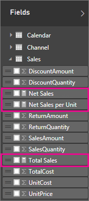
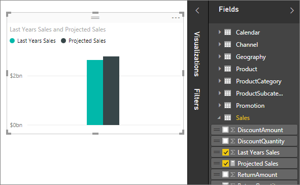
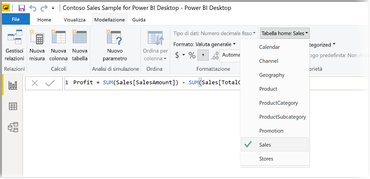
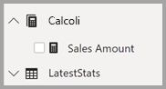

# <a name="create-measures-for-data-analysis-in-power-bi-desktop"></a>Creare misure per l'analisi dei dati in Power BI Desktop

Power BI Desktop consente di creare informazioni dettagliate sui dati con pochi semplici clic. Tuttavia, a volte i dati non includono tutto ciò che occorre per rispondere ad alcune domande importanti. A questo scopo possono essere usate le misure.

Le misure vengono usate in alcune delle analisi dei dati più comuni. È possibile impostare alcuni semplici riepiloghi, ad esempio somme, medie, minime, massime e conteggi, attraverso l'area **Campi**. I risultati calcolati delle misure vengono aggiornati costantemente in base alle operazioni dell'utente nei report e consentono un'esplorazione dei dati ad hoc, rapida e dinamica, come verrà illustrato nelle sezioni successive. Per altre informazioni, vedere [Creare misure calcolate](/learn/modules/model-data-power-bi/4b-create-calculated-measures).

## <a name="understanding-measures"></a>Informazioni sulle misure

In Power BI Desktop le misure vengono create e visualizzate in *Visualizzazione report* o in *Vista dati*. Le misure create dall'utente vengono visualizzate nell'elenco **Campi** con un'icona a forma di calcolatrice. È possibile assegnare qualsiasi nome alle misure e aggiungerle a una visualizzazione nuova o esistente con le normali procedure usate per gli altri campi.



> [!NOTE]
> Potrebbe anche essere interessante ottenere informazioni sulle *misure rapide*, cioè misure già pronte selezionabili nelle finestre di dialogo. Si tratta di un buon metodo per creare rapidamente le misure, nonché per apprendere la sintassi DAX (Data Analysis Expressions), perché le formule DAX create automaticamente sono disponibili per la revisione. Per altre informazioni, vedere [Misure rapide](desktop-quick-measures.md).
> 
> 

## <a name="data-analysis-expressions"></a>Data Analysis Expressions

Le misure calcolano un risultato da una formula di espressione. Quando si creano misure personalizzate, viene usato il linguaggio delle formule [DAX (Data Analysis Expressions)](/dax/). DAX include una libreria con oltre 200 funzioni, operatori e costrutti. Questa libreria offre un'enorme flessibilità per la creazione di misure di calcolo dei risultati per quasi tutte le esigenze di analisi dei dati.

Le formule DAX sono molto simili alle formule di Excel. DAX include anche molte delle stesse funzioni disponibili in Excel, ad esempio `DATE`, `SUM` e `LEFT`. Le funzioni DAX, tuttavia, sono pensate per essere usate con dati relazionali come quelli in Power BI Desktop.

## <a name="lets-look-at-an-example"></a>Esempio

Jan è un responsabile delle vendite di Contoso. A Jan è stato chiesto di fornire proiezioni sulle vendite dei rivenditori per il prossimo anno fiscale. Jan decide di basare le stime sull'importo delle vendite dell'anno precedente, con un 6% di incremento annuale risultante da diverse promozioni pianificate nei successivi sei mesi.

Per visualizzare le stime, Jan importa i dati sulle vendite dell'anno precedente in Power BI Desktop. Individua il campo **SalesAmount** nella tabella **Reseller Sales**. I dati importati contengono solo l'importo delle vendite dell'anno precedente, quindi rinomina il campo **SalesAmount** in *Last Years Sales*. Jan trascina quindi **Last Years Sales** nell'area di disegno del report. in cui viene visualizzato in un grafico come valore singolo pari alla somma di tutte le vendite dei rivenditori dell'anno precedente.

Jan nota che, anche se non è stato specificato un calcolo, ne è stato fornito uno automaticamente. Power BI Desktop ha creato la propria misura sommando tutti i valori in **Last Years Sales**.

Tuttavia, a Jan occorre una misura per calcolare le proiezioni delle vendite per l'anno successivo, che saranno basate sulle vendite dell'anno precedente moltiplicate per 1,06 per tenere conto dell'incremento del 6% previsto per le vendite. Per questo calcolo, Jan crea una misura. Usando la funzionalità *Nuova misura*, crea una nuova misura e immette la seguente formula DAX:

```sql
    Projected Sales = SUM('Sales'[Last Years Sales])*1.06
```

Jan trascina quindi la nuova misura Projected Sales nel grafico.



In poco tempo e con il minimo sforzo, ora Jan ha una misura per calcolare le vendite previste. Può analizzare ulteriormente le proiezioni filtrando per rivenditori specifici o aggiungendo altri campi al report.

## <a name="data-categories-for-measures"></a>Categorie di dati per le misure

È anche possibile selezionare le categorie di dati per le misure.

In questo modo, tra l'altro, è possibile usare le misure per creare gli URL in modo dinamico e contrassegnare la categoria di dati come un URL Web.

È possibile creare tabelle che visualizzano le misure come URL Web e fare in modo che sia possibile fare clic sull'URL creato in base alla selezione. Questa funzionalità è particolarmente utile quando ci si vuole collegare ad altri report di Power BI con [parametri di filtro URL](service-url-filters.md).

## <a name="organizing-your-measures"></a>Organizzazione delle misure

Le misure dispongono di una tabella *principale* che ne definisce la posizione nell'elenco dei campi. È possibile modificare la posizione delle misure scegliendone una dalle tabelle nel modello.



È anche possibile organizzare i campi di una tabella in *Cartelle di visualizzazione*. Selezionare **Modello** sul margine sinistro di Power BI Desktop. Nel riquadro **Proprietà** selezionare il campo che si vuole spostare dall'elenco dei campi disponibili. Creare una nuova cartella immettendone il nome desiderato in **Cartella di visualizzazione**. Il campo selezionato viene automaticamente spostato nella cartella appena creata.


È possibile creare sottocartelle usando il carattere barra rovesciata. Se si digita ad esempio *Finanza\Valute*, viene creata una cartella *Finanza* contente la sottocartella *Valute*.

È possibile fare in modo che un campo venga visualizzato in più cartelle usando il punto e virgola per separare i nomi delle cartelle. Se ad esempio si digita *Prodotti\Nomi;Reparti*, il campo viene visualizzato sia nella cartella *Reparti* che nella cartella *Nomi* all'interno della cartella *Prodotti*.

È possibile anche creare una tabella speciale contenente solo misure, visualizzata nella parte superiore dell'elenco **Campi**. A tale scopo, creare una tabella con una sola colonna. È possibile utilizzare **Immettere i dati** per creare la tabella. Spostare quindi le misure nella tabella. Nascondere infine la colonna creata (non la tabella). Selezionare la freccia nella parte superiore dell'elenco **Campi** per chiudere e riaprire l'elenco dei campi e visualizzare le modifiche apportate.



## <a name="learn-more"></a>Altre informazioni

In questo articolo è stata fornita solo una rapida introduzione alle misure, ma esistono molte altre risorse che spiegano come creare misure personalizzate. Per altre informazioni, vedere [Esercitazione: Creare misure personalizzate in Power BI Desktop](desktop-tutorial-create-measures.md). È possibile scaricare un file di esempio e acquisire così informazioni dettagliate su come creare nuove misure.  

Per approfondire la conoscenza su DAX, consultare [Nozioni di DAX in Power BI Desktop](desktop-quickstart-learn-dax-basics.md). [Riferimento a Data Analysis Expressions (DAX)](/dax/) fornisce articoli dettagliati su tutte le funzioni, la sintassi, gli operatori e le convenzioni di denominazione. DAX è stato incluso per diversi anni in Power Pivot in Excel e in SQL Server Analysis Services. Sono quindi disponibili molte altre risorse utili da consultare. Vedere la pagina [Wiki del centro risorse DAX](https://social.technet.microsoft.com/wiki/contents/articles/1088.dax-resource-center.aspx), in cui membri esperti della community BI condividono le proprie conoscenze su DAX.
