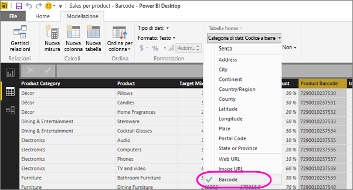

# Contrassegnare codici a barre in Power BI Desktop per dispositivi mobili
In Power BI Desktop è possibile [classificare i dati](desktop-data-categorization.md) in una colonna, in modo che Power BI Desktop sappia come gestire i valori negli oggetti visivi in un report. È anche possibile classificare una colonna come **Codice a barre**. Quando l'utente o i colleghi [effettuano la scansione di un codice a barre in un prodotto con l'app di Power BI](mobile-apps-scan-barcode-iphone.md) in un iPhone, vengono visualizzati tutti i report che includono tale codice a barre. Quando si apre il report nell'app per dispositivi mobili, Power BI filtra automaticamente il report per visualizzare i dati correlati al codice a barre.

1. In Power BI Desktop passare alla visualizzazione dati.
2. Selezionare una colonna con dati di codice a barre. Vedere l'elenco di [formati di codice a barre supportati](#supported-barcode-formats) più avanti.
3. Nella scheda **Creazione di modelli** selezionare **Categoria di dati** > **Codice a barre**.
   
    
4. Nella visualizzazione Report aggiungere questo campo agli oggetti visivi da filtrare in base al codice a barre.
5. Salvare il report e pubblicarlo nel servizio Power BI.

Quando si apre lo scanner nell'[app di Power BI per iPhone](mobile-ios-ipad-iphone-apps.md) e si effettua la scansione di un codice a barre, viene visualizzato questo report nell'elenco di report. Quando si apre il report, i rispettivi oggetti visivi vengono filtrati in base al codice a barre del prodotto sottoposto a scansione.

## Formati di codice a barre supportati
Questi sono i codici a barre riconosciuti da Power BI se contrassegnati in un report di Power BI: 

* UPCECode 
* Code39Code  
* A39Mod43Code 
* EAN13Code 
* EAN8Code  
* 93Code  
* 128Code 
* PDF417Code 
* Interleaved2of5Code 
* ITF14Code 

## Passaggi successivi
* [Scansionare un codice a barre dall'app Power BI nell'iPhone](mobile-apps-scan-barcode-iphone.md)
* [Problema di scansione dei codici a barre in un iPhone](mobile-apps-scan-barcode-iphone.md#issues-with-scanning-a-barcode)
* [Categorizzazione dei dati in Power BI Desktop](desktop-data-categorization.md)  
* Domande? [Provare a rivolgersi alla community di Power BI](http://community.powerbi.com/)

