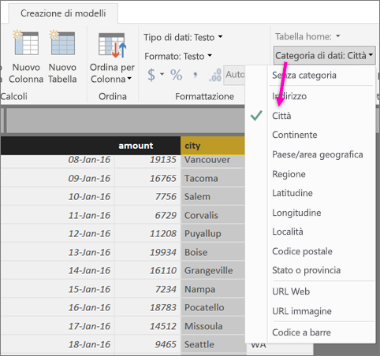
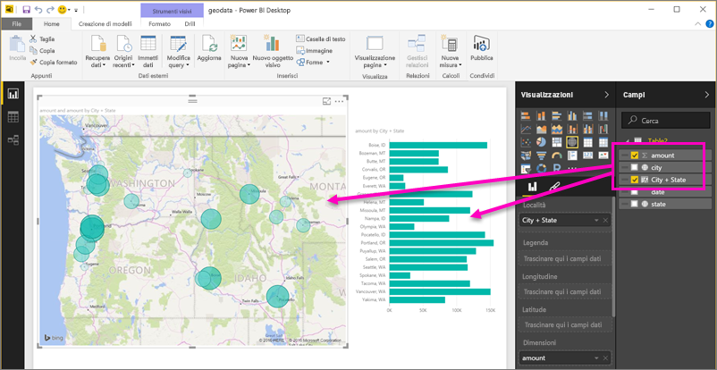
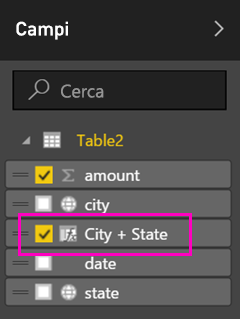
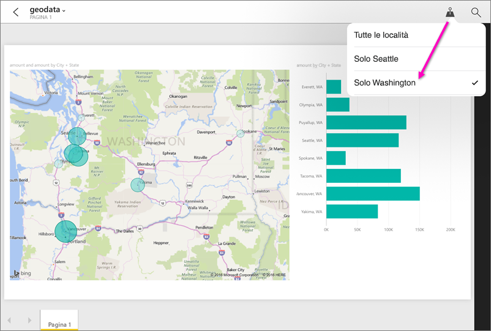

# Impostare filtri geografici in Power BI Desktop per le app per dispositivi mobili
In Power BI Desktop è possibile [classificare i dati geografici](desktop-data-categorization.md) per una colonna, in modo che Power BI Desktop sappia come gestire i valori negli oggetti visivi in un report. Un vantaggio aggiuntivo è costituito dal fatto che quando l'utente o un collega visualizza il report nell'app per dispositivi mobili di Power BI, Power BI fornisce automaticamente i filtri geografici corrispondenti alla posizione dell'utente. 

Si supponga ad esempio di essere un responsabile vendite in trasferta per incontrare clienti e si supponga di voler filtrare rapidamente il totale di vendite e ricavi per il cliente specifico che si intende incontrare. Si vogliono suddividere i dati per la località corrente, in base a stato, città o indirizzo effettivo. In seguito, se il tempo è sufficiente, si vogliono incontrare altri clienti nelle vicinanze. È possibile [filtrare il report in base alla località per trovare i clienti](mobile-apps-geographic-filtering.md).

> [!NOTE]
> È possibile filtrare in base alla località nell'app per dispositivi mobili solo se i nomi geografici del report sono in inglese, ad esempio "New York City" o "Germany".
> 
> 

## Identificare i dati geografici nel report
1. In Power BI Desktop passare alla visualizzazione dati .
2. Selezionare una colonna con dati geografici, ad esempio una colonna City.
   
    
3. Nella scheda **Creazione di modelli** selezionare **Categoria di dati**, quindi scegliere la categoria corretta, ovvero in questo esempio **City**.
   
    
4. Continuare a impostare le categorie di dati geografiche per altri campi nel modello. 
   
   > [!NOTE]
   > È possibile impostare più colonne per ogni categoria di dati in un modello, ma in questo caso il modello non potrà applicare il filtro geografico nell'app Power BI per dispositivi mobili. Per usare il filtro geografico nelle app per dispositivi mobili, impostare solo una colonna per ogni categoria di dati, ovvero ad esempio solo una colonna **City**, una colonna **State or Province** e una colonna **Country**. 
   > 
   > 

## Creare oggetti visivi con i dati geografici
1. Passare alla visualizzazione report e creare oggetti visivi che usano i campi dei dati geografici. 
   
    
   
    In questo esempio, il modello contiene anche una colonna calcolata che combina città e stato in un'unica colonna. Altre informazioni su come [creare colonne calcolate in Power BI Desktop](desktop-calculated-columns.md).
   
    
2. Pubblicare il report nel servizio Power BI.

## Visualizzare il report nell'app Power BI per dispositivi mobili
1. Aprire il report in una qualsiasi [app Power BI per dispositivi mobili](mobile-apps-for-mobile-devices.md).
2. Se ci si trova in una località geografica con dati nel report, è ora possibile filtrarlo automaticamente in modo da visualizzare la propria località.
   
    

Altre informazioni su come [filtrare un report per località nelle app Power BI per dispositivi mobili](mobile-apps-geographic-filtering.md).

## Passaggi successivi
* [Categorizzazione dei dati in Power BI Desktop](desktop-data-categorization.md)  
* Domande? [Provare a rivolgersi alla community di Power BI](http://community.powerbi.com/)

