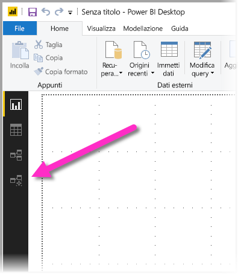
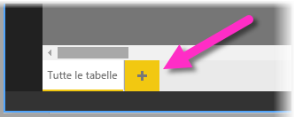
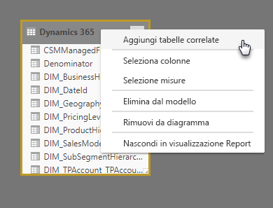
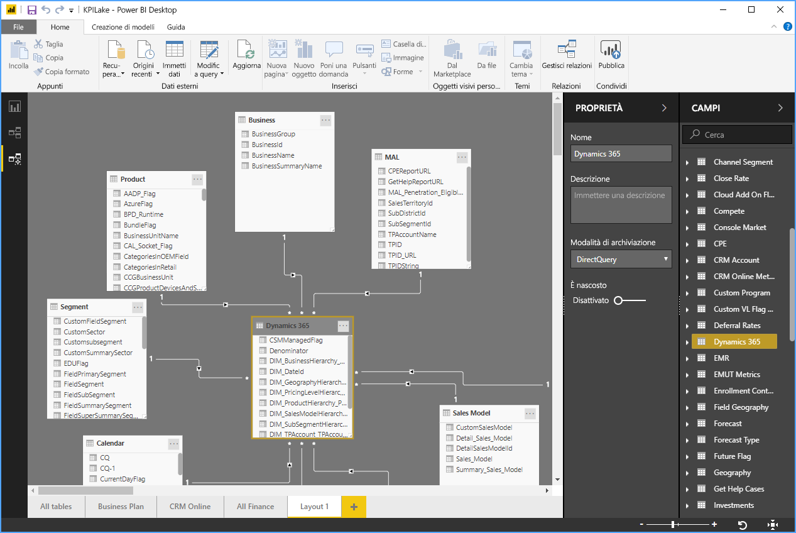
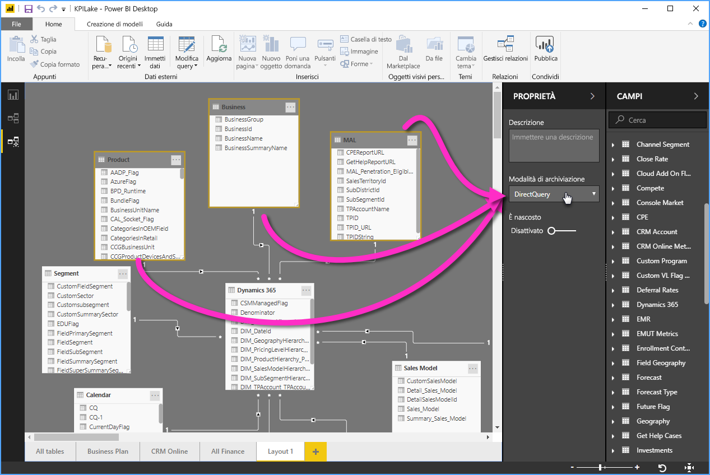

# Usare la visualizzazione di modellazione in Power BI Desktop

Con la **visualizzazione di modellazione** in **Power BI Desktop**, è possibile visualizzare e usare set di dati complessi contenenti molte tabelle.

## Uso della visualizzazione di modellazione

Per accedere alla visualizzazione di modellazione, selezionare l'icona Visualizzazione di modellazione sul lato sinistro di **Power BI Desktop**, come illustrato nell'immagine seguente.

## Creazione di diagrammi separati

Con la visualizzazione di modellazione, è possibile creare diagrammi del modello contenenti solo un subset delle tabelle nel modello. Ciò consente di ottenere una visualizzazione più chiara delle tabelle che si vuole usare e di semplificare l'uso dei set di dati complessi. Per creare un nuovo diagramma solo con un subset delle tabelle, fare clic sul segno **+** accanto alla scheda **Tutte le tabelle** nella parte inferiore della finestra di Power BI Desktop.

È quindi possibile trascinare una tabella dall'elenco **Campi** alla superficie del diagramma. Fare clic con il pulsante destro del mouse sulla tabella e quindi scegliere **Aggiungi tabelle correlate** dal menu visualizzato.

Quando si esegue questa operazione, le tabelle correlate alla tabella originale vengono visualizzate nel nuovo diagramma. L'immagine seguente illustra come vengono visualizzate le tabelle correlate dopo aver selezionato l'opzione di menu **Aggiungi tabelle correlate**.

## Impostazione delle proprietà comuni

In visualizzazione di modellazione è possibile selezionare più oggetti contemporaneamente tenendo premuto il tasto **CTRL** e facendo clic su più tabelle. Tutte le tabelle selezionate vengono evidenziate nella visualizzazione di modellazione. Quando sono evidenziate più tabelle, le modifiche applicate nel riquadro **Proprietà** vengono applicate a tutte le tabelle selezionate.

È ad esempio possibile modificare la [modalità di archiviazione](desktop-storage-mode.md) per più tabelle nella Visualizzazione diagramma tenendo premuto il tasto **CTRL**, selezionando le tabelle, quindi modificando l'impostazione della modalità di archiviazione nel riquadro **Proprietà**.

## Passaggi successivi

Gli articoli seguenti includono altre informazioni sui modelli di dati e descrivono anche la modalità DirectQuery in modo dettagliato.

* [Aggregazioni in Power BI Desktop (anteprima)](desktop-aggregations.md)
* [Modelli compositi in Power BI Desktop](desktop-composite-models.md)
* [Modalità di archiviazione in Power BI Desktop (anteprima)](desktop-storage-mode.md)
* [Relazioni molti-a-molti in Power BI Desktop](desktop-many-to-many-relationships.md)

Articoli su DirectQuery:

* [Uso di DirectQuery in Power BI](desktop-directquery-about.md)
* [Origini dati supportate da DirectQuery in Power BI](desktop-directquery-data-sources.md)
