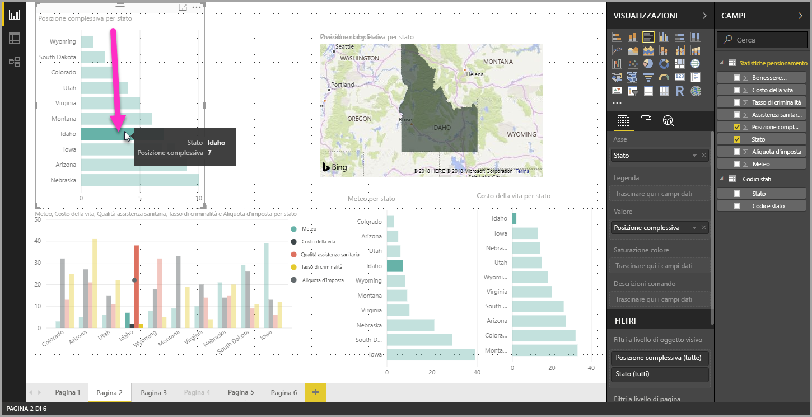
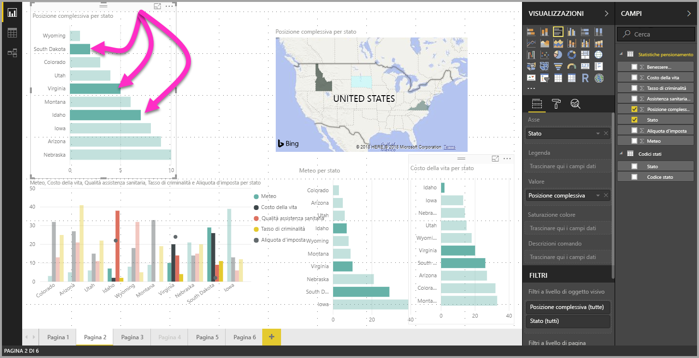

# Selezione multipla di elementi dati in oggetti visivi con Power BI Desktop

In **Power BI Desktop** è possibile evidenziare un punto dati in un determinato oggetto visivo facendo semplicemente clic sul punto dati nell'oggetto visivo. Ad esempio, in presenza di una barra o di un elemento di un grafico importante, se si vogliono evidenziare i dati negli altri oggetti visivi nella pagina del report in base alla selezione, è possibile fare clic sull'elemento dati in un oggetto visivo e vedere i risultati rispecchiati negli altri oggetti visivi nella pagina. Si tratta di un'evidenziazione semplice, con singola selezione. La figura seguente mostra un'evidenziazione semplice. 

Con la selezione multipla, è ora possibile selezionare più di un punto dati nella pagina del report di **Power BI Desktop** ed evidenziare i risultati in tutti gli oggetti visivi nella pagina. Ciò equivale a un'istruzione **and** o a funzionalità del tipo "evidenzia risultati per Lombardia **and** Piemonte". Per la selezione multipla di punti dati negli oggetti visivi, è sufficiente usare **CTRL+clic** per selezionare più punti dati. La figura seguente mostra **più punti dati** selezionati (selezione multipla).

Anche se si tratta apparentemente di una funzionalità semplice, apre le porte a moltissime opportunità durante la creazione, la condivisione e l'interazione con i report. 

## Passaggi successivi

Potrebbero essere interessanti anche gli articoli seguenti:

* [Usare le linee della griglia e il blocco alla griglia nei report di Power BI Desktop](desktop-gridlines-snap-to-grid.md)
* [Informazioni su filtri ed evidenziazione nei report di Power BI](power-bi-reports-filters-and-highlighting.md)

