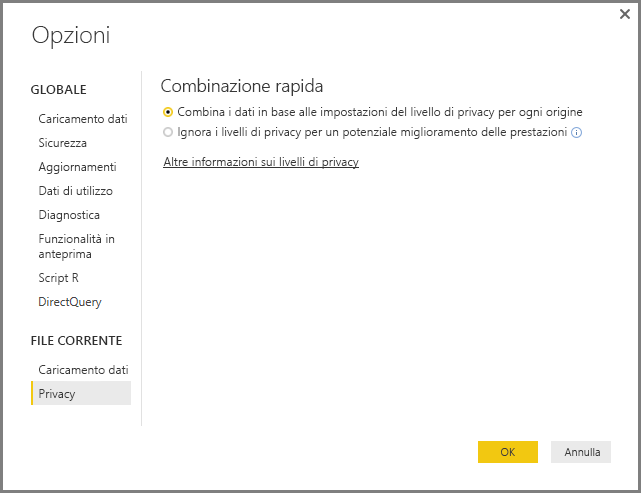
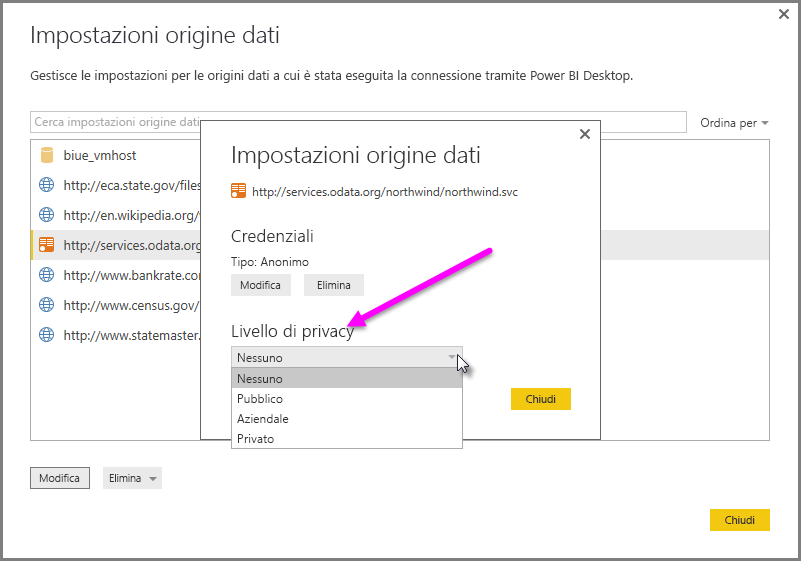

# Livelli di privacy di Power BI Desktop
In **Power BI Desktop**, i livelli di privacy specificano un livello di isolamento che definisce in che misura un'origine dati verrà isolata dalle altre. Anche se un livello di isolamento restrittivo impedisce lo scambio di informazioni tra le origini dati, può ridurre le funzionalità e compromettere le prestazioni.

L'impostazione **Livelli di privacy**, presente in **File > Opzioni e impostazioni > Opzioni** e quindi **File corrente > Privacy**, determina se Power BI Desktop usa le impostazioni Livello di privacy durante la combinazione dei dati. Questa finestra di dialogo include un collegamento alla documentazione di Power BI Desktop sui livelli di privacy (questo articolo).

 La finestra di dialogo delle impostazioni di **Privacy** per ogni origine dati si trova in **File > Opzioni e impostazioni > Impostazioni origine dati**. Selezionare l'origine dati, quindi **Modifica**. Viene visualizzata la finestra di dialogo **Impostazioni origine dati**. Nel menu a discesa nella parte inferiore di questa finestra di dialogo è possibile selezionare il livello di privacy appropriato, come mostrato nella figura seguente.

 

> [!CAUTION]
> Un'origine dati che contiene dati altamente sensibili o riservati dovrebbe essere configurata come **Privata**.
> 
> 

## Configurare un livello di privacy
Le impostazioni dei livelli di privacy consentono di specificare un livello di isolamento che definisca in che misura un'origine dati deve essere isolata dalle altre.

| Impostazione | Descrizione | Origini dati di esempio |
| --- | --- | --- |
| **Origine dati privata** |Un'origine dati **Privata** contiene dati sensibili o riservati e la sua visibilità può essere limitata agli utenti autorizzati. Un'origine dati privati è completamente isolata da altre origini dati. |Dati di Facebook, un file di testo contenente gli incentivi in azioni o una cartella di lavoro con le informazioni sulle verifiche dei dipendenti. |
| **Origine dati aziendale** |Un'origine dati **Aziendale** limita la visibilità di un'origine dati a un gruppo di persone considerato attendibile. Un'origine dati **Aziendale** è isolata da ogni origine dati **Pubblica** , ma è visibile alle altre origini dati di tipo **Aziendale** . |Un documento di **Microsoft Word** in un sito di SharePoint Intranet con autorizzazioni abilitate per un gruppo attendibile. |
| **Origine dati pubblica** |Con un'origine dati **Pubblica** , i dati contenuti nell'origine dati sono visibili a tutti. Solo i file, le origini dati Internet o i dati delle cartelle di lavoro possono essere contrassegnati come origine **Pubblica**. |Dati liberi da Microsoft Azure Marketplace, dati da una pagina di Wikipedia o file locale contenente dati copiati da una pagina Web pubblica |

## Configurare le impostazioni del livello di privacy
La finestra di dialogo delle impostazioni di **Privacy** per ogni origine dati si trova in **File > Opzioni e impostazioni > Impostazioni origine dati**.

Per configurare il livello di privacy per un'origine dati, selezionare l'origine dati e quindi **Modifica**. Viene visualizzata la finestra di dialogo **Impostazioni origine dati**. Nel menu a discesa nella parte inferiore di questa finestra di dialogo è possibile selezionare il livello di privacy appropriato, come mostrato nella figura seguente.

> [!CAUTION]
> Un'origine dati che contiene dati altamente sensibili o riservati dovrebbe essere configurata come **Privata**.
> 

## Configurare i livelli di privacy
L'impostazione **Livelli di privacy** è configurata su **Combina i dati in base alle impostazioni del livello di privacy per ogni origine** per impostazione predefinita. In altri termini, **Livelli di privacy** non è abilitata.

| Impostazione | Descrizione |
| --- | --- |
| **Combina i dati in base alle impostazioni del livello di privacy per ogni origine** (attivata per impostazione predefinita) |Le impostazioni del livello di privacy vengono usate per determinare il livello di isolamento tra le origini dati durante la combinazione dei dati. |
| **Ignora i livelli di privacy per un potenziale miglioramento delle prestazioni** (disattivata) |I livelli di privacy non vengono tenuti in considerazione durante la combinazione dei dati, ma le prestazioni e le funzionalità dei dati potrebbero incrementare. |

> **Nota sulla sicurezza:** quando si abilita **Livelli di privacy** selezionando **Ignora i livelli di privacy per un potenziale miglioramento delle prestazioni** nella finestra di dialogo **Livelli di privacy** è possibile che vengano esposti dati sensibili o riservati a persone non autorizzate. Non abilitare **Livelli di privacy** a meno che non si sia certi che l'origine dati non contiene dati sensibili o riservati.
> 
> 

> [!CAUTION]
> L'impostazione **Ignora i livelli di privacy per un potenziale miglioramento delle prestazioni** non funziona nel servizio Power BI. Di conseguenza, i report di Power BI Desktop per cui è abilitata questa impostazione che vengono pubblicati nel servizio Power BI *non* riflettono questo comportamento quando vengono usati nel servizio.
> 

**Configurare i livelli di privacy**

In Power BI Desktop o nell'editor di Query selezionare **File > Opzioni e impostazioni > Opzioni** e quindi **File corrente > Privacy**.

a. Quando è selezionata l'opzione **Combina i dati in base alle impostazioni del livello di privacy per ogni origine** , i dati vengono combinati in base all'impostazione Livelli di privacy. L'unione dei dati tra aree di isolamento di privacy comporta il buffering dei dati.

b. Quando è selezionata l'opzione **Ignora i livelli di privacy per un potenziale miglioramento delle prestazioni** , i dati vengono combinati ignorando i livelli di privacy che potrebbero rivelare dati sensibili o riservati a un utente non autorizzato. Questa impostazione può migliorare le prestazioni e le funzionalità.

> **Nota sulla sicurezza:** selezionando **Ignora i livelli di privacy per un potenziale miglioramento delle prestazioni** è possibile che si verifichi un miglioramento delle prestazioni, ma Power BI Desktop non è in grado di garantire la privacy dei dati uniti nel file di Power BI Desktop.
> 
> 

