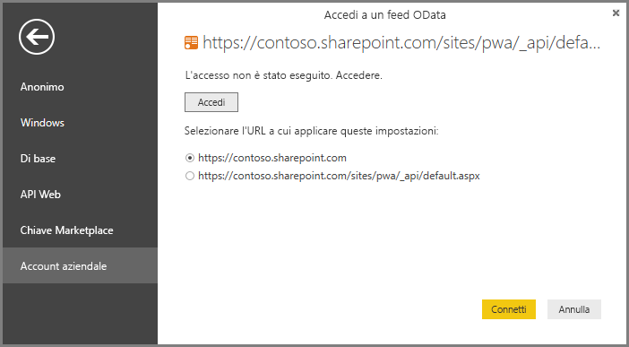

# Project Online: connettersi ai dati con Power BI Desktop
È possibile connettersi ai dati in Project Online con Power BI Desktop.

### Passaggio 1: scaricare Power BI Desktop
1. [Scaricare Power BI Desktop](http://go.microsoft.com/fwlink/?LinkID=521662), quindi eseguire il programma di installazione per installare **Power BI Desktop** nel computer.

### Passaggio 2: connettersi a Project Online con OData
1. Aprire **Power BI Desktop**.
2. Nella schermata *iniziale* selezionare **Recupera dati** .
3. Scegliere **Feed OData** e selezionare **Connetti**.
4. Immettere l'indirizzo per il feed OData nella casella URL e fare clic su OK.
   
   Se l'indirizzo del sito Project Web App è simile a https://\<nometenant\>.sharepoint.com/sites/pwa, l'indirizzo da inserire per il feed OData sarà https://\<nometenant\>.sharepoint.com/sites/pwa/\_api/Projectdata.
   
   Per questo esempio, verrà usato https://contoso.sharepoint.com/sites/pwa/default.aspx
5. Power BI Desktop richiederà di eseguire l'autenticazione con l'account Office 365. Selezionare l'account aziendale e quindi immettere le proprie credenziali.
   
   

A questo punto, è possibile scegliere a quali tabelle ci si vuole connettere e compilare una query.  Per un'idea di come iniziare,  leggere il post di blog seguente che illustra come creare un grafico burn-down a partire dai dati di Project Online.  Il post di blog riguarda l'uso di Power Query per connettersi a Project Online, ma si applica anche a Power BI Desktop.

[Creazione di grafici burn-down per Project Online usando Power Pivot e Power Query](http://blogs.office.com/2014/03/24/creating-burndown-charts-for-project-using-power-pivot-and-power-query/)

