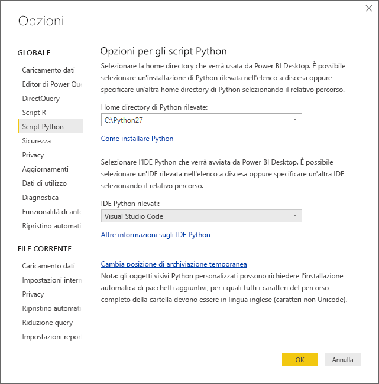
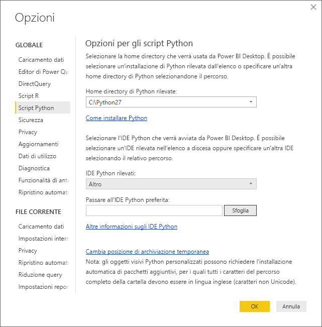
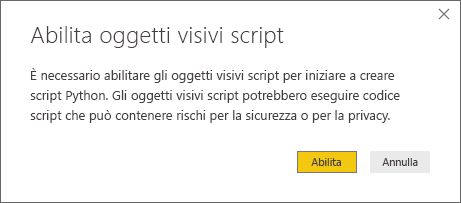
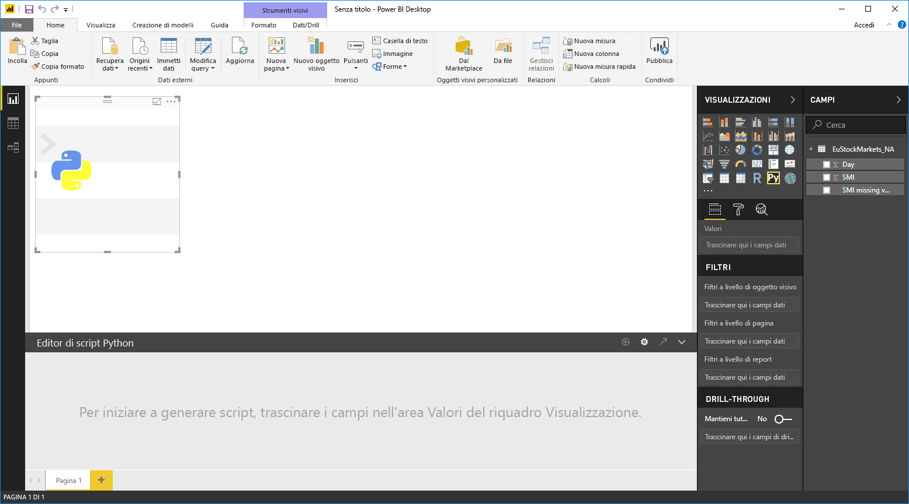
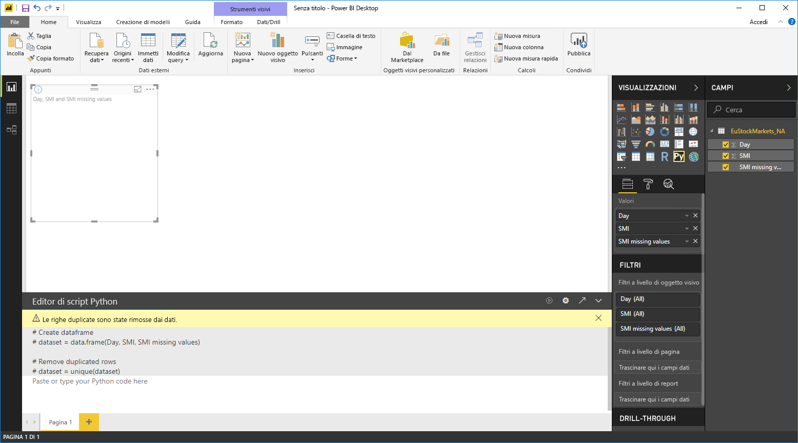
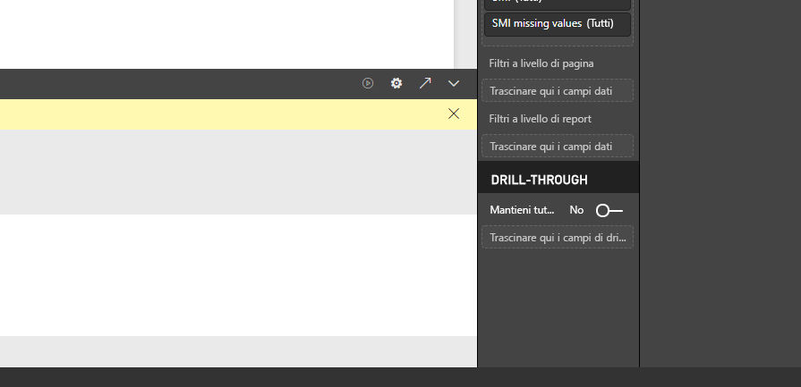
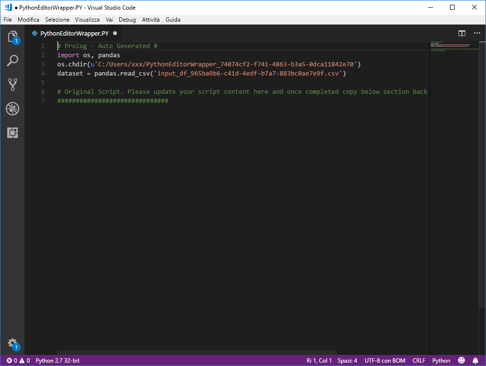

# Usare un IDE Python esterno con Power BI
Con **Power BI Desktop**, è possibile usare un IDE (Integrated Development Environment, ambiente di sviluppo integrato) Python esterno per creare e ridefinire gli script Python e quindi usarli in Power BI.

## Abilitare un IDE Python esterno
È possibile avviare l'IDE Python esterno da **Power BI Desktop** per importare e visualizzare automaticamente i dati nell'IDE Python. Da qui è possibile modificare lo script nell'ambiente IDE Python esterno e quindi incollarlo di nuovo in **Power BI Desktop** per creare oggetti visivi e report di Power BI.

È possibile specificare quale IDE Python usare e impostarne l'avvio automatico dall'interno di **Power BI Desktop**.

### Requisiti
Per usare questa funzionalità, è necessario installare un **IDE Python** nel computer locale. **Power BI Desktop** non include, distribuisce o installa il motore Python. È quindi è necessario installare separatamente **Python** nel computer locale. È possibile scegliere quale IDE Python usare, con le opzioni seguenti:

* È possibile installare l'IDE Python preferito. Molti tra quelli disponibili sono gratuiti, ad esempio [Visual Studio Code](https://code.visualstudio.com/download/).
* **Power BI Desktop** supporta anche **Visual Studio**.
* È anche possibile installare un IDE Python diverso e configurare **Power BI Desktop** in modo da avviare tale **IDE Python**. A tale scopo, eseguire una delle operazioni seguenti:
  
  * È possibile associare i file con estensione **PY** all'IDE esterno che dovrà essere avviato da **Power BI Desktop**.
  * È possibile specificare il file con estensione exe che **Power BI Desktop** deve avviare selezionando *Altro* nella sezione **Opzioni per gli script Python** della finestra di dialogo **Opzioni**. È possibile visualizzare la finestra di dialogo **Opzioni** passando a **File > Opzioni e impostazioni > Opzioni**.
    
    

Se sono installati più IDE Python, è possibile specificare quale avviare selezionandolo dall'elenco a discesa *IDE Python rilevati* nella finestra di dialogo **Opzioni**.

Per impostazione predefinita, **Power BI Desktop** avvia come IDE Python esterno **Visual Studio Code**, se è installato nel computer locale. Se **Visual Studio Code** non è installato ma è disponibile **Visual Studio**, verrà avviato quest'ultimo. Se nessuno di questi IDE Python è installato, verrà avviata l'applicazione associata ai file con estensione **PY**.

E se non esiste alcuna associazione per i file con estensione **PY**, è possibile specificare il percorso di un IDE personalizzato nella sezione *Scegliere l'IDE di Python desiderato* della finestra di dialogo **Opzioni**. È anche possibile avviare un IDE Python diverso selezionando l'icona dell'ingranaggio **Impostazioni** accanto all'icona a forma di freccia **Avvia IDE Python** in **Power BI Desktop**.

## Avviare un IDE Python da Power BI Desktop
Per avviare un IDE Python da **Power BI Desktop**, seguire questa procedura:

1. Caricare i dati in **Power BI Desktop**.
2. Nel riquadro **ampi** selezionare i campi che si prevede di utilizzare. Se non sono ancora stati abilitati oggetti visivi di script, verrà richiesto di farlo.
   
   
3. Quando gli oggetti visivi di script sono abilitati, è possibile selezionare un oggetto visivo Python nel riquadro **Visualizzazioni**, che crea un oggetto visivo Python vuoto pronto per la visualizzazione dei risultati dello script. Verrà visualizzato anche il riquadro **Editor di script Python**.
   
   
4. È ora possibile selezionare i campi da usare nello script Python. Quando si seleziona un campo, nel campo **Editor di script Python** viene creato automaticamente il codice script in base al campo o ai campi selezionati. È possibile creare (o incollare) lo script Python direttamente nel riquadro **Editor di script Python** o lasciare vuoto il riquadro.
   
   
   
   > [!NOTE]
   > Il tipo di aggregazione predefinito per gli oggetti visivi Python è *Non riepilogare*.
   > 
   > 
5. È ora possibile avviare l'IDE Python direttamente da **Power BI Desktop**. Selezionare il pulsante **Avvia IDE Python**, a destra della barra del titolo **Editor di script Python**, come illustrato di seguito.
   
   
6. L'IDE Python specificato viene avviato da Power BI Desktop, come illustrato nell'immagine seguente. In questa immagine, l'IDE Python predefinito corrisponde a **Visual Studio Code**.
   
   
   
   > [!NOTE]
   > **Power BI Desktop** aggiunge le prime tre righe dello script per consentire l'importazione dei dati da **Power BI Desktop** dopo che l'utente ha eseguito lo script.
   > 
   > 
7. Qualsiasi script creato nel riquadro **Editor di script Python** di **Power BI Desktop** viene visualizzato a partire dalla riga 4 nell'IDE Python. A questo punto è possibile creare lo script Python nell'IDE Python. Dopo aver completato lo script Python nell'IDE Python, è necessario copiarlo e incollarlo nel riquadro **Editor di script Python** in **Power BI Desktop**, *escludendo* le prime tre righe dello script generate automaticamente da **Power BI Desktop**. Non ricopiare le prime tre righe dello script in **Power BI Desktop**, perché sono state usate solo per l'importazione dei dati nell'IDE Python da **Power BI Desktop**.

### Limitazioni note
L'avvio di un IDE Python direttamente da Power BI Desktop presenta alcune limitazioni:

* L'esportazione automatica dello script dall'IDE Python in **Power BI Desktop** non è supportata.

## Passaggi successivi
Esaminare le informazioni aggiuntive seguenti su Python in Power BI.

* [Esecuzione di script Python in Power BI Desktop](desktop-python-scripts.md)
* [Creare oggetti visivi di Power BI tramite Python](desktop-python-visuals.md)

