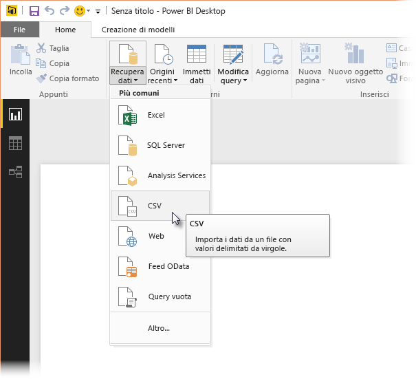
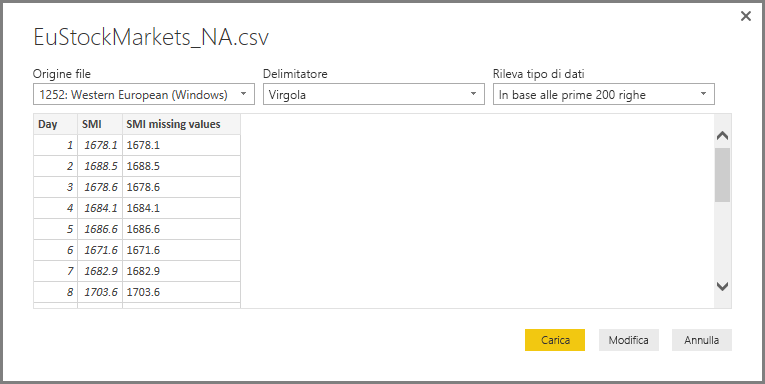
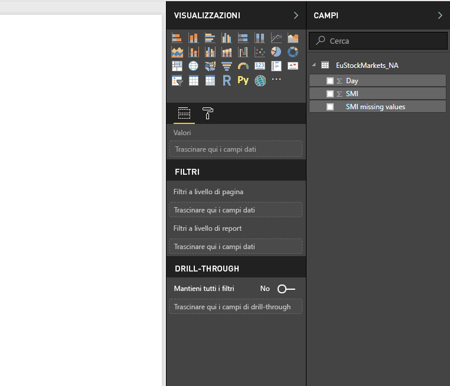
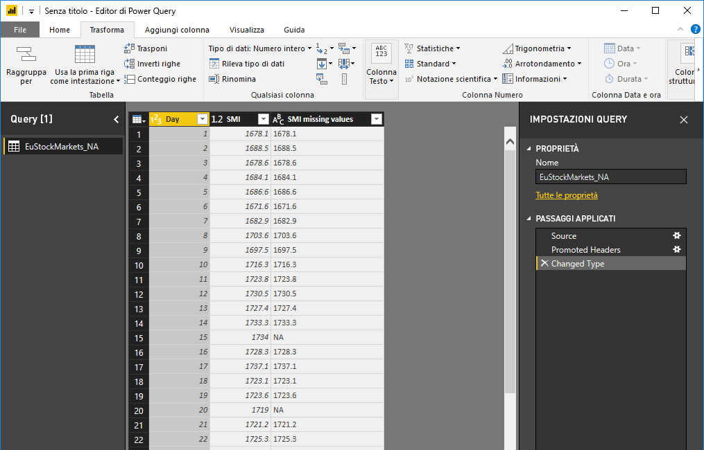
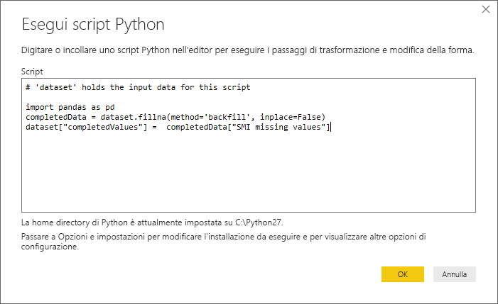
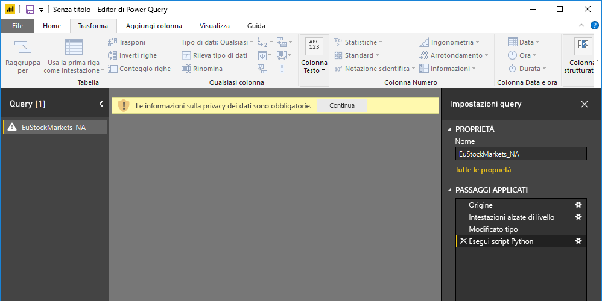
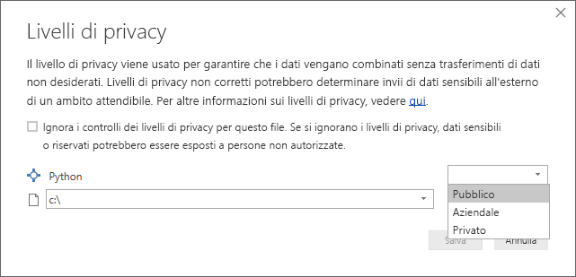
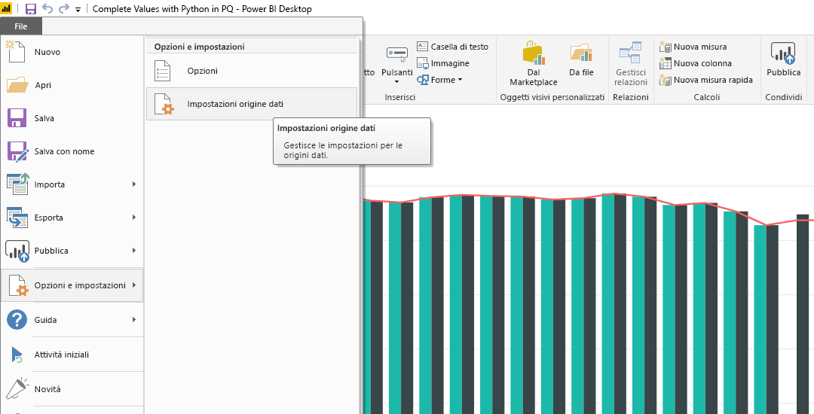
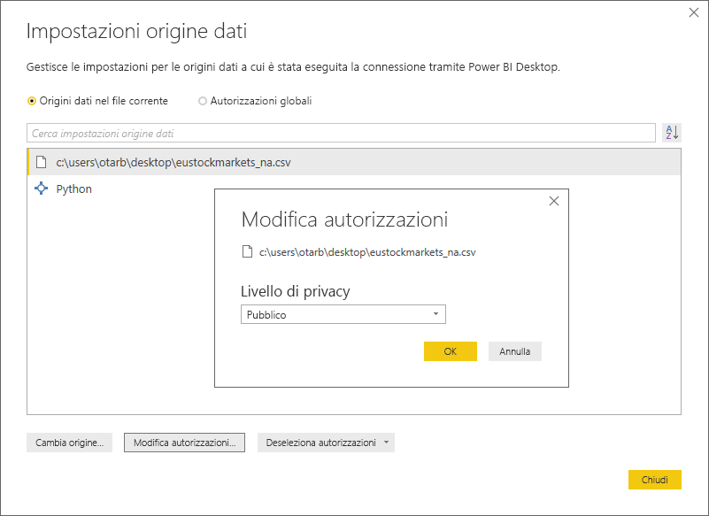

# <a name="using-python-in-query-editor"></a>Uso di Python nell'Editor di query
È possibile usare **Python**, un linguaggio di programmazione ampiamente utilizzato da analisti e data scientist, nell'**Editor di query** di Power BI Desktop. L'integrazione di Python nell'**Editor di query** consente di pulire i dati con Python ed eseguire operazioni di data shaping e analisi in set di dati, tra cui, per fare solo qualche esempio, completamento di dati mancanti, stime e clustering. **Python** è un linguaggio potente e può essere usato nell'**Editor di query** per preparare il modello di dati e creare report.

## <a name="installing-python"></a>Installazione di Python
Per usare **Python** nell'**Editor di query** di Power BI Desktop, è necessario installare **Python** nel computer locale. È possibile scaricare e installare **Python** gratuitamente da molte posizioni, tra cui la [pagina di download ufficiale di Python](https://www.python.org/) e [Anaconda](https://anaconda.org/anaconda/python/).

## <a name="using-python-in-query-editor"></a>Uso di Python nell'Editor di query
Per comprendere l'uso di **Python** nell'**Editor di query**, usare questo esempio, tratto da un set di dati del mercato azionario e basato su un file con estensione csv, [scaricarlo da qui](http://download.microsoft.com/download/F/8/A/F8AA9DC9-8545-4AAE-9305-27AD1D01DC03/EuStockMarkets_NA.csv) e seguire la spiegazione. Ecco la procedura per questo esempio:

1. Prima di tutto, caricare i dati in **Power BI Desktop**. Caricare il file *EuStockMarkets_NA.csv* in questo esempio e selezionare **Recupera dati > CSV** dalla barra multifunzione **Home** in **Power BI Desktop**.
   
   
2. Selezionare il file e scegliere **Apri**. Il file CSV verrà visualizzato nella finestra di dialogo **File CSV**.
   
   
3. Una volta caricati, i dati saranno visibili nel riquadro **ampi** in Power BI Desktop.
   
   
4. Aprire l'**Editor di query** selezionando **Modifica query** nella scheda **Home** in **Power BI Desktop**.
   
   
5. Nella scheda **Trasforma** selezionare **Esegui script Python**. Verrà visualizzato l'editor **Esegui script Python** (illustrato nel passaggio successivo). Si noti che nelle righe 15 e 20 c'è un problema di dati mancanti, così come in altre righe non visibili nell'immagine seguente. La procedura seguente illustra come usare Python per completare automaticamente le righe.
   
   
6. In questo esempio immettere il codice script seguente:
   
    ```python
       import pandas as pd
       completedData = dataset.fillna(method='backfill', inplace=False)
       dataset["completedValues"] =  completedData["SMI missing values"]
   ```

   > [!NOTE]
   > Per il corretto funzionamento del codice script precedente, è necessario che nell'ambiente Python sia installata la libreria *pandas*. Per installare la libreria pandas, eseguire il comando seguente nell'installazione di Python: |      > pip install pandas
   > 
   > 
   
   Quando viene inserito nella finestra di dialogo **Esegui script Python**, il codice ha l'aspetto seguente:
   
   
7. Dopo aver selezionato **OK**, l'**Editor di query** visualizza un avviso relativo alla privacy dei dati.
   
   
8. Per il corretto funzionamento degli script Python nel servizio Power BI, è necessario impostare tutte le origini dati su *Pubblico*. Per altre informazioni sulle impostazioni di privacy e sulle relative implicazioni, vedere [Livelli di privacy](desktop-privacy-levels.md).
   
   
   
   Si noti una nuova colonna nel riquadro **Campi** denominata *completedValues*. Si noti che alcuni elementi dati risultano mancanti, ad esempio nelle righe 15 e 18. Nella prossima sezione si scoprirà in che modo Python gestisce questo problema.
   

Con appena cinque righe di script Python, l'**Editor di query** ha inserito i valori mancanti con un modello predittivo.

## <a name="creating-visuals-from-python-script-data"></a>Creazione di oggetti visivi da dati di script Python
A questo punto è possibile creare un oggetto visivo per osservare come il codice script Python ha inserito i valori mancanti usando la libreria *pandas*, come illustrato nella figura seguente:


Dopo aver completato l'oggetto visivo e aver creato tutti gli altri oggetti visivi necessari con **Power BI Desktop**, è possibile salvare il file di **Power BI Desktop** (con estensione pbix) e usare il modello di dati, compresi gli script Python che ne fanno parte, nel servizio Power BI.

> [!NOTE]
> Se si vuole visualizzare un file con estensione pbix completato con questa procedura, il file di **Power BI Desktop** completato usato in questo esempio è disponibile per il download [qui](http://download.microsoft.com/download/A/B/C/ABCF5589-B88F-49D4-ADEB-4A623589FC09/Complete%20Values%20with%20Python%20in%20PQ.pbix).

Dopo avere caricato il file con estensione pbix nel servizio Power BI, è necessario eseguire qualche altro passaggio per abilitare l'aggiornamento dei dati (nel servizio) e degli oggetti visivi nel servizio (perché gli oggetti visivi vengano aggiornati, i dati devono accedere a Python). I passaggi aggiuntivi sono i seguenti:

* **Abilitare l'aggiornamento pianificato per il set di dati**: per abilitare l'aggiornamento pianificato per la cartella di lavoro che contiene il set di dati con gli script Python, vedere [Configurazione dell'aggiornamento pianificato](refresh-scheduled-refresh.md), che include anche informazioni su **Personal Gateway**.
* **Installare Personal Gateway**: **Personal Gateway** deve essere installato nel computer in cui si trova il file e in cui è installato Python. Il servizio Power BI deve accedere alla cartella di lavoro ed eseguire nuovamente il rendering degli oggetti visivi aggiornati. Sono disponibili altre informazioni su come [installare e configurare Personal Gateway](personal-gateway.md).

## <a name="limitations"></a>Limitazioni
Esistono alcune limitazioni per le query che includono script Python creati nell'**Editor di query**:

* Tutte le impostazioni dell'origine dati Python devono essere impostate su *Pubblico*, così come tutti gli altri passaggi delle query create nell'**Editor di query**. Per ottenere le impostazioni dell'origine dati, in **Power BI Desktop** selezionare **File > Opzioni e impostazioni > Impostazioni origine dati**.
  
  
  
  Nella finestra di dialogo **Impostazioni origine dati** selezionare le origini dati, quindi scegliere **Modifica autorizzazioni** e verificare che l'opzione **Livello di privacy** sia impostata su *Pubblico*.
  
      
* Per abilitare l'aggiornamento pianificato degli oggetti visivi o del set di dati Python, è necessario abilitare l'opzione **Aggiornamento pianificato**. È anche necessario che nel computer che ospita la cartella di lavoro e l'installazione di Python sia installato **Personal Gateway**. Per altre informazioni su entrambi, vedere la sezione precedente di questo articolo, in cui sono riportati collegamenti a informazioni più specifiche.
* Le tabelle annidate (tabelle di tabelle) non sono attualmente supportate 

Con Python e le query personalizzate si possono eseguire le operazioni più svariate, esplorando e modellando i dati per visualizzarli nel modo voluto.

