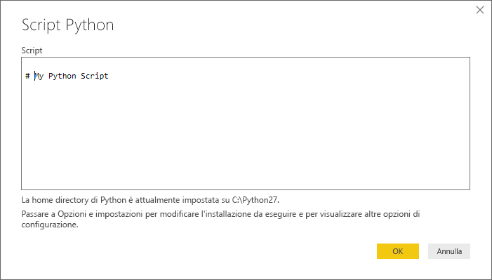
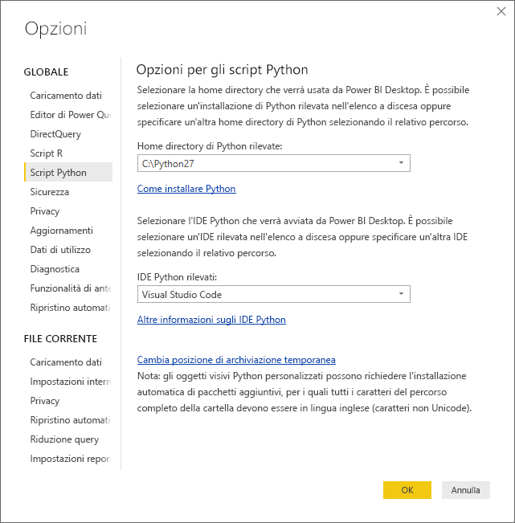

# Eseguire script Python in Power BI Desktop
È possibile eseguire gli script Python direttamente in **Power BI Desktop** e importare i set di dati risultanti in un modello di dati di Power BI Desktop.

## Installare Python
Per eseguire gli script Python in Power BI Desktop, è necessario installare **Python** nel computer locale. È possibile scaricare e installare **Python** gratuitamente da molte posizioni, tra cui la [pagina di download ufficiale di Python](https://www.python.org/) e [Anaconda](https://anaconda.org/anaconda/python/). La versione corrente della funzionalità di creazione di script Python in Power BI Desktop supporta la presenza di caratteri Unicode e di spazi (caratteri vuoti) all'interno del percorso di installazione.

## Eseguire script Python
Con pochi passaggi in Power BI Desktop è possibile eseguire script Python e creare un modello di dati da cui sia possibile creare report e condividerli nel servizio Power BI.

### Preparare uno script Python
Per eseguire uno script Python in Power BI Desktop, creare lo script nell'ambiente di sviluppo Python locale e verificare che venga eseguito correttamente.

Per eseguire lo script in Power BI Desktop, assicurarsi che lo script venga eseguito correttamente in un'area di lavoro nuova e non modificata. Ciò significa che tutti i pacchetti e le dipendenze devono essere esplicitamente caricati ed eseguiti.

La preparazione e l'esecuzione di uno script Python in Power BI Desktop sono soggette ad alcune limitazioni:

* Vengono importati solo i frame di dati Pandas. Assicurarsi quindi che i dati da importare in Power BI siano rappresentati in un frame di dati
* Tutti gli script Python la cui esecuzione dura più di 30 minuti generano un timeout
* Le chiamate interattive, ad esempio l'attesa dell'input dell'utente, all'interno dello script Python interrompono l'esecuzione dello script
* Quando si imposta la directory di lavoro all'interno dello script Python, *è necessario* definire un percorso completo a questa directory anziché un percorso relativo
* Le tabelle annidate (tabelle di tabelle) non sono attualmente supportate 

### Eseguire lo script Python e importare i dati
1. In Power BI Desktop, il connettore dati degli script Python è disponibile in **Recupera dati**. Per eseguire lo script Python, selezionare **Recupera dati &gt; Altro...** e quindi selezionare **Altro &gt; Script Python** come illustrato nella figura seguente:
   
   
2. Se Python è installato nel computer locale, l'ultima versione installata è selezionata come motore di Python. Copiare semplicemente lo script nella finestra dello script e selezionare **OK**.
   
   
3. Se Python non è installato o non viene identificato, oppure se sono presenti più installazioni nel computer locale, viene visualizzato un avviso.
   
   
   
   Le impostazioni di installazione di Python si trovano al centro della sezione Script Python della finestra di dialogo Opzioni. Per specificare le impostazioni di installazione di Python, selezionare **File > Opzioni e impostazioni** e quindi **Opzioni > Script Python**. Se sono disponibili più installazioni di Python, viene visualizzato un menu a discesa che consente di selezionare l'installazione da usare. È anche possibile selezionare **Altro** e specificare un percorso personalizzato.
   
   
4. Selezionare **OK** per eseguire lo script Python. Quando lo script viene eseguito correttamente, è possibile scegliere i frame di dati risultante da aggiungere al modello di Power BI.

### Aggiorna
È possibile aggiornare uno script Python in Power BI Desktop. Quando si aggiorna uno script Python, Power BI Desktop lo esegue nuovamente nell'ambiente di Power BI Desktop.

## Passaggi successivi
Esaminare le informazioni aggiuntive seguenti su Python in Power BI.

* [Creare oggetti visivi Python in Power BI Desktop](desktop-python-visuals.md)
* [Usare un IDE Python esterno con Power BI](desktop-python-ide.md)