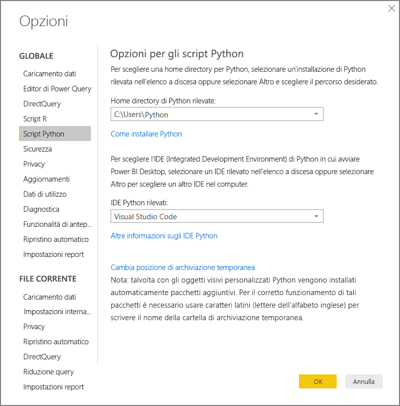
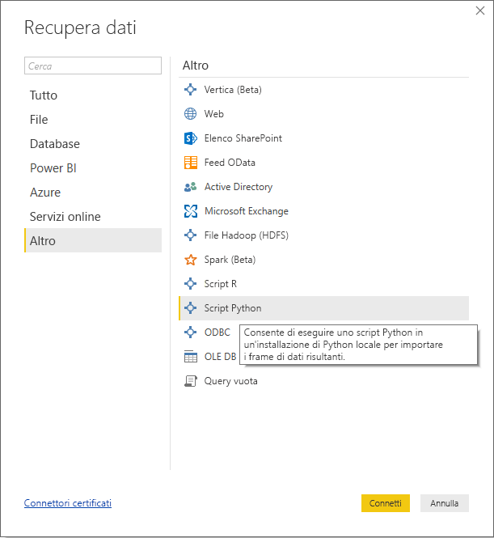
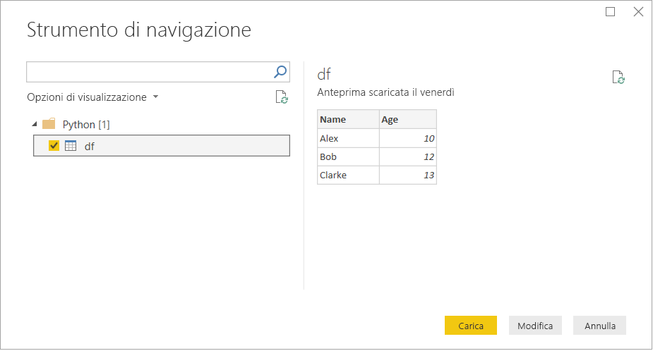
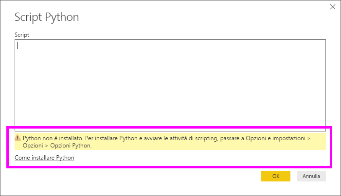

# <a name="run-python-scripts-in-power-bi-desktop"></a>Eseguire script Python in Power BI Desktop

È possibile eseguire gli script Python direttamente in **Power BI Desktop** e importare i set di dati risultanti in un modello di dati di Power BI Desktop.

## <a name="install-python"></a>Installare Python

Per eseguire gli script Python in Power BI Desktop, è necessario installare **Python** nel computer locale. È possibile scaricare **Python** dalla [pagina di download ufficiale di Python](https://www.python.org/). La versione corrente della funzionalità di creazione di script Python supporta la presenza di caratteri Unicode e di spazi all'interno del percorso di installazione.

### <a name="install-required-python-packages"></a>Installare i pacchetti Python necessari

L'integrazione di Power BI Python richiede l'installazione di due pacchetti Python:

- [Pandas](https://pandas.pydata.org/): una libreria software per la manipolazione e l'analisi dei dati. Offre strutture di dati e operazioni per la manipolazione di tabelle numeriche e serie temporali. I dati importati devono essere in un [frame di dati Pandas](https://www.tutorialspoint.com/python_pandas/python_pandas_dataframe.htm). Un frame di dati è una struttura di dati bidimensionale. I dati, ad esempio, sono allineati in formato tabulare in righe e colonne.
- [Matplotlib](https://matplotlib.org/): una libreria di tracciato per Python e la relativa estensione matematica numerica [NumPy](https://www.numpy.org/). Fornisce un'API orientata agli oggetti per incorporare i tracciati nelle applicazioni tramite toolkit generici per l'interfaccia utente (come Tkinter, wxPython, Qt o GTK+).

1. In una console o una shell, usare lo strumento da riga di comando [pip](https://pip.pypa.io/en/stable/) per installare i due pacchetti. Lo strumento pip è incluso nelle versioni più recenti di Python.

```CMD
pip install pandas
pip install matplotlib
```

## <a name="enable-python-scripting"></a>Abilitare gli script Python

Per abilitare gli script Python:

1. In Power BI Desktop selezionare **File** > **Opzioni e impostazioni** > **Opzioni** > **Script Python**. Verrà visualizzata la pagina Opzioni per gli script Python.

   

1. Se necessario, specificare il percorso dell'installazione locale di Python nella casella di testo **Home directory di Python rilevate**. 

   Nell'immagine precedente il percorso dell'installazione locale di Python è **C:\Python**. Assicurarsi che il percorso sia relativo all'installazione locale di Python che Power BI Desktop dovrà usare.

1. Selezionare **OK**.

Dopo aver specificato l'installazione di Python, è possibile iniziare l'esecuzione degli script Python in Power BI Desktop.

## <a name="run-python-scripts"></a>Eseguire script Python

In pochi passaggi è possibile eseguire script Python e creare un modello di dati. Da questo modello è possibile creare report e condividerli nel servizio Power BI.

### <a name="prepare-a-python-script"></a>Preparare uno script Python
Creare innanzitutto uno script nell'ambiente di sviluppo Python locale e verificare che venga eseguito correttamente. Ecco ad esempio un semplice script Python che importa Pandas e usa un frame di dati:

```python
import pandas as pd
data = [['Alex',10],['Bob',12],['Clarke',13]]
df = pd.DataFrame(data,columns=['Name','Age'],dtype=float)
print (df)
```
Quando viene eseguito, stampa:

```python
     Name   Age
0    Alex  10.0
1     Bob  12.0
2  Clarke  13.0
```

La preparazione e l'esecuzione di uno script Python in Power BI Desktop sono soggette ad alcune limitazioni:

* Poiché vengono importati solo i frame di dati Pandas, assicurarsi che i dati da importare in Power BI siano rappresentati in un frame di dati
* Tutti gli script Python la cui esecuzione dura più di 30 minuti generano un timeout
* Le chiamate interattive, ad esempio l'attesa dell'input dell'utente, all'interno dello script Python interrompono l'esecuzione dello script
* Quando si imposta la directory di lavoro all'interno dello script Python, *è necessario* definire un percorso completo a questa directory anziché un percorso relativo
* Le tabelle annidate non sono attualmente supportate 

### <a name="run-your-python-script-and-import-data"></a>Eseguire lo script Python e importare i dati

Per eseguire lo script Python in Power BI Desktop:

1. Nella scheda Home della barra multifunzione selezionare **Recupera dati** > **Altro...** .
   
1. Selezionare **Altro** > **Script Python**, come illustrato nell'immagine seguente:

   
   
1. Selezionare **Connetti**. L'ultima versione installata di Python nel computer locale è selezionata come motore di Python. Copiare lo script nella finestra di dialogo Script Python visualizzata. In questo caso viene immesso il semplice script Python illustrato in precedenza.

   

1. Selezionare **OK**. Se lo script viene eseguito correttamente, viene visualizzata la finestra di dialogo Strumento di navigazione ed è possibile caricare e usare i dati. Per l'esempio, selezionare la casella di controllo **df**, come illustrato nell'immagine, quindi **Carica**.

    

### <a name="troubleshooting"></a>Risoluzione dei problemi

Se Python non è installato o identificato, viene visualizzato un avviso. È anche possibile che venga visualizzato un avviso se sono presenti più installazioni nel computer locale. Rivedere ed esaminare le sezioni precedenti Installare Python e Abilitare gli script Python.



### <a name="refresh"></a>Aggiorna

È possibile aggiornare uno script Python in Power BI Desktop. Per eseguire l'aggiornamento, passare alla scheda **Home** della barra multifunzione e selezionare **Aggiorna**. Quando si aggiorna uno script Python, Power BI Desktop lo esegue nuovamente.

## <a name="next-steps"></a>Passaggi successivi

Esaminare le informazioni aggiuntive seguenti su Python in Power BI.

* [Creare oggetti visivi Python in Power BI Desktop](desktop-python-visuals.md)
* [Usare un IDE Python esterno con Power BI](desktop-python-ide.md)
