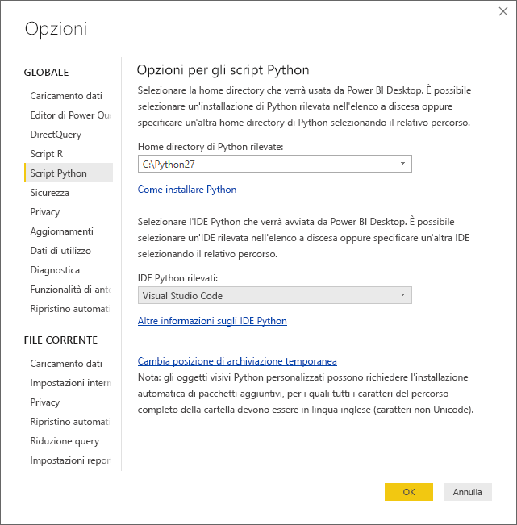
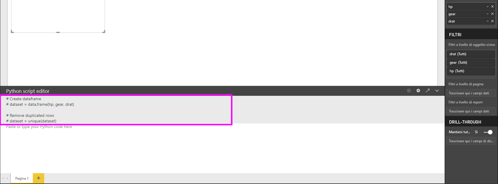
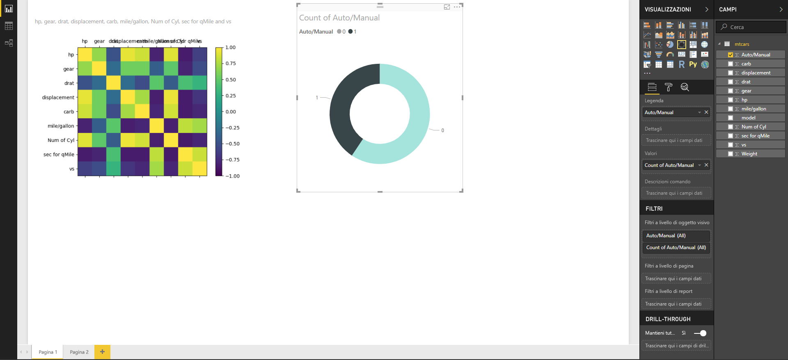
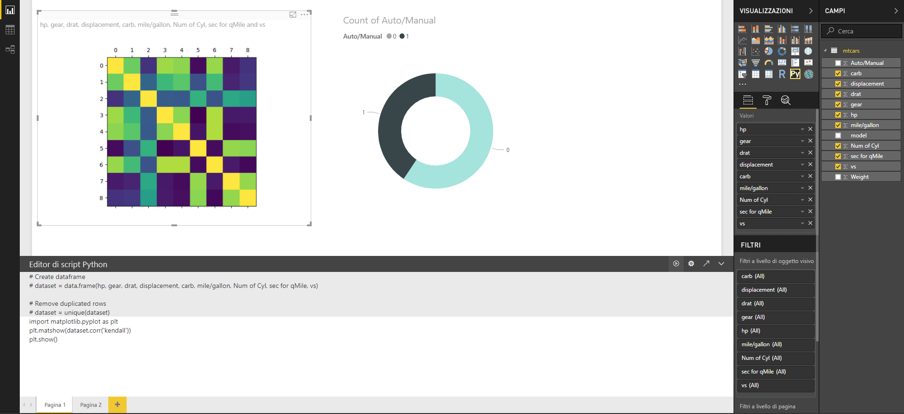
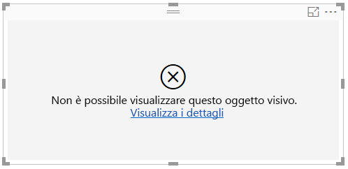

# Creare oggetti visivi di Power BI tramite Python
Con **Power BI Desktop** è possibile usare **Python** per visualizzare i dati.

## Installare Python
**Power BI Desktop** non include, distribuisce o installa il motore di **Python**. Per eseguire gli script Python in **Power BI Desktop**, è necessario installare **Python** nel computer locale. È possibile scaricare e installare **Python** gratuitamente da molte posizioni, tra cui la [pagina di download ufficiale di Python](https://www.python.org/) e [Anaconda](https://anaconda.org/anaconda/python/). La versione corrente della funzionalità di creazione di script Python in Power BI Desktop supporta la presenza di caratteri Unicode e di spazi (caratteri vuoti) all'interno del percorso di installazione.

## Abilitare gli oggetti visivi Python
Per abilitare gli oggetti visivi Python, selezionare **File > Opzioni e impostazioni > Opzioni** e nella pagina **Opzioni** visualizzata verificare che l'installazione locale di Python sia specificata nella sezione **Script Python** della finestra **Opzioni**, come illustrato nella figura seguente. Nella figura seguente, il percorso dell'installazione locale di Python è **C:\Python27**. Questo percorso è indicato in modo esplicito nella casella di testo. Assicurarsi che il percorso visualizzato rifletta correttamente l'installazione locale di Python che **Power BI Desktop** dovrà usare.
   
   

Dopo aver specificato l'installazione di Python, è possibile iniziare la creazione di oggetti visivi Python.

## Creare oggetti visivi Python in Power BI Desktop
1. Per aggiungere un oggetto visivo Python, selezionare l'icona **Oggetto visivo Python** nel riquadro **Visualizzazione**, come illustrato nella figura seguente.
   
   

   Quando si aggiunge un oggetto visivo Python a un report, in **Power BI Desktop** avviene quanto segue:
   
   - Un'immagine segnaposto dell'oggetto visivo Python viene visualizzata nell'area di disegno del report.
   
   - L'**editor di script Python** viene visualizzato nella parte inferiore del riquadro centrale.
   
   

2. Aggiungere quindi i campi da usare nello script Python nella sezione **Valori** dell'area **Campi**, esattamente come si fa con qualsiasi altro oggetto visivo **Power BI Desktop**. 
    
    Solo i campi aggiunti nell'area **Campi** sono disponibili per lo script Python. È possibile aggiungere nuovi campi o rimuovere i campi non necessari dall'area **Campi** quando si modifica lo script Python nell'**editor di script Python di Power BI Desktop**. **Power BI Desktop** rileva automaticamente i campi aggiunti o rimossi.
   
   > [!NOTE]
   > Il tipo di aggregazione predefinito per gli oggetti visivi Python è *Non riepilogare*.
   > 
   > 
   
3. A questo punto è possibile usare i dati selezionati per creare un tracciato. 

    Quando si selezionano i campi, l'**editor di script Python** genera codice di associazione di supporto nello script Python in base alle selezioni nell'area grigia nella parte superiore del riquadro dell'editor. Man mano che si selezionano o rimuovono campi, il codice di supporto nell'editor di script Python viene generato o rimosso automaticamente di conseguenza.
   
   Nell'esempio illustrato nella figura seguente, sono stati selezionati tre campi: hp, gear e drat. A seguito di queste selezioni, l'editor di script Python genera il codice di associazione seguente:
   
   * Viene creato un frame di dati denominato **dataset**
     * Questo frame di dati è costituito dai diversi campi selezionati dall'utente
   * L'aggregazione predefinita è *Non riepilogare*
   * Analogamente agli oggetti visivi della tabella, i campi vengono raggruppati e le righe duplicate sono visualizzate una sola volta
   
   
   
   > [!TIP]
   > Talvolta può essere opportuno impedire il raggruppamento automatico o la visualizzazione di tutte le righe, incluse quelle duplicate. In tal caso, è possibile aggiungere un campo di indice al set di dati in modo che tutte le righe siano considerate univoche, impedendo così il raggruppamento.
   > 
   > 
   
   Il frame di dati generato è detto **set di dati** ed è possibile accedere alle colonne selezionate in base ai rispettivi nomi. È ad esempio possibile accedere al campo gear scrivendo *dataset["gear"]* nello script Python.

4. Con il frame di dati generato automaticamente in base ai campi selezionati, è ora possibile scrivere uno script Python che generi il tracciato per il dispositivo Python predefinito. Dopo aver completato lo script, selezionare **Esegui** dalla barra del titolo dell'**editor di script Python** (**Esegui** è sul lato destro della barra del titolo).
   
    Quando si seleziona **Esegui**, **Power BI Desktop** identifica il tracciato e lo visualizza nel canvas. Poiché il processo viene eseguito nell'installazione di Python locale, verificare che siano installati i pacchetti necessari.
   
   **Power BI Desktop** ritraccia l'oggetto visivo quando si verifica uno degli eventi seguenti:
   
   * Quando si seleziona **Esegui** dalla barra del titolo dell'**editor di script Python**
   * Ogni volta che si modificano i dati, a causa dell'aggiornamento, del filtraggio o dell’evidenziazione dei dati stessi

    L'immagine seguente presenta un esempio di codice del tracciato di correlazione e illustra le correlazioni tra gli attributi di tipi diversi di automobili.

    

5. Per ottenere una vista ingrandita delle visualizzazioni, è possibile ridurre a icona l'**editor di script Python**. Naturalmente, come altri oggetti visivi in **Power BI Desktop**, è possibile applicare un filtro incrociato al tracciato di correlazione selezionando solo auto sportive nell'oggetto visivo anello, ovvero l'oggetto rotondo a destra nell'immagine di esempio precedente.

    

6. È anche possibile modificare lo script Python per personalizzare l'oggetto visivo e sfruttare la potenza di Python aggiungendo parametri al comando di tracciamento.

    Il comando di tracciamento originale era il seguente:

    plt.matshow(dataset.corr('pearson'))

    Dopo qualche modifica allo script Python, il comando è ora il seguente:

    plt.matshow(dataset.corr('kendall'))

    Di conseguenza, l'oggetto visivo Python ora esegue il tracciato con il coefficiente di correlazione Kendall Tau, come illustrato nell'immagine seguente.

    

    Quando si esegue uno script Python che genera un errore, l'oggetto visivo Python non viene tracciato e nell'area di disegno viene visualizzato un messaggio di errore. Per informazioni dettagliate sull'errore, selezionare **Visualizza i dettagli** nell'errore dell'oggetto visivo Python nell'area di disegno.

    

    > **Sicurezza degli script Python:** gli oggetti visivi Python vengono creati in base agli script Python, che possono contenere codice che comporta rischi per la sicurezza o per la privacy. Quando prova a visualizzare un oggetto visivo Python o a interagire con esso per la prima volta, l'utente riceve un messaggio di avviso di sicurezza. Abilitare gli oggetti visivi Python solo se l'autore e l'origine sono considerati attendibili o dopo aver esaminato lo script Python e averne compreso il funzionamento.
    > 
    > 

## Limitazioni note
Gli oggetti visivi Python in **Power BI Desktop** hanno alcune limitazioni:

* Limitazioni relative alle dimensioni dei dati: i dati usati da un oggetto visivo Python per un tracciato hanno un limite di 150.000 righe. Se vengono selezionate più di 150.000 righe, vengono utilizzate solo le prime 150.000 righe e viene visualizzato un messaggio sull'immagine.
* Limitazione relativa al tempo di calcolo: se un calcolo di un oggetto visivo Python supera i cinque minuti, si verifica un timeout di esecuzione e viene generato un errore.
* Relazioni: come con altri oggetti visivi Power BI Desktop, se vengono selezionati campi di dati da diverse tabelle senza una relazione definita tra di esse, si verifica un errore.
* Gli oggetti visivi Python vengono aggiornati al momento dell'aggiornamento, del filtraggio e dell'evidenziazione dei dati. Tuttavia, l'immagine in sé non è interattiva e non può essere l'origine del filtro incrociato.
* Gli oggetti visivi Python reagiscono all'evidenziazione di altri oggetti visivi, ma non è possibile fare clic sugli elementi nell'oggetto visivo Python per applicare un filtro incrociato ad altri elementi.
* Solo i tracciati eseguiti dal dispositivo di visualizzazione Python predefinito vengono visualizzati correttamente nell'area di disegno. Evitare di usare in modo esplicito un altro dispositivo di visualizzazione Python.

## Passaggi successivi
Esaminare le informazioni aggiuntive seguenti su Python in Power BI.

* [Esecuzione di script Python in Power BI Desktop](desktop-python-scripts.md)
* [Usare un IDE Python esterno con Power BI](desktop-python-ide.md)

