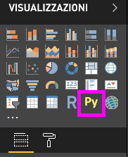
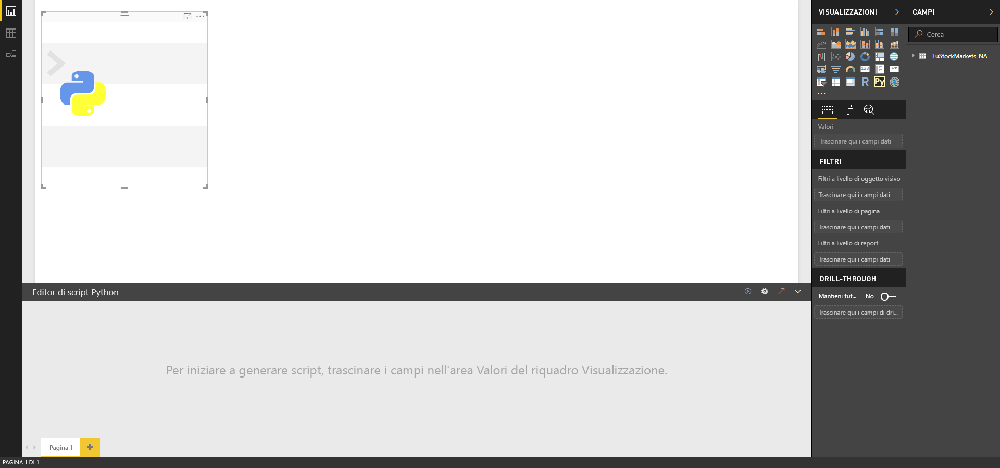
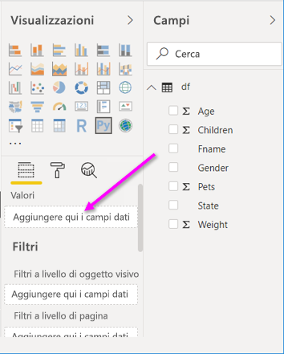
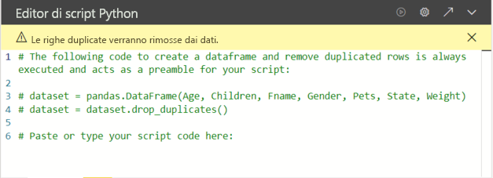
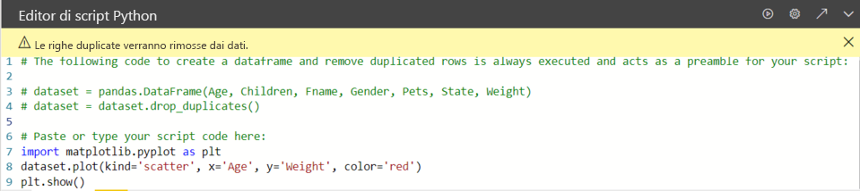

# <a name="create-power-bi-visuals-by-using-python"></a>Creare oggetti visivi di Power BI tramite Python

Con *Power BI Desktop* è possibile usare Python per visualizzare i dati.

## <a name="prerequisites"></a>Prerequisiti

Completare l'esercitazione [Eseguire script Python in Power BI Desktop](desktop-python-scripts.md) con lo script Python seguente:

```python
import pandas as pd 
df = pd.DataFrame({ 
    'Fname':['Harry','Sally','Paul','Abe','June','Mike','Tom'], 
    'Age':[21,34,42,18,24,80,22], 
    'Weight': [180, 130, 200, 140, 176, 142, 210], 
    'Gender':['M','F','M','M','F','M','M'], 
    'State':['Washington','Oregon','California','Washington','Nevada','Texas','Nevada'],
    'Children':[4,1,2,3,0,2,0],
    'Pets':[3,2,2,5,0,1,5] 
}) 
print (df) 
```

L'articolo [Eseguire script Python in Power BI Desktop](desktop-python-scripts.md) illustra come installare Python nel computer locale e come abilitarlo per gli script Python in Power BI Desktop. Questa esercitazione usa i dati dello script precedente per illustrare la creazione di oggetti visivi Python.

## <a name="create-python-visuals-in-power-bi-desktop"></a>Creare oggetti visivi Python in Power BI Desktop

1. Selezionare l'icona **Oggetto visivo Python** nel riquadro **Visualizzazioni**.

   

1. Nella finestra di dialogo **Abilita oggetti visivi script** visualizzata selezionare **Abilita**.

    Quando si aggiunge un oggetto visivo Python a un report, in Power BI Desktop vengono eseguite le azioni seguenti:

    - Un'immagine segnaposto dell'oggetto visivo Python viene visualizzata nell'area di disegno del report.

    - L'**editor di script Python** viene visualizzato nella parte inferiore del riquadro centrale.

    

1. Trascinare i campi **Age**, **Children**, **Fname**, **Gender**, **Pets**, **State** e **Weight** nell'area della sezione **Valori** che visualizza **Aggiungere qui i campi dati**.

    

   Lo script Python può usare solo i campi aggiunti alla sezione **Valori**. È possibile aggiungere o rimuovere campi dalla sezione **Valori** durante l'uso dello script Python. Power BI Desktop rileva automaticamente le modifiche apportate ai campi.

   > [!NOTE]
   > Il tipo di aggregazione predefinito per gli oggetti visivi Python è *Non riepilogare*.
   > 
   > 

1. A questo punto è possibile usare i dati selezionati per creare un tracciato.

    Man mano che si selezionano o rimuovono campi, il codice di supporto nell'editor di script Python viene generato o rimosso automaticamente. 

    A seconda delle selezioni, l'editor di script Python genera il codice di associazione seguente.

    - Nell'editor è stato creato un frame di dati del *set di dati*, con i campi aggiunti.
    - L'aggregazione predefinita è *Non riepilogare*.
    - Analogamente agli oggetti visivi della tabella, i campi vengono raggruppati e le righe duplicate sono visualizzate una sola volta.

    

     > [!TIP]
     > Talvolta può essere opportuno impedire il raggruppamento automatico o la visualizzazione di tutte le righe, incluse quelle duplicate. In tal caso, è possibile aggiungere un campo di indice al set di dati in modo che tutte le righe siano considerate univoche, impedendo così il raggruppamento.

   È possibile accedere alle colonne nel set di dati usando i rispettivi nomi. È ad esempio possibile inserire `dataset["Age"]` nello script Python per accedere al campo Age.

1. Con il frame di dati generato automaticamente in base ai campi selezionati, ora è possibile scrivere uno script Python che genera il tracciato per il dispositivo Python predefinito. Dopo aver completato lo script, selezionare **Esegui** dalla barra del titolo dell'**editor di script Python**.

   Power BI Desktop ritraccia l'oggetto visivo se si verifica uno degli eventi seguenti:

   - Quando si seleziona **Esegui** dalla barra del titolo dell'**editor di script Python**
   - Ogni volta che si modificano i dati, a causa dell'aggiornamento, del filtraggio o dell’evidenziazione dei dati stessi

   Quando si esegue uno script Python che genera un errore, l'oggetto visivo Python non viene tracciato e viene visualizzato un messaggio di errore nell'area di disegno. Per informazioni dettagliate sull'errore, selezionare **Visualizza i dettagli** dal messaggio.

   Per ottenere una vista ingrandita delle visualizzazioni, è possibile ridurre a icona l'**editor di script Python**.

A questo punto, è possibile creare alcuni oggetti visivi.

## <a name="create-a-scatter-plot"></a>Creare un tracciato a dispersione

Verrà ora creato un tracciato a dispersione per verificare se esiste una correlazione tra l'età e il peso.

1. In **Incollare o digitare qui il codice dello script** immettere il codice seguente:

   ```python
   import matplotlib.pyplot as plt 
   dataset.plot(kind='scatter', x='Age', y='Weight', color='red')
   plt.show() 
   ```  

   Il riquadro dell'editor di script Python ora dovrebbe essere simile al seguente:

   

   Viene importata la libreria **matplotlib** per tracciare e creare gli oggetti visivi.

1. Quando si seleziona il pulsante **Esegui script**, viene generato il tracciato a dispersione seguente nell'immagine segnaposto dell'oggetto visivo Python.

   

## <a name="create-a-line-plot-with-multiple-columns"></a>Creare un tracciato a linee con più colonne

 Verrà ora creato un tracciato a linee per ogni persona, che mostra il numero di figli e animali domestici. Rimuovere o impostare come commento il codice in **Incollare o digitare qui il codice dello script** e immettere il codice Python seguente:

 ```python
 import matplotlib.pyplot as plt 
ax = plt.gca() 
dataset.plot(kind='line',x='Fname',y='Children',ax=ax) 
dataset.plot(kind='line',x='Fname',y='Pets', color='red', ax=ax) 
plt.show() 
```

Quando si seleziona il pulsante **Esegui script**, viene generato il tracciato a linee seguente con più colonne.


## <a name="create-a-bar-plot"></a>Creare un tracciato a barre

Verrà ora creato un tracciato a barre per l'età di ogni persona. Rimuovere o impostare come commento il codice in **Incollare o digitare qui il codice dello script** e immettere il codice Python seguente:

```python
import matplotlib.pyplot as plt 
dataset.plot(kind='bar',x='Fname',y='Age') 
plt.show() 
```

Quando si seleziona il pulsante **Esegui script**, viene generato il tracciato a barre seguente:

 

## <a name="security"></a>Sicurezza

> [!IMPORTANT] 
> **Sicurezza degli script Python:** gli oggetti visivi Python vengono creati in base agli script Python, che possono contenere codice che comporta rischi per la sicurezza o per la privacy. Quando prova a visualizzare un oggetto visivo Python o a interagire con esso per la prima volta, l'utente riceve un messaggio di avviso di sicurezza. Abilitare gli oggetti visivi Python solo se l'autore e l'origine sono considerati attendibili o dopo aver esaminato lo script Python e averne compreso il funzionamento.
>  

## <a name="more-information-about-plotting-with-matplotlib-pandas-and-python"></a>Altre informazioni sulla creazione di tracciati con Matplotlib, Pandas e Python

Questa esercitazione illustra le fasi iniziali della creazione di oggetti visivi con Python in Power BI Desktop. Vengono appena accennate le numerose opzioni e funzionalità per la creazione di report visivi con Python, Pandas e la libreria Matplotlib. Sono disponibili molte altre informazioni in proposito e di seguito sono riportati alcuni collegamenti per iniziare.

- Documentazione nel sito Web [Matplotlib](https://matplotlib.org/). 
- [Esercitazione su Matplotlib: guida di base per l'uso di Matplotlib con Python](https://www.datasciencelearner.com/matplotlib-tutorial-complete-guide-to-use-matplotlib-with-python/) 
- [Esercitazione su Matplotlib: libreria Matplotlib Python con esempi](https://www.edureka.co/blog/python-matplotlib-tutorial/) 
- [Informazioni di riferimento sulle API Pandas](https://pandas.pydata.org/pandas-docs/stable/reference/index.html) 
- [Visualizzazioni Python nel servizio Power BI](https://powerbi.microsoft.com/blog/python-visualizations-in-power-bi-service/) 
- [Uso di oggetti visivi Python in Power BI](https://www.absentdata.com/how-to-user-python-and-power-bi/)

## <a name="known-limitations"></a>Limitazioni note

Gli oggetti visivi Python in Power BI Desktop hanno alcune limitazioni:

- Limitazioni relative alle dimensioni dei dati. I dati usati dall'oggetto visivo Python per la creazione del tracciato sono limitati a 150.000 righe. Se vengono selezionate più di 150.000 righe, vengono utilizzate solo le prime 150.000 righe e viene visualizzato un messaggio sull'immagine. Inoltre, i dati di input hanno un limite di 250 MB. 
- Risoluzione. Tutti gli oggetti visivi Python vengono visualizzati a 72 DPI.
- Limitazione relativa al tempo di calcolo. Se il calcolo di un oggetto visivo Python supera i cinque minuti, si verifica un timeout di esecuzione e viene generato un errore.
- Relazioni. come con altri oggetti visivi Power BI Desktop, se vengono selezionati campi di dati da diverse tabelle senza una relazione definita tra di esse, si verifica un errore.
- Gli oggetti visivi Python vengono aggiornati al momento dell'aggiornamento, del filtraggio e dell'evidenziazione dei dati. Tuttavia, l'immagine in sé non è interattiva e non può essere l'origine del filtro incrociato.
- Gli oggetti visivi Python reagiscono all'evidenziazione di altri oggetti visivi, ma non è possibile fare clic sugli elementi nell'oggetto visivo Python per applicare un filtro incrociato ad altri elementi.
- Solo i tracciati eseguiti dal dispositivo di visualizzazione Python predefinito vengono visualizzati correttamente nell'area di disegno. Evitare di usare in modo esplicito un altro dispositivo di visualizzazione Python.
- Gli oggetti visivi Python non supportano la ridenominazione delle colonne di input. Durante l'esecuzione dello script si farà riferimento alle colonne con il nome originale.

## <a name="next-steps"></a>Passaggi successivi

Esaminare le informazioni aggiuntive seguenti su Python in Power BI.

- [Eseguire script Python in Power BI Desktop](desktop-python-scripts.md)
- [Usare un IDE Python esterno con Power BI](desktop-python-ide.md)

