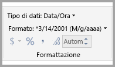
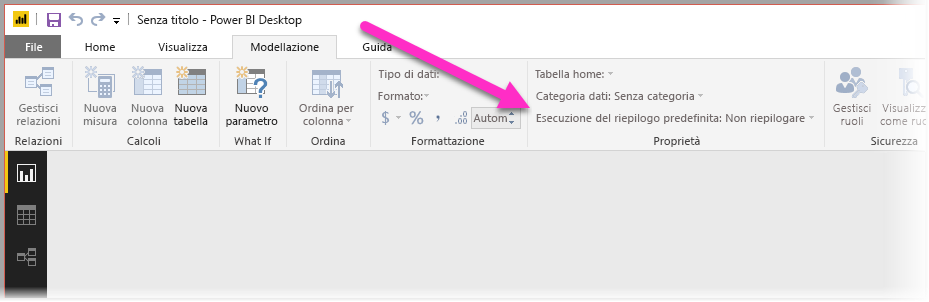
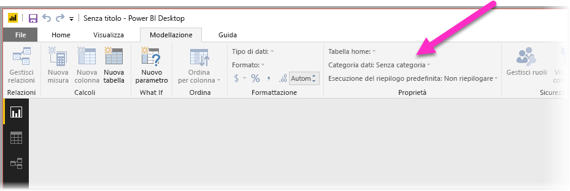
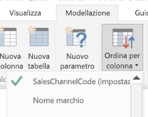
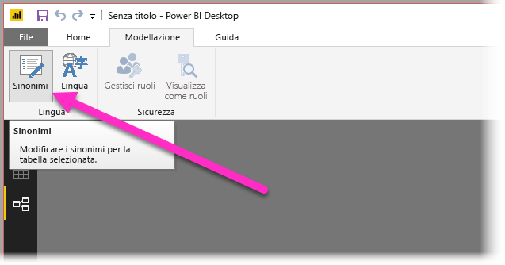
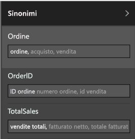

# Usare Domande e risposte in Power BI Desktop per eseguire query in linguaggio naturale
L'uso del linguaggio naturale e di frasi comuni per porre le domande ai dati è una funzionalità molto potente. Ed è ancora più potente quando i dati rispondono, ovvero quello che fa Domande e risposte in **Power BI Desktop**.

Per consentire a Domande e risposte di interpretare correttamente l'ampia raccolta di domande a cui è in grado di rispondere, Domande e risposte deve fare ipotesi sul modello. Se la struttura del modello non soddisfa una o più di tali ipotesi, sarà necessario rettificare il modello. Le rettifiche per Domande e risposte corrispondono alle procedure di ottimizzazione consigliate per qualsiasi modello in Power BI, indipendentemente dal fatto che si usi Domande e risposte o meno. 

> [!NOTE]
> Le Domande e risposte sono disponibili solo quando si usa un modello contenente dati **importati**. Le connessioni dinamiche a modelli SSAS e DirectQuery non sono supportate.
>
>

Nelle sezioni seguenti viene descritto come adattare il modello per il corretto funzionamento con Domande e risposte in Power BI.

## Aggiungere relazioni mancanti

Se nel modello mancano le relazioni tra le tabelle, i report di Power BI e Domande e risposte non saranno in grado di interpretare come unire tali tabelle quando viene posta una domanda su di esse. Le relazioni sono l'aspetto fondamentale di un buon modello. Ad esempio, non è possibile porre la domanda relativa alle "vendite totali per i clienti di Seattle" se manca la relazione tra la tabella *ordini* e la tabella *clienti*. Le immagini seguenti mostrano esempi di un modello da modificare e di un modello pronto per Domande e risposte.

**Da modificare**

**Pronto per Domande e risposte**

## Rinominare tabelle e colonne

La scelta delle tabelle e delle colonne è molto importante per Domande e risposte. Se ad esempio è presente una tabella contenente l'elenco dei clienti denominata *CustomerSummary*, sarà necessario porre la domanda "Elenca i riepiloghi dei clienti di Chicago" anziché "Elenca i clienti di Chicago". 

Benché Domande e risposte possa eseguire alcune operazioni di suddivisione delle parole e rilevamento dei plurali di base, presuppone che i nomi delle tabelle e delle colonne ne riflettano in modo accurato il contenuto.

Ecco un altro esempio. Si supponga di avere una tabella denominata *ConteggioPersonale* che contiene i nomi, i cognomi e i numeri di matricola dei dipendenti e un'altra tabella denominata *Dipendenti* che contiene i numeri di matricola dei dipendenti, il numero di lavori svolti e le date di inizio. Per chi ha familiarità con il modello non sono necessarie spiegazioni, ma se viene posta la domanda "conta dipendenti" verrà restituito il numero di righe della tabella "Dipendenti" che probabilmente non è il risultato previsto, poiché si tratta di un conteggio di tutti i lavori svolti da ogni dipendente. Sarebbe quindi opportuno rinominare le tabelle in modo che riflettano effettivamente i dati contenuti.

**Da modificare**

**Pronto per Domande e risposte**

## Correggere i tipi di dati non corretti

I dati importati possono presentare tipi di dati non corretti. In particolare, le colonne *data* e *numero* importate come *stringhe* non verranno interpretate da Domande e rispose come date e numeri. È necessario assicurarsi di selezionare il tipo di dati corretto nel modello di Power BI.

## Contrassegnare le colonne anno e identificatore come Non riepilogare

Per impostazione predefinita, Power BI aggrega in modo aggressivo le colonne numeriche, quindi le domande come "totale vendite per anno" possono talvolta restituire un totale generale delle vendite e un totale generale degli anni. Se non si vuole che Power BI adotti questo comportamento per colonne specifiche, impostare la proprietà **Riepiloga per** nella colonna su **Non riepilogare**. Prestare attenzione alle colonne **anno**, **mese**, **giorno** e **ID**, in quanto sono quelle in cui si verificano più di frequente i problemi. Impostare **Riepiloga per** su **Non riepilogare** o su **Media** può risultare utile anche altre colonne non sensibili alla somma, come *età*. Questa impostazione è disponibile nella scheda **Modellazione**.

## Scegliere una categoria di dati per ogni colonna data e area geografica

La **Categoria di dati** fornisce ulteriori informazioni semantiche sul contenuto di una colonna, oltre al relativo tipo di dati. Ad esempio, una colonna integer potrebbe essere contrassegnata come CAP, una colonna stringa come Città, Paese, Area geografica e così via. Queste informazioni vengono usate da Domande e risposte in due modi importanti: per la selezione della visualizzazione e per varianti linguistiche.

Per prima cosa, Domande e risposte usa le informazioni in **Categoria di dati** per scegliere il tipo di visualizzazione da usare. Ad esempio, riconosce che le colonne con **Categorie di dati** data e ora sono in genere una buona scelta per l'asse orizzontale di un grafico a linee o l'asse di riproduzione di un grafico a bolle. Presume inoltre che i risultati contenenti colonne con **Categorie di dati** geografiche vengono visualizzati meglio su una mappa.

In secondo luogo, Domande e risposte fa alcune ipotesi prudenti sul modo in cui gli utenti fanno riferimento alle colonne di date e aree geografiche, per aumentare la comprensione di determinati tipi di domande. Ad esempio il "Quando" nella domanda "Quando è stato assunto Davide Milani?" fa riferimento a una colonna data e "Crema" in "Conta i clienti a Crema" indica più probabilmente una città anziché un colore.

## Scegliere una colonna in base a cui ordinare per le colonne pertinenti

La proprietà **Ordina per colonna** permette di ordinare automaticamente i dati in base a una colonna diversa. Ad esempio, se si pone la domanda "ordina i clienti per taglia", è più probabile che si voglia che la colonna Taglia venga ordinata in base al numero di taglia sottostante (XS, S, M, L, XL) anziché in ordine alfabetico.

## Normalizzare il modello

Questo non significa che è necessario modificare l'intero modello. Tuttavia, alcune strutture sono difficili e in tutta probabilità Domande e risposte non riuscirà a gestirle correttamente. Con alcune operazioni di normalizzazione di base della struttura del modello, sarà possibile aumentare l'usabilità dei report di Power BI in modo significativo, così come l'accuratezza dei risultati di Domande e risposte.

La regola generale da seguire è questa: ogni "elemento" univoco a cui l'utente si riferisce deve essere rappresentato esattamente da un oggetto (tabella o colonna) del modello. Se gli utenti si riferiscono ai clienti, deve essere presente un oggetto *cliente*. Se gli utenti si riferiscono alle vendite, deve essere presente un oggetto *vendite*. Sembra semplice, o no? A seconda della forma dei dati con cui si inizia, può esserlo. L'**editor di query** offre funzionalità di forma dei dati avanzate in caso di necessità, ma molte delle trasformazioni più semplici possono essere eseguite semplicemente con i calcoli nel modello di Power BI.

Le sezioni seguenti descrivono alcune trasformazioni comuni.

### Creare nuove tabelle per le entità con più colonne

Se sono presenti più colonne che agiscono come una singola unità distinta in una tabella più grande, è opportuno creare una tabella appositamente per tali colonne. Ad esempio, se nella tabella *Aziende* è presente una colonna con Nome contatto, Titolo contatto e Telefono contatto, può essere utile creare una tabella *Contatti* separata contenente Nome, Titolo e Telefono, con un collegamento alla tabella *Aziende*. In questo modo, diventa molto più facile porre domande sui contatti separatamente dalle domande sulle aziende di cui essi costituiscono il contatto, migliorando inoltre la flessibilità della visualizzazione.

**Da modificare**

**Pronto per Domande e risposte**

### Eliminare i contenitori delle proprietà

Se il modello include contenitori delle proprietà, è opportuno ristrutturarli e creare una singola colonna per proprietà. I contenitori delle proprietà sono molto utili per gestire un elevato numero di proprietà, ma prevedono diversi limiti interni che i report di Power BI e Domande e risposte non riescono ad aggirare.

Si consideri ad esempio un tabella *CustomerDemographics* con le colonne CustomerID, Property e Value in cui ogni riga rappresenta una proprietà diversa del cliente, ad esempio età, stato civile, città e così via. Sovraccaricando il significato della colonna Value in base al contenuto della colonna Property, diventa impossibile per Domande e risposte interpretare la maggior parte delle domande che vi fanno riferimento. Una semplice domanda come "mostra l'età di ogni cliente" potrebbe funzionare, poiché può essere interpretata come "mostra i clienti e i dati demografici dei clienti dove la proprietà corrisponde a età". Tuttavia, la struttura del modello semplicemente non supporta domande leggermente più complesse, come "età media dei clienti di Chicago". Mentre gli utenti che creano direttamente i report di Power BI possono talvolta trovare soluzioni intelligenti per ottenere i dati che cercano, Domande e risposte funziona solo quando ogni colonna ha un solo significato.

**Da modificare**

**Pronto per Domande e risposte**

### Combinare i dati per eliminare il partizionamento

Se i dati sono stati partizionati su più tabelle o i valori sono stati trasformati tramite Pivot su più colonne, alcune operazioni comuni saranno difficili o impossibili da eseguire. Consideriamo un tipico partizionamento di tabella: una tabella *Vendite2000-2010* e una tabella *Vendite2011-2020*. Se tutti i report importanti sono limitati a una decade specifica, ai fini dei report di Power BI si potrebbe lasciare tutto com'è. Tuttavia, in virtù della flessibilità di Domande e risposte, gli utenti potrebbero aspettarsi risposte a domande come "totale vendite per anno". Perché funzioni, sarà necessario combinare i dati in una singola tabella del modello di Power BI.

Analogamente, consideriamo una tipica colonna con valore trasformato tramite Pivot: una tabella *BookTour* contenente le colonne Author, Book, City1, City2 e City3. Con una struttura come questa, anche le domande più semplici, ad esempio "conta i libri per città" non può essere interpretata correttamente. Perché funzioni, è necessario creare una tabella *BookTourCities* che combina i valori delle città in una singola colonna.

**Da modificare**

**Pronto per Domande e risposte**

### Dividere le colonne formattate

Se l'origine da cui vengono importati i dati contiene colonne formattate, i report di Power BI e Domande e risposte, non riusciranno ad accedere alle colonne per analizzarne il contenuto. Ad esempio, se è presente una colonna **Full Address** contenente indirizzo, città e paese, sarà necessario dividerla nelle colonne Address, City e Country per consentire agli utenti di eseguire query singolarmente su ogni colonna.

**Da modificare**

**Pronto per Domande e risposte**

Analogamente, se sono presenti colonne con nomi completi di persone, sarà opportuno aggiungere le colonne **Nome** e **Cognome** nel caso in cui gli utenti vogliano porre domande usando nomi parziali. 

### Creare nuove tabelle per le colonne multivalore

Se l'origine da cui vengono importati i dati contiene colonne multivalore, i report di Power BI e Domande e risposte, non riusciranno ad accedere alle colonne per analizzarne il contenuto. Se ad esempio è presente una colonna Composer contenente i nomi di più compositori per un brano, sarà necessario dividerla in più righe in una tabella *Composers* separata.

**Da modificare**

**Pronto per Domande e risposte**

### Denormalizzare per eliminare le relazioni inattive

L'unica eccezione alla regola secondo cui è opportuno normalizzare, è quando è presente più di un percorso per passare da una tabella all'altra. Ad esempio, se è presente una tabella *Flights* con le colonne SourceCityID e DestinationCityID, entrambe con una relazione con la tabella *Cities*, una di queste due relazioni dovrà essere contrassegnata come inattiva. Poiché Domande e risposte può usare solo relazioni attive, non sarebbe possibile porre domande sull'origine o sulla destinazione, a seconda della città scelta. Se invece le colonne relative al nome della città nella tabella *Flights* vengono denormalizzate, sarà possibile porre domande come "elenca i voli per domani con città di origine Seattle e città di destinazione San Francisco".

**Da modificare**

**Pronto per Domande e risposte**

### Aggiungere sinonimo a tabelle e colonne

Questa procedura si applica specificatamente a Domande e risposte e non ai report di Power BI in generale. Spesso gli utenti usano vari termini per fare riferimento alla stessa cosa, ad esempio totale vendite, vendite nette, totale vendite nette. Il modello di Power BI consente di aggiungere questi sinonimi alle tabelle e alle colonne nel modello. 

Questo è un passaggio molto importante. Anche con nomi di tabelle e colonne estremamente semplici, gli utenti di Domande e risposte pongono domande usando i primi termini che vengono loro in mente, senza scegliere da un elenco predefinito di colonne. Aggiungendo i sinonimi più probabili e frequenti, sarà possibile migliorare l'esperienza degli utenti con i report. Per aggiungere i sinonimi, nella visualizzazione **Relazioni** selezionare il pulsante Sinonimi nella barra multifunzione, come illustrato nell'immagine seguente.

Il campo **Sinonimi** in cui è possibile aggiungere i sinonimi viene visualizzato sul lato destro di **Power BI Desktop**.

 Aggiungere i sinonimi con attenzione, in quanto aggiungere lo stesso sinonimo a più di una colonna o tabella può generare ambiguità. Domande e risposte, laddove possibile, usa il contesto per scegliere tra sinonimi ambigui, ma non tutte le domande presentano contesto sufficiente. Se gli utenti pongono la domanda "conta i clienti" e nel modello sono presenti tre elementi con il sinonimo "cliente", la risposta restituita potrebbe non essere quella prevista. In questi casi, assicurarsi che il sinonimo primario sia univoco, in quanto questo è quello che viene usato nella riformulazione. Ad esempio, la riformulazione "mostra il numero di record dei clienti archiviati" potrebbe avvisare l'utente dell'ambiguità suggerendo di porre la domanda in modo diverso.

## Passaggi successivi
Per altre informazioni sulle funzionalità incluse in Power BI Desktop, vedere gli articoli seguenti:

* [Usare il drill-through in Power BI Desktop](desktop-drillthrough.md)
* [Visualizzare un riquadro del dashboard o un oggetto visivo di un report in modalità messa a fuoco](service-focus-mode.md)

