# Panoramica delle query in Power BI Desktop
Con **Power BI Desktop** è possibile connettersi a un mondo di dati, creare report efficaci e fondamentali e condividere il proprio impegno con altri utenti, che potranno quindi basarsi sul lavoro già svolto ed espandere le proprie attività di business intelligence.

Power BI Desktop offre tre visualizzazioni:

* **Report** : consente di usare le query create dall'utente per generare visualizzazioni interessanti, organizzate nella sequenza preferita e con più pagine, che è possibile condividere con altri
* **Dati** : consente di visualizzare i dati nel report in formato di modello di dati, a cui è possibile aggiungere misure, creare nuove colonne e gestire le relazioni
* **Relazioni** : consente di ottenere una rappresentazione grafica delle relazioni che sono state stabilite nel modello di dati e di gestirle o modificarle in base alle esigenze.

Queste visualizzazioni sono accessibili selezionando una delle tre icone lungo il lato sinistro di Power BI Desktop. Nella figura seguente, è selezionata la Visualizzazione Report, indicata dalla striscia di colore giallo accanto all'icona.  

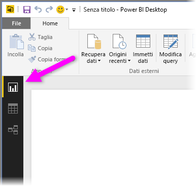

Power BI Desktop viene fornite anche con un **Editor di query**, che consente di connettersi a una o più origini dati, modellare e trasformare i dati in base alle esigenze, quindi caricare tale modello in Power BI Desktop.

Questo documento fornisce una panoramica dell'elaborazione dati nell' **Editor di query**. C'è molto di più da imparare, naturalmente, perciò, al termine di questo documento, sono disponibili collegamenti ad articoli che forniscono informazioni dettagliate e informazioni aggiuntive sui tipi di dati supportati, sulla connessione ai dati, sul data shaping, sulla creazione di relazioni e su come iniziare.

Prima di tutto è necessario acquisire familiarità con l'**editor di query**.

## Editor di query
Per ottenere l'**editor di query**, selezionare **Modifica query** dalla scheda **Home** di Power BI Desktop.  

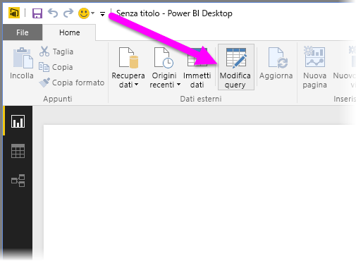

Senza connessioni dati, l'**editor di query** appare come un riquadro vuoto, pronto per i dati.  

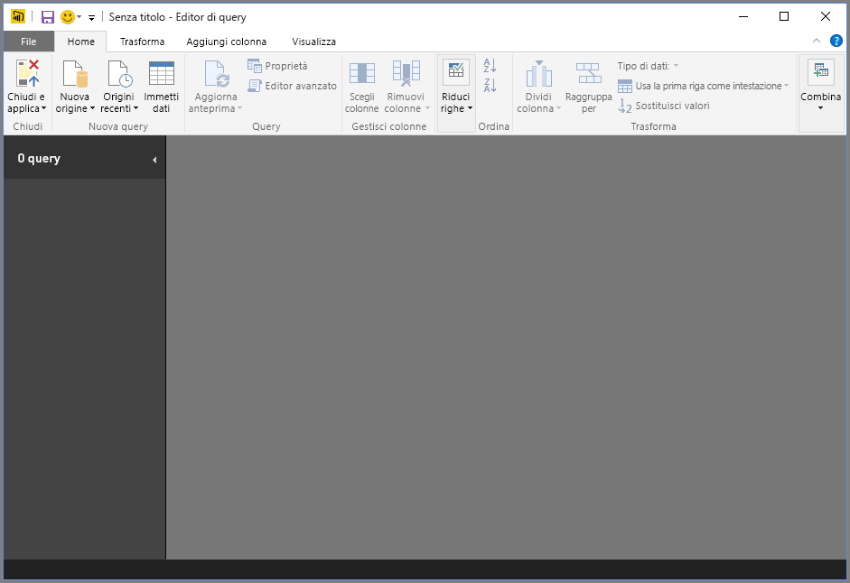

Dopo aver caricato una query, la visualizzazione dell'**editor di query** diventa più interessante. Se ci si connette all'origine dati Web seguente, l'**editor di query** carica le informazioni relative ai dati, a cui è possibile iniziare a dare forma.

[*http://www.bankrate.com/finance/retirement/best-places-retire-how-state-ranks.aspx*](http://www.bankrate.com/finance/retirement/best-places-retire-how-state-ranks.aspx)

Ecco come viene visualizzato l'**editor di query** dopo aver stabilito una connessione dati:

1. Nella barra multifunzione, molti pulsanti sono ora attivi per interagire con i dati nella query
2. Nel riquadro sinistro, le query vengono elencate e rese disponibili per la selezione, visualizzazione e il data shaping
3. Nel riquadro centrale, vengono visualizzati i dati della query selezionata, disponibili per il data shaping
4. Viene visualizzata la finestra **Impostazioni query**, che elenca le proprietà della query e i passaggi applicati  
   
   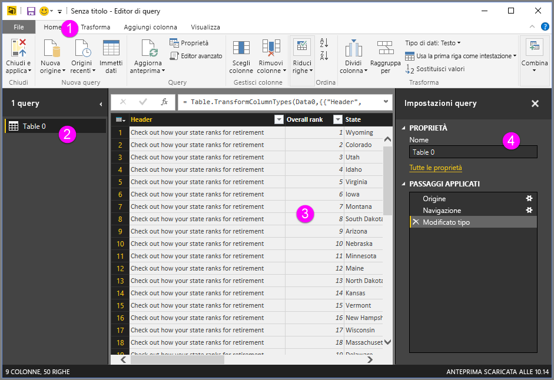

Nelle sezioni seguenti verranno ora esaminate ciascuna di queste quattro aree: la barra multifunzione, il riquadro query, la visualizzazione dei dati e il riquadro Impostazioni query.

## Barra multifunzione query
La barra multifunzione nell'**editor di query** è costituita da quattro schede: **Home**, **Trasforma**, **Aggiungi colonna** e **Visualizza**.

La scheda **Home** contiene le attività di query comuni, tra cui il primo passaggio in qualsiasi query, cioè **Recupera dati**. La figura seguente mostra la barra multifunzione **Home**.  

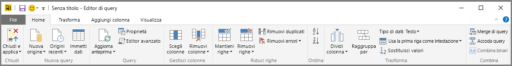

Per connettersi ai dati e iniziare il processo di compilazione di query, selezionare il pulsante **Recupera dati** . Viene visualizzato un menu, che fornisce le origini dati più comuni.  

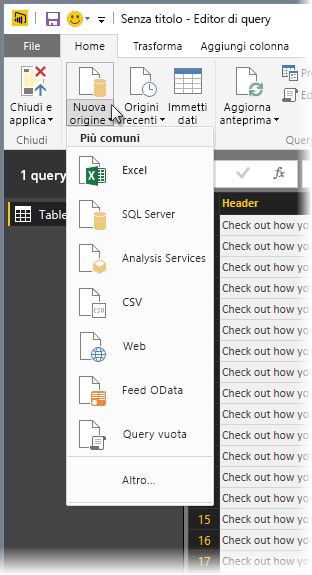

Per altre informazioni sulle origini dati disponibili, vedere **Origini dati**. Per informazioni sulla connessione ai dati, includi gli esempi e i passaggi, vedere **Connettersi ai dati**.

La scheda **Trasforma** fornisce accesso alle attività di trasformazione dei dati comuni, ad esempio aggiunta o rimozione di colonne, modifica dei tipi di dati, suddivisione di colonne e altre attività guidate dai dati. L'immagine seguente mostra la scheda **Trasforma** .  

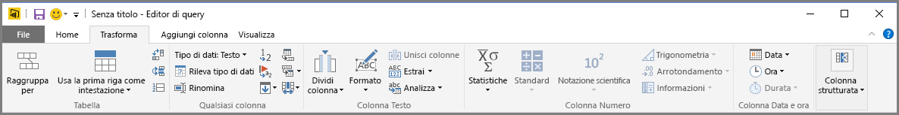

Per altre informazioni sulla trasformazione dei dati, inclusi gli esempi, vedere **Eseguire il data shaping e combinare dati**.

La scheda **Aggiungi colonna** fornisce ulteriori attività associate all'aggiunta di una colonna, la formattazione di dati della colonna e l'aggiunta di colonne personalizzate. L'immagine seguente mostra la scheda **Aggiungi colonna** .  

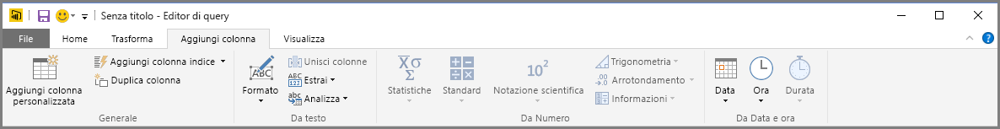

La scheda **Visualizza** sulla barra multifunzione viene usata per attivare/disattivare la visualizzazione di determinati riquadri o finestre. È anche usata per visualizzare l'Editor avanzato. La figura seguente mostra la scheda **Visualizza**.  

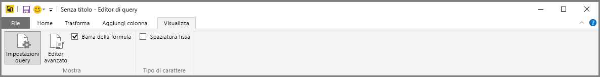

È utile sapere che molte delle attività disponibili nella barra multifunzione sono disponibili anche facendo clic con il pulsante destro del mouse su una colonna, o su altri dati, nel riquadro centrale.

## Riquadro a sinistra
Il riquadro a sinistra contiene il numero di query attive, oltre al nome della query. Quando si seleziona una query nel riquadro di sinistra, i relativi dati vengono visualizzati nel riquadro centrale, dove è possibile eseguirne lo shaping e la trasformazione in base alle proprie esigenze. La figura seguente mostra il riquadro di sinistra contenente più query.  

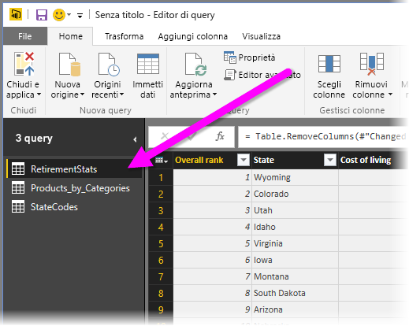

## Riquadro centrale (dati)
Nel riquadro centrale, o riquadro Dati, vengono visualizzati i dati della query selezionata. È qui che viene eseguita gran parte dell'attività della visualizzazione Query.

Nella figura seguente viene visualizzata la connessione dati Web stabilita in precedenza, con la colonna **Overall score** selezionata; fare clic con il pulsante destro del mouse sulla relativa intestazione per visualizzare le voci di menu disponibili. Si noti che molte di queste voci del menu di scelta rapida corrispondono ai pulsanti disponibili nelle schede della barra multifunzione.  

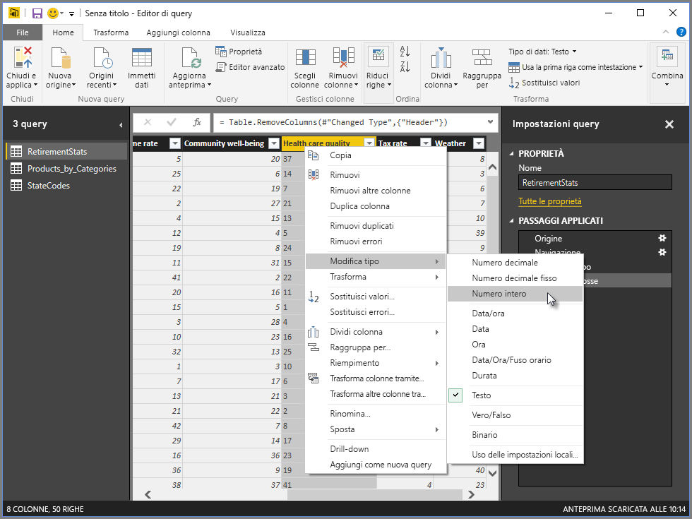

Quando si seleziona una voce di menu del menu di scelta rapida (o un pulsante della barra multifunzione), Query applica il passaggio ai dati e lo salva come parte della query stessa. I passaggi vengono registrati nel riquadro **Impostazioni query** in ordine sequenziale, come descritto nella sezione successiva.  

## Riquadro Impostazioni query
Nel riquadro **Impostazioni query** vengono visualizzati tutti i passaggi associati a una query. Ad esempio, nell'immagine seguente, nella sezione **Passaggi applicati** del riquadro **Impostazioni query** riflette il fatto che è stato appena modificato il tipo della colonna **Overall score** .

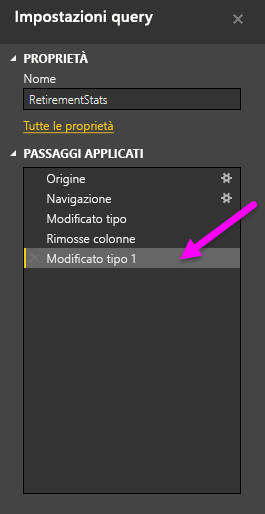

Man mano che verranno applicati passaggi di shaping aggiuntivi alla query, verranno acquisiti nella sezione **Passaggi applicati** .

È importante sapere che i dati sottostanti *non* vengono modificati; invece, l'Editor di query regola e dà forma alla visualizzazione dei dati e qualsiasi interazione con i dati sottostanti avviene in base alla visualizzazione dei dati modificata e sottoposta a shaping dall'Editor di query.

Nel riquadro **Impostazioni query** , è possibile rinominare, eliminare o riordinare i passaggi secondo necessità. A tale scopo, fare clic con il pulsante destro del mouse sul passaggio nella sezione **Passaggi applicati** e scegliere dal menu di scelta rapida. Tutte le query vengono eseguite nell'ordine in cui vengono visualizzate nel riquadro **Passaggi applicati**.

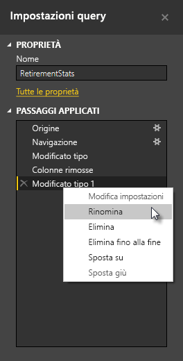

## Editor avanzato
Se si vuole visualizzare il codice che Query crea a ogni passaggio o si vuole creare un codice di shaping personalizzato, è possibile usare l' **Editor avanzato**. Per avviare l'editor avanzato, selezionare **Visualizza** dalla barra multifunzione, quindi selezionare **Editor avanzato**. Verrà visualizzata una finestra che mostra il codice della query esistente.  
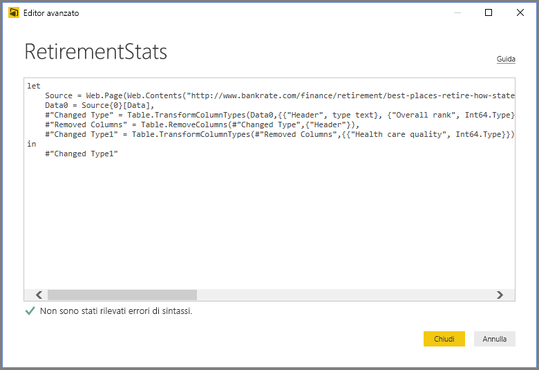

È possibile modificare direttamente il codice nella finestra **Editor avanzato** . Per chiudere la finestra, selezionare il pulsante **Fatto** o **Annulla** .  

## Salvare il lavoro
Quando la query si trova dove opportuno, è possibile applicare le modifiche al modello di dati in Power BI Desktop con l'Editor di query, quindi chiudere l'Editor di query. A tale scopo, scegliere **Chiudi e applica** dal menu **File** dell'Editor di query.  
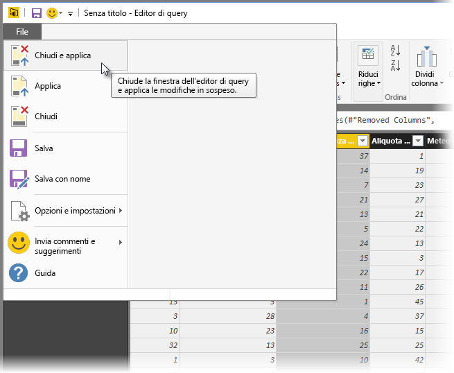

Durante l'avanzamento, una finestra di dialogo di Power BI Desktop ne mostra lo stato.  
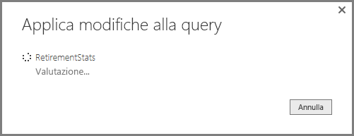

Dopo aver inserito la query dove opportuno oppure se si vuole solo verificare di aver salvato il lavoro, Power BI Desktop può salvare il lavoro sotto forma di file pbix.

Per salvare il lavoro, selezionare **File \> Salva** (o **File \> Salva con nome**), come illustrato nella figura seguente.  
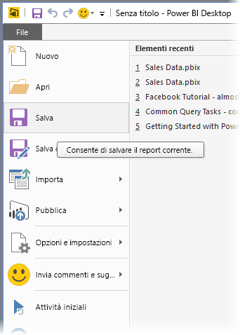

## Passaggi successivi
Power BI Desktop offre infinite possibilità. Per altre informazioni sulle capacità disponibili, vedere le risorse seguenti:

* [Introduzione a Power BI Desktop](desktop-getting-started.md)
* [Origini dati in Power BI Desktop](desktop-data-sources.md)
* [Connettersi ai dati in Power BI Desktop](desktop-connect-to-data.md)
* [Effettuare il data shaping e combinare i dati con Power BI Desktop](desktop-shape-and-combine-data.md)
* [Attività di query comuni in Power BI Desktop](desktop-common-query-tasks.md)   

