# Usare Misure rapide per eseguire facilmente calcoli comuni e avanzati
È possibile usare **Misure rapide** per eseguire facilmente e velocemente calcoli comuni e avanzati. Una **misura rapida** esegue un set di comandi DAX in background in base all'input fornito dall'utente in una finestra di dialogo, quindi presenta i risultati da usare nel report. Non è quindi necessario scrivere i comandi DAX perché quest'operazione viene eseguita automaticamente. Soprattutto, è possibile visualizzare le espressioni DAX che vengono eseguite dalla Misura rapida e iniziare subito o espandere le proprie competenze di DAX.

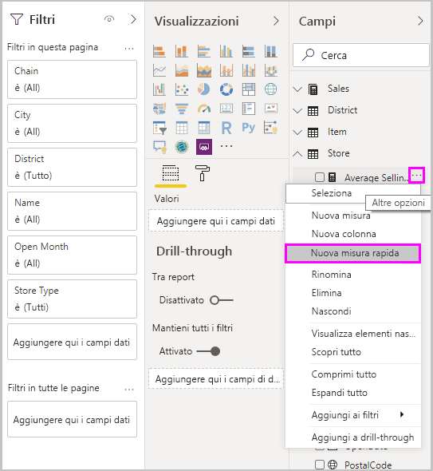

Per creare le **Misure rapide**, fare clic con il pulsante destro del mouse su un campo nell'area **Campi**, quindi selezionare **Misure rapide** dal menu visualizzato. È anche possibile fare clic con il pulsante destro del mouse su qualsiasi valore nel riquadro **Valori** di un oggetto visivo esistente (ad esempio il campo *Valori* in un oggetto visivo *Grafico a barre*). Sono disponibili diverse categorie di calcoli e metodi per modificare ogni calcolo secondo le proprie esigenze.

### Le misure rapide sono ora disponibili a livello generale

A partire dalla versione di febbraio 2018 di **Power BI Desktop**, le misure rapide sono disponibili a livello generale (non più in anteprima). Se si usa una versione precedente di **Power BI Desktop**, è possibile provare la funzionalità **Misure rapide** a partire dalla versione di **aprile 2017** di **Power BI Desktop** selezionando **File > Opzioni e impostazioni > Opzioni > Funzionalità di anteprima** e selezionando quindi la casella di controllo **Misure rapide**.

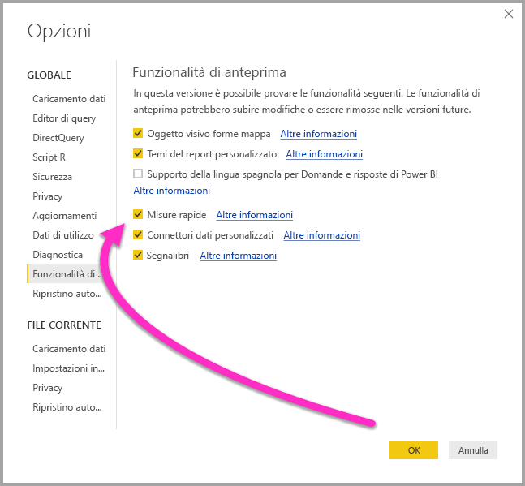

Dopo aver effettuato la selezione è necessario riavviare **Power BI Desktop**.

## Uso di Misure rapide
Per creare una **Misura rapida**, fare clic con il pulsante destro del mouse su un campo qualsiasi nell'area **Campi** in **Power BI Desktop** e selezionare **Misura rapida** dal menu visualizzato.

Quando si usano le connessioni in tempo reale di SQL Server Analysis Services (SSAS), alcune **Misure rapide** sono disponibili. **Power BI Desktop** visualizza solo la raccolta di **Misure rapide** supportate per la versione di SSAS a cui viene effettuata la connessione. Quindi, se si è connessi a un'origine dati dinamica e alcune **Misure rapide** non sono disponibili nell'elenco, è perché la versione di SSAS a cui si è connessi non supporta la misura DAX usata per implementare la **Misura rapida** in questione.

Quando selezionata dal menu di scelta rapida, verrà visualizzata la finestra **Misure rapide**, che consente di selezionare i calcoli necessari e i campi in base ai quali si vuole eseguire il calcolo.

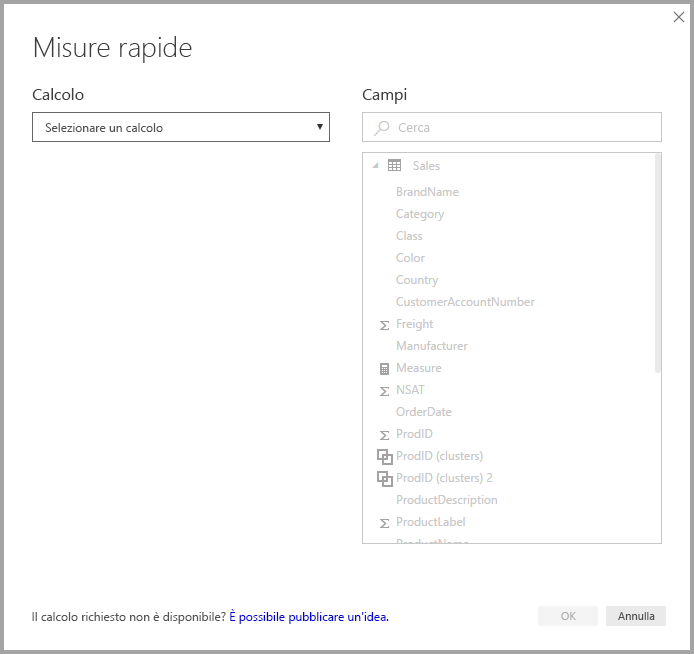

Quando si seleziona il menu a discesa, viene visualizzato il lungo elenco di **Misure rapide** disponibili.

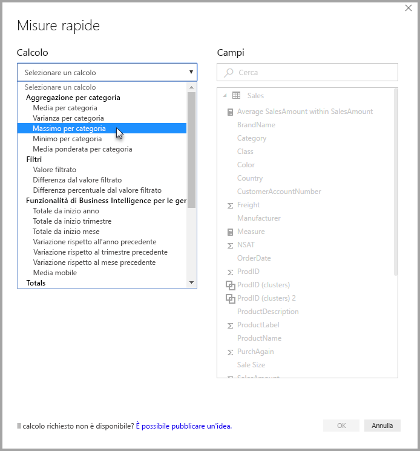

Esistono cinque gruppi distinti di tipi di calcolo Misura rapida, ognuno con una raccolta di calcoli. Tali gruppi e calcoli sono i seguenti:

* **Aggregazione per categoria**
  * Media per categoria
  * Varianza per categoria
  * Massimo per categoria
  * Minimo per categoria
  * Media ponderata per categoria
* **Filtri**
  * Valore filtrato
  * Differenza dal valore filtrato
  * Differenza percentuale dal valore filtrato
  * Vendite da nuove categorie
* **Business Intelligence**
  * Totale da inizio anno
  * Totale da inizio trimestre
  * Totale da inizio mese
  * Variazione rispetto all'anno precedente
  * Variazione rispetto al trimestre precedente
  * Variazione rispetto al mese precedente
  * Media mobile
* **Totali**
  * Totale parziale
  * Totale per categoria (filtri applicati)
  * Totale per categoria (filtri non applicati)
* **Operazioni matematiche**
  * Aggiunta
  * Sottrazione
  * Moltiplicazione
  * Divisione
  * Differenza percentuale
  * Coefficiente di correlazione
* **Testo**
  * Classificazione a stelle
  * Elenco concatenato di valori

Il numero di calcoli dovrebbe aumentare in futuro e saranno molto apprezzati i suggerimenti degli utenti su quali **Misure rapide** vorrebbero vedere ed eventuali idee (incluse le formule DAX sottostanti) per **Misure rapide** da aggiungere. Altre informazioni in proposito vengono fornite alla fine di questo articolo.

## Esempio di Misure rapide
Esaminiamo un esempio di queste **Misure rapide** in azione.

L'oggetto visivo **Matrice** seguente mostra una tabella delle vendite di vari prodotti elettronici. È una tabella di base che include il totale per ogni categoria.

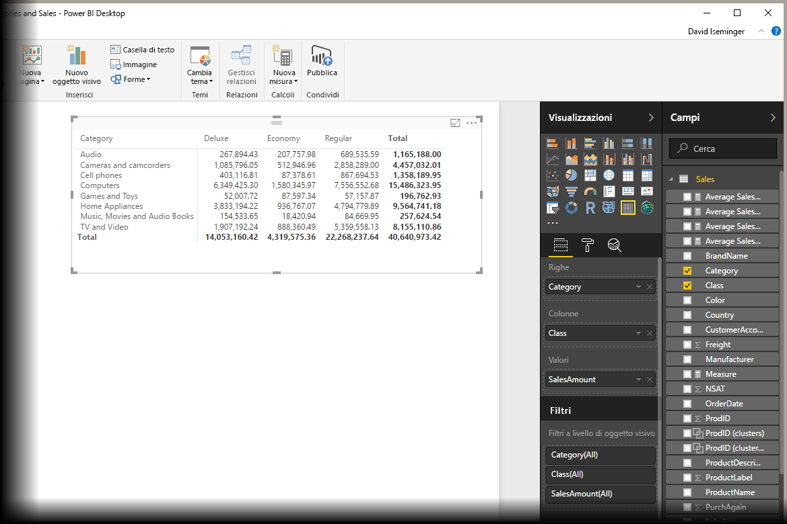

Quando si fa clic con il pulsante destro del mouse sul campo **Valori** e quindi si seleziona **Misure rapide**, è possibile selezionare *Media per categoria* come *Calcolo*, quindi selezionare *Somma di SalesAmount* come *Valore di base*, infine specificare *SalesAmount* trascinando il campo dalla casella *Campi* nel riquadro di destra nella sezione *Categoria* a sinistra.

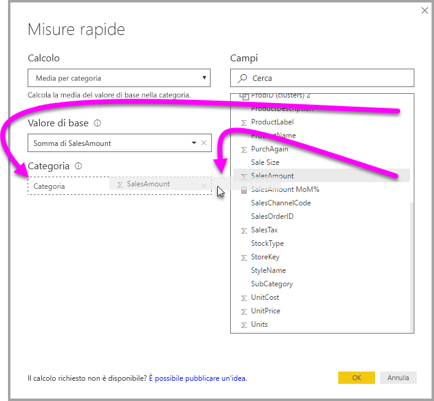

Quando si seleziona **OK**, si verificano alcune azioni interessanti, come illustrato nell'immagine che segue questo elenco:

1. L'oggetto visivo **Matrice** ora contiene una nuova colonna che mostra il calcolo (in questo caso, *Media di SalesAmount in SalesAmount*).
2. È stata creata una nuova **misura**, disponibile nell'area **Campi**, che viene evidenziata da Power BI in una casella di colore giallo. Questa misura è disponibile per qualsiasi altro oggetto visivo nel report, non solo per l'oggetto visivo per il quale è stato originariamente creato.
3. La formula DAX che è stata creata per la **Misura rapida** viene visualizzata nella barra della formula.

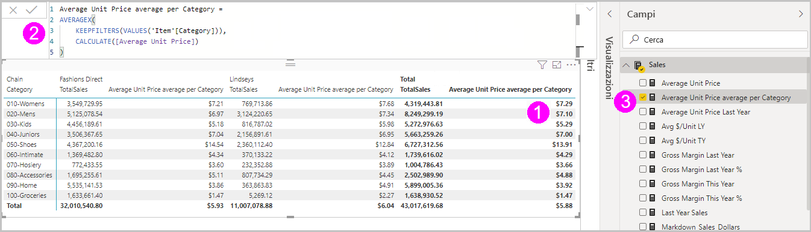

Per iniziare con il primo elemento, si noti che la **Misura rapida** è stata applicata all'oggetto visivo. Viene visualizzata una nuova colonna con un valore associato, entrambi basati sulla **Misura rapida** appena creata.

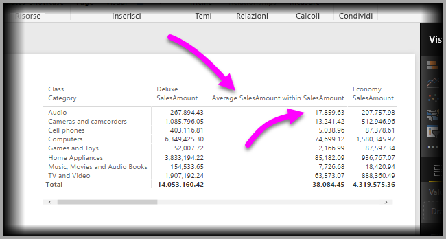

In secondo luogo, la **Misura rapida** viene visualizzata nell'area **Campi** del modello di dati e può essere usata come qualsiasi altro campo nel modello, per qualsiasi altro oggetto visivo. Nell'immagine seguente, è stato creato un rapido oggetto visivo di **grafico a barre** usando il nuovo campo creato dalla **Misura rapida**.

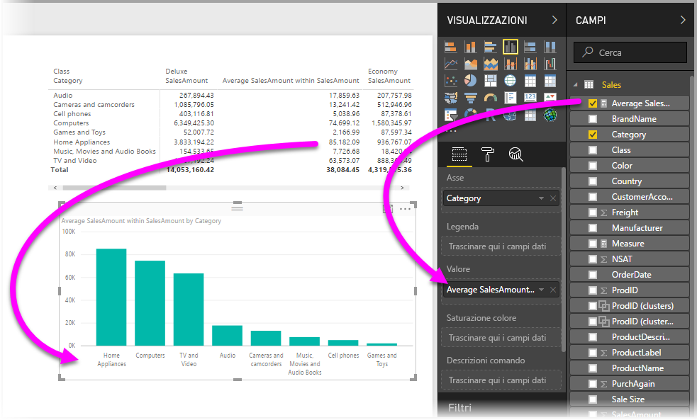

Passiamo ora alla sezione successiva in cui verrà illustrato il terzo elemento: le formule DAX.

## Apprendere a usare DAX con le Misure rapide
Un altro grande vantaggio della funzionalità **Misure rapide** è che mostra direttamente la formula DAX che è stata creata per implementare la misura. Nell'immagine seguente, è stata scelta la misura creata con la **Misura rapida** (che ora si trova nell'area **Campi**, quindi basta fare clic su di essa). Quando si esegue questa operazione, viene visualizzata la **barra della formula** che mostra la formula DAX creata da Power BI per implementare la misura.

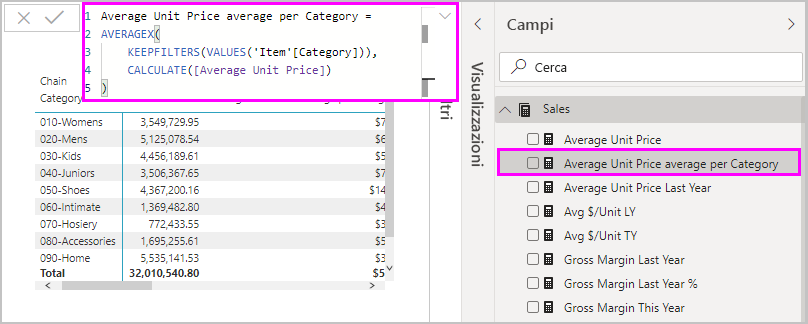

Questo è interessante già di per sé, perché mostra la formula che sta alla base della misura, ma, soprattutto, consente di usare **Misure rapide** per vedere come creare le formule DAX sottostanti.

Si supponga che sia necessario calcolare la variazione rispetto all'anno precedente, ma che non si sia certi di come strutturare la formula DAX (oppure, che non si sappia esattamente da dove cominciare). Invece di arrovellarsi inutilmente, basterebbe creare una **Misura rapida** con il calcolo **Variazione rispetto all'anno precedente** e vedere cosa accade, cioè creare la **Misura rapida** e vedere come appare nell'oggetto visivo, verificare come ha funzionato la formula DAX, quindi apportare le modifiche direttamente nella formula DAX oppure creare un'altra misura, finché i calcoli non soddisfano le proprie aspettative o esigenze.

È come avere a disposizione un insegnante rapido che risponda immediatamente alle proprie domande per l'analisi di simulazione con pochi clic. Se lo si preferisce, è sempre possibile eliminare tali misure dal modello: basta fare clic con il pulsante destro del mouse sulla misura e scegliere **Elimina**.

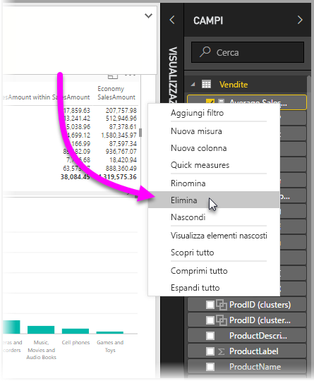

Infine, dopo aver perfezionato la misura, è possibile rinominarla nel modo preferito, usando lo stesso menu di scelta rapida.

## Limitazioni e considerazioni
Occorre tenere presenti alcune limitazioni e considerazioni.

* Le **misure rapide** sono disponibili solo se è possibile modificare il modello, operazione che non si esegue quando si usano connessioni dinamiche. Le connessioni dinamiche tabulari SSAS sono supportate, come illustrato in precedenza.
* La misura che viene aggiunta all'area **Campi** può essere usata con qualsiasi oggetto visivo nel report.
* È sempre possibile visualizzare l'espressione DAX associata a una **Misura rapida** selezionando la misura creata nell'area **Campi**, quindi osservando la formula nella **barra della formula**.
* Non è possibile creare misure rapide di Business Intelligence per le gerarchie temporali in modalità DirectQuery. Le funzioni DAX usate in queste misure rapide hanno implicazioni sulle prestazioni quando vengono convertite nelle istruzioni T-SQL che vengono inviate all'origine dati.

> [!WARNING]
> Le misure rapide attualmente generano *solo* istruzioni DAX con virgole come separatori di argomento. Se la versione di **Power BI Desktop** è localizzata in una lingua che usa le virgole come separatori decimali, le misure rapide non funzioneranno correttamente.
> 
> 

### Funzionalità di Business Intelligence per le gerarchie temporali e misure rapide
A partire dall'aggiornamento di ottobre 2017 per **Power BI Desktop**, sarà possibile usare tabelle di date personalizzate con **Misure rapide** con funzionalità di Business Intelligence per le gerarchie temporali. Se si sta usando un modello tabulare esterno, assicurarsi che al momento della creazione del modello la colonna della data primaria nella tabella sia stata contrassegnata come tabella data, come descritto in [questo articolo](https://docs.microsoft.com/sql/analysis-services/tabular-models/specify-mark-as-date-table-for-use-with-time-intelligence-ssas-tabular). Se si sta importando la propria tabella data, verificare di averla contrassegnata come tabella data, come descritto in [questo articolo](https://docs.microsoft.com/power-bi/desktop-date-tables)

### Altre informazioni ed esempi
In futuro saranno forniti esempi e istruzioni per ciascuno dei calcoli delle **Misure rapide**, quindi si consiglia di tornare a verificare la presenza di aggiornamenti dell'articolo mirato.

Si hanno idee per una **Misura rapida** non ancora fornita? Ottimo! Visitare [questa pagina](https://go.microsoft.com/fwlink/?linkid=842906) e inviare le proprie idee (compresa la formula DAX) per la **Misura rapida** che si vorrebbe vedere in **Power BI Desktop** e il team ne considererà l'aggiunta all'elenco fornito di **Misure rapide** in una versione futura.

