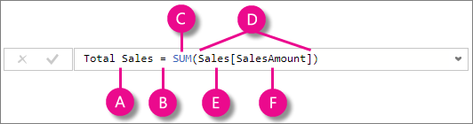
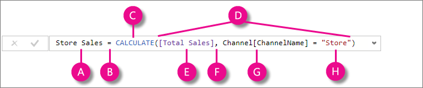

# Nozioni di DAX in Power BI Desktop
Questo articolo è destinato ai nuovi utenti di Power BI Desktop e mira a offrire una rapida e semplice introduzione su come usare Data Analysis Expressions (DAX) per risolvere una serie di problemi basilari di calcolo e analisi dei dati. Verranno prese in esame alcune informazioni concettuali, una serie di attività che è possibile completare e alcuni quiz per verificare quanto appreso. Dopo aver completato questo articolo, si dovrebbe avere una buona conoscenza dei concetti fondamentali più importanti in DAX.

## Che cos'è DAX?
DAX è una raccolta di funzioni, operatori e costanti che possono essere usati in una formula o in un'espressione per calcolare e restituire uno o più valori. In parole povere, DAX consente di creare nuove informazioni in base ai dati già presenti nel modello.

## Perché DAX è così importante?
È piuttosto semplice creare un nuovo file di Power BI Desktop e importarvi alcuni dati. È persino possibile creare report che contengano informazioni preziose senza usare neanche una formula DAX. Ma cosa accade se è necessario analizzare la percentuale di aumento delle categorie di prodotto e per diversi intervalli di date? Oppure se è necessario calcolare la crescita anno dopo anno rispetto alle tendenze di mercato? Le formule DAX forniscono questa funzionalità e anche molte altre importanti funzionalità. Imparare a creare formule DAX efficaci consente di sfruttare al meglio i dati. Quando si ottengono le informazioni necessarie, è possibile iniziare a risolvere problemi aziendali reali che interessano i profitti. Questa è la potenza di Power BI e DAX consente di sfruttarla.

## Prerequisiti
È probabile che l'utente abbia già familiarità con la creazione di formule in Microsoft Excel. Tali informazioni saranno utili per capire DAX, ma anche se non si ha alcuna esperienza con le formule di Excel, i concetti illustrati di seguito consentono immediatamente di iniziare a creare formule DAX e risolvere problemi BI reali.

L'attenzione sarà rivolta principalmente alla comprensione delle formule DAX usate nei calcoli; in maniera più specifica, nelle misure e nelle colonne calcolate. L'utente dovrebbe già conoscere Power BI Desktop, le operazioni di importazione dei dati e di aggiunta di campi a un report e i concetti fondamentali relativi a [Misure](desktop-measures.md) e [Colonne calcolate](desktop-calculated-columns.md).

**Cartella di lavoro di esempio**

Il modo migliore per imparare a usare DAX consiste nel creare alcune formule di base, usarle con alcuni dati effettivi e visualizzare i risultati autonomamente. Per gli esempi e le attività qui illustrati verrà usato il file Contoso Sales Sample for Power BI Desktop Preview. Si tratta dello stesso file di esempio usato nell'articolo Esercitazione: Creare misure personalizzate in Power BI Desktop. È possibile scaricarlo [qui](http://download.microsoft.com/download/4/6/A/46AB5E74-50F6-4761-8EDB-5AE077FD603C/Contoso%20Sales%20for%20Power%20BI%20Designer.zip).

## Introduzione
L'approfondimento di DAX è imperniato su tre concetti fondamentali: *Sintassi*, *Funzioni* e *Contesto*. Naturalmente, esistono altri concetti importanti in DAX, ma la comprensione di questi tre concetti getterà la base più solida su cui fondare le proprie competenze DAX.

### Sintassi
Prima di creare formule personalizzate, verrà esaminata la sintassi della formula DAX. La sintassi include i diversi elementi che costituiscono una formula o, più semplicemente, il modo in cui la formula viene scritta. Ad esempio, verrà ora esaminata una semplice formula DAX per una misura.

Questa formula include gli elementi di sintassi seguenti:

**A.** Il nome della misura è **Total Sales**.

**B.** L'operatore di segno uguale (**=**) indica l'inizio della formula. Quando calcolata, restituirà un risultato.

**C.** La funzione DAX **SUM** somma tutti i numeri nella colonna **Sales[SalesAmount]**. Verranno fornite altre informazioni sulle funzioni più avanti.

**D.** Le parentesi **()** racchiudono un'espressione contenente uno o più argomenti. Tutte le funzioni richiedono almeno un argomento. Un argomento passa un valore a una funzione.

**E.** La tabella **Sales** di riferimento.

**F.** La colonna di riferimento **[SalesAmount]** nella tabella Sales. Con questo argomento, la funzione SUM sa su quale colonna aggregare una SOMMA.

Quando si prova a comprendere una formula DAX, è spesso utile suddividere ogni elemento in una lingua in cui si pensa e si parla tutti i giorni. Ad esempio, è possibile leggere la formula come:

> *Per la misura denominata Total Sales, calcolare (=) la SOMMA dei valori nella colonna [SalesAmount] nella tabella Sales.*
> 
> 

Quando viene aggiunta a un report, questa misura calcola e restituisce valori sommando gli importi delle vendite per ogni campo incluso, ad esempio telefoni cellulari negli Stati Uniti.

Si potrebbe ritenere che questa misura abbia lo stesso risultato della semplice aggiunta del campo SalesAmount al report, e in effetti è vero. Ma c'è un buon motivo per creare una misura personalizzata che sommi i valori del campo SalesAmount, e cioè che è possibile usarla come argomento in altre formule. Tutto ciò potrebbe sembrare poco chiaro al momento, ma con l'aumentare delle competenze sulle formule DAX questa nozione aumenterà l'efficienza di formule e modelli. In effetti, la misura Total Sales verrà visualizzata come argomento in altre formule più avanti.

Verranno ora esaminati alcuni altri aspetti di questa formula. In particolare, è stata introdotta una funzione, [SUM](https://msdn.microsoft.com/library/ee634387.aspx). Le funzioni sono formule pre-scritte che semplificano l'esecuzione di calcoli e modifiche complessi con numeri, date, ora, testo e altro. Verranno fornite altre informazioni sulle funzioni più avanti.

Come si può osservare, la colonna [SalesAmount] è preceduta dalla tabella Sales a cui appartiene la colonna. Questo è noto come nome di colonna completo perché include il nome della colonna preceduto dal nome della tabella. Le colonne a cui si fa riferimento nella stessa tabella non richiedono l'inclusione del nome della tabella nella formula. Ciò può rendere le formule lunghe, che fanno riferimento a molte colonne, più brevi e facili da leggere. Tuttavia, è consigliabile includere il nome della tabella nelle formule della misura, anche quando si trovano nella stessa tabella.

> [!NOTE]
> Se un nome di tabella contiene spazi, parole chiave riservate o caratteri non consentiti, sarà necessario racchiuderlo tra virgolette singole. È anche necessario racchiudere i nomi di tabella tra virgolette se il nome contiene caratteri al di fuori dell'intervallo di caratteri alfanumerici ANSI, indipendentemente dal fatto che le impostazioni locali supportino il set di caratteri.
> 
> 

È importante che la sintassi delle formule sia corretta. Nella maggior parte dei casi, se la sintassi non è corretta, verrà restituito un errore di sintassi. In altri casi, la sintassi può essere corretta, ma i valori restituiti potrebbero non essere quelli previsti. L'editor DAX in Power BI Desktop include suggerimenti, una funzionalità che consente di creare formule sintatticamente corrette grazie alla possibilità di selezionare gli elementi corretti.

A questo punto verrà creata una semplice formula. Questa operazione consentirà di comprendere ulteriormente la sintassi della formula e il modo in cui la funzionalità dei suggerimenti nella barra della formula può essere d'aiuto.

### Attività: Creare una formula della misura
Per completare questa attività, è necessario aprire il file Contoso Sales Sample Power BI Desktop.

**1.**  Nell'elenco dei campi della visualizzazione Report fare clic con il pulsante destro del mouse sulla tabella **Sales** e quindi fare clic su **Nuova misura**.

**2.**  Nella barra della formula sostituire **Misura** digitando un nuovo nome di misura, **Previous Quarter Sales**.

**3.**  Dopo il segno di uguale digitare **SUM** seguito da una parentesi aperta.

> Invece di digitare un nome di colonna da sommare immediatamente, verrà immessa un'altra funzione, per *filtrare* i dati che si vogliono sommare.
> 
> 

**4.**  Tra le parentesi, digitare **CALCULATE**, seguito da una parentesi aperta.

> La funzione CALCULATE verrà usata per filtrare gli importi da sommare in base a un argomento che viene passato alla funzione CALCOLATE. Questo è ciò che viene definita funzione di annidamento. La funzione CALCULATE ha almeno due argomenti. Il primo è l'espressione da valutare e il secondo è un filtro.
> 
> 

**5.**  Tra parentesi **()** per la funzione **CALCULATE**, digitare **Sales[SalesAmount]**. Questo è il primo argomento di espressione per la funzione CALCULATE.

**6.** Digitare una virgola (**,**) per specificare il primo filtro, quindi digitare **PREVIOUSQUARTER** seguito da una parentesi aperta.

> Verrà usata la funzionalità di Business Intelligence per le gerarchie temporali PREVIOUSQUARTER per filtrare i risultati SUM in base al trimestre precedente.
> 
> 

**7.** Tra le parentesi **()** per la funzione PREVIOUSQUARTER, digitare **Calendar[DateKey]**.

> La funzione PREVIOUSQUARTER ha un solo argomento, una colonna contenente un intervallo contiguo di date.
> 
> 

**8.** Verificare che entrambi gli argomenti passati alla funzione PREVIOUSQUARTER e alla funzione CALCULATE siano chiusi da due parentesi chiuse **))**.

La formula a questo punto dovrebbe essere simile alla seguente:

> **Previous Quarter Sales = CALCULATE(SUM(Sales[SalesAmount]), PREVIOUSQUARTER(Calendar[DateKey]))**
> 
> 

**9.** Fare clic sul segno di spunta  nella barra della formula o premere INVIO per convalidare la formula e aggiungerla al modello.

L'operazione è stata completata. È stata creata una misura complessa usando DAX. Lo scopo di questa formula è calcolare le vendite totali per il trimestre precedente, in base ai filtri applicati a un report. Ad esempio, inserendo SalesAmount e la nuova misura Previous Quarter Sales in un grafico e aggiungendo Year e QuarterOfYear come filtri dei dati, si otterrebbe un risultato simile al seguente:

Sono stati appena introdotti diversi importanti aspetti delle formule DAX. In primo luogo, questa formula includeva due funzioni. Si noti che [PREVIOUSQUARTER](https://msdn.microsoft.com/library/ee634385.aspx), una funzionalità di Business Intelligence per le gerarchie temporali, è annidata come argomento passato a [CALCULATE](https://msdn.microsoft.com/library/ee634825.aspx), una funzione di filtro. Le formule DAX possono contenere fino a 64 funzioni annidate. È improbabile che una formula contenga così tante funzioni annidate. In effetti, sarebbe molto difficile creare ed eseguire il debug di tale formula e probabilmente non sarebbe neanche molto veloce.

In questa formula, sono stati usati anche dei filtri. I filtri limitano ciò che verrà calcolato. In questo caso, è stato selezionato un filtro come argomento, che è effettivamente il risultato di un'altra funzione. Verranno fornite altre informazioni sui filtri più avanti.

Infine, è stata usata la funzione CALCULATE. Si tratta di una delle funzioni più potenti di DAX. Nel creare modelli e formule più complesse, è probabile che si usi questa funzione molte volte. La discussione della funzione CALCULATE esula dall'ambito di questo articolo, ma con l'aumentare della conoscenza di DAX occorre prestarvi particolare attenzione.

### Quiz veloce sulla sintassi
1. Qual è lo scopo di questo pulsante sulla barra della formula?
   
   > 
   > 
   > 
2. Cosa racchiude sempre un nome di colonna in una formula DAX?

Le risposte vengono fornite alla fine di questo articolo.

### Funzioni
Le funzioni sono formule predefinite che eseguono calcoli usando valori specifici, detti argomenti, in una struttura o un ordine particolare. Gli argomenti possono essere altre funzioni, un'altra formula, un'espressione, riferimenti di colonna, numeri, testo, valori logici quali TRUE o FALSE o costanti.

DAX include le seguenti categorie di funzioni: [data e ora](https://msdn.microsoft.com/library/ee634786.aspx), [Business Intelligence per le gerarchie temporali](https://msdn.microsoft.com/library/ee634763.aspx)[, ](https://msdn.microsoft.com/library/ee634552.aspx)[informative](https://msdn.microsoft.com/library/ee634552.aspx), [logiche](https://msdn.microsoft.com/library/ee634365.aspx)[, ](https://msdn.microsoft.com/library/ee634365.aspx)[matematiche](https://msdn.microsoft.com/library/ee634241.aspx), [statistiche](https://msdn.microsoft.com/library/ee634822.aspx), [testuali](https://msdn.microsoft.com/library/ee634938.aspx), [padre-figlio](https://msdn.microsoft.com/library/mt150102.aspx) e [altre](https://msdn.microsoft.com/library/mt150101.aspx). Se si ha familiarità con le funzioni nelle formule di Excel, molte delle funzioni in DAX appariranno simili. Tuttavia, le funzioni DAX sono univoche nei modi seguenti:

* Una funzione DAX fa sempre riferimento a una colonna o una tabella completa. Se si vogliono usare solo particolari valori di una tabella o colonna, è possibile aggiungere filtri alla formula.
* Se è necessario personalizzare i calcoli riga per riga, in DAX sono disponibili funzioni che consentono di usare il valore della riga corrente o un valore correlato come un tipo di argomento, per eseguire calcoli che variano in base al contesto. Verranno fornite altre informazioni sul contesto più avanti.
* DAX include numerose funzioni che restituiscono una tabella anziché un valore. La tabella non viene visualizzata, ma viene usata per fornire input ad altre funzioni. Ad esempio, è possibile recuperare una tabella e quindi contare i valori distinti in essa contenuti o calcolare somme dinamiche nelle tabelle o colonne filtrate.
* Dax include varie funzionalità di Business Intelligence per le gerarchie temporali. Queste funzioni consentono di definire o selezionare intervalli di date ed eseguire calcoli dinamici basati su di essi. Ad esempio, è possibile confrontare somme in periodi paralleli.
* Excel offre una funzione molto diffusa, VLOOKUP. Le funzioni DAX non prendono come riferimento una cella o un intervallo di celle così come fa VLOOKUP in Excel, ma una colonna o una tabella. Tenere presente, in Power BI Desktop, che si lavora con un modello dati relazionale. La ricerca di valori in un'altra tabella è davvero molto semplice e, nella maggior parte dei casi, non è affatto necessario creare alcuna formula.
  
  Come si può vedere, le funzioni in DAX consentono di creare formule molto potenti. Finora sono state illustrate solo le nozioni di base delle funzioni. Con l'aumentare delle competenze DAX, si creeranno le formule usando diverse funzioni. Uno dei migliori articoli da consultare, che contiene informazioni su ciascuna delle funzioni DAX, è [Riferimento a Data Analysis Expressions (DAX)](https://msdn.microsoft.com/library/ee634396.aspx).

### Quiz veloce sulle funzioni
1. A che cosa fa sempre riferimento una funzione?
2. Una formula può contenere più di una funzione?
3. Quale categoria di funzioni usereste per concatenare due stringhe di testo in un'unica stringa?

Le risposte vengono fornite alla fine di questo articolo.

### Contesto
Il contesto è uno dei principali concetti DAX da comprendere. Esistono due tipi di contesto in DAX: contesto di riga e contesto di filtro. Verrà esaminato prima il contesto di riga.

**Contesto di riga**

Il contesto di riga è più facilmente considerato come riga corrente. Si applica ogni volta che una formula ha una funzione che applica i filtri per identificare una singola riga in una tabella. La funzione applicherà intrinsecamente un contesto di riga per ogni riga della tabella su cui viene filtrata. Questo tipo di contesto di riga si applica più spesso alle misure.

**Contesto di filtro**

Il contesto di filtro è un po' più difficile da comprendere rispetto al contesto di riga. Per facilitare la comprensione, pensare al contesto di filtro come a uno o più filtri applicati in un calcolo che determina un risultato o valore.

Il contesto di filtro non esiste al posto del contesto di riga, ma si applica in aggiunta al contesto di riga. Ad esempio, per restringere ulteriormente i valori da includere in un calcolo, è possibile applicare un contesto di filtro che non solo specifica il contesto di riga, ma anche un solo determinato valore (filtro) in tale contesto di riga.

Il contesto di filtro è facilmente visibile nei report. Ad esempio, quando si aggiunge TotalCost a una visualizzazione e quindi si aggiungono Year e Region, si definisce un contesto di filtro che consente di selezionare un sottoinsieme di dati basati su un determinato anno e area.

Perché il contesto di filtro è così importante per DAX? Anche se il contesto di filtro può essere applicato più facilmente aggiungendo campi a una visualizzazione, può anche essere applicato in una formula DAX con la definizione di un filtro che usa funzioni quali ALL, RELATED, FILTER, CALCULATE, in base alle relazioni e ad altre misure e colonne. Ad esempio, verrà ora esaminata la seguente formula in una misura denominata Store Sales:

Per meglio comprendere questa formula, è possibile suddividerla, proprio come con altre formule.

Questa formula include gli elementi di sintassi seguenti:

**A.** Il nome della misura è **Store Sales**.

**B.** L'operatore di segno uguale (**=**) indica l'inizio della formula.

**C.** La funzione **CALCULATE** valuta un'espressione come argomento in un contesto modificato dai filtri specificati.

**D.** Le parentesi **()** racchiudono un'espressione contenente uno o più argomenti.

**E.** Una misura **[Total Sales]** nella stessa tabella come espressione. La misura Total Sales ha la formula: =SUM(Sales[SalesAmount]).

**F.** Una virgola (**,**) separa il primo argomento di espressione dall'argomento di filtro.

**G.** La colonna di riferimento completa **Channel[ChannelName]**. Questo è il contesto di riga. Ogni riga in questa colonna specifica un canale: Store, Online e così via.

**H.** Il valore particolare, **Store**, come filtro. Questo è il contesto di filtro.

Questa formula garantisce che solo i valori di vendita definiti dalla misura Total Sales vengano calcolati solo per le righe nella colonna Channel[ChannelName] con il valore "Store", come filtro.

Come è facile immaginare, la possibilità di definire il contesto di filtro all'interno della formula è enorme e ha grandi potenzialità. La possibilità di fare riferimento solo a un determinato valore in una tabella correlata è solo un esempio di questo tipo. Non occorre preoccuparsi se il contesto non è completamente chiaro sin da subito. Quando si creano formule personalizzate, è possibile comprendere meglio il contesto e perché è così importante in DAX.

### Quiz veloce sul contesto
1. Quali sono i due tipi di contesto?
2. Che cos'è il contesto di filtro?
3. Che cos'è il contesto di riga?

Le risposte vengono fornite alla fine di questo articolo.

## Riepilogo
Ora che sono state apprese le nozioni di base dei concetti più importanti in DAX, è possibile iniziare a creare formule DAX per misure personalizzate. DAX può essere effettivamente un po' complesso da apprendere, ma sono disponibili molte risorse di approfondimento. Dopo aver letto questo articolo e sperimentato con alcune delle formule personalizzate, sarà possibile apprendere altri concetti e formule DAX che consentono di risolvere altri problemi aziendali. Sono disponibili molte risorse DAX, la più importante delle quali è l'articolo [Riferimento a Data Analysis Expressions (DAX)](https://msdn.microsoft.com/library/gg413422.aspx).

DAX è stato rilasciato da diversi anni in altri strumenti BI di Microsoft, come ad esempio Power Pivot e i modelli tabulari di Analysis Services, quindi esiste molta disponibilità di informazioni. È possibile trovare altre informazioni in libri, white paper e blog pubblicati da Microsoft e dai principali professionisti di Business Intelligence. Anche la pagina [Wiki del centro risorse DAX su TechNet](http://social.technet.microsoft.com/wiki/contents/articles/dax-resource-center.aspx) è un ottimo punto di partenza.

### Risposte del quiz veloce
Sintassi:

1. Convalida e immette la misura nel modello.
2. Le parentesi quadre [].

Funzioni:

1. Una tabella e una colonna.
2. Sì. Una formula può contenere fino a 64 funzioni annidate.
3. [Funzioni di testo](https://msdn.microsoft.com/library/ee634938.aspx).

Contesto:

1. Contesto di riga e contesto di filtro.
2. Uno o più filtri in un calcolo che determina un singolo valore.
3. La riga corrente.

