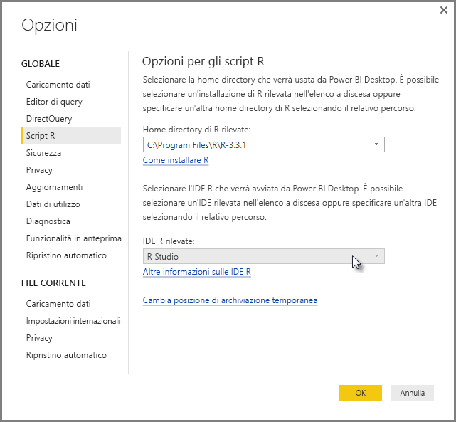
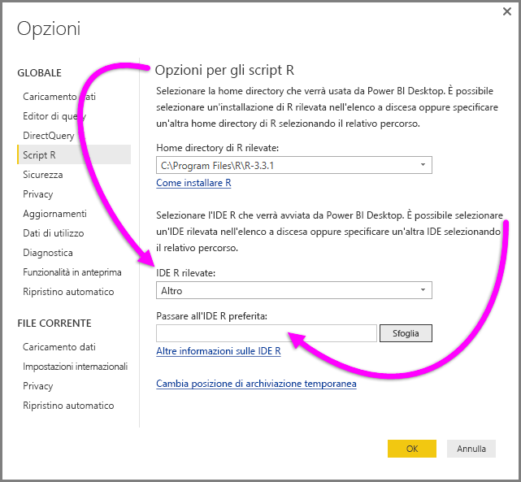
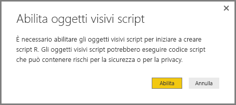
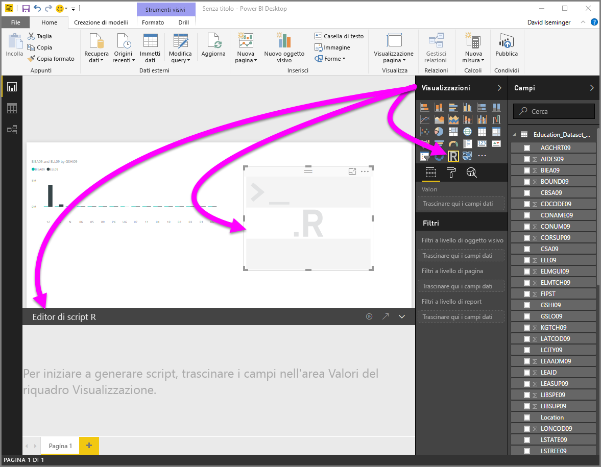
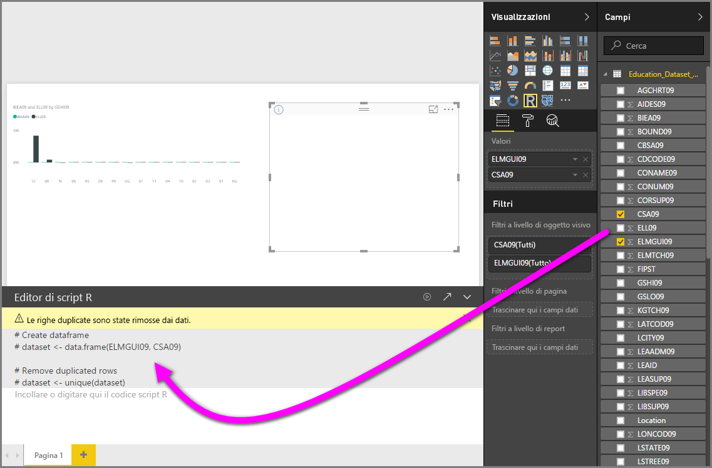
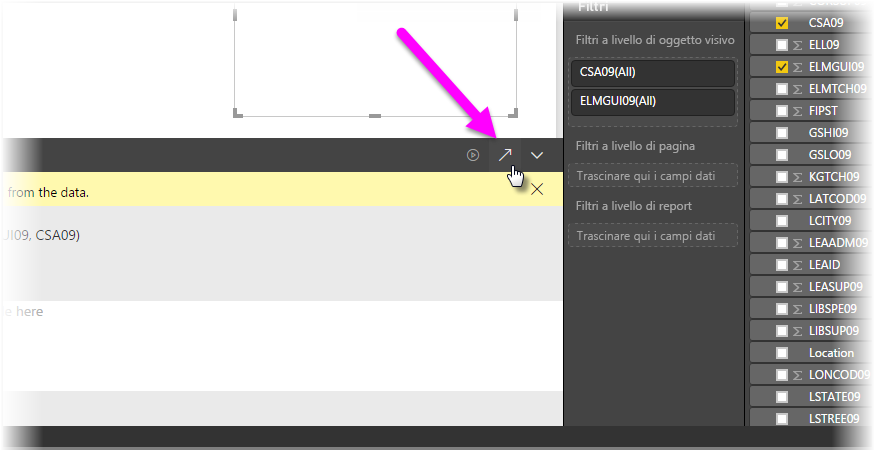
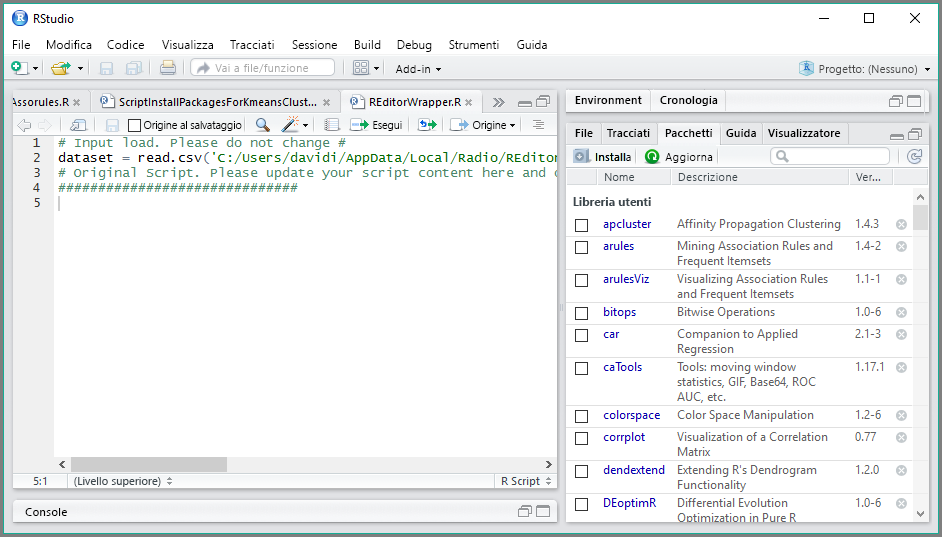

# Usare un IDE R esterno con Power BI
Con **Power BI Desktop**, è possibile usare un IDE (Integrated Development Environment) R esterno per creare e ridefinire gli script R e quindi usarli in Power BI.

## Abilitare un IDE R esterno
In precedenza era necessario usare l'editor di script R in **Power BI Desktop** per creare ed eseguire gli script R. Con questa versione è possibile avviare l'IDE R esterno da **Power BI Desktop** per importare e visualizzare automaticamente i dati nell'IDE R. Da qui è possibile modificare lo script nell'ambiente IDE R esterno, quindi incollarlo di nuovo in **Power BI Desktop** per creare oggetti visivi e report di Power BI.

A partire dal rilascio di settembre 2016 di **Power BI Desktop** (versione 2.39.4526.362), è possibile specificare quali IDE R si vogliono usare e impostarne l'avvio automatico dall'interno **Power BI Desktop**.

### Requisiti
Per usare questa funzionalità, è necessario installare un **IDE R** nel computer locale. **Power BI Desktop** non include, distribuisce o installa il motore R, quindi occorre installare separatamente **R** nel computer locale. È possibile scegliere quale IDE R usare, con le opzioni seguenti:

* È possibile installare il proprio IDE R preferito, molti dei quali sono disponibili gratuitamente, ad esempio la [pagina di download di Revolution Open](https://mran.revolutionanalytics.com/download/) e il [repository CRAN](https://cran.r-project.org/bin/windows/base/).
* **Power BI Desktop** supporta anche [R Studio](https://www.rstudio.com/) e **Visual Studio 2015** con gli editor [*Strumenti R per Visual Studio*](https://beta.visualstudio.com/vs/rtvs/).
* È anche possibile installare un IDE R diverso e configurare **Power BI Desktop** in modo da avviare tale **IDE R** effettuando una delle operazioni seguenti:
  
  * È possibile associare i file con estensione **R** all'IDE esterno che dovrà essere avviato da **Power BI Desktop**.
  * È possibile specificare il file EXE che **Power BI Desktop** deve avviare selezionando *Altro* dalla sezione **Opzioni per gli script R** della finestra di dialogo **Opzioni**. È possibile visualizzare la finestra di dialogo **Opzioni** passando a **File > Opzioni e impostazioni > Opzioni**.
    
    

Se sono stati installati più IDE R, è possibile specificare quale verrà avviato selezionandolo dall'elenco a discesa *IDE R rilevati* nella finestra di dialogo **Opzioni**.

Per impostazione predefinita, **Power BI Desktop** avvierà **R Studio** dell'IDE R esterno se è installato nel computer locale; se **R Studio** non è installato ed è disponibile **Visual Studio 2015** con **Strumenti R per Visual Studio**, verrà avviato quest'ultimo. Se nessuno di questi IDE R è installato, verrà avviata l'applicazione associata ai file **R**.

Se non esiste alcuna associazione dei file **R** è possibile specificare un percorso a un IDE personalizzato nella sezione *Passare all'IDE R preferito* della finestra di dialogo **Opzioni**. È anche possibile avviare un IDE R diverso selezionando l'icona dell'ingranaggio **Impostazioni** accanto all'icona a forma di freccia **Avvia IDE R** in **Power BI Desktop**.

## Avviare un IDE R da Power BI Desktop
Per avviare un IDE R da **Power BI Desktop**, seguire questa procedura.

1. Caricare i dati in **Power BI Desktop**.
2. Nel riquadro **ampi** selezionare i campi che si prevede di utilizzare. Se non sono ancora stati abilitati oggetti visivi di script, verrà richiesto di farlo.
   
   
3. Quando gli oggetti visivi di script sono abilitati, è possibile selezionare un oggetto visivo R nel riquadro **Visualizzazioni** crea un oggetto visivo R vuoto pronto per la visualizzazione dei risultati dello script. Verrà visualizzato anche il riquadro **Editor di script R**.
   
   
4. A questo punto è possibile selezionare i campi da usare nello script R. Quando si seleziona un campo, nel campo **Editor di script R** viene creato automaticamente il codice script in base al campo o ai campi selezionati. È possibile creare (o incollare) lo script R direttamente nel riquadro **Editor di script R** o lasciarlo vuoto.
   
   
   
   > [!NOTE]
   > Il tipo di aggregazione predefinito per gli oggetti visivi R è *Non riepilogare*.
   > 
   > 
5. Ora è possibile avviare l'IDE R direttamente da **Power BI Desktop**. Scegliere il pulsante per l'**avvio dell'IDE R** a destra della barra del titolo **Editor di script R**, come illustrato di seguito.
   
   
6. L'IDE R specificato viene avviato da Power BI Desktop, come illustrato nell'immagine seguente. In questa immagine **RStudio** è l'IDE R predefinito.
   
   
   
   > [!NOTE]
   > **Power BI Desktop** aggiunge le prime tre righe dello script per consentire l'importazione dei dati da **Power BI Desktop** dopo che l'utente ha eseguito lo script.
   > 
   > 
7. Qualsiasi script creato nel riquadro **Editor di script R** di **Power BI Desktop** viene visualizzato a partire dalla riga 4 nell'IDE R. A questo punto è possibile creare uno script R nell'IDE R. Dopo aver completato lo script R nell'IDE R, è necessario copiarlo e incollarlo nel riquadro **Editor di script R** in **Power BI Desktop**, *escludendo* le prime tre righe dello script generate automaticamente da **Power BI Desktop**. Non ricopiare le prime tre righe dello script in **Power BI Desktop**, perché sono state usate solo per l'importazione dei dati nell'IDE R da **Power BI Desktop**.

### Limitazioni note
L'avvio di un IDE R direttamente da Power BI Desktop presenta alcune limitazioni:

* L'esportazione automatica dello script dall'IDE R in **Power BI Desktop** non è supportata.
* L'editor di **R Client** (RGui.exe) non è supportato, perché l'editor stesso non supporta l'apertura di file.

## Passaggi successivi
Esaminare le informazioni aggiuntive seguenti su R in Power BI.

* [Esecuzione di script R in Power BI Desktop](desktop-r-scripts.md)
* [Creare oggetti visivi di Power BI usando R](desktop-r-visuals.md)

