# <a name="using-r-in-query-editor"></a>Uso di R nell'Editor di query
È possibile usare **R**, un linguaggio di programmazione ampiamente utilizzato da analisti e data scientist, nell'**Editor di query** di Power BI Desktop. L'integrazione di R nell'**Editor di query** consente di pulire i dati con R ed eseguire operazioni di data shaping e analisi in set di dati, tra cui completamento di dati mancanti, stime e clustering. **R** è un linguaggio potente e può essere usato nell'**Editor di query** per preparare il modello di dati e creare report.

## <a name="installing-r"></a>Installazione di R
Per usare **R** nell'**Editor di query** di Power BI Desktop, è necessario installare **R** nel computer locale. È possibile scaricare e installare **R** gratuitamente da molte posizioni, tra cui la [pagina di download di Revolution Open](https://mran.revolutionanalytics.com/download/) e il [repository CRAN](https://cran.r-project.org/bin/windows/base/).

## <a name="using-r-in-query-editor"></a>Uso di R nell'Editor di query
Per illustrare l'uso di **R** nell'**Editor di query**, usare l'esempio tratto da un set di dati del mercato azionario che si basa su un file con estensione csv [scaricabile qui](http://download.microsoft.com/download/F/8/A/F8AA9DC9-8545-4AAE-9305-27AD1D01DC03/EuStockMarkets_NA.csv) e seguire la spiegazione. Ecco la procedura per questo esempio:

1. Prima di tutto, caricare i dati in **Power BI Desktop**. Caricare il file *EuStockMarkets_NA.csv* in questo esempio e selezionare **Recupera dati > CSV** dalla barra multifunzione **Home** in **Power BI Desktop**.

   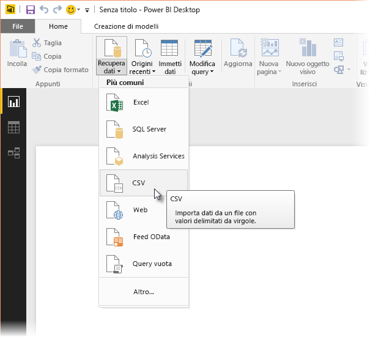
2. Selezionare il file e scegliere **Apri**. Il file CSV verrà visualizzato nella finestra di dialogo **File CSV**.

   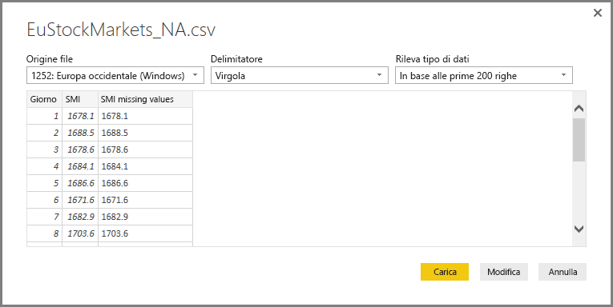
3. Una volta caricati, i dati saranno visibili nel riquadro **ampi** in Power BI Desktop.

   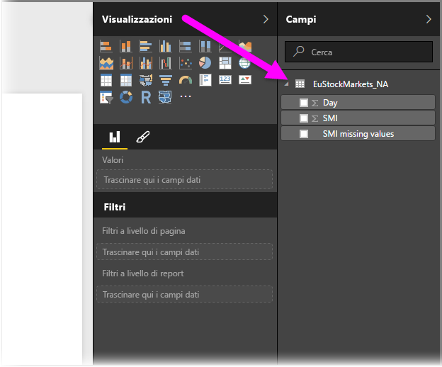
4. Aprire l'**Editor di query** selezionando **Modifica query** nella scheda **Home** in **Power BI Desktop**.

   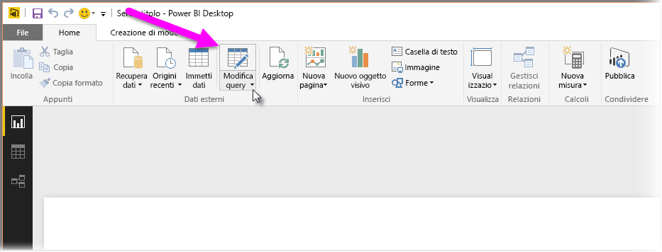
5. Nella scheda **Trasforma** selezionare **Esegui script R**. Verrà visualizzato l'editor **Esegui script R** (illustrato nel passaggio successivo). Si noti che nelle righe 15 e 20 c'è un problema di dati mancanti, così come in altre righe non visibili nell'immagine seguente. La procedura seguente mostra come usare R per completare automaticamente le righe.

   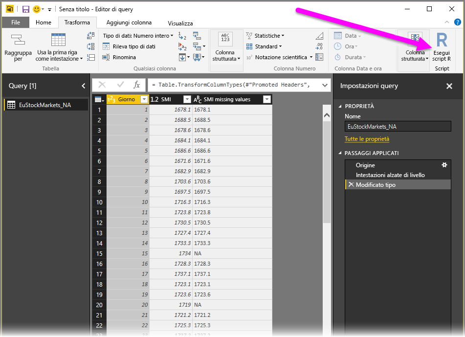
6. In questo esempio immettere il codice script seguente:

    ```r
       library(mice)
       tempData <- mice(dataset,m=1,maxit=50,meth='pmm',seed=100)
       completedData <- complete(tempData,1)
       output <- dataset
       output$completedValues <- completedData$"SMI missing values"
    ```

   > [!NOTE]
   > Per il corretto funzionamento del codice script precedente, è necessario che nell'ambiente R sia installata la libreria *mice*. Per installare la libreria mice, eseguire il comando seguente nell'installazione di R:     > install.packages('mice')
   > 
   > 

   Quando viene inserito nella finestra di dialogo **Esegui script R**, il codice sarà analogo al seguente:

   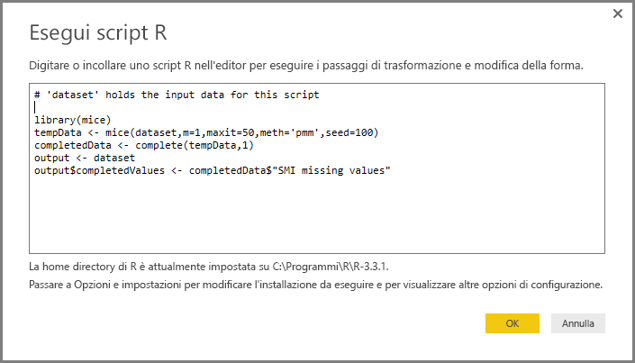
7. Dopo aver selezionato **OK**, l'**Editor di query** visualizza un avviso relativo alla privacy dei dati.

   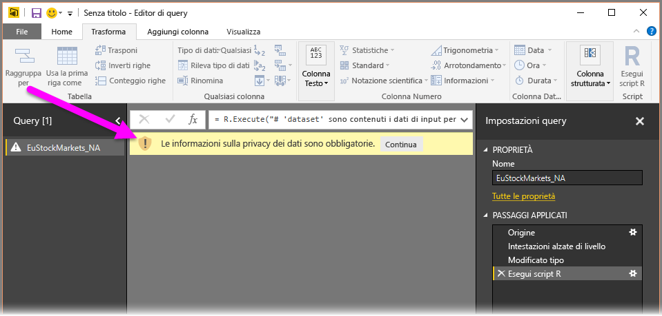
8. Per il corretto funzionamento degli script R nel servizio Power BI, è necessario impostare tutte le origini dati su *pubblico*. Per altre informazioni sulle impostazioni di privacy e sulle relative implicazioni, vedere [Livelli di privacy](desktop-privacy-levels.md).

   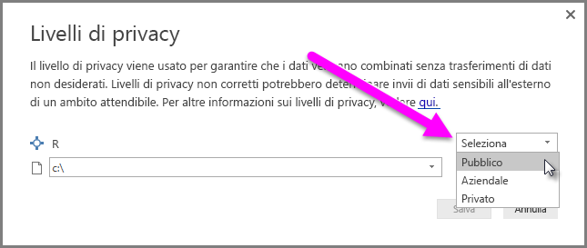

   Si noti una nuova colonna nel riquadro **Campi** denominata *completedValues*. Si noti che alcuni elementi dati risultano mancanti, ad esempio nelle righe 15 e 18. Scoprire come questo problema viene gestito in R nella prossima sezione.


Con appena cinque righe di script R, l'**Editor di query** ha inserito i valori mancanti con un modello predittivo.

## <a name="creating-visuals-from-r-script-data"></a>Creazione di oggetti visivi da dati di script R
A questo punto è possibile creare un oggetto visivo per osservare come il codice script R che usa la libreria *mice* ha completato i valori mancanti, come illustrato nella figura seguente:

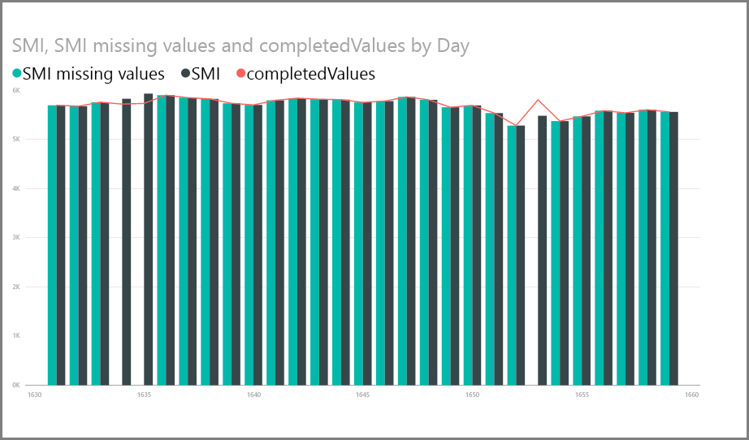

Dopo aver completato l'oggetto visivo e aver creato tutti gli altri oggetti visivi necessari con **Power BI Desktop**, è possibile salvare il file di **Power BI Desktop** (che viene salvato con estensione pbix) e usare il modello di dati, compresi gli script R che ne fanno parte, nel servizio Power BI.

> [!NOTE]
> Se si vuole visualizzare un file con estensione pbix completato con questa procedura, il file di **Power BI Desktop** completato usato in questo esempio è disponibile per il download [qui](http://download.microsoft.com/download/F/8/A/F8AA9DC9-8545-4AAE-9305-27AD1D01DC03/Complete%20Values%20with%20R%20in%20PQ.pbix).

Dopo avere caricato il file con estensione pbix nel servizio Power BI, è necessario eseguire alcuni altri passaggi per abilitare l'aggiornamento dei dati (nel servizio) e per abilitare l'aggiornamento degli oggetti visivi nel servizio (i dati devono accedere a R perché gli oggetti visivi vengano aggiornati). I passaggi aggiuntivi sono i seguenti:

* **Abilitare l'aggiornamento pianificato per il set di dati**: per abilitare l'aggiornamento pianificato per la cartella di lavoro che contiene il set di dati con gli script R, vedere [Configurazione dell'aggiornamento pianificato](refresh-scheduled-refresh.md), che include anche informazioni su **Personal Gateway**.
* **Installare Personal Gateway**: è necessario che sia installato **Personal Gateway** nel computer in cui si trova il file e in cui è installato R. Il servizio Power BI deve accedere alla cartella di lavoro ed eseguire nuovamente il rendering degli oggetti visivi aggiornati. Sono disponibili altre informazioni su come [installare e configurare Personal Gateway](service-gateway-personal-mode.md).

## <a name="limitations"></a>Limitazioni
Esistono alcune limitazioni per le query che includono script R creati nell'**Editor di query**:

* Tutte le impostazioni dell'origine dati R devono essere impostate su *Pubblico* e anche tutti gli altri passaggi di una query creata nell'**Editor di query** devono essere pubblici. Per ottenere le impostazioni dell'origine dati, in **Power BI Desktop** selezionare **File > Opzioni e impostazioni > Impostazioni origine dati**.

  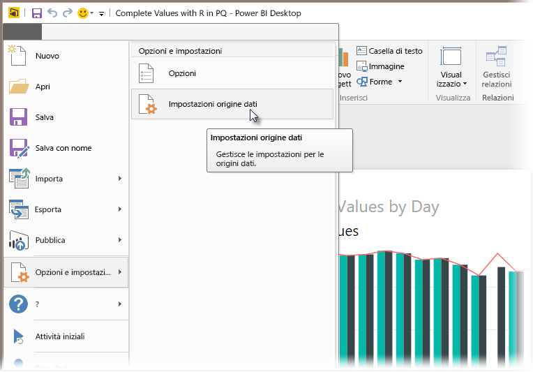

  Nella finestra di dialogo **Impostazioni origine dati** selezionare le origini dati, quindi scegliere **Modifica autorizzazioni** e verificare che l'opzione **Livello di privacy** sia impostata su *Pubblico*.

  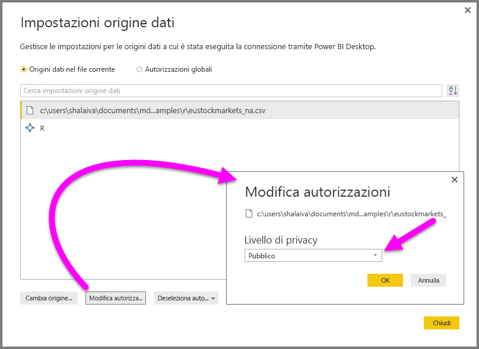    
* Per abilitare l'aggiornamento pianificato degli oggetti visivi o del set di dati R, è necessario abilitare l'opzione **Aggiornamento pianificato** e che nel computer che ospita la cartella di lavoro e l'installazione di R sia installato **Personal Gateway**. Per altre informazioni su entrambi, vedere la sezione precedente di questo articolo, in cui sono riportati collegamenti a informazioni più specifiche.

Con R e le query personalizzate si possono eseguire moltissime operazioni, esplorando e modellando i dati per visualizzarli nel modo desiderato.

