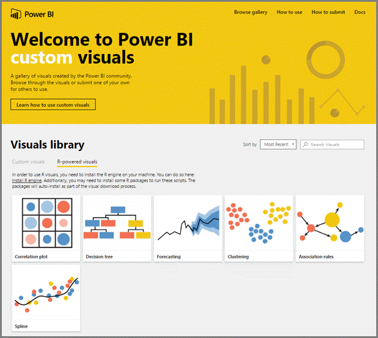
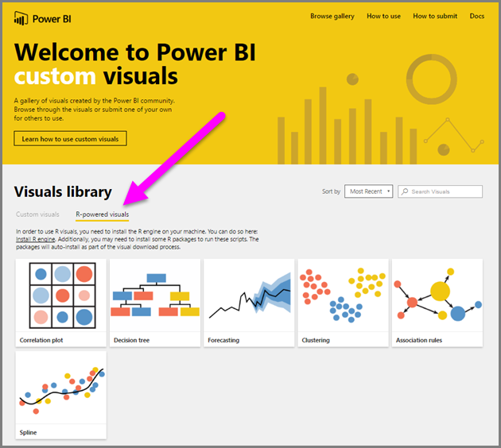
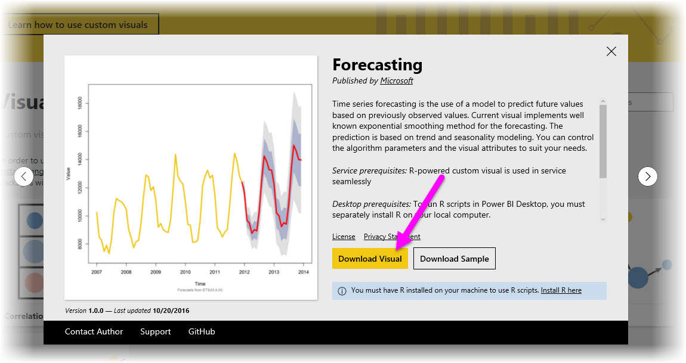
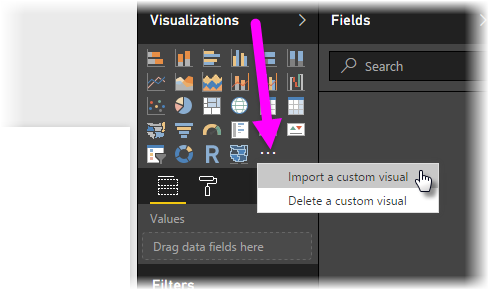

# Usare oggetti visivi personalizzati basati su R in Power BI
Con la versione di ottobre 2016 di **Power BI Desktop** e nel **servizio Power BI** è possibile usare oggetti visivi personalizzati basati su R senza alcuna conoscenza e script di R. Ciò consente di sfruttare la potenza analitica e degli oggetti visivi di R, nonché gli script R, senza conoscere R o dover programmare manualmente.

Per usare gli oggetti visivi personalizzati basati su R, è necessario selezionare e scaricare l'oggetto visivo personalizzato di R dalla sezione **R-powered visuals** (Oggetti visivi basati su R) della raccolta di **oggetti visivi personalizzati** di Power BI.

Le sezioni seguenti descrivono come selezionare, caricare e usare oggetti visivi basati su R in **Power BI Desktop**.

### Usare oggetti visivi personalizzati
Per usare gli oggetti visivi personalizzati basati su R, è necessario scaricare ciascun oggetto visivo dalla raccolta di **oggetti visivi personalizzati**, quindi usare l'oggetto visivo come qualsiasi altro tipo di oggetto visivo in **Power BI Desktop**. Ecco i passaggi necessari:

1. Accedere alla raccolta di [oggetti visivi personalizzati](http://app.powerbi.com/visuals), disponibile all'indirizzo [http://app.powerbi.com/visuals](http://app.powerbi.com/visuals). Selezionare il collegamento *R-powered visuals* (Oggetti visivi basati su R) nella parte superiore della pagina.
   
   
2. Selezionare dalla raccolta l'**oggetto visivo basato su R** che si vuole usare. Viene visualizzata una finestra di dialogo con alcune informazioni aggiuntive. Selezionare **Download Visual** (Scarica oggetto visivo) per avviare il download.
   
   > [!NOTE]
> Per la creazione in **Power BI Desktop**, è necessario disporre di R installato sul computer locale. Se gli utenti desiderano visualizzare un oggetto visivo basato su R nel **servizio Power BI**, *non* è necessario disporre di R installato localmente.
   > 
   > 
   
   
   
   Non è necessario installare R per usare oggetti visivi personalizzati basati su R nel **servizio Power BI**. Tuttavia, se si vogliono usare oggetti visivi personalizzati basati su R in **Power BI Desktop** è *necessario* installare R nel computer locale. È possibile scaricare R dai percorsi seguenti:
   
   * [CRAN 3.3.1](https://cran.r-project.org/bin/windows/base/R-3.3.1-win.exe)
   * [MRO 3.3.1](https://mran.microsoft.com/install/mro/3.3.1/microsoft-r-open-3.3.1.msi)
3. Dopo aver scaricato l'oggetto visivo (operazione simile al download di un file dal browser), passare a **Power BI Desktop** e fare clic sui puntini di sospensione (...) nel riquadro **Visualizzazioni**, quindi selezionare **Importa un oggetto visivo personalizzato**.
   
   
4. Prestare attenzione all'importazione di un oggetto visivo personalizzato, come illustrato nella figura seguente:
   
   
5. Individuare il puntno in cui è stato l'oggetto visivo è stato salvato e selezionare il file. Le visualizzazioni personalizzate di **Power BI Desktop** hanno l'estensione pbiviz.
   
   
6. Quando si torna a Power BI Desktop, è possibile visualizzare il nuovo tipo di oggetto visivo nel riquadro **Visualizzazioni**.
   
   
7. Quando si importa il nuovo oggetto visivo (o si apre un report che contiene un oggetto visivo basato su R), **Power BI Desktop** installa i pacchetti R necessari.
   
   

Da qui, è possibile aggiungere all'oggetto visivo dati e altri oggetti visivi di **Power BI Desktop**. Al termine, è possibile visualizzare l'oggetto visivo nell'area di disegno. Nell'elemento visivo seguente, l'oggetto visivo **Forecasting** basato su R è stato usato con le proiezioni sul tasso di nascita delle Nazioni Unite (oggetto visivo a sinistra).

Come per qualsiasi altro oggetto visivo di **Power BI Desktop**, è possibile pubblicare il report con i relativi oggetti visivi basati su R nel **servizio Power BI** e condividerlo con altri utenti.

Controllare spesso la raccolta di [oggetti visivi personalizzati basati su R](https://app.powerbi.com/visuals/R-powered), poiché vengono aggiunti continuamente nuovi oggetti visivi.

### Contributo agli oggetti visivi personalizzati basati su R
Se si creano oggetti visivi di R personalizzati da usare nei report, è possibile condividerli con tutti, aggiungendo l'oggetto visivo personalizzato alla **raccolta di oggetti visivi personalizzati**. I contributi vengono eseguiti tramite GitHub secondo la procedura seguente:

* [Contributo alla raccolta di oggetti visivi personalizzati basati su R](https://github.com/Microsoft/PowerBI-visuals#building-r-powered-custom-visual-corrplot)

### Risoluzione dei problemi relativi agli oggetti visivi personalizzati basati su R
Per il corretto funzionamento degli oggetti visivi personalizzati e basati su R occorre rispettare determinate dipendenze. Quando gli oggetti visivi basati su R non vengono eseguiti o caricati correttamente, il problema è in genere uno dei seguenti:

* Il motore R è mancante
* Errori nello script R su cui si basa l'oggetto visivo
* I pacchetti R sono mancanti o non aggiornati

La sezione seguente descrive i passaggi di risoluzione dei problemi che è possibile eseguire per trovare una soluzione ai problemi riscontrati.

#### Pacchetti R mancanti o non aggiornati
Quando si prova a installare un oggetto visivo personalizzato basato su R, possono verificarsi errori in caso di pacchetti R mancanti o obsoleti. Ciò può dipendere da uno dei seguenti motivi:

* L'installazione di R non è compatibile con il pacchetto R
* Le impostazioni del firewall, del software antivirus o del proxy impediscono la connessione di R a Internet
* La connessione Internet è lenta o si verifica un problema di connessione Internet

Il team di Power BI è attivamente impegnato nel risolvere questi problemi prima che raggiungano l'utente e la prossima versione di Power BI Desktop incorporerà degli aggiornamenti per risolvere questi problemi. Fino ad allora, è possibile eseguire una o più delle seguenti operazioni per ridurre i problemi:

1. Rimuovere l'oggetto visivo personalizzato, quindi installarlo di nuovo. Verrà avviata una nuova installazione dei pacchetti R.
2. Se l'installazione di R non è aggiornata, aggiornare l'installazione di R, quindi rimuovere/reinstallare l'oggetto visivo personalizzato come descritto nel passaggio precedente.
   
   * Le versioni supportate di R sono elencate nella descrizione di ogni oggetto visivo personalizzato con tecnologia R, come illustrato nella figura seguente.
     
     > [!NOTE]
> È possibile mantenere l'installazione di R originale e associare Power BI Desktop solo alla versione corrente installata. Passare a **File > Opzioni e impostazioni > Opzioni > Script R**.
3. Installare i pacchetti R manualmente, usando qualsiasi console di R. Ecco la procedura per questo approccio:
   
   a.  Scaricare lo script di installazione dell'oggetto visivo basato su R e salvare il file in un'unità locale.
   
   b.  Dalla console di R, eseguire le operazioni seguenti:
   
       > source(“C:/Users/david/Downloads/ScriptInstallPackagesForForecastWithWorkarounds.R”)    
   
   Di seguito sono elencati i percorsi di installazione predefiniti:
   
       c:\Program Files\R\R-3.3.x\bin\x64\Rterm.exe (for CRAN-R)
       c:\Program Files\R\R-3.3.x\bin\x64\Rgui.exe (for CRAN-R)
       c:\Program Files\R\R-3.3.x\bin\R.exe (for CRAN-R)
       c:\Program Files\Microsoft\MRO-3.3.x\bin\R.exe (for MRO)
       c:\Program Files\Microsoft\MRO-3.3.x\bin\x64\Rgui.exe (for MRO)
       c:\Program Files\RStudio\bin\rstudio.exe (for RStudio)
4. Se la procedura precedente non funziona, provare a eseguire le operazioni seguenti:
   
   a. Usare **R Studio** e seguire i passaggi descritti al punto 3.b. sopra (eseguire la riga di script dalla console di R).
   
   b. Se il passaggio precedente non funziona, passare a **Strumenti > Opzioni globali > Pacchetti** in **R Studio** e attivare la casella di controllo **Usa libreria di Internet Explorer/proxy per HTTP**, quindi ripetere il passaggio 3.b. riportato in precedenza.

### Passaggi successivi
Esaminare le informazioni aggiuntive seguenti su R in Power BI.

* [Raccolta di oggetti visivi personalizzati di Power BI](https://app.powerbi.com/visuals/)
* [Esecuzione di script R in Power BI Desktop](desktop-r-scripts.md)
* [Creare oggetti visivi R in Power BI Desktop](desktop-r-visuals.md)
* [Usare un IDE R esterno con Power BI](desktop-r-ide.md)

