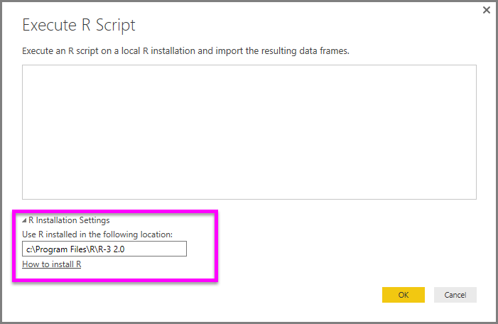
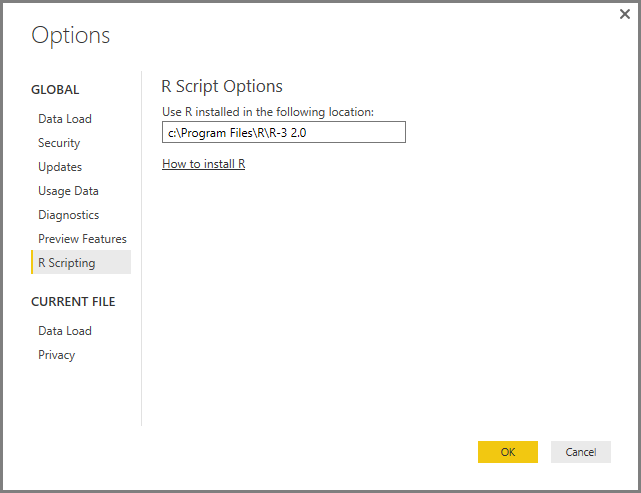

# Esecuzione di script R in Power BI Desktop
È possibile eseguire gli script R direttamente in **Power BI Desktop** e importare i set di dati risultanti in un modello di dati di Power BI Desktop.

## Installare R
Per eseguire gli script R in Power BI Desktop, è necessario installare **R** nel computer locale. È possibile scaricare e installare **R** gratuitamente da molte posizioni, tra cui la [pagina di download di Revolution Open](https://mran.revolutionanalytics.com/download/) e il [repository CRAN](https://cran.r-project.org/bin/windows/base/). La versione corrente dello script R in Power BI Desktop supporta i caratteri Unicode oltre agli spazi (caratteri vuoti) nel percorso di installazione.

## Eseguire gli script R
Con pochi passaggi in Power BI Desktop è possibile eseguire gli script R e creare un modello di dati, da cui è possibile creare report e condividerli nel servizio Power BI. Lo script R in Power BI Desktop ora supporta i formati di numero contenenti separatori decimali (.) e virgole (,).

### Preparare uno script R
Per eseguire uno script R in Power BI Desktop, creare lo script nell'ambiente di sviluppo locale R e verificare che venga eseguito correttamente.

Per eseguire lo script in Power BI Desktop, assicurarsi che lo script venga eseguito correttamente in un'area di lavoro nuova e non modificata. Ciò significa che tutti i pacchetti e le dipendenze devono essere esplicitamente caricati ed eseguiti. È possibile usare *source()* per eseguire gli script dipendenti.

La preparazione e l'esecuzione di uno script R in Power BI Desktop sono soggette ad alcune limitazioni:

* Vengono importati solo i frame di dati. Assicurarsi quindi che i dati da importare in Power BI siano rappresentati in un frame di dati
* Le colonne di tipo complesso e vettore non vengono importate e nella tabella creata vengono sostituite con valori di errore.
* In Power BI Desktop i valori N/D vengono convertiti in valori NULL
* Tutti gli script R eseguiti per più di 30 minuti generano un timeout
* Le chiamate interattive, ad esempio l'attesa dell'input dell'utente, all'interno dello script R, interrompono l'esecuzione dello script
* Quando si imposta la directory di lavoro all'interno dello script R, *è necessario* definire un percorso completo, a questa directory anziché un percorso relativo

### Eseguire lo script R e importare i dati
1. In Power BI Desktop, il connettore dati dello script R è disponibile **Recupera dati**. Per eseguire lo script R, selezionare **Recupera dati &gt; Altro...**, quindi selezionare **Altro &gt; Script R** come illustrato nella figura seguente.
   
   
2. Se R è installato nel computer locale, l'ultima versione installata è selezionata come motore di R. Copiare semplicemente lo script nella finestra dello script e selezionare **OK**.
   
   
3. Se R non è installato, non viene identificato, o se sono presenti più installazioni nel computer locale, espandere **Impostazioni di installazione R** per visualizzare le opzioni di installazione, oppure selezionare l'installazione che deve eseguire lo script R.
   
   
   
   Se R è installato ma non è identificato, è possibile indicare in modo esplicito il relativo percorso nella casella di testo fornita quando si espande **Impostazioni di installazione R**. Nell'immagine precedente, il percorso *C:\Programmi\R\R-3.2.0* viene fornito in modo esplicito nella casella di testo.
   
   Le impostazioni di installazione R si trovano al centro della sezione Script R della finestra di dialogo Opzioni. Per specificare le proprie impostazioni di installazione R, selezionare **File > Opzioni e impostazioni** e quindi **Opzioni > Script R**. Se sono disponibili più installazioni di R, viene visualizzato un menu a discesa che consente di selezionare l'installazione da usare.
   
   
4. Selezionare **OK** per eseguire lo script R. Quando lo script viene eseguito correttamente, è possibile scegliere i frame di dati risultante da aggiungere al modello di Power BI.

### Aggiorna
È possibile aggiornare uno script R in Power BI Desktop. Quando si aggiorna uno script R, Power BI Desktop esegue nuovamente lo script R nell'ambiente di Power BI Desktop.

## Passaggi successivi
Esaminare le informazioni aggiuntive seguenti su R in Power BI.

* [Creare oggetti visivi R in Power BI Desktop](desktop-r-visuals.md)
* [Usare un IDE R esterno con Power BI](desktop-r-ide.md)

