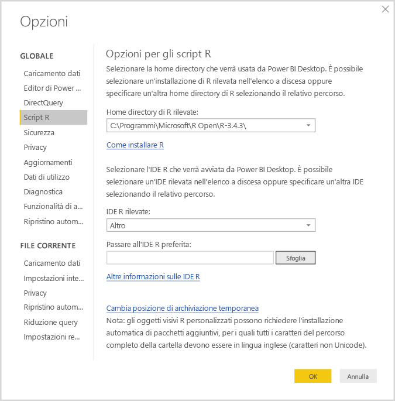
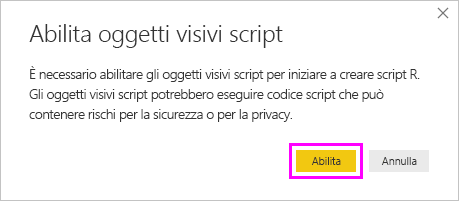
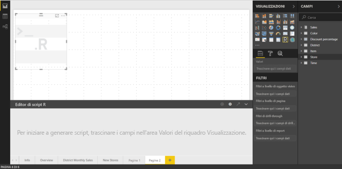
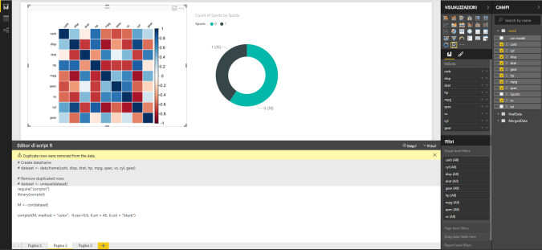
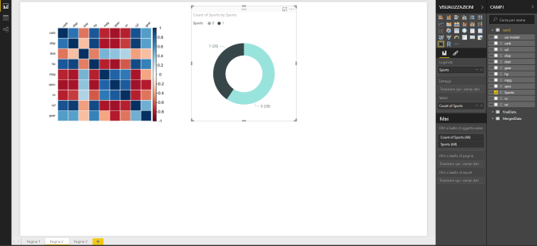
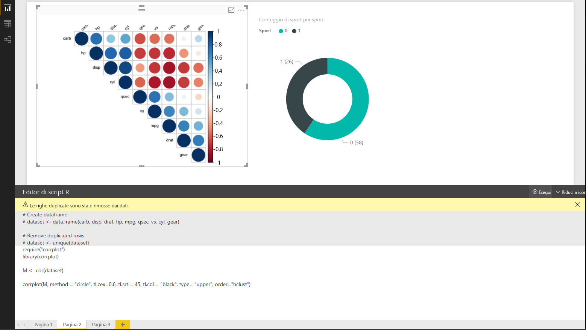

# <a name="create-power-bi-visuals-using-r"></a>Creare oggetti visivi di Power BI usando R
Con Power BI Desktop, è possibile usare *R* per visualizzare i dati. [R](https://mran.revolutionanalytics.com/documents/what-is-r) è un linguaggio, nonché un ambiente per l'elaborazione statistica e la grafica.

## <a name="install-r"></a>Installare R
Per impostazione predefinita, Power BI Desktop non include, distribuisce o installa il motore R. Per eseguire gli script R in Power BI Desktop, è necessario installare R nel computer locale. È possibile scaricare e installare R gratuitamente da molte posizioni, tra cui la [pagina di download di Revolution Open](https://mran.revolutionanalytics.com/download/) e il [repository CRAN](https://cran.r-project.org/bin/windows/base/). La versione corrente dello script R in Power BI Desktop supporta i caratteri Unicode oltre agli spazi (caratteri vuoti) nel percorso di installazione.

## <a name="enable-r-visuals-in-power-bi-desktop"></a>Abilitare oggetti visivi R in Power BI Desktop
Dopo aver installato R, Power BI Desktop lo abilita automaticamente. Per verificare che Power BI Desktop abbia abilitato R nella posizione corretta, seguire questa procedura: 

1. Nel menu di Power BI Desktop selezionare **File** > **Opzioni e impostazioni** > **Opzioni**. 

2. Sul lato sinistro della pagina **Opzioni**, in **Globali** selezionare **Script R**. 

3. In **Opzioni per gli script R** verificare che l'installazione di R sia specificata in **Home directory di R rilevate** e che rifletta correttamente l'installazione di R locale che deve essere usata da Power BI Desktop. Nella figura seguente il percorso di installazione locale di R è **C:\Programmi\R Open\R-3.5.3\\** .
   
   

Dopo aver specificato l'installazione di R, è possibile iniziare la creazione di oggetti visivi R.

## <a name="create-r-visuals-in-power-bi-desktop"></a>Creare oggetti visivi R in Power BI Desktop
1. Per aggiungere un oggetto visivo R, selezionare l'icona **Oggetto visivo R** nel riquadro **Visualizzazione**.
   
   

2. Nella finestra **Abilita oggetti visivi script** visualizzata selezionare **Abilita**.

   

   Quando si aggiunge un oggetto visivo R a un report, Power BI Desktop apporta queste modifiche:
   
   - Un'immagine segnaposto dell'oggetto visivo R viene visualizzata nell'area di disegno del report.
   
   - L'**editor di script R** viene visualizzato nella parte inferiore del riquadro centrale.
   
   

3. Nella sezione **Valori** del riquadro **Visualizzazione** trascinare dal riquadro **Campi** i campi da utilizzare nello script R, esattamente come si farebbe con qualsiasi altro oggetto visivo di Power BI Desktop. In alternativa, è anche possibile selezionare i campi direttamente nel riquadro **Campi**.
    
    Solo i campi aggiunti nella sezione **Valori** sono disponibili per lo script R. È possibile aggiungere nuovi campi o rimuovere i campi non necessari dalla sezione **Valori** quando si modifica lo script R nell'**editor di script R**. Power BI Desktop rileva automaticamente i campi aggiunti o rimossi.
   
   > [!NOTE]
   > Il tipo di aggregazione predefinito per gli oggetti visivi R è *Non riepilogare*.
   > 
   > 
   
4. A questo punto è possibile usare i dati selezionati per creare un tracciato: 

    - Quando si selezionano i campi, l'**editor di script R** genera un codice di associazione script R di supporto per tali campi nell'area grigia nella parte superiore del riquadro dell'editor.
    - Se si rimuove un campo, l'**editor di script R** rimuove automaticamente il codice di supporto per tale campo.
   
   Nell'esempio illustrato nella figura seguente, sono selezionati tre campi: hp, gear e drat. A seguito di queste selezioni, l'editor di script R genera il codice di associazione, come riepilogato di seguito:
   
   * Creare un frame di dati denominato **dataset**, costituito dai diversi campi selezionati dall'utente.
   * L'aggregazione predefinita è *Non riepilogare*.
   * Analogamente agli oggetti visivi della tabella, i campi vengono raggruppati e le righe duplicate sono visualizzate una sola volta.
   
   
   
   > [!TIP]
   > Talvolta può essere opportuno impedire il raggruppamento automatico o la visualizzazione di tutte le righe, incluse quelle duplicate. In questo caso aggiungere un campo di indice al set di dati che fa sì che tutte le righe siano considerate univoche e impedisce il raggruppamento.
   > 
   > 
   
   Il frame di dati generato è denominato **set di dati** e si accede alle colonne selezionate in base ai rispettivi nomi. È ad esempio possibile accedere al campo gear aggiungendo *dataset$gear* allo script R. Per i campi con spazi o caratteri speciali, usare le virgolette singole.

5. Con il frame di dati generato automaticamente in base ai campi selezionati, si è pronti a scrivere uno script R per cui Power BI Desktop crea un tracciato al dispositivo predefinito R. Dopo aver completato lo script, selezionare **Esegui script** sul lato destro della barra del titolo **Editor di script R**.
   
    Quando si seleziona **Esegui script**, Power BI Desktop identifica il tracciato e lo visualizza nell'area di disegno. Poiché il processo viene eseguito nell'installazione R locale, verificare che siano installati i pacchetti R necessari.
   
   Power BI Desktop ritraccia l'oggetto visivo quando si verifica uno degli eventi seguenti:
   
   * Si seleziona **Esegui script** dalla barra del titolo dell'**editor di script R**.
   * I dati vengono modificati perché vengono aggiornati, filtrati o evidenziati.

     L'immagine seguente illustra un esempio di codice del tracciato di correlazione, che traccia le correlazioni tra gli attributi di tipi diversi di automobili.

     

6. Per ottenere una vista ingrandita delle visualizzazioni, ridurre a icona l'**editor di script R**. Come altri oggetti visivi in Power BI Desktop, è possibile applicare un filtro incrociato al tracciato di correlazione selezionando una sezione specifica (ad esempio, le auto sportive) nell'oggetto visivo a forma di anello, ovvero l'oggetto rotondo a destra.

    

7. Modificare lo script R per personalizzare l'oggetto visivo e sfruttare la potenza di R aggiungendo parametri al comando di creazione del tracciato.

    Il comando di creazione del tracciato originale è:

    ```
    corrplot(M, method = "color",  tl.cex=0.6, tl.srt = 45, tl.col = "black")
    ```

    Modificare lo script R in modo che il comando di creazione del tracciato sia il seguente:

    ```
    corrplot(M, method = "circle", tl.cex=0.6, tl.srt = 45, tl.col = "black", type= "upper", order="hclust")
    ```

    Di conseguenza, l'oggetto visivo R ora traccia cerchi, prende in considerazione solo la metà superiore e riordina la matrice per raggruppare gli attributi correlati.

    

    Quando si esegue uno script R che restituisce un errore, viene visualizzato un messaggio di errore nell'area di disegno invece che nel tracciato dell'oggetto visivo R. Per informazioni dettagliate sull'errore, selezionare **Visualizza i dettagli** dall'errore dell'oggetto visivo R.

    

## <a name="r-scripts-security"></a>Sicurezza degli script R 
Gli oggetti visivi R vengono creati in base agli script R, che potrebbero contenere codice con rischi per la sicurezza o per la privacy. Quando prova a visualizzare o a interagire con un oggetto visivo R per la prima volta, un utente riceve un messaggio di avviso di sicurezza. Abilitare gli oggetti visivi R solo se l'autore e l'origine sono considerati attendibili o dopo aver esaminato e acquisito informazioni sullo script R.


## <a name="known-limitations"></a>Limitazioni note
Gli oggetti visivi R in Power BI Desktop hanno le limitazioni seguenti:

* Dimensioni dei dati: i dati usati da un oggetto visivo R per il tracciato sono limitati a 150.000 righe. Se vengono selezionate più di 150.000 righe, vengono utilizzate solo le prime 150.000 righe e viene visualizzato un messaggio sull'immagine.

* Risoluzione: Tutti gli oggetti visivi R vengono visualizzati a 72 DPI.

* Dispositivo di tracciamento: è supportato solo il tracciamento nel dispositivo predefinito. 

* Tempi di calcolo: se il calcolo di un oggetto visivo R supera i cinque minuti, causa un errore di timeout.

* Relazioni: come con altri oggetti visivi Power BI Desktop, se vengono selezionati campi di dati da diverse tabelle senza una relazione definita tra di esse, si verifica un errore.

* Aggiornamenti: Gli oggetti visivi R vengono aggiornati al momento dell’aggiornamento, del filtraggio e dell’evidenziazione dei dati. Tuttavia, l'immagine in sé non è interattiva e non può essere l'origine del filtro incrociato.

* Elementi in evidenza: gli oggetti visivi R reagiscono se si evidenziano altri oggetti visivi, ma non è possibile selezionare gli elementi nell'oggetto visivo R per applicare un filtro incrociato ad altri elementi.

* Dispositivi di visualizzazione: Solo i tracciati sul dispositivo di visualizzazione predefinito R vengono visualizzati correttamente nell'area di disegno. Evitare di usare in modo esplicito un altro dispositivo di visualizzazione R.

* Installazioni di RRO: in questa versione Power BI Desktop a 32 bit non identifica automaticamente le installazioni di RRO. È necessario specificare manualmente il percorso della directory di installazione di R in **Opzioni e impostazioni** > **Opzioni** > **Script R**.

## <a name="next-steps"></a>Passaggi successivi
Per altre informazioni su R in Power BI, vedere gli articoli seguenti:

* [Esecuzione di script R in Power BI Desktop](desktop-r-scripts.md)
* [Usare un IDE R esterno con Power BI](desktop-r-ide.md)

