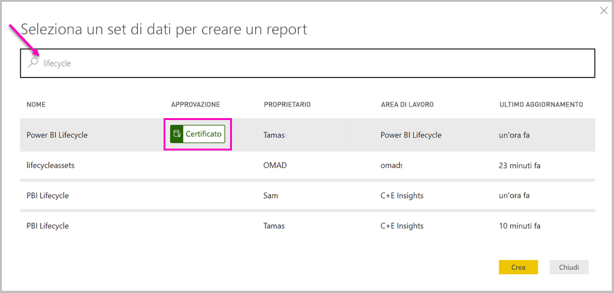

# Connettersi ai set di dati nel servizio Power BI da Power BI Desktop
È possibile stabilire una connessione attiva a un set di dati condiviso nel servizio Power BI e creare report diversi dal set di dati stesso. In questo modo si può creare il modello di dati ideale in Power BI Desktop e pubblicarlo nel servizio Power BI. Partendo dallo stesso modello di dati comune, tutti possono così creare più report diversi (in file con estensione pbix separati) e salvarli in aree di lavoro diverse. Questa funzionalità è denominata **Connessione dinamica al servizio Power BI**.

Questa funzionalità comporta vari vantaggi, tra cui procedure consigliate che saranno illustrate nel corso di questo articolo. Occorre tenere presenti alcune limitazioni e considerazioni ed è per questo che è consigliabile leggere attentamente l'articolo fino alla fine.

## Uso di una connessione dinamica al servizio Power BI per la gestione del ciclo di vita
Uno dei problemi relativi alla popolarità di Power BI è la proliferazione di rapporti, dashboard e dei relativi modelli di dati sottostanti. Il motivo è che è facile creare report interessanti in **Power BI Desktop**, quindi condividerli ([pubblicarli](desktop-upload-desktop-files.md)) nel **servizio Power BI** e creare dashboard eccezionali in base a tali set di dati. Dato che molti utenti procedevano in questo modo, spesso usando gli stessi (o quasi) set di dati, sapere quale report fosse basato su quale set di dati, e quanto fosse aggiornato ogni set di dati, è diventato un problema. La **Connessione dinamica al servizio Power BI** risolve questo problema, rendendo più semplici e coerenti le operazioni di creazione, condivisione ed espansione dei report e dei dashboard dei set di dati comuni.

### Creare un set di dati che tutti possano usare, quindi condividerlo
Si supponga che Anna, un'analista aziendale, faccia parte del proprio team e che sia molto brava a creare modelli di dati validi (spesso chiamati set di dati). Grazie alla sua esperienza, Anna può creare un set di dati e un report e quindi condividere tale report nel **servizio Power BI**.

Tutti apprezzano il report e il set di dati di Anna ed è qui che iniziano i guai: ogni membro del team vuole provare a creare una *versione personalizzata* del set di dati e quindi condividere i propri report con il team. All'improvviso, l'area di lavoro del team nel **servizio Power BI** si riempie di moltissimi report, provenienti da diversi set di dati. Qual è il più recente? I set di dati erano gli stessi o quasi? Quali erano le differenze? Con la funzionalità **Connessione dinamica al servizio Power BI**, tutto questo può cambiare in meglio. Nella sezione successiva si vedrà in che modo gli altri colleghi possono usare il set di dati pubblicato da Anna per personalizzare i report nelle proprie aree di lavoro e consentire a chiunque di usare lo stesso set di dati comune, esaminato e pubblicato per compilare i report univoci.

### Connettersi a un set di dati del servizio Power BI usando una connessione dinamica
Se Anna crea un report (e il set di dati su cui è basato) e quindi lo pubblica nel **servizio Power BI**, viene visualizzato nell'area di lavoro del suo team nel servizio Power BI. Se Anna lo salva in un'*area di lavoro della nuova esperienza*, può impostare l'autorizzazione di creazione affinché il report diventi disponibile per la visualizzazione e l'uso per tutti i colleghi all'interno o all'esterno della sua area di lavoro.

Per altre informazioni sulle aree di lavoro della nuova esperienza, vedere le [aree di lavoro per le app](service-new-workspaces.md).

Altri membri all'interno e all'esterno dell'area di lavoro di Anna possono ora stabilire una connessione dinamica al suo modello di dati condiviso (usando la funzionalità **Connessione dinamica al servizio Power BI**) e creare report personalizzati basati sul *set di dati originale* nelle *proprie aree di lavoro della nuova esperienza*.

Nella figura seguente, si vedrà in che modo Anna crea un report di **Power BI Desktop** e lo pubblica (incluso il modello di dati) nel **servizio Power BI**. Quindi, altri colleghi potranno connettersi al modello di dati di Anna usando la funzionalità **Connessione dinamica al servizio Power BI** e creare report personalizzati basati sul set di dati di Anna nelle proprie aree di lavoro.

> [!NOTE]
> Se si salva il set di dati in un'[area di lavoro condivisa classica](service-create-workspaces.md), solo i membri di quell'area di lavoro potranno compilare report basandosi sul set di dati in questione. Per stabilire una connessione dinamica al servizio Power BI, il set di dati a cui connettersi deve trovarsi in un'area di lavoro condivisa di cui si è membri.
> 
> 

## Istruzioni dettagliate per usare la connessione dinamica al servizio Power BI
Ora che si conosce l'utilità della funzionalità **Connessione dinamica al servizio Power BI** e come è possibile usarla come approccio ottimale alla gestione del ciclo di vita del report, si passerà a esaminare i passaggi che portano dall'utile report (e set di dati) di Anna a un set di dati condiviso che i sui colleghi di Power BI potranno usare.

### Pubblicare un report e un set di dati di Power BI
Il primo passaggio nella gestione del ciclo di vita del report con una **connessione dinamica al servizio Power BI** consiste nel creare un report (e set di dati) che i colleghi vorranno usare. Anna deve quindi prima **pubblicare** il report da **Power BI Desktop**. A tale scopo, è necessario selezionare **Pubblica** sulla barra multifunzione **Home** in Power BI Desktop.

Se Anna non ha ancora effettuato l'accesso all'account del servizio Power BI, verrà visualizzata una notifica popup in cui viene chiesto di farlo.

A questo punto, Anna può scegliere l'area di lavoro di destinazione nella quale verranno pubblicati il report e il set di dati. Tenere presente che se Anna salva il report in un'area di lavoro della nuova esperienza, chiunque abbia l'autorizzazione di creazione potrà accedere al set di dati. L'autorizzazione di compilazione viene impostata nel servizio Power BI dopo la pubblicazione. Se il lavoro viene salvato in un'area di lavoro classica, solo i membri che hanno accesso all'area di lavoro in cui è pubblicato il report potranno accedere al relativo set di dati usando la funzionalità **Connessione dinamica al servizio Power BI**.

Inizia il processo di pubblicazione e **Power BI Desktop** mostra lo stato di avanzamento.

Una volta completato, **Power BI Desktop** mostra l'esito positivo e indica alcuni collegamenti al report stesso nel **servizio Power BI** e un collegamento per ottenere **Informazioni rapide** sul report.

Ora che il report con il relativo set di dati si trova nel servizio Power BI, è anche possibile *promuoverlo* per attestarne la qualità e l'affidabilità. È anche possibile richiedere che sia *certificato* da un'autorità centrale nel tenant di Power BI. Con una di queste approvazioni, il set di dati sarà sempre elencato tra gli argomenti ogni volta che si eseguirà una ricerca di set di dati. Se necessario, sono disponibili altre informazioni sul processo di [promozione del set di dati](service-datasets-promote.md). 

L'ultimo passaggio consiste nell'impostare l'*autorizzazione di compilazione* per il set di dati su cui è basato il report. L'autorizzazione di compilazione determina chi può visualizzare e usare il set di dati. È possibile impostarla nell'area di lavoro stessa o quando si condivide un'app dall'area di lavoro. Altre informazioni sull'[autorizzazione di compilazione](service-datasets-build-permissions.md#build-permissions-for-shared-datasets).

A questo punto si vedrà in che modo gli altri colleghi che hanno accesso all'area di lavoro in cui è stato pubblicato il report possono connettersi al set di dati e creare report personalizzati.

### Stabilire una connessione dinamica al servizio Power BI con il set di dati pubblicato
Per stabilire una connessione al report pubblicato e creare un report personalizzato sulla base del set di dati pubblicato, selezionare **Recupera dati** dalla barra multifunzione **Home** in **Power BI Desktop**, selezionare **Power BI** dal riquadro sinistro, quindi selezionare **Set di dati Power BI**.

Se non è stato fatto, verrà chiesto di eseguire l'accesso a Power BI. Una volta effettuato l'accesso, viene presentata una finestra che mostra di quali aree di lavoro si è membri di ed è possibile selezionare l'area di lavoro che contiene il set di dati in cui si vuole stabilire un **connessione dinamica al servizio Power BI**.

I set di dati elencati sono tutti set di dati condivisi per i quali si ha autorizzazione di compilazione in qualsiasi area di lavoro. È possibile eseguire la ricerca di un set di dati specifico e visualizzarne il nome, il proprietario, l'area di lavoro in cui si trova e la data dell'ultimo aggiornamento. È anche possibile visualizzare i set di dati *approvati*, certificati o promossi nella parte superiore dell'elenco. 

Quando si seleziona **Carica** dalla finestra si stabilisce una connessione dinamica al set di dati selezionato, vale a dire che i dati visualizzati (i campi e i relativi valori) vengono caricati in **Power BI Desktop** in tempo reale.

A questo punto tutti potranno creare e condividere i report personalizzati dallo stesso set di dati. È un ottimo modo per affidare la creazione di un set di dati ben formato a una persona esperta (come lo è Anna, ad esempio) e consentire a molti colleghi di usare tale set di dati condiviso per creare report personalizzati.

## Limitazioni e considerazioni
Quando si usa la **Connessione dinamica al servizio Power BI** occorre tenere presenti alcune limitazioni e considerazioni.

* Solo gli utenti con autorizzazione di compilazione per un set di dati possono connettersi a un set di dati pubblicato usando la funzionalità **Connessione dinamica al servizio Power BI**. 
* Gli utenti del piano gratuito visualizzano solo i set di dati dell'area di lavoro personale e delle aree di lavoro con capacità Premium.
* Poiché si tratta di una connessione dinamica, lo spostamento a sinistra e la modellazione sono disabilitati, analogamente al comportamento riscontrato quando si è connessi a **SQL Server Analysis Services**, ed è possibile solo connettersi a un set di dati in ogni report.
* Poiché si tratta di una connessione dinamica, vengono applicati la sicurezza a livello di riga e di ruolo e altri comportamenti di connessione simili, esattamente come quando si è connessi a **SQL Server Analysis Services**.
* Se si modifica il file originale con estensione pbix condiviso, il set di dati e il report condivisi nel **servizio Power BI** vengono sovrascritti. I report basati su tale set di dati non vengano sovrascritti, ma eventuali modifiche al set di dati saranno visibili nel report.
* I membri di un'area di lavoro non possono sostituire il report condiviso in origine. Se si prova a farlo, verrà visualizzato un avviso che richiede di rinominare il file e pubblicarlo.
* Se si elimina il set di dati condiviso nel **servizio Power BI**, gli altri report basati su tale set di dati non funzioneranno più correttamente né visualizzeranno gli oggetti visivi.
* Per i pacchetti di contenuto, è necessario creare una copia di un pacchetto di contenuto prima di usarlo come base per la condivisione di un report PBIX e un set di dati con il **servizio Power BI**.
* Per i pacchetti di contenuto da *Organizzazione*, una volta copiati, non è possibile sostituire il report creato nel servizio e/o un report creato come parte della copia di un pacchetto di contenuto con una connessione dinamica. Se si prova a farlo, verrà visualizzato un avviso che richiede di rinominare il file e pubblicarlo. In questo caso, è possibile sostituire solo i report pubblicati con connessione dinamica.
* Se viene eliminato un set di dati condiviso nel **servizio Power BI**, nessuno potrà più accedere a tale set di dati da **Power BI Desktop**.
* I report che condividono un set di dati nel servizio Power BI non supportano le distribuzioni automatiche con l'API REST di Power BI.

