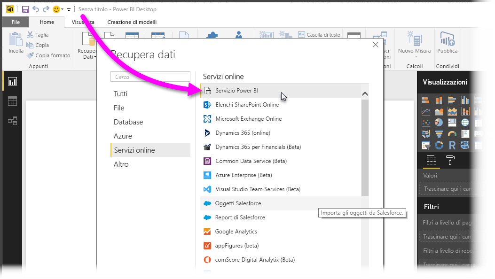
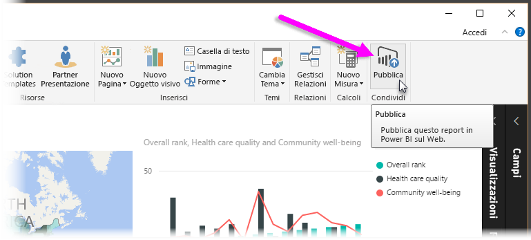
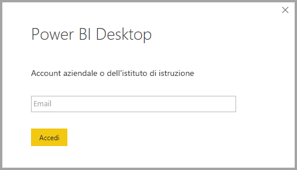
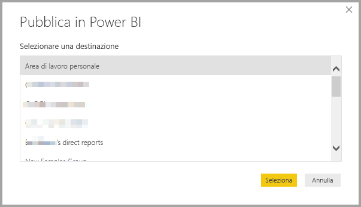
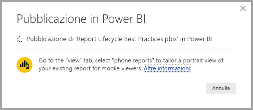
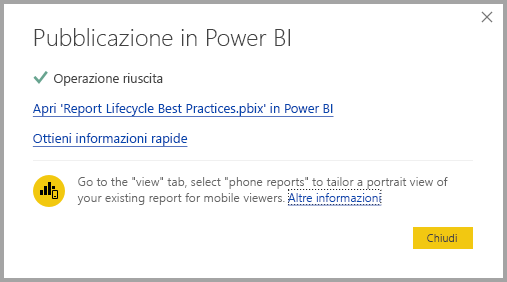
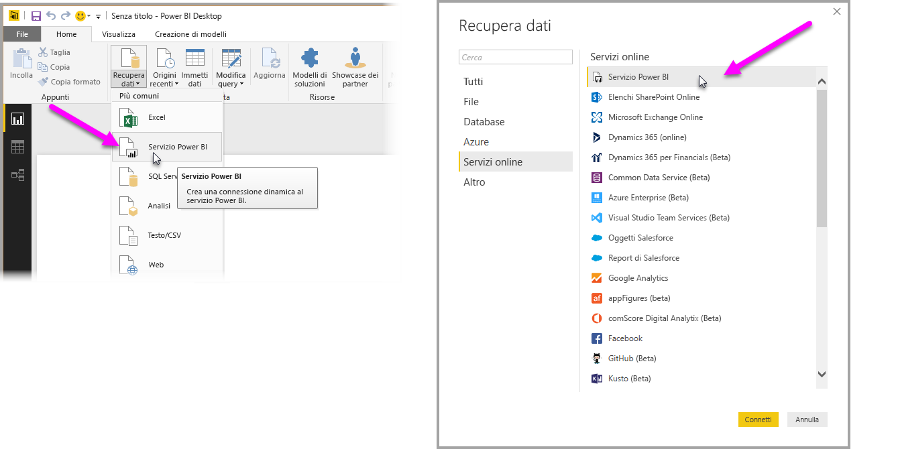
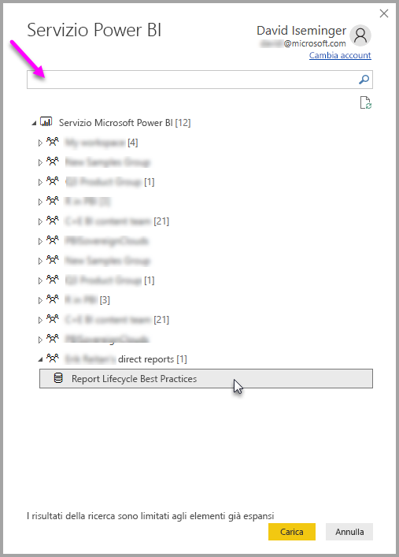
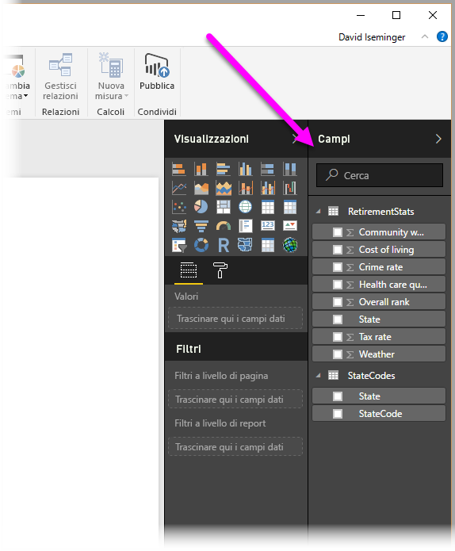

# Connettersi ai set di dati nel servizio Power BI da Power BI Desktop
È possibile stabilire una connessione attiva a un set di dati condiviso nel servizio Power BI e creare report diversi dal set di dati stesso. Ciò significa che è possibile creare il modello di dati ideale in Power BI Desktop, pubblicarlo nel servizio Power BI, quindi sarà possibile creare più report diversi (in file con estensione pbix separati) in base allo stesso modello di dati comuni. Questa funzionalità è denominata **Connessione dinamica al servizio Power BI**.

Questa funzionalità comporta vari vantaggi, tra cui procedure consigliate che saranno illustrate nel corso di questo articolo. Occorre tenere presenti alcune limitazioni e considerazioni ed è per questo che è consigliabile leggere attentamente l'articolo fino alla fine.

## Uso di una connessione dinamica al servizio Power BI per la gestione del ciclo di vita
Uno dei problemi relativi alla popolarità di Power BI è la proliferazione di rapporti, dashboard e dei relativi modelli di dati sottostanti. Il motivo è che è facile creare report interessanti in **Power BI Desktop**, quindi condividerli ([pubblicarli](desktop-upload-desktop-files.md)) nel **servizio Power BI** e creare dashboard eccezionali in base a tali set di dati. Dato che molti utenti procedevano in questo modo, spesso usando gli stessi (o quasi) set di dati, sapere quale report fosse basato su quale set di dati, e quanto fosse aggiornato ogni set di dati, è diventato un problema. La **Connessione dinamica al servizio Power BI** risolve questo problema, rendendo più semplici e coerenti le operazioni di creazione, condivisione ed espansione dei report e dei dashboard dei set di dati comuni.

### Creare un set di dati che tutti possano usare, quindi condividerlo
Si supponga che Anna, un'analista aziendale, faccia parte del proprio team e che sia molto brava a creare dei modelli di dati validi (spesso chiamati set di dati). Grazie alla sua esperienza, Anna riesce a creare un set di dati e un report e quindi a condividere tale report nel **servizio Power BI**.

Tutti apprezzano il report e il set di dati creati da Anna ed è qui che ha origine il problema: ogni membro del team proverebbe a creare *la propria versione* dello stesso set di dati e quindi a condividere i propri report con il team. All'improvviso, l'area di lavoro del team nel **servizio Power BI** pullulerebbe di report provenienti da diversi set di dati. Qual è il più recente? I set di dati erano gli stessi o quasi? Quali erano le differenze? Con la funzionalità **Connessione dinamica al servizio Power BI**, tutto questo può cambiare in meglio. Nella sezione successiva, si vedrà in che modo gli altri colleghi possono usare il set di dati pubblicato da Anna per la creazione di report e consentire a chiunque di usare lo stesso set di dati consistente, esaminato e pubblicato per compilare i report univoci.

### Connettersi a un set di dati del servizio Power BI usando una connessione dinamica
Quando Anna avrà creato un report (e il set di dati su cui è basato) e lo pubblicherà nel **servizio Power BI**, questo verrà visualizzato nell'area di lavoro del suo team nel servizio Power BI. A questo punto, tutti i colleghi che hanno accesso alla sua area di lavoro potranno vederlo e usarlo.

Altri membri dell'area di lavoro di Anna potranno ora stabilire una connessione dinamica al suo modello di dati condiviso (usando la funzionalità **Connessione dinamica al servizio Power BI**) e creare report personalizzati in base al *suo set di dati originale*.

Nella figura seguente, si vedrà in che modo Anna crea un report di **Power BI Desktop** e lo pubblica (incluso il modello di dati) nel **servizio Power BI**. Quindi, altri colleghi nella sua area di lavoro potranno connettersi al suo modello di dati usando la **connessione dinamica al servizio Power BI** e creare report personalizzati basati sul suo set di dati.

> [!NOTE]
> I set di dati vengono condivisi in un'unica area di lavoro. Per stabilire una connessione dinamica al servizio Power BI, il set di dati a cui connettersi deve trovarsi in un'area di lavoro condivisa di cui si è membri.
> 
> 

## Istruzioni dettagliate per usare la connessione dinamica al servizio Power BI
Ora che si conosce l'utilità della **connessione dinamica al servizio Power BI** e come è possibile usarla come un approccio ottimale alla gestione del ciclo di vita del report, si passerà a esaminare i passaggi che portano dall'utile report (e set di dati) di Anna a un set di dati condiviso che i colleghi nella sua area di lavoro di Power BI potranno usare.

### Pubblicare un report e un set di dati di Power BI
Il primo passaggio nella gestione del ciclo di vita del report con una **connessione dinamica al servizio Power BI** consiste nel creare un report (e set di dati) che i colleghi vorranno usare. Pertanto Anna dovrà innanzitutto **pubblicare** il suo report da **Power BI Desktop**. A tale scopo, seleziona **Pubblica** dalla barra multifunzione **Home** in Power BI Desktop.

Se non ha ancora effettuato l'accesso al suo account del servizio Power BI, le verrà richiesto di farlo.

Da lì, sarà possibile scegliere l'area di lavoro di destinazione nella quale verranno pubblicati il report e il set di dati. Tenere presente che solo i membri che hanno accesso all'area di lavoro in cui viene pubblicato un report possono accedere al relativo set di dati usando una **connessione dinamica al servizio Power BI**.

Inizia il processo di pubblicazione e **Power BI Desktop** mostra lo stato di avanzamento.

Una volta completato, **Power BI Desktop** mostra l'esito positivo e indica alcuni collegamenti al report stesso nel **servizio Power BI** e un collegamento per ottenere **Informazioni rapide** sul report.

A questo punto si vedrà in che modo gli altri colleghi che hanno accesso all'area di lavoro in cui è stato pubblicato il report possono connettersi al set di dati e creare report personalizzati.

### Stabilire una connessione dinamica al servizio Power BI con il set di dati pubblicato
Per stabilire una connessione con il report pubblicato e creare un report personalizzato in base al set di dati pubblicato, selezionare **Recupera dati** dalla barra multifunzione **Home** in **Power BI Desktop** e selezionare **Servizio Power BI**. È anche possibile selezionare **Recupera dati > Online Services > Servizio Power BI**.

Se non è stato fatto, verrà chiesto di eseguire l'accesso a Power BI. Una volta effettuato l'accesso, viene presentata una finestra che mostra di quali aree di lavoro si è membri di ed è possibile selezionare l'area di lavoro che contiene il set di dati in cui si vuole stabilire un **connessione dinamica al servizio Power BI**.

Il numero tra parentesi accanto all'area di lavoro indica il numero di set di dati condivisi disponibili in tale gruppo di lavoro e selezionando il triangolo a sinistra si espande l'area di lavoro, che consente di selezionare il set di dati condiviso.

Esistono alcuni elementi da considerare dalla precedente finestra di connessione dinamica di **servizio Power BI**:

* È possibile cercare un set di dati condiviso, ma i risultati della ricerca sono limitati agli elementi espansi e non includono le aree di lavoro che non sono espanse.
* È possibile espandere più aree più lavoro per espandere la ricerca.

Quando si seleziona **Carica** dalla finestra si stabilisce una connessione dinamica al set di dati selezionato, vale a dire che i dati visualizzati (i campi e i relativi valori) vengono caricati in **Power BI Desktop** in tempo reale.

A questo punto tutti potranno creare e condividere i report personalizzati dallo stesso set di dati. È un ottimo modo per affidare la creazione di un set di dati ben formato a una persona esperta (come lo è Anna, ad esempio) e consentire a molti colleghi di usare tale set di dati condiviso per creare report personalizzati.

> [!NOTE]
> Quando si creano report basati sul set di dati usando una connessione dinamica al **servizio Power BI**, è possibile pubblicare solo il report stesso nella stessa area di lavoro del servizio Power BI che contiene il set di dati in uso.
> 
> 

## Limitazioni e considerazioni
Quando si usa la **Connessione dinamica al servizio Power BI** occorre tenere presenti alcune limitazioni e considerazioni.

* I membri di sola lettura di un'area di lavoro non possono connettersi a set di dati da **Power BI Desktop**.
* Solo gli utenti che fanno parte della stessa area di lavoro del **servizio Power BI** possono connettersi a un set di dati pubblicato usando la **connessione dinamica al servizio Power BI**. Gli utenti possono appartenere a più aree di lavoro (e spesso è proprio così).
* Dato che si tratta di una connessione dinamica, lo spostamento a sinistra e la modellazione sono disabilitati, analogamente al comportamento riscontrato quando si è connessi a **SQL Server Analysis Services**.
* Dato che si tratta di una connessione dinamica, vengono applicati la sicurezza a livello di riga e di ruolo, OneDrive for Business e altri simili comportamenti di connessione, esattamente come quando si è connessi a **SQL Server Analysis Services**.
* Quando si seleziona il set di dati a cui connettersi nel **servizio Power BI**, la casella di ricerca si applica solo alle aree di lavoro che sono stati espanse.
* Se si modifica il file originale con estensione pbix condiviso, il set di dati e il report condivisi nel **servizio Power BI** vengono sovrascritti.
* I membri di un'area di lavoro non possono sostituire il report condiviso in origine. Se si prova a farlo, verrà visualizzato un avviso che richiede di rinominare il file e pubblicarlo.
* Se si elimina il set di dati condiviso nel **servizio Power BI**, altri file di **Power BI Desktop** (file con estensione pbix) non funzioneranno più correttamente né visualizzeranno gli oggetti visivi.
* Per i pacchetti di contenuto, è necessario creare una copia di un pacchetto di contenuto prima di usarlo come base per la condivisione di un report PBIX e un set di dati con il **servizio Power BI**.
* Per i pacchetti di contenuto da *Organizzazione*, una volta copiati, non è possibile sostituire il report creato nel servizio e/o un report creato come parte della copia di un pacchetto di contenuto con una connessione dinamica. Se si prova a farlo, verrà visualizzato un avviso che richiede di rinominare il file e pubblicarlo. In questo caso, è possibile sostituire solo i report pubblicati con connessione dinamica.
* Quando si crea un report basato sul set di dati usando una connessione dinamica al **servizio Power BI**, è possibile pubblicare solo il report stesso nella stessa area di lavoro del servizio Power BI che contiene il set di dati in uso.
* L'eliminazione di un set di dati condiviso nel **servizio Power BI** significa che è non è più possibile accedere a tale set di dati da **Power BI Desktop**.

