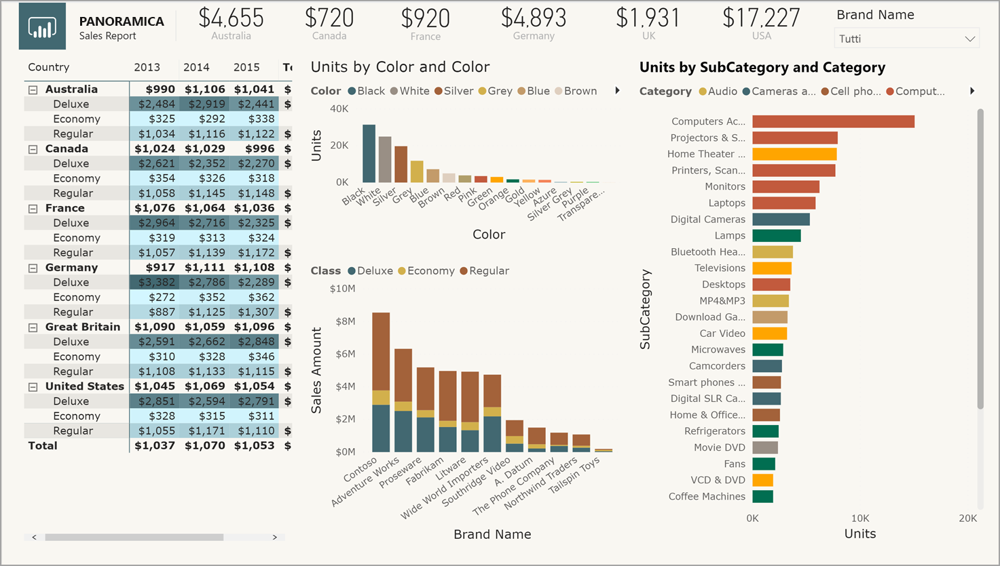
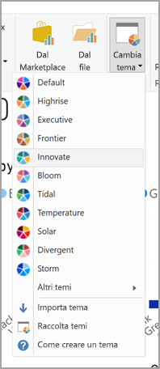
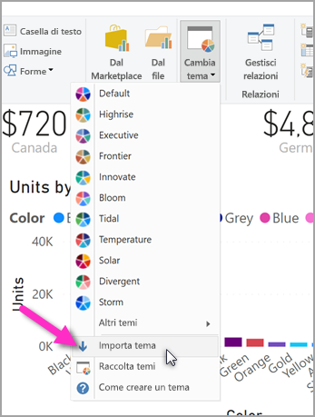

# <a name="use-report-themes-in-power-bi-desktop"></a>Usare i temi del report in Power BI Desktop

In Power BI Desktop i *temi dei report* consentono di applicare modifiche alla struttura dell'intero report, ad esempio usando i colori aziendali, modificando i set di icone o applicando una nuova formattazione visuale predefinita. Quando si applica un tema del report, tutti gli oggetti visivi del report usano per impostazione predefinita i colori e la formattazione del tema selezionato. Ci sono alcune eccezioni, che vengono descritte più avanti in questo articolo.



Esistono due tipi di temi del report: i temi del report predefiniti e i file del tema del report personalizzati:

- I temi del report predefiniti offrono diversi tipi di combinazioni di colori predefinite installate con Power BI Desktop. È possibile selezionare i temi del report predefiniti direttamente dal menu di Power BI Desktop.

- I file del tema del report personalizzati sono temi del report creati in file JSON che ne definiscono la struttura di base. Per applicare un tema del report personalizzato si importa il file JSON corrispondente in Power BI Desktop e lo si applica al report.

  È anche possibile personalizzare un tema del report esistente dall'interno Power BI Desktop usando la [finestra di dialogo **Personalizza tema**](#create-and-customize-a-theme-in-power-bi-desktop-preview).

È possibile personalizzare e standardizzare quasi tutti gli elementi visualizzati nella sezione **Formattazione** del riquadro **Visualizzazioni**, tramite personalizzazioni eseguite direttamente in Power BI Desktop o tramite un file JSON del tema del report. L'obiettivo è offrire all'utente il controllo completo sull'aspetto grafico predefinito del report, a un livello granulare.

## <a name="how-report-themes-work"></a>Come funzionano i temi del report

Per applicare un tema a un report di Power BI Desktop, è possibile selezionare tra i [temi predefiniti disponibili](#built-in-report-themes), [importare un file JSON con un tema personalizzato](#import-custom-report-theme-files) oppure [usare la finestra di dialogo **Personalizza tema**](#create-and-customize-a-theme-in-power-bi-desktop-preview).

Per informazioni dettagliate sulle impostazioni predefinite che è possibile personalizzare, vedere la sezione seguente relativa al [formato JSON del tema del report](#report-theme-json-file-format).

### <a name="built-in-report-themes"></a>Temi del report predefiniti

Per fare una selezione tra i temi del report incorporati disponibili:

1. Selezionare **Cambia tema** nella barra multifunzione **Home**.

   

2. Selezionare uno dei temi disponibili dal menu a discesa.

   Il tema del report è ora applicato al report.

La tabella seguente visualizza i modelli di temi del report predefiniti disponibili.

| Tema del report predefinito | Sequenza di colori predefinita |
|------ |---------- |
| Predefinito | |
| Highrise | |
| Executive | |
| Frontiera| |
| Innovazione | |
| Fioritura | |
| Marea| |
| Temperatura | |
| Solare| |
| Divergente | |
| Storm | |
| Classico | |
| Parco cittadino | |
| Classe | |
| Per daltonici | |
| Elettrico | |
| Contrasto elevato | |
| Tramonto | |
| Crepuscolo | |

## <a name="customize-report-themes"></a>Personalizzare i temi del report

A partire dalla versione di dicembre 2019 di Power BI Desktop, è possibile personalizzare un tema del report in due modi:

- [Creare e personalizzare un tema in Power BI Desktop (anteprima)](#create-and-customize-a-theme-in-power-bi-desktop-preview)
- [Creare e personalizzare un file JSON del tema del report personalizzato](#introduction-to-report-theme-json-files)

### <a name="create-and-customize-a-theme-in-power-bi-desktop-preview"></a>Creare e personalizzare un tema in Power BI Desktop (anteprima)

A partire dalla versione di dicembre 2019 di Power BI Desktop, la possibilità di personalizzare un tema direttamente in Power BI Desktop è ora disponibile come funzionalità di anteprima.

Per personalizzare un tema direttamente in Power BI Desktop:

1. Selezionare **File** > **Opzioni e impostazioni** > **Opzioni**.

2. Nella sezione **Funzionalità in anteprima** selezionare **Personalizza tema corrente** e quindi selezionare **OK**.

   

   Potrebbe essere richiesto di riavviare Power BI Desktop per rendere effettiva la funzionalità di anteprima. Dopo il riavvio è possibile iniziare a personalizzare il tema attualmente applicato.

3. Nella barra multifunzione **Home** selezionare **Cambia tema** > **Personalizza tema corrente**.

   Verrà visualizzata una finestra di dialogo in cui sono riportate le opzioni di personalizzazione del tema attualmente applicato al report.

   

4. Se si vuole usare un tema esistente apportando solo alcune modifiche, selezionare il tema e quindi **Personalizza tema corrente**.

   

Le impostazioni del tema personalizzabili rientrano nelle categorie seguenti, che rispecchiano quelle della finestra **Personalizza tema**:

- **Nome e colori**: le impostazioni relative al nome e ai colori del tema includono i [colori del tema](#how-report-theme-colors-stick-with-your-reports), i colori sentiment, i colori divergenti e i [colori strutturali (opzione avanzata)](#setting-structural-colors).
- **Text**: le impostazioni del testo includono la famiglia, la dimensione e il colore dei caratteri, che specificano [le impostazioni predefinite della classe di testo primaria](#setting-formatted-text-defaults) per le etichette, i titoli, le schede, gli indicatori KPI e le intestazioni delle schede.
- **Oggetti visivi**: le impostazioni degli oggetti visivi includono lo sfondo, il bordo, l'intestazione e le descrizioni comando.
- **Pagina**: le impostazioni degli elementi della pagina includono gli sfondi.
- **Riquadro filtro**: le impostazioni del riquadro filtro includono colore di sfondo, trasparenza, colore dei caratteri e delle icone, dimensioni e schede dei filtri.

Dopo avere apportato le modifiche, selezionare **Applica e salva** per salvare il tema. Il tema ora può essere usato nel report corrente ed esportato.

Questa modalità di personalizzazione del tema corrente offre un metodo semplice e rapido per personalizzare i temi. Tuttavia è possibile apportare modifiche più precise ai temi, che richiedono la modifica del [file JSON](#report-theme-json-file-format) del tema.

> [!TIP]
> È possibile personalizzare le opzioni più comuni del tema del report usando i controlli della finestra di dialogo **Personalizza tema**. Per un controllo ancora più dettagliato, è possibile esportare il file JSON di un tema e apportare manualmente regolazioni modificando le impostazioni nel file. È possibile rinominare il file JSON ottimizzato e quindi importarlo.

### <a name="import-custom-report-theme-files"></a>Importare i file del tema del report personalizzati

Per importare un file del tema del report personalizzato:

1. Selezionare **Cambia tema** nella scheda **Home** della barra multifunzione, quindi selezionare **Importa tema** nel menu a discesa.

   

   Verrà visualizzata una finestra che consente di passare al percorso del file del tema JSON.

2. Nell'immagine seguente sono disponibili alcuni file di temi per le festività. Verrà scelto un tema relativo a una festività che cade nel mese di marzo, *St Patricks Day.json*.

   

   Al termine del caricamento del file del tema, Power BI Desktop visualizza una notifica.

   

## <a name="introduction-to-report-theme-json-files"></a>Introduzione ai file JSON dei temi del report

 Quando si apre il file JSON di base indicato nella sezione precedente (St Patricks Day.Json), viene visualizzato come segue:

 ```json
    {
        "name": "St Patrick's Day",
        "dataColors": ["#568410", "#3A6108", "#70A322", "#915203", "#D79A12", "#bb7711", "#114400", "#aacc66"],
        "background":"#FFFFFF",
        "foreground": "#3A6108",
        "tableAccent": "#568410"
    }
```

Questo file JSON del tema del report include le righe seguenti:

- **name**: Nome del tema del report. Questo è l'unico campo obbligatorio.
- **dataColors**: elenco di codici colore esadecimali da usare per i dati negli oggetti visivi di Power BI Desktop. L'elenco può contenere il numero di colori desiderato.
- **background**, **firstLevelElements**, **tableAccent** e così via: Classi di colori. Le classi di colori consentono di impostare contemporaneamente molti colori strutturali nel report.

È possibile usare questo file JSON come base per creare un file di tema del report personalizzato da importare. Se si vuole modificare solo i colori base del report, modificare il nome e i codici esadecimali nel file.

In un file JSON del tema del report si definisce solo la formattazione che si vuole modificare. Le formattazioni non specificate nel file JSON tornano ad assumere le impostazioni predefinite di Power BI Desktop.

I vantaggi della creazione di un file JSON sono molti. È ad esempio possibile specificare che tutti i grafici devono usare le dimensioni carattere 12, che determinati oggetti visivi devono usare una particolare famiglia di caratteri oppure che le etichette dati sono disattivate per tipi di grafici specifici. Tramite un file JSON è possibile creare un file del tema del report che definisce grafici e report standard, per semplificare la creazione di report coerenti nell'organizzazione.

Per altre informazioni sul formato del file JSON, vedere [Formato di file JSON dei temi dei report](#report-theme-json-file-format).

> [!NOTE]
> La modifica di un tema del report JSON personalizzato con la [finestra di dialogo **Personalizza tema**](#create-and-customize-a-theme-in-power-bi-desktop-preview) non presenta alcun rischio.  La finestra di dialogo non modificherà le impostazioni del tema che non è in grado di controllare e aggiornerà le modifiche apportate al tema del report sul posto.

## <a name="how-report-theme-colors-stick-with-your-reports"></a>Permanenza dei colori del tema nei report

Quando il report viene pubblicato nel servizio Power BI, i colori del tema del report restano applicati al report. La sezione **Colori dati** del pannello **Formato** riflette il tema del report.

Per visualizzare i colori disponibili in un tema del report:

1. Selezionare un oggetto visivo.

2. Nella sezione **Formato** del riquadro **Visualizzazioni** selezionare **Colori dati**.

3. Selezionare il menu a discesa di un elemento per visualizzare le informazioni **Colori tema** per il tema del report.

   

Nell'esempio corrente, dopo avere applicato le varie tonalità di verde e marrone incluse nel tema St. Patrick's Day, visualizzare i colori del tema. Come si nota, sono presenti molte sfumature di colore verde. Questo avviene perché tali colori fanno parte del tema del report importato e applicato.

I colori nella tavolozza dei colori sono relativi al tema corrente. Ad esempio, si supponga di scegliere il terzo colore dall'alto per un punto dati. Se in seguito si passa a un tema diverso, il colore del punto dati viene aggiornato automaticamente al terzo colore della riga superiore nel nuovo tema, come accade quando si modificano i temi in Microsoft Office.

### <a name="situations-when-report-theme-colors-wont-stick-to-your-reports"></a>Casi in cui i colori del tema del report non rimangono applicati ai report

Si supponga di applicare un set di colori (o un singolo colore) personalizzato a un particolare punto dati in un oggetto visivo usando l'opzione **Colore personalizzato** nel selettore colori. Quando si applica un tema del report, questo *non* sostituisce il colore personalizzato per il punto dati.

In alternativa, si immagini di voler impostare manualmente il colore di un punto dati usando la sezione **Colori tema**. Quando si applica un nuovo tema del report, questi colori *non* vengono aggiornati. Per ripristinare i colori predefiniti in modo che vengano aggiornati quando si applica un nuovo tema del report, selezionare **Ripristina valori predefiniti** o selezionare un colore nella tavolozza **Colori tema** del selettore colori.


Molti oggetti visivi personalizzati non si applicano ai temi del report.

## <a name="custom-report-theme-files-you-can-use-right-now"></a>File di temi del report personalizzati pronti all'uso

Si vuole provare subito a usare i temi del report? Vedere i temi del report personalizzati nella [raccolta di temi](https://community.powerbi.com/t5/Themes-Gallery/bd-p/ThemesGallery) o provare i seguenti file JSON del tema del report personalizzati, che è possibile scaricare e importare nel report Power BI Desktop:

- [Tema Waveform](https://community.powerbi.com/t5/Themes-Gallery/Waveform/m-p/140536). Questo tema è stato introdotto nel [post di blog](https://powerbi.microsoft.com/blog/power-bi-desktop-march-feature-summary/) in cui è stato annunciato il primo rilascio dei temi dei report. [Scaricare Waveform.json](https://go.microsoft.com/fwlink/?linkid=843924).

  

- [Tema Adatto ai daltonici](https://community.powerbi.com/t5/Themes-Gallery/Color-Blind-Friendly/m-p/140597).
Questo tema del report è facile da leggere per le persone con difficoltà visive. [Scaricare ColorblindSafe-Longer.json](https://go.microsoft.com/fwlink/?linkid=843923).

  .

- Temi Power View con Apothecary.json. [Scaricare i temi Power View in un file con estensione zip](https://go.microsoft.com/fwlink/?linkid=843925).

  

- Tema dedicato al giorno di San Valentino.

  

  Ecco il codice per il file JSON dedicato al giorno di San Valentino:

   ```json
       {
           "name": "Valentine's Day",
           "dataColors": ["#990011", "#cc1144", "#ee7799", "#eebbcc", "#cc4477", "#cc5555", "#882222", "#A30E33"],
           "background":"#FFFFFF",
           "foreground": "#ee7799",
           "tableAccent": "#990011"
       }
   ```

Ecco altri temi dei report che è possibile usare come punti di partenza:

- [Sunflower-twilight](https://community.powerbi.com/t5/Themes-Gallery/Sunflower-Twilight/m-p/140749)
- [Plum](https://community.powerbi.com/t5/Themes-Gallery/Plum/m-p/140711)
- [Autumn](https://community.powerbi.com/t5/Themes-Gallery/Autumn/m-p/140746)
- [High contrast](https://community.powerbi.com/t5/Themes-Gallery/Color-Blind-Friendly/m-p/140597)

Con i temi del report è possibile aggiungere un tocco creativo ai report di Power BI Desktop, applicando i colori preferiti dall'utente o dall'organizzazione o quelli caratteristici di una stagione o di una festività.

## <a name="export-report-themes-preview"></a>Esportare temi del report (anteprima)

A partire dalla versione dicembre 2019 di Power BI Desktop, è possibile scegliere di esportare direttamente il tema del report attualmente applicato da Power BI Desktop a un file JSON. Dopo aver esportato un tema del report è possibile riutilizzarlo in altri report. Questa opzione consente di esportare il file JSON per la maggior parte dei temi predefiniti. Le uniche eccezioni sono i temi di base, Classico e Predefinito, su cui si basano gli altri temi quando vengono importati.

Per esportare il tema attualmente applicato da Power BI Desktop:

1. Selezionare **File** > **Opzioni e impostazioni** > **Opzioni**.

2. Nella sezione **Funzionalità in anteprima** selezionare **Personalizza tema corrente** e quindi selezionare **OK**.

   Potrebbe essere richiesto di riavviare Power BI Desktop per rendere effettiva la funzionalità di anteprima. Dopo il riavvio è possibile iniziare a esportare il tema attualmente applicato.

3. Nella barra multifunzione **Home** selezionare **Cambia tema** > **Esporta tema corrente**.

4. Nella finestra di dialogo **Salva con nome** passare a una directory in cui salvare il file JSON, quindi selezionare **Salva**.

## <a name="report-theme-json-file-format"></a>Formato di file JSON dei temi dei report

Al livello base, il file JSON del tema ha una sola riga obbligatoria: **name**.

```json
{
    "name": "Custom Theme"
}
```

Tutti gli altri elementi a parte **name** sono facoltativi, ovvero è possibile aggiungere al file del tema solo le proprietà che si vuole formattare in modo specifico e continuare a usare le impostazioni predefinite di Power BI per le altre proprietà.

### <a name="setting-theme-colors"></a>Impostazione dei colori del tema

Sotto **name** è possibile aggiungere alcune proprietà di base associate al colore dei dati:

- **dataColors**: elenco dei codici esadecimali dei colori da usare per colorare le forme che rappresentano i dati negli oggetti visivi di Power BI Desktop. L'elenco può contenere il numero di colori desiderato. Se dopo aver usato tutti i colori di questo elenco l'oggetto visivo richiede altri colori, torna a usare la tavolozza dei colori predefinita di Power BI.
- **good**, **neutral**, **bad**: queste proprietà impostano i colori di stato usati dal grafico a cascata e dall'indicatore KPI.
- **maximum**, **center**, **minimum**, **null**: questi colori impostano le varie sfumature di colore nella finestra di dialogo della formattazione condizionale.

Un tema semplice che definisce questi colori può avere un aspetto simile al seguente:

```json
{
    "name": "Custom Theme",
    "dataColors": [
        "#118DFF",
        "#12239E",
        "#E66C37",
        "#6B007B",
        "#E044A7",
        "#744EC2",
        "#D9B300",
        "#D64550",
        "#197278",
        "#1AAB40"
    ],
    "good": "#1AAB40",
    "neutral": "#D9B300",
    "bad": "#D64554",
    "maximum": "#118DFF",
    "center": "#D9B300",
    "minimum": "#DEEFFF",
    "null": "#FF7F48"
}
```

### <a name="setting-structural-colors"></a>Impostazione dei colori strutturali

È quindi possibile aggiungere varie classi di colore, ad esempio **background** e **firstLevelElements**. Queste classi impostano i colori strutturali per gli elementi del report, ad esempio la griglia dell'asse, i colori di evidenziazione e i colori di sfondo per gli elementi visivi.

La tabella seguente visualizza le sei classi di colori che è possibile formattare.  Il nomi di **classe di colori** corrispondono ai nomi riportati nella sottosezione "Avanzate" della sezione "Nome e colori" della finestra di dialogo [**Personalizza tema**](#create-and-customize-a-theme-in-power-bi-desktop-preview).

|Classe di colori  |Elemento formattato  |
|---------|---------|
| **firstLevelElements** <br> **foreground** (deprecato) | Colore di sfondo delle etichette (se esterne ai punti dati) <br> Colore della linea di tendenza <br>  Colore predefinito della casella di testo <br> Colori dei caratteri di valori e totali di tabella e matrice, colore degli assi delle barre dei dati <br> Etichette dati della scheda <br> Colore del valore del callout del misuratore <br> Colore dell'obiettivo KPI <br>  Colore del testo KPI <br> Colore dell'elemento filtro dei dati (in modalità messa a fuoco)  <br> Colore carattere elemento a discesa del filtro dei dati <br> Colore carattere dell'input numerico del filtro dei dati <br> Colore carattere dell'intestazione filtro dei dati <br> Colore della linea del rapporto del grafico a dispersione <br> Colore della linea di previsione del grafico a linee <br> Colore della guida della mappa <br> Colore del riquadro del filtro e del testo della scheda|
| **secondLevelElements** <br> **foregroundNeutralSecondary** (deprecato) | [classi di testo secondarie](#setting-formatted-text-defaults) "light" <br> Colori dell'etichetta  <br> Colore etichetta della legenda <br> Colore etichetta dell'asse <br> Colore carattere dell'intestazione di tabella e matrice <br> Colore linea destinazione misuratore e guida di destinazione <br>  Colore asse tendenza dell'indicatore KPI <br> Colore dispositivo di scorrimento del filtro dei dati <br> Colore carattere elemento del filtro dei dati <br> Colore contorno del filtro dei dati <br> Colore al passaggio sul grafico a linee <br> Colore del titolo di scheda con più righe <br> Colore del tratto del grafico a nastri <br> Colore bordo delle forme mappa <br> Colore carattere del testo del pulsante <br> Colore linea dell'icona del pulsante <br> Colore del contorno del pulsante |
| **thirdLevelElements** <br >**backgroundLight** (deprecato) | Colore della griglia dell'asse <br> Colore della griglia di tabella e matrice <br> Colore di sfondo dell'intestazione del filtro dei dati (in modalità messa a fuoco)  <br> Colore del contorno della scheda a più righe  <br> Colore del riempimento della forma <br> Colore di sfondo arco del misuratore <br> Colore di sfondo scheda del filtro applicato <br> |
| **fourthLevelElements** <br> **foregroundNeutralTertiary** (deprecato) | Colore della legenda disattivata <br> Colore etichetta categoria della scheda <br> Colore etichette categoria della scheda con più righe <br> Colore della barra della scheda con più righe <br> Colore tratto del tasso di conversione del grafico a imbuto
| **background** | Colore di sfondo delle etichette (se all'interno di punti dati) <br> Colore di sfondo degli elementi del menu a discesa del filtro dei dati  <br> Colore tratto del grafico ad anello <br> Colore tratto della mappa ad albero <br> Colore di sfondo del grafico combinato <br> Colore di riempimento del pulsante <br> Colore di sfondo del riquadro Filtro e della scheda del filtro disponibile |
| **secondaryBackground** <br> **backgroundNeutral** (deprecato) | Colore contorno della griglia di tabella e matrice <br> Colore predefinito delle forme mappa <br> Colore di riempimento della barra del grafico a barre (quando l'opzione Abbina al colore della serie è disattivata) |
| **tableAccent** | Esegue l'override del colore del contorno della griglia di tabella e matrice se presente |

Ecco un tema di esempio che imposta le classi di colori:

```json
{
    "name": "Custom Theme",
    "firstLevelElements": "#252423",
    "secondLevelElements": "#605E5C",
    "thirdLevelElements": "#F3F2F1",
    "fourthLevelElements": "#B3B0AD",
    "background": "#FFFFFF",
    "secondaryBackground": "#C8C6C4",
    "tableAccent": "#118DFF"
}
```

> [!TIP]
> Se si sta creando un "tema scuro" o un altro tema colorato diverso dal tipico stile **firstLevelElements** "nero" su **background** "bianco", assicurarsi di impostare anche i valori per altri colori strutturali e i [colori della classe di testo primaria](#setting-formatted-text-defaults).  In questo modo, ad esempio, le etichette dati nei grafici con lo sfondo di un'etichetta corrisponderanno allo stile previsto e saranno leggibili, oltre a consentire la visibilità della griglia dell'asse.

### <a name="setting-formatted-text-defaults"></a>Configurazione delle impostazioni predefinite del testo formattato

Successivamente è possibile aggiungere classi di testo al file JSON. Le classi di testo sono simili alle classi di colori, ma sono progettate per consentire all'utente di aggiornare le dimensioni, il colore e la famiglia del carattere per i gruppi di testo nel report.

Sono disponibili 12 classi di testo, ma è sufficiente impostare quattro classi, denominate *classi primarie*, per modificare tutta la formattazione del testo nel report.  Queste quattro classi primarie possono essere impostate nella sezione "Testo" della [finestra di dialogo **Personalizza tema**](#create-and-customize-a-theme-in-power-bi-desktop-preview): "Generale" corrisponde a **label**, "Titolo" a **title**, "Schede e indicatori KPI" a **callout** e "Intestazioni della scheda" a **header**.

Le proprietà delle altre classi di testo, considerate *secondarie*, derivano automaticamente da quelle delle classi primarie associate. Spesso una classe secondaria corrisponde a una sfumatura più chiara del colore del testo o una dimensione del testo maggiore o minore in percentuale rispetto alla classe primaria.

Prendere come esempio la classe **label**. La formattazione predefinita per la classe **label** è Segoe UI, #252423 (un colore grigio scuro) e 12 punti. Questa classe viene usata per formattare i valori nella tabella e nella matrice. In genere i totali in una tabella o in una matrice hanno una formattazione simile, ma sono formattati in grassetto per evidenziarli, pertanto usano la classe **bold label** (etichetta in grassetto). Non è tuttavia necessario specificare questa classe nel codice JSON del tema: questa operazione viene eseguita automaticamente Power BI. Se successivamente si decide di specificare etichette con un tipo di carattere a 14 punti nel tema, non è necessario aggiornare anche l'etichetta della classe **bold label**, perché questa eredita la formattazione del testo dalla classe **label**.

La tabella che segue include le informazioni seguenti:

- Le quattro classi di testo principali, gli elementi formattati e le impostazioni predefinite
- Le singole classi secondarie, gli elementi formattati e l'impostazione predefinita, univoca rispetto alla classe primaria

|Classe primaria  |Classi secondarie  |Nome della classe JSON  | Impostazioni predefinite  |Oggetti visivi associati  |
|---------|---------|---------|---------|---------|
| Callout | N/D | callout | DIN <br> #252423 <br> 45pt |Etichette dati della scheda <br> Indicatori KPI|
|Intestazione|N/D|header|Segoe UI Semibold <br> #252423 <br> 12pt |Intestazioni fattori di influenza chiave |
| Titolo || title |DIN <br> #252423 <br> 12pt |Titolo asse delle categorie <br> Titolo asse dei valori <br> Titolo di scheda con più righe* <br> Intestazione del filtro dei dati|
|-| Titolo grande | largeTitle |14pt |Titolo oggetto visivo |
|Etichetta ||label |Segoe UI<br>#252423<br>10pt |Intestazioni colonna di tabella e matrice <br> Intestazioni di riga matrice<br>Griglia di tabella e matrice<br>Valori di tabella e matrice |
|-|Semibold |semiboldLabel| Segoe UI Semibold | Testo profilo dei fattori di influenza chiave
|-|large |largeLabel |12pt | Etichette dati scheda a più righe |
|-|Piccolo |smallLabel |9pt |Etichette linea di riferimento* <br>Etichette intervallo data del filtro dei dati<br> Stile testo dell'input numerico del filtro dei dati<br>Casella di ricerca del filtro dei dati<br>Testo fattore di influenza dei fattori di influenza chiave|
|-|Light |lightLabel |#605E5C |Testo legenda<br>Testo del pulsante<br>Etichette asse delle categorie<br>Etichette dati del grafico a imbuto<br>Etichette tasso di conversione del grafico a imbuto<br>Destinazione misuratore<br>Etichetta categoria grafico a dispersione<br>Elementi filtro dei dati|
|-|Grassetto |boldLabel |Segoe UI Bold |Subtotali della matrice<br>Totali complessivi della matrice<br>Totali della tabella |
|-|Large e Light |largeLightLabel |#605E5C<br>12pt |Etichette categorie della scheda<br>Etichette misuratore<br>Etichette categoria della scheda a più righe |
|-|Small e Light |smallLightLabel |#605E5C<br>9pt |Etichette dati<br>Etichette asse Valore|

*\* Gli elementi contrassegnati sono anche colorati in base al primo colore dei dati del tema del report.*

> [!TIP]
> Le varianti *light* delle classi di testo ereditano il colore chiaro dai [colori strutturali](#setting-structural-colors) definiti sopra.  Se si modifica un "tema scuro", assicurarsi di impostare anche "firstLevelElements" (corrispondente al colore di testo primario), "secondLevelElements" (corrispondente al colore "light" previsto per il testo) e "background" (con contrasto sufficiente per entrambi i colori degli elementi di primo e secondo livello).

Il tema di esempio seguente imposta solo le classi di testo primarie:

```json
{
    "name": "Custom Theme",
    "textClasses": {
        "callout": {
            "fontSize": 45,
            "fontFace": "DIN",
            "color": "#252423"
        },
        "title": {
            "fontSize": 12,
            "fontFace": "DIN",
            "color": "#252423"
        },
        "header": {
            "fontSize": 12,
            "fontFace": "Segoe UI Semibold",
            "color": "#252423"
        },
        "label": {
            "fontSize": 10,
            "fontFace": "Segoe UI",
            "color": "#252423"
        }
    }
}
```

Poiché le classi secondarie ereditano dalle classi primarie, non è necessario impostarle nel file del tema. Tuttavia, se non si vuole usare regole di ereditarietà (ad esempio, se non si vuole che i totali siano una versione in grassetto dei valori di una tabella), è possibile formattare in modo esplicito le classi secondarie nel file del tema, esattamente come per la formattazione delle classi primarie.

### <a name="setting-visual-property-defaults-visualstyles"></a>Configurazione delle impostazioni predefinite delle proprietà di oggetti visivi (`visualStyles`)

Infine, per creare un file JSON in formato esteso con un controllo più dettagliato e granulare sulla formattazione in un report, aggiungere una sezione **visualStyles** al file JSON per annidare le specifiche di formattazione. Di seguito è riportato un esempio di modello della sezione**visualStyles**:

```json
    "visualStyles": {
        "<visualName>": {
            "<styleName>": {
                "<cardName>": [{
                    "<propertyName>": <propertyValue>
                }]
            }
        }
    }
```

Per le sezioni **visualName** e **cardName** usare un nome oggetto visivo e un nome scheda specifici. Attualmente **styleName** è sempre un asterisco (*), ma in una versione futura sarà possibile creare stili diversi per gli oggetti visivi e assegnare loro dei nomi (come con la funzionalità stile per la tabella e la matrice). **propertyName** è il nome dell'opzione di formattazione e **propertyValue** è il valore di tale opzione di formattazione.

Per **visualName** e **cardName** usare un asterisco tra virgolette se si vuole che l'impostazione si applichi a tutti gli oggetti visivi o a tutte le schede che hanno una proprietà. Se si usa un asterisco sia per l'oggetto visivo che per il nome della scheda, si applica un'impostazione a livello globale nel report, ad esempio una dimensione del carattere o una famiglia di caratteri specifica per tutto il testo in tutti gli oggetti visivi.

L'esempio seguente imposta alcune proprietà tramite gli stili di visualizzazione:

```json
{
   "name":"Custom Theme",
   "visualStyles":{
      "*": {
         "*": {
            "*": [{
                "wordWrap": true
            }],
            "categoryAxis": [{
                "gridlineStyle": "dotted"
            }],
            "filterCard": [
              {
                "$id": "Applied",
                "foregroundColor": {"solid": {"color": "#252423" } }
              },
              {
                "$id":"Available",
                "border": true
              }
            ]
         }
      },
      "scatterChart": {
         "*": {
            "bubbles": [{
                  "bubbleSize": -10
            }]
         }
      }
   }
}
```

Questo esempio applica le impostazioni seguenti:

- Attiva il ritorno a capo automatico ovunque
- Imposta lo stile della griglia su punteggiato per tutti gli oggetti visivi con un asse delle categorie
- Imposta una formattazione per le schede filtro disponibili e applicate (si noti il formato con "$id" per impostare le diverse versioni delle schede del filtro)
- Imposta le dimensioni delle bolle su -10 per i grafici a dispersione.

> [!NOTE]
> È sufficiente specificare solo gli elementi di formattazione da modificare. Per gli elementi di formattazione non inclusi nel file JSON vengono ripristinate le impostazioni e i valori predefiniti.

### <a name="visualstyles-definition-list"></a>Elenco di definizioni `visualStyles`

Le tabelle di questa sezione definiscono i nomi degli oggetti visivi (**visualName**), i nomi delle schede (**cardName**), i nomi delle proprietà (**propertyName**) e le enumerazioni necessarie per creare il file JSON.

| Valori di visualName |
| --- |
| areaChart |
| barChart |
| basicShape |
| scheda |
| clusteredBarChart |
| clusteredColumnChart |
| columnChart |
| comboChart |
| donutChart |
| filledMap |
| imbuto |
| misuratore |
| hundredPercentStackedBarChart |
| hundredPercentStackedColumnChart |
| image |
| kpi |
| lineChart |
| lineClusteredColumnComboChart |
| lineStackedColumnComboChart |
| map |
| multiRowCard |
| pieChart |
| pivotTable |
| ribbonChart |
| scatterChart |
| shapeMap |
| filtro dei dati |
| stackedAreaChart |
| tableEx |
| mappa ad albero |
| waterfallChart |

La tabella seguente definisce i valori di **cardName**. Il primo valore in ogni cella è il termine del file JSON. Il secondo valore è il nome della scheda presente nell'interfaccia utente di Power BI Desktop.

| Valori di cardName |
| --- |
| axis: Asse misuratore |
| breakdown: Scomposizione |
| bubbles: Bolle |
| calloutValue: Valore callout |
| card: Card |
| cardTitle: Titolo scheda |
| categoryAxis: Asse X |
| categoryLabels: Etichette categorie |
| columnFormatting: Formattazione campi |
| columnHeaders: Intestazioni di colonna |
| dataLabels: Etichette dati |
| fill: Riempimento |
| fillPoint: Punto di riempimento |
| forecast: Previsione |
| general: Generale |
| goals: Obiettivi |
| grid: Griglia |
| header: Intestazione |
| imageScaling: Scalabilità |
| indicator: Indicatore |
| items: Items |
| labels: Etichette dati |
| legend: Legenda |
| lineStyles: Forme |
| mapControls: Controlli mappa |
| mapStyles: Stili mappa |
| numericInputStyle: Input numerici |
| percentBarLabel: Etichetta tasso di conversione |
| plotArea: Area tracciato |
| plotAreaShading: Ombreggiatura simmetrica |
| ratioLine: Riga del rapporto |
| referenceLine: Linea costante |
| ribbonChart: Barre multifunzione |
| rotation: Rotazione |
| rowHeaders: Intestazioni di riga |
| selection: Comandi di selezione |
| sentimentColors: Colori sentiment |
| shape: Con forme |
| slider: Dispositivo di scorrimento |
| status: Codifica a colori |
| subTotals: Subtotali |
| target: Destinazione |
| total: Totale complessivo |
| trend: Linea di tendenza |
| trendline: Asse tendenza |
| valueAxis: Asse Y |
| values: Valori |
| wordWrap: A capo automatico |
| xAxisReferenceLine: Linea costante asse X |
| y1AxisReferenceLine: Linea costante |
| zoom: Zoom |

### <a name="properties-within-each-card"></a>Proprietà in ogni scheda

La sezione seguente definisce le proprietà in ogni scheda. Il nome della scheda è seguito dal nome di ogni proprietà. Per ogni proprietà viene visualizzato il nome che appare se è visibile il riquadro di formattazione, una descrizione dell'opzione di formattazione e il tipo di opzione di formattazione. Questo approccio consente di determinare il tipo di valori che è possibile usare nel file del tema.

Quando si usa **dateTime**, la data deve essere una data ISO tra virgolette singole, preceduta dall'indicazione datetime. Vedere l'esempio seguente:

  "datetime'2011-10-05T14:48:00.000Z'"

I valori booleani sono true o false. Le stringhe devono essere tra virgolette doppie, come in "this is a string". I numeri sono visualizzati come valori semplici, senza virgolette.

I colori usano il formato seguente, in cui il codice esadecimale personalizzato sostituisce "FFFFFF" nell'esempio seguente:

    { "solid": { "color": "#FFFFFF" } }

Un'enumerazione, usata più comunemente per le opzioni di formattazione a discesa, può essere impostata su qualsiasi opzione visualizzata nel riquadro, ad esempio "A destra al centro" per la posizione della legenda o "Valore dati, percentuale del totale" per l'etichetta dati del grafico a torta. Le opzioni di enumerazione vengono visualizzate sotto l'elenco delle proprietà.

```json
{
      "general":{
        "responsive": {
          "type": [
            "bool"
          ],
          "displayName": [
            "(Preview) Responsive"
          ],
          "description": [
            "The visual will adapt to size changes"
          ]
        },
        "legend": {
        "show": {
          "type": [
            "bool"
          ],
          "displayName": [
            "Show"
          ]
        },
        "position": {
          "type": [
            "enumeration"
          ],
          "displayName": [
            "Position"
          ],
          "description": [
            "Select the location for the legend"
          ]
        },
        "showTitle": {
          "type": [
            "bool"
          ],
          "displayName": [
            "Title"
          ],
          "description": [
            "Display a title for legend symbols"
          ]
        },
        "labelColor": {
          "type": [
            "fill"
          ],
          "displayName": [
            "Color"
          ]
        },
        "fontFamily": {
          "type": [
            "formatting"
          ],
          "displayName": [
            "Font family"
          ]
        },
        "fontSize": {
          "type": [
            "formatting"
          ],
          "displayName": [
            "Text Size"
          ]
        }
      },
      "categoryAxis": {
        "show": {
          "type": [
            "bool"
          ],
          "displayName": [
            "Show"
          ]
        },
        "axisScale": {
          "type": [
            "enumeration"
          ],
          "displayName": [
            "Scale type"
          ]
        },
        "start": {
          "type": [
            "numeric",
            "dateTime"
          ],
          "displayName": [
            "Start"
          ],
          "description": [
            "Enter a starting value (optional)"
          ]
        },
        "end": {
          "type": [
            "numeric",
            "dateTime"
          ],
          "displayName": [
            "End"
          ],
          "description": [
            "Enter an ending value (optional)"
          ]
        },
        "axisType": {
          "type": [
            "enumeration"
          ],
          "displayName": [
            "Type"
          ]
        },
        "showAxisTitle": {
          "type": [
            "bool"
          ],
          "displayName": [
            "Title"
          ],
          "description": [
            "Title for the X-axis",
            "Title for the Y-axis"
          ]
        },
        "axisStyle": {
          "type": [
            "enumeration"
          ],
          "displayName": [
            "Style"
          ]
        },
        "labelColor": {
          "type": [
            "fill"
          ],
          "displayName": [
            "Color"
          ]
        },
        "fontFamily": {
          "type": [
            "formatting"
          ],
          "displayName": [
            "Font family"
          ]
        },
        "fontSize": {
          "type": [
            "formatting"
          ],
          "displayName": [
            "Text Size"
          ]
        },
        "labelDisplayUnits": {
          "type": [
            "formatting"
          ],
          "displayName": [
            "Display units"
          ],
          "description": [
            "Select the units (millions, billions, etc.)"
          ]
        },
        "labelPrecision": {
          "type": [
            "numeric"
          ],
          "displayName": [
            "Value decimal places"
          ],
          "description": [
            "Select the number of decimal places to display for the values"
          ]
        },
        "concatenateLabels": {
          "type": [
            "bool"
          ],
          "displayName": [
            "Concatenate labels"
          ],
          "description": [
            "Always concatenate levels of the hierarchy instead of drawing the hierarchy."
          ]
        },
        "preferredCategoryWidth": {
          "type": [
            "numeric"
          ],
          "displayName": [
            "Minimum category width"
          ]
        },
        "titleColor": {
          "type": [
            "fill"
          ],
          "displayName": [
            "Title color"
          ]
        },
        "titleFontFamily": {
          "type": [
            "formatting"
          ],
          "displayName": [
            "Font family"
          ]
        },
        "titleFontSize": {
          "type": [
            "formatting"
          ],
          "displayName": [
            "Title text size"
          ]
        },
        "position": {
          "type": [
            "enumeration"
          ],
          "displayName": [
            "Position"
          ],
          "description": [
            "Select left or right"
          ]
        },
        "color": {
          "type": [
            "fill"
          ],
          "displayName": [
            "Color"
          ],
          "description": [
            "Select color for data labels"
          ]
        },
        "duration": {
          "type": [
            "numeric"
          ]
        }
      },
      "valueAxis": {
        "show": {
          "type": [
            "bool"
          ],
          "displayName": [
            "Show"
          ]
        },
        "position": {
          "type": [
            "enumeration"
          ],
          "displayName": [
            "Position"
          ],
          "description": [
            "Select left or right"
          ]
        },
        "axisScale": {
          "type": [
            "enumeration"
          ],
          "displayName": [
            "Scale type"
          ]
        },
        "start": {
          "type": [
            "numeric",
            "dateTime"
          ],
          "displayName": [
            "Start"
          ],
          "description": [
            "Enter a starting value (optional)"
          ]
        },
        "end": {
          "type": [
            "numeric",
            "dateTime"
          ],
          "displayName": [
            "End"
          ],
          "description": [
            "Enter an ending value (optional)"
          ]
        },
        "showAxisTitle": {
          "type": [
            "bool"
          ],
          "displayName": [
            "Title"
          ],
          "description": [
            "Title for the Y-axis",
            "Title for the X-axis"
          ]
        },
        "axisStyle": {
          "type": [
            "enumeration"
          ],
          "displayName": [
            "Style"
          ]
        },
        "labelColor": {
          "type": [
            "fill"
          ],
          "displayName": [
            "Color"
          ]
        },
        "fontFamily": {
          "type": [
            "formatting"
          ],
          "displayName": [
            "Font family"
          ]
        },
        "fontSize": {
          "type": [
            "formatting"
          ],
          "displayName": [
            "Text Size"
          ]
        },
        "labelDisplayUnits": {
          "type": [
            "formatting"
          ],
          "displayName": [
            "Display units"
          ],
          "description": [
            "Select the units (millions, billions, etc.)"
          ]
        },
        "labelPrecision": {
          "type": [
            "numeric"
          ],
          "displayName": [
            "Value decimal places"
          ],
          "description": [
            "Select the number of decimal places to display for the values"
          ]
        },
        "titleColor": {
          "type": [
            "fill"
          ],
          "displayName": [
            "Title color"
          ]
        },
        "titleFontFamily": {
          "type": [
            "formatting"
          ],
          "displayName": [
            "Font family"
          ]
        },
        "titleFontSize": {
          "type": [
            "formatting"
          ],
          "displayName": [
            "Title text size"
          ]
        },
        "axisLabel": {
          "type": [
            "none"
          ],
          "displayName": [
            "Y-Axis (Column)"
          ]
        },
        "secShow": {
          "type": [
            "bool"
          ],
          "displayName": [
            "Show secondary"
          ]
        },
        "alignZeros": {
          "type": [
            "bool"
          ],
          "displayName": [
            "Align zeros"
          ],
          "description": [
            "Align the zero tick marks for both value axes"
          ]
        },
        "secAxisLabel": {
          "type": [
            "none"
          ],
          "displayName": [
            "Y-Axis (Line)"
          ]
        },
        "secPosition": {
          "type": [
            "enumeration"
          ],
          "displayName": [
            "Position"
          ],
          "description": [
            "Select left or right"
          ]
        },
        "secAxisScale": {
          "type": [
            "enumeration"
          ],
          "displayName": [
            "Scale type"
          ]
        },
        "secStart": {
          "type": [
            "numeric"
          ],
          "displayName": [
            "Start"
          ],
          "description": [
            "Enter a starting value (optional)"
          ]
        },
        "secEnd": {
          "type": [
            "numeric"
          ],
          "displayName": [
            "End"
          ],
          "description": [
            "Enter an ending value (optional)"
          ]
        },
        "secShowAxisTitle": {
          "type": [
            "bool"
          ],
          "displayName": [
            "Title"
          ],
          "description": [
            "Title for the Y-axis"
          ]
        },
        "secAxisStyle": {
          "type": [
            "enumeration"
          ],
          "displayName": [
            "Style"
          ]
        },
        "secLabelColor": {
          "type": [
            "fill"
          ],
          "displayName": [
            "Color"
          ]
        },
        "secFontFamily": {
          "type": [
            "formatting"
          ],
          "displayName": [
            "Font family"
          ]
        },
        "secFontSize": {
          "type": [
            "formatting"
          ],
          "displayName": [
            "Text Size"
          ]
        },
        "secLabelDisplayUnits": {
          "type": [
            "formatting"
          ],
          "displayName": [
            "Display units"
          ],
          "description": [
            "Select the units (millions, billions, etc.)"
          ]
        },
        "secLabelPrecision": {
          "type": [
            "numeric"
          ],
          "displayName": [
            "Value decimal places"
          ],
          "description": [
            "Select the number of decimal places to display for the values"
          ]
        },
        "secTitleColor": {
          "type": [
            "fill"
          ],
          "displayName": [
            "Title color"
          ]
        },
        "secTitleFontFamily": {
          "type": [
            "formatting"
          ],
          "displayName": [
            "Font family"
          ]
        },
        "secTitleFontSize": {
          "type": [
            "formatting"
          ],
          "displayName": [
            "Title text size"
          ]
        }
      },
      "dataPoint": {
        "defaultColor": {
          "type": [
            "fill"
          ],
          "displayName": [
            "Default color",
            "Default Column Color"
          ]
        },
        "fill": {
          "type": [
            "fill"
          ],
          "displayName": [
            "Fill"
          ]
        },
        "defaultCategoryColor": {
          "type": [
            "fill"
          ],
          "displayName": [
            "Default color",
            "Default Column Color"
          ]
        },
        "showAllDataPoints": {
          "type": [
            "bool"
          ],
          "displayName": [
            "Show all"
          ]
        }
      },
      "labels": {
        "show": {
          "type": [
            "bool"
          ],
          "displayName": [
            "Show"
          ]
        },
        "showSeries": {
          "type": [
            "bool"
          ],
          "displayName": [
            "Show"
          ]
        },
        "color": {
          "type": [
            "fill"
          ],
          "displayName": [
            "Color"
          ],
          "description": [
            "Select color for data labels"
          ]
        },
        "labelDisplayUnits": {
          "type": [
            "formatting"
          ],
          "displayName": [
            "Display units"
          ],
          "description": [
            "Select the units (millions, billions, etc.)"
          ]
        },
        "labelPrecision": {
          "type": [
            "numeric"
          ],
          "displayName": [
            "Value decimal places"
          ],
          "description": [
            "Select the number of decimal places to display for the values"
          ]
        },
        "showAll": {
          "type": [
            "bool"
          ],
          "displayName": [
            "Customize series"
          ]
        },
        "fontSize": {
          "type": [
            "formatting"
          ],
          "displayName": [
            "Text Size"
          ]
        },
        "fontFamily": {
          "type": [
            "formatting"
          ],
          "displayName": [
            "Font family"
          ]
        },
        "labelDensity": {
          "type": [
            "formatting"
          ],
          "displayName": [
            "Label density"
          ]
        },
        "labelOrientation": {
          "type": [
            "enumeration"
          ],
          "displayName": [
            "Orientation"
          ]
        },
        "labelPosition": {
          "type": [
            "enumeration"
          ],
          "displayName": [
            "Position"
          ]
        },
        "percentageLabelPrecision": {
          "type": [
            "numeric"
          ],
          "displayName": [
            "% decimal places"
          ],
          "description": [
            "Select the number of decimal places to display for the percentages"
          ]
        },
        "labelStyle": {
          "type": [
            "enumeration"
          ],
          "displayName": [
            "Label style"
          ]
        }
      },
      "lineStyles": {
        "strokeWidth": {
          "type": [
            "numeric"
          ],
          "displayName": [
            "Stroke width"
          ]
        },
        "strokeLineJoin": {
          "type": [
            "enumeration"
          ],
          "displayName": [
            "Join type"
          ]
        },
        "lineStyle": {
          "type": [
            "enumeration"
          ],
          "displayName": [
            "Line style"
          ]
        },
        "showMarker": {
          "type": [
            "bool"
          ],
          "displayName": [
            "Show marker"
          ]
        },
        "markerShape": {
          "type": [
            "enumeration"
          ],
          "displayName": [
            "Marker shape"
          ]
        },
        "markerSize": {
          "type": [
            "numeric"
          ],
          "displayName": [
            "Marker size"
          ]
        },
        "markerColor": {
          "type": [
            "fill"
          ],
          "displayName": [
            "Marker color"
          ]
        },
        "showSeries": {
          "type": [
            "bool"
          ],
          "displayName": [
            "Customize series",
            "Show"
          ]
        },
        "shadeArea": {
          "type": [
            "bool"
          ],
          "displayName": [
            "Shade area"
          ]
        }
      },
      "plotArea": {
        "transparency": {
          "type": [
            "numeric"
          ],
          "displayName": [
            "Transparency"
          ],
          "description": [
            "Set transparency for background color"
          ]
        }
      },
      "trend": {
        "show": {
          "type": [
            "bool"
          ],
          "displayName": [
            "Show"
          ]
        },
        "displayName": {
          "type": [
            "text"
          ],
          "displayName": [
            "Name"
          ],
          "description": [
            "Set trend line name"
          ]
        },
        "lineColor": {
          "type": [
            "fill"
          ],
          "displayName": [
            "Color"
          ],
          "description": [
            "Set trend line color"
          ]
        },
        "transparency": {
          "type": [
            "numeric"
          ],
          "displayName": [
            "Transparency"
          ],
          "description": [
            "Set transparency for trend line color"
          ]
        },
        "style": {
          "type": [
            "enumeration"
          ],
          "displayName": [
            "Style"
          ],
          "description": [
            "Set trend line style"
          ]
        },
        "combineSeries": {
          "type": [
            "bool"
          ],
          "displayName": [
            "Combine Series"
          ],
          "description": [
            "Show one trend line per series or combine"
          ]
        }
      },
      "y1AxisReferenceLine": {
        "show": {
          "type": [
            "bool"
          ],
          "displayName": [
            "Show"
          ]
        },
        "value": {
          "type": [
            "numeric"
          ],
          "displayName": [
            "Value"
          ],
          "description": [
            "Set reference line numeric value"
          ]
        },
        "lineColor": {
          "type": [
            "fill"
          ],
          "displayName": [
            "Color"
          ],
          "description": [
            "Set reference line color"
          ]
        },
        "transparency": {
          "type": [
            "numeric"
          ],
          "displayName": [
            "Transparency"
          ],
          "description": [
            "Set transparency for reference line color"
          ]
        },
        "style": {
          "type": [
            "enumeration"
          ],
          "displayName": [
            "Line style"
          ]
        },
        "position": {
          "type": [
            "enumeration"
          ],
          "displayName": [
            "Position"
          ],
          "description": [
            "Arrange relative to chart data points"
          ]
        },
        "dataLabelShow": {
          "type": [
            "bool"
          ],
          "displayName": [
            "Data label"
          ],
          "description": [
            "Display a data label for the reference line"
          ]
        },
        "dataLabelColor": {
          "type": [
            "fill"
          ],
          "displayName": [
            "Color"
          ],
          "description": [
            "Set the reference line data label color"
          ]
        },
        "dataLabelDecimalPoints": {
          "type": [
            "numeric"
          ],
          "displayName": [
            "Decimal Places"
          ]
        },
        "dataLabelHorizontalPosition": {
          "type": [
            "enumeration"
          ],
          "displayName": [
            "Horizontal Position"
          ],
          "description": [
            "Set the horizontal position for the reference line data label"
          ]
        },
        "dataLabelVerticalPosition": {
          "type": [
            "enumeration"
          ],
          "displayName": [
            "Vertical Position"
          ],
          "description": [
            "Set the vertical position for the reference line data label"
          ]
        },
        "dataLabelDisplayUnits": {
          "type": [
            "formatting"
          ],
          "displayName": [
            "Display units"
          ],
          "description": [
            "Select the units (millions, billions, etc.)"
          ]
        }
      },
      "referenceLine": {
        "show": {
          "type": [
            "bool"
          ],
          "displayName": [
            "Show"
          ]
        },
        "displayName": {
          "type": [
            "text"
          ],
          "displayName": [
            "Name"
          ],
          "description": [
            "Set reference line name"
          ]
        },
        "value": {
          "type": [
            "numeric"
          ],
          "displayName": [
            "Value"
          ],
          "description": [
            "Set reference line numeric value"
          ]
        },
        "lineColor": {
          "type": [
            "fill"
          ],
          "displayName": [
            "Color"
          ],
          "description": [
            "Set reference line color"
          ]
        },
        "transparency": {
          "type": [
            "numeric"
          ],
          "displayName": [
            "Transparency"
          ],
          "description": [
            "Set transparency for reference line color"
          ]
        },
        "style": {
          "type": [
            "enumeration"
          ],
          "displayName": [
            "Line style"
          ]
        },
        "position": {
          "type": [
            "enumeration"
          ],
          "displayName": [
            "Position"
          ],
          "description": [
            "Arrange relative to chart data points"
          ]
        },
        "dataLabelShow": {
          "type": [
            "bool"
          ],
          "displayName": [
            "Data label"
          ],
          "description": [
            "Display a data label for the reference line"
          ]
        },
        "dataLabelColor": {
          "type": [
            "fill"
          ],
          "displayName": [
            "Color"
          ],
          "description": [
            "Set the reference line data label color"
          ]
        },
        "dataLabelDecimalPoints": {
          "type": [
            "numeric"
          ],
          "displayName": [
            "Decimal Places"
          ]
        },
        "dataLabelHorizontalPosition": {
          "type": [
            "enumeration"
          ],
          "displayName": [
            "Horizontal Position"
          ],
          "description": [
            "Set the horizontal position for the reference line data label"
          ]
        },
        "dataLabelVerticalPosition": {
          "type": [
            "enumeration"
          ],
          "displayName": [
            "Vertical Position"
          ],
          "description": [
            "Set the vertical position for the reference line data label"
          ]
        },
        "dataLabelDisplayUnits": {
          "type": [
            "formatting"
          ],
          "displayName": [
            "Display units"
          ],
          "description": [
            "Select the units (millions, billions, etc.)"
          ]
        }
      },
      "line": {
        "lineColor": {
          "type": [
            "fill"
          ],
          "displayName": [
            "Line color"
          ]
        },
        "transparency": {
          "type": [
            "numeric"
          ],
          "displayName": [
            "Transparency"
          ],
          "description": [
            "Set transparency for background color"
          ]
        },
        "weight": {
          "type": [
            "numeric"
          ],
          "displayName": [
            "Weight"
          ]
        },
        "roundEdge": {
          "type": [
            "numeric"
          ],
          "displayName": [
            "Round edges"
          ]
        }
      },
      "fill": {
        "show": {
          "type": [
            "bool"
          ],
          "displayName": [
            "Show"
          ]
        },
        "fillColor": {
          "type": [
            "fill"
          ],
          "displayName": [
            "Fill color"
          ]
        },
        "transparency": {
          "type": [
            "numeric"
          ],
          "displayName": [
            "Transparency"
          ],
          "description": [
            "Set transparency for background color"
          ]
        }
      },
      "rotation": {
        "angle": {
          "type": [
            "numeric"
          ],
          "displayName": [
            "Rotation"
          ]
        }
      },
      "categoryLabels": {
        "show": {
          "type": [
            "bool"
          ],
          "displayName": [
            "Show"
          ]
        },
        "color": {
          "type": [
            "fill"
          ],
          "displayName": [
            "Color"
          ],
          "description": [
            "Select color for data labels"
          ]
        },
        "fontSize": {
          "type": [
            "formatting"
          ],
          "displayName": [
            "Text Size"
          ]
        },
        "fontFamily": {
          "type": [
            "formatting"
          ],
          "displayName": [
            "Font family"
          ]
        }
      },
      "wordWrap": {
        "show": {
          "type": [
            "bool"
          ],
          "displayName": [
            "Show"
          ]
        }
      },
      "dataLabels": {
        "color": {
          "type": [
            "fill"
          ],
          "displayName": [
            "Color"
          ],
          "description": [
            "Select color for data labels"
          ]
        },
        "fontSize": {
          "type": [
            "formatting"
          ],
          "displayName": [
            "Text Size"
          ]
        },
        "fontFamily": {
          "type": [
            "formatting"
          ],
          "displayName": [
            "Font family"
          ]
        }
      },
      "cardTitle": {
        "color": {
          "type": [
            "fill"
          ],
          "displayName": [
            "Color"
          ],
          "description": [
            "Select color for data labels"
          ]
        },
        "fontSize": {
          "type": [
            "formatting"
          ],
          "displayName": [
            "Text Size"
          ]
        },
        "fontFamily": {
          "type": [
            "formatting"
          ],
          "displayName": [
            "Font family"
          ]
        }
      },
      "card": {
        "outline": {
          "type": [
            "enumeration"
          ],
          "displayName": [
            "Outline"
          ]
        },
        "outlineColor": {
          "type": [
            "fill"
          ],
          "displayName": [
            "Outline color"
          ],
          "description": [
            "Color of the outline"
          ]
        },
        "outlineWeight": {
          "type": [
            "numeric"
          ],
          "displayName": [
            "Outline weight"
          ],
          "description": [
            "Thickness of the outline in pixels"
          ]
        },
        "barShow": {
          "type": [
            "bool"
          ],
          "displayName": [
            "Show bar"
          ],
          "description": [
            "Display a bar to the left side of the card as an accent"
          ]
        },
        "barColor": {
          "type": [
            "fill"
          ],
          "displayName": [
            "Bar color"
          ]
        },
        "barWeight": {
          "type": [
            "numeric"
          ],
          "displayName": [
            "Bar thickness"
          ],
          "description": [
            "Thickness of the bar in pixels"
          ]
        },
        "cardPadding": {
          "type": [
            "numeric"
          ],
          "displayName": [
            "Padding"
          ],
          "description": [
            "Background"
          ]
        },
        "cardBackground": {
          "type": [
            "fill"
          ],
          "displayName": [
            "Background"
          ]
        }
      },
      "percentBarLabel": {
        "show": {
          "type": [
            "bool"
          ],
          "displayName": [
            "Show"
          ]
        },
        "color": {
          "type": [
            "fill"
          ],
          "displayName": [
            "Color"
          ],
          "description": [
            "Select color for data labels"
          ]
        },
        "fontSize": {
          "type": [
            "formatting"
          ],
          "displayName": [
            "Text Size"
          ]
        },
        "fontFamily": {
          "type": [
            "formatting"
          ],
          "displayName": [
            "Font family"
          ]
        }
      },
      "axis": {
        "min": {
          "type": [
            "numeric"
          ],
          "displayName": [
            "Min"
          ]
        },
        "max": {
          "type": [
            "numeric"
          ],
          "displayName": [
            "Max"
          ]
        },
        "target": {
          "type": [
            "numeric"
          ],
          "displayName": [
            "Target"
          ]
        }
      },
      "target": {
        "show": {
          "type": [
            "bool"
          ],
          "displayName": [
            "Show"
          ]
        },
        "color": {
          "type": [
            "fill"
          ],
          "displayName": [
            "Color"
          ],
          "description": [
            "Select color for data labels"
          ]
        },
        "labelDisplayUnits": {
          "type": [
            "formatting"
          ],
          "displayName": [
            "Display units"
          ],
          "description": [
            "Select the units (millions, billions, etc.)"
          ]
        },
        "labelPrecision": {
          "type": [
            "numeric"
          ],
          "displayName": [
            "Value decimal places"
          ],
          "description": [
            "Select the number of decimal places to display for the values"
          ]
        },
        "fontSize": {
          "type": [
            "formatting"
          ],
          "displayName": [
            "Text Size"
          ]
        },
        "fontFamily": {
          "type": [
            "formatting"
          ],
          "displayName": [
            "Font family"
          ]
        }
      },
      "calloutValue": {
        "show": {
          "type": [
            "bool"
          ],
          "displayName": [
            "Show"
          ]
        },
        "color": {
          "type": [
            "fill"
          ],
          "displayName": [
            "Color"
          ],
          "description": [
            "Select color for data labels"
          ]
        },
        "labelDisplayUnits": {
          "type": [
            "formatting"
          ],
          "displayName": [
            "Display units"
          ],
          "description": [
            "Select the units (millions, billions, etc.)"
          ]
        },
        "labelPrecision": {
          "type": [
            "numeric"
          ],
          "displayName": [
            "Value decimal places"
          ],
          "description": [
            "Select the number of decimal places to display for the values"
          ]
        }
      },
      "forecast": {
        "show": {
          "type": [
            "bool"
          ],
          "displayName": [
            "Show"
          ]
        },
        "displayName": {
          "type": [
            "text"
          ],
          "displayName": [
            "Name"
          ],
          "description": [
            "Set forecast name"
          ]
        },
        "confidenceBandStyle": {
          "type": [
            "enumeration"
          ],
          "displayName": [
            "Confidence band style"
          ],
          "description": [
            "Set forecast confidence band style"
          ]
        },
        "lineColor": {
          "type": [
            "fill"
          ],
          "displayName": [
            "Color"
          ],
          "description": [
            "Set forecast line color"
          ]
        },
        "transparency": {
          "type": [
            "numeric"
          ],
          "displayName": [
            "Transparency"
          ],
          "description": [
            "Set transparency for background color"
          ]
        },
        "style": {
          "type": [
            "enumeration"
          ],
          "displayName": [
            "Line style"
          ]
        },
        "transform": {
          "type": [
            "queryTransform"
          ]
        }
      },
      "bubbles": {
        "bubbleSize": {
          "type": [
            "formatting"
          ],
          "displayName": [
            "Size"
          ]
        }
      },
      "mapControls": {
        "autoZoom": {
          "type": [
            "bool"
          ],
          "displayName": [
            "Auto zoom"
          ]
        },
        "zoomLevel": {
          "type": [
            "numeric"
          ]
        },
        "centerLatitude": {
          "type": [
            "numeric"
          ]
        },
        "centerLongitude": {
          "type": [
            "numeric"
          ]
        }
      },
      "mapStyles": {
        "mapTheme": {
          "type": [
            "enumeration"
          ],
          "displayName": [
            "Theme"
          ]
        }
      },
      "shape": {
        "map": {
          "type": [
            "geoJson"
          ]
        },
        "projectionEnum": {
          "type": [
            "enumeration"
          ],
          "displayName": [
            "Projection"
          ],
          "description": [
            "Projection"
          ]
        }
      },
      "zoom": {
        "autoZoom": {
          "type": [
            "bool"
          ],
          "displayName": [
            "Auto zoom"
          ],
          "description": [
            "Zoom in on shapes with available data"
          ]
        },
        "selectionZoom": {
          "type": [
            "bool"
          ],
          "displayName": [
            "Selection zoom"
          ],
          "description": [
            "Zoom in on selected shapes"
          ]
        },
        "manualZoom": {
          "type": [
            "bool"
          ],
          "displayName": [
            "Manual zoom"
          ],
          "description": [
            "Allow user to zoom and pan"
          ]
        }
      },
      "xAxisReferenceLine": {
        "show": {
          "type": [
            "bool"
          ],
          "displayName": [
            "Show"
          ]
        },
        "value": {
          "type": [
            "numeric"
          ],
          "displayName": [
            "Value"
          ],
          "description": [
            "Set reference line numeric value"
          ]
        },
        "lineColor": {
          "type": [
            "fill"
          ],
          "displayName": [
            "Color"
          ],
          "description": [
            "Set reference line color"
          ]
        },
        "transparency": {
          "type": [
            "numeric"
          ],
          "displayName": [
            "Transparency"
          ],
          "description": [
            "Set transparency for reference line color"
          ]
        },
        "style": {
          "type": [
            "enumeration"
          ],
          "displayName": [
            "Line style"
          ]
        },
        "position": {
          "type": [
            "enumeration"
          ],
          "displayName": [
            "Position"
          ],
          "description": [
            "Arrange relative to chart data points"
          ]
        },
        "dataLabelShow": {
          "type": [
            "bool"
          ],
          "displayName": [
            "Data label"
          ],
          "description": [
            "Display a data label for the reference line"
          ]
        },
        "dataLabelColor": {
          "type": [
            "fill"
          ],
          "displayName": [
            "Color"
          ],
          "description": [
            "Set the reference line data label color"
          ]
        },
        "dataLabelDecimalPoints": {
          "type": [
            "numeric"
          ],
          "displayName": [
            "Decimal Places"
          ]
        },
        "dataLabelHorizontalPosition": {
          "type": [
            "enumeration"
          ],
          "displayName": [
            "Horizontal Position"
          ],
          "description": [
            "Set the horizontal position for the reference line data label"
          ]
        },
        "dataLabelVerticalPosition": {
          "type": [
            "enumeration"
          ],
          "displayName": [
            "Vertical Position"
          ],
          "description": [
            "Set the vertical position for the reference line data label"
          ]
        },
        "dataLabelDisplayUnits": {
          "type": [
            "formatting"
          ],
          "displayName": [
            "Display units"
          ],
          "description": [
            "Select the units (millions, billions, etc.)"
          ]
        }
      },
      "fillPoint": {
        "show": {
          "type": [
            "bool"
          ],
          "displayName": [
            "Show"
          ]
        }
      },
      "colorByCategory": {
        "show": {
          "type": [
            "bool"
          ],
          "displayName": [
            "Show"
          ]
        }
      },
      "plotAreaShading": {
        "show": {
          "type": [
            "bool"
          ],
          "displayName": [
            "Show"
          ]
        },
        "upperShadingColor": {
          "type": [
            "fill"
          ],
          "displayName": [
            "Upper shading"
          ],
          "description": [
            "Shading color of the upper region"
          ]
        },
        "lowerShadingColor": {
          "type": [
            "fill"
          ],
          "displayName": [
            "Lower shading"
          ],
          "description": [
            "Shading color of the lower region"
          ]
        },
        "transparency": {
          "type": [
            "numeric"
          ],
          "displayName": [
            "Transparency"
          ],
          "description": [
            "Set transparency for background color"
          ]
        }
      },
      "ratioLine": {
        "show": {
          "type": [
            "bool"
          ],
          "displayName": [
            "Show"
          ]
        },
        "lineColor": {
          "type": [
            "fill"
          ],
          "displayName": [
            "Color"
          ],
          "description": [
            "Set reference line color"
          ]
        },
        "transparency": {
          "type": [
            "numeric"
          ],
          "displayName": [
            "Transparency"
          ],
          "description": [
            "Set transparency for line color"
          ]
        },
        "style": {
          "type": [
            "enumeration"
          ],
          "displayName": [
            "Line style"
          ]
        }
      },
      "grid": {
        "outlineColor": {
          "type": [
            "fill"
          ],
          "displayName": [
            "Outline color"
          ],
          "description": [
            "Color of the outline"
          ]
        },
        "outlineWeight": {
          "type": [
            "numeric"
          ],
          "displayName": [
            "Outline weight"
          ],
          "description": [
            "Thickness of the outline in pixels"
          ]
        },
        "gridVertical": {
          "type": [
            "bool"
          ],
          "displayName": [
            "Vert grid"
          ],
          "description": [
            "Show/Hide the vertical gridlines"
          ]
        },
        "gridVerticalColor": {
          "type": [
            "fill"
          ],
          "displayName": [
            "Vert grid color"
          ],
          "description": [
            "Color for the vertical gridlines"
          ]
        },
        "gridVerticalWeight": {
          "type": [
            "numeric"
          ],
          "displayName": [
            "Vert grid thickness"
          ],
          "description": [
            "Thickness of the vertical gridlines in pixels"
          ]
        },
        "gridHorizontal": {
          "type": [
            "bool"
          ],
          "displayName": [
            "Horiz grid"
          ],
          "description": [
            "Show/Hide the horizontal gridlines"
          ]
        },
        "gridHorizontalColor": {
          "type": [
            "fill"
          ],
          "displayName": [
            "Horiz grid color"
          ],
          "description": [
            "Color for the horizontal gridlines"
          ]
        },
        "gridHorizontalWeight": {
          "type": [
            "numeric"
          ],
          "displayName": [
            "Horiz grid thickness"
          ],
          "description": [
            "Thickness of the horizontal gridlines in pixels"
          ]
        },
        "rowPadding": {
          "type": [
            "numeric"
          ],
          "displayName": [
            "Row padding"
          ],
          "description": [
            "Padding in pixels applied to top and bottom of every row"
          ]
        },
        "imageHeight": {
          "type": [
            "numeric"
          ],
          "displayName": [
            "Image height"
          ],
          "description": [
            "The height of images in pixels"
          ]
        },
        "textSize": {
          "type": [
            "numeric"
          ],
          "displayName": [
            "Text Size"
          ]
        }
      },
      "columnHeaders": {
        "outline": {
          "type": [
            "enumeration"
          ],
          "displayName": [
            "Outline"
          ]
        },
        "fontColor": {
          "type": [
            "fill"
          ],
          "displayName": [
            "Font color"
          ],
          "description": [
            "Font color of the cells"
          ]
        },
        "backColor": {
          "type": [
            "fill"
          ],
          "displayName": [
            "Background color"
          ],
          "description": [
            "Background color of the cells"
          ]
        },
        "wordWrap": {
          "type": [
            "bool"
          ],
          "displayName": [
            "Word wrap"
          ]
        },
        "fontFamily": {
          "type": [
            "formatting"
          ],
          "displayName": [
            "Font family"
          ]
        },
        "fontSize": {
          "type": [
            "formatting"
          ],
          "displayName": [
            "Text Size"
          ]
        },
        "autoSizeColumnWidth": {
          "type": [
            "bool"
          ],
          "displayName": [
            "Auto-size column width"
          ]
        },
        "urlIcon": {
          "type": [
            "bool"
          ],
          "displayName": [
            "URL icon"
          ],
          "description": [
            "Show an icon instead of the full URL"
          ]
        }
      },
      "values": {
        "outline": {
          "type": [
            "enumeration"
          ],
          "displayName": [
            "Outline"
          ]
        },
        "backColor": {
          "type": [
            "fill"
          ],
          "displayName": [
            "Color scales"
          ]
        },
        "fontColorPrimary": {
          "type": [
            "fill"
          ],
          "displayName": [
            "Font color"
          ],
          "description": [
            "Font color of the odd rows"
          ]
        },
        "backColorPrimary": {
          "type": [
            "fill"
          ],
          "displayName": [
            "Background color"
          ],
          "description": [
            "Background color of the odd rows"
          ]
        },
        "fontColorSecondary": {
          "type": [
            "fill"
          ],
          "displayName": [
            "Alternate font color"
          ],
          "description": [
            "Font color of the even rows"
          ]
        },
        "backColorSecondary": {
          "type": [
            "fill"
          ],
          "displayName": [
            "Alternate background color"
          ],
          "description": [
            "Background color of the even rows"
          ]
        },
        "urlIcon": {
          "type": [
            "bool"
          ],
          "displayName": [
            "URL icon"
          ],
          "description": [
            "Show an icon instead of the full URL"
          ]
        },
        "fontFamily": {
          "type": [
            "formatting"
          ],
          "displayName": [
            "Font family"
          ]
        },
        "fontSize": {
          "type": [
            "formatting"
          ],
          "displayName": [
            "Text Size"
          ]
        },
        "wordWrap": {
          "type": [
            "bool"
          ],
          "displayName": [
            "Word wrap"
          ]
        },
        "bandedRowHeaders": {
          "type": [
            "bool"
          ],
          "displayName": [
            "Banded row style"
          ],
          "description": [
            "Apply banded row style to the last level of the row group headers, using the colors of the values."
          ]
        },
        "valuesOnRow": {
          "type": [
            "bool"
          ],
          "displayName": [
            "Show on rows"
          ],
          "description": [
            "Show values in row groups rather than columns"
          ]
        }
      },
      "total": {
        "outline": {
          "type": [
            "enumeration"
          ],
          "displayName": [
            "Outline"
          ]
        },
        "fontColor": {
          "type": [
            "fill"
          ],
          "displayName": [
            "Font color"
          ],
          "description": [
            "Font color of the cells"
          ]
        },
        "backColor": {
          "type": [
            "fill"
          ],
          "displayName": [
            "Background color"
          ],
          "description": [
            "Background color of the cells"
          ]
        },
        "applyToHeaders": {
          "type": [
            "bool"
          ],
          "displayName": [
            "Apply to labels"
          ]
        },
        "totals": {
          "type": [
            "bool"
          ],
          "displayName": [
            "Totals"
          ]
        },
        "fontFamily": {
          "type": [
            "formatting"
          ],
          "displayName": [
            "Font family"
          ]
        },
        "fontSize": {
          "type": [
            "formatting"
          ],
          "displayName": [
            "Text Size"
          ]
        }
      },
      "columnFormatting": {
        "fontColor": {
          "type": [
            "fill"
          ],
          "displayName": [
            "Font color"
          ],
          "description": [
            "Font color of the cells"
          ]
        },
        "backColor": {
          "type": [
            "fill"
          ],
          "displayName": [
            "Background color"
          ],
          "description": [
            "Background color of the cells"
          ]
        },
        "styleHeader": {
          "type": [
            "bool"
          ],
          "displayName": [
            "Color header"
          ]
        },
        "styleValues": {
          "type": [
            "bool"
          ],
          "displayName": [
            "Color values"
          ]
        },
        "styleTotal": {
          "type": [
            "bool"
          ],
          "displayName": [
            "Color total"
          ]
        },
        "styleSubtotals": {
          "type": [
            "bool"
          ],
          "displayName": [
            "Color subtotals"
          ]
        }
      },
      "rowHeaders": {
        "outline": {
          "type": [
            "enumeration"
          ],
          "displayName": [
            "Outline"
          ]
        },
        "fontColor": {
          "type": [
            "fill"
          ],
          "displayName": [
            "Font color"
          ],
          "description": [
            "Font color of the cells"
          ]
        },
        "backColor": {
          "type": [
            "fill"
          ],
          "displayName": [
            "Background color"
          ],
          "description": [
            "Background color of the cells"
          ]
        },
        "wordWrap": {
          "type": [
            "bool"
          ],
          "displayName": [
            "Word wrap"
          ]
        },
        "fontFamily": {
          "type": [
            "formatting"
          ],
          "displayName": [
            "Font family"
          ]
        },
        "fontSize": {
          "type": [
            "formatting"
          ],
          "displayName": [
            "Text Size"
          ]
        },
        "stepped": {
          "type": [
            "bool"
          ],
          "displayName": [
            "Stepped layout"
          ],
          "description": [
            "Render row headers with stepped layout"
          ]
        },
        "steppedLayoutIndentation": {
          "type": [
            "numeric"
          ],
          "displayName": [
            "Stepped layout indentation"
          ],
          "description": [
            "Set the indentation, in pixels, applied to row headers"
          ]
        },
        "urlIcon": {
          "type": [
            "bool"
          ],
          "displayName": [
            "URL icon"
          ],
          "description": [
            "Show an icon instead of the full URL"
          ]
        }
      },
      "subTotals": {
        "outline": {
          "type": [
            "enumeration"
          ],
          "displayName": [
            "Outline"
          ]
        },
        "fontColor": {
          "type": [
            "fill"
          ],
          "displayName": [
            "Font color"
          ],
          "description": [
            "Font color of the cells"
          ]
        },
        "backColor": {
          "type": [
            "fill"
          ],
          "displayName": [
            "Background color"
          ],
          "description": [
            "Background color of the cells"
          ]
        },
        "fontFamily": {
          "type": [
            "formatting"
          ],
          "displayName": [
            "Font family"
          ]
        },
        "fontSize": {
          "type": [
            "formatting"
          ],
          "displayName": [
            "Text Size"
          ]
        },
        "rowSubtotals": {
          "type": [
            "bool"
          ],
          "displayName": [
            "Total row"
          ]
        },
        "columnSubtotals": {
          "type": [
            "bool"
          ],
          "displayName": [
            "Total column"
          ]
        },
        "applyToHeaders": {
          "type": [
            "bool"
          ],
          "displayName": [
            "Apply to labels"
          ]
        }
      },
      "selection": {
        "selectAllCheckboxEnabled": {
          "type": [
            "bool"
          ],
          "displayName": [
            "Select All"
          ]
        },
        "singleSelect": {
          "type": [
            "bool"
          ],
          "displayName": [
            "Single Select"
          ]
        }
      },
      "header": {
        "show": {
          "type": [
            "bool"
          ],
          "displayName": [
            "Show"
          ]
        },
        "fontColor": {
          "type": [
            "fill"
          ],
          "displayName": [
            "Font color"
          ],
          "description": [
            "Font color of the cells"
          ]
        },
        "background": {
          "type": [
            "fill"
          ],
          "displayName": [
            "Background"
          ]
        },
        "outline": {
          "type": [
            "enumeration"
          ],
          "displayName": [
            "Outline"
          ]
        },
        "textSize": {
          "type": [
            "numeric"
          ],
          "displayName": [
            "Text Size"
          ]
        },
        "fontFamily": {
          "type": [
            "formatting"
          ],
          "displayName": [
            "Font family"
          ]
        }
      },
      "items": {
        "fontColor": {
          "type": [
            "fill"
          ],
          "displayName": [
            "Font color"
          ],
          "description": [
            "Font color of the cells"
          ]
        },
        "background": {
          "type": [
            "fill"
          ],
          "displayName": [
            "Background"
          ]
        },
        "outline": {
          "type": [
            "enumeration"
          ],
          "displayName": [
            "Outline"
          ]
        },
        "textSize": {
          "type": [
            "numeric"
          ],
          "displayName": [
            "Text Size"
          ]
        },
        "fontFamily": {
          "type": [
            "formatting"
          ],
          "displayName": [
            "Font family"
          ]
        }
      },
      "numericInputStyle": {
        "fontColor": {
          "type": [
            "fill"
          ],
          "displayName": [
            "Font color"
          ],
          "description": [
            "Font color of the cells"
          ]
        },
        "textSize": {
          "type": [
            "numeric"
          ],
          "displayName": [
            "Text Size"
          ]
        },
        "fontFamily": {
          "type": [
            "formatting"
          ],
          "displayName": [
            "Font family"
          ]
        },
        "background": {
          "type": [
            "fill"
          ],
          "displayName": [
            "Background"
          ]
        }
      },
      "slider": {
        "show": {
          "type": [
            "bool"
          ],
          "displayName": [
            "Show"
          ]
        },
        "color": {
          "type": [
            "fill"
          ],
          "displayName": [
            "Color"
          ]
        }
      },
      "dateRange": {
        "includeToday": {
          "type": [
            "bool"
          ],
          "displayName": [
            "Include today"
          ]
        }
      },
      "sentimentColors": {
        "increaseFill": {
          "type": [
            "fill"
          ],
          "displayName": [
            "Increase"
          ]
        },
        "decreaseFill": {
          "type": [
            "fill"
          ],
          "displayName": [
            "Decrease"
          ]
        },
        "totalFill": {
          "type": [
            "fill"
          ],
          "displayName": [
            "Total"
          ]
        },
        "otherFill": {
          "type": [
            "fill"
          ],
          "displayName": [
            "Other"
          ]
        }
      },
      "breakdown": {
        "maxBreakdowns": {
          "type": [
            "integer"
          ],
          "displayName": [
            "Max breakdowns"
          ],
          "description": [
            "The number of individual breakdowns to show (rest grouped into Other)"
          ]
        }
      },
      "indicator": {
        "indicatorDisplayUnits": {
          "type": [
            "formatting"
          ],
          "displayName": [
            "Display units"
          ],
          "description": [
            "Select the units (millions, billions, etc.)"
          ]
        },
        "indicatorPrecision": {
          "type": [
            "numeric"
          ],
          "displayName": [
            "Value decimal places"
          ],
          "description": [
            "Select the number of decimal places to display for the values"
          ]
        },
        "kpiFormat": {
          "type": [
            "text"
          ],
          "displayName": [
            "Format"
          ]
        }
      },
      "trendline": {
        "show": {
          "type": [
            "bool"
          ],
          "displayName": [
            "Show"
          ]
        }
      },
      "goals": {
        "showGoal": {
          "type": [
            "bool"
          ],
          "displayName": [
            "Goal"
          ]
        },
        "showDistance": {
          "type": [
            "bool"
          ],
          "displayName": [
            "Distance"
          ]
        }
      },
      "status": {
        "direction": {
          "type": [
            "enumeration"
          ],
          "displayName": [
            "Direction"
          ]
        },
        "goodColor": {
          "type": [
            "fill"
          ],
          "displayName": [
            "Good Color"
          ]
        },
        "neutralColor": {
          "type": [
            "fill"
          ],
          "displayName": [
            "Neutral Color"
          ]
        },
        "badColor": {
          "type": [
            "fill"
          ],
          "displayName": [
            "Bad Color"
          ]
        }
      }
```


### <a name="enumerations-in-the-json-file"></a>Enumerazioni nel file JSON
La sezione seguente definisce le enumerazioni che è possibile usare nel file JSON.

```json
    {
        "legend": {
            "position": [
                {
                    "value": "Top",
                    "displayName": "Top"
                },
                {
                    "value": "Bottom",
                    "displayName": "Bottom"
                },
                {
                    "value": "Left",
                    "displayName": "Left"
                },
                {
                    "value": "Right",
                    "displayName": "Right"
                },
                {
                    "value": "TopCenter",
                    "displayName": "Top Center"
                },
                {
                    "value": "BottomCenter",
                    "displayName": "Bottom Center"
                },
                {
                    "value": "LeftCenter",
                    "displayName": "Left Center"
                },
                {
                    "value": "RightCenter",
                    "displayName": "Right center"
                }
            ],
            "legendMarkerRendering": [
                {
                    "value": "markerOnly",
                    "displayName": "Markers only"
                },
                {
                    "value": "lineAndMarker",
                    "displayName": "Line and markers"
                },
                {
                    "value": "lineOnly",
                    "displayName": "Line only"
                }
            ]
        },
        "categoryAxis": {
            "axisScale": [
                {
                    "value": "linear",
                    "displayName": "Linear"
                },
                {
                    "value": "log",
                    "displayName": "Log"
                }
            ],
            "axisType": [
                {
                    "value": "Scalar",
                    "displayName": "Continuous"
                },
                {
                    "value": "Categorical",
                    "displayName": "Categorical"
                }
            ],
            "axisStyle": [
                {
                    "value": "showTitleOnly",
                    "displayName": "Show title only"
                },
                {
                    "value": "showUnitOnly",
                    "displayName": "Show unit only"
                },
                {
                    "value": "showBoth",
                    "displayName": "Show both"
                }
            ],
            "gridlineStyle": [
                {
                    "value": "dashed",
                    "displayName": "Dashed"
                },
                {
                    "value": "solid",
                    "displayName": "Solid"
                },
                {
                    "value": "dotted",
                    "displayName": "Dotted"
                }
            ],
            "position": [
                {
                    "value": "Left",
                    "displayName": "Left"
                },
                {
                    "value": "Right",
                    "displayName": "Right"
                }
            ]
        },
        "valueAxis": {
            "position": [
                {
                    "value": "Left",
                    "displayName": "Left"
                },
                {
                    "value": "Right",
                    "displayName": "Right"
                }
            ],
            "axisScale": [
                {
                    "value": "linear",
                    "displayName": "Linear"
                },
                {
                    "value": "log",
                    "displayName": "Log"
                }
            ],
            "axisStyle": [
                {
                    "value": "showTitleOnly",
                    "displayName": "Show title only"
                },
                {
                    "value": "showUnitOnly",
                    "displayName": "Show unit only"
                },
                {
                    "value": "showBoth",
                    "displayName": "Show both"
                }
            ],
            "gridlineStyle": [
                {
                    "value": "dashed",
                    "displayName": "Dashed"
                },
                {
                    "value": "solid",
                    "displayName": "Solid"
                },
                {
                    "value": "dotted",
                    "displayName": "Dotted"
                }
            ],
            "secPosition": [
                {
                    "value": "Left",
                    "displayName": "Left"
                },
                {
                    "value": "Right",
                    "displayName": "Right"
                }
            ],
            "secAxisScale": [
                {
                    "value": "linear",
                    "displayName": "Linear"
                },
                {
                    "value": "log",
                    "displayName": "Log"
                }
            ],
            "secAxisStyle": [
                {
                    "value": "showTitleOnly",
                    "displayName": "Show title only"
                },
                {
                    "value": "showUnitOnly",
                    "displayName": "Show unit only"
                },
                {
                    "value": "showBoth",
                    "displayName": "Show both"
                }
            ]
        },
        "lineStyles": {
            "strokeLineJoin": [
                {
                    "value": "miter",
                    "displayName": "Miter"
                },
                {
                    "value": "round",
                    "displayName": "Round"
                },
                {
                    "value": "bevel",
                    "displayName": "Bevel"
                }
            ],
            "lineStyle": [
                {
                    "value": "dashed",
                    "displayName": "Dashed"
                },
                {
                    "value": "solid",
                    "displayName": "Solid"
                },
                {
                    "value": "dotted",
                    "displayName": "Dotted"
                }
            ],
            "markerShape": [
                {
                    "value": "circle",
                    "displayName": "●"
                },
                {
                    "value": "square",
                    "displayName": "■"
                },
                {
                    "value": "diamond",
                    "displayName": "◆"
                },
                {
                    "value": "triangle",
                    "displayName": "▲"
                },
                {
                    "value": "x",
                    "displayName": "☓"
                },
                {
                    "value": "shortDash",
                    "displayName": " -"
                },
                {
                    "value": "longDash",
                    "displayName": "—"
                },
                {
                    "value": "plus",
                    "displayName": "+"
                }
            ]
        },
        "trend": {
            "style": [
                {
                    "value": "dashed",
                    "displayName": "Dashed"
                },
                {
                    "value": "solid",
                    "displayName": "Solid"
                },
                {
                    "value": "dotted",
                    "displayName": "Dotted"
            }
        ]
    },
    "y1AxisReferenceLine": {
        "style": [
            {
                "value": "dashed",
                "displayName": "Dashed"
            },
            {
                "value": "solid",
                "displayName": "Solid"
            },
            {
                "value": "dotted",
                "displayName": "Dotted"
            }
        ],
        "position": [
            {
                "value": "back",
                "displayName": "Behind"
            },
            {
                "value": "front",
                "displayName": "In Front"
            }
        ],
        "dataLabelText": [
            {
                "value": "Value",
                "displayName": "Value"
            },
            {
                "value": "Name",
                "displayName": "Name"
            },
            {
                "value": "ValueAndName",
                "displayName": "Name and Value"
            }
        ],
        "dataLabelHorizontalPosition": [
            {
                "value": "left",
                "displayName": "Left"
            },
            {
                "value": "right",
                "displayName": "Right"
            }
        ],
        "dataLabelVerticalPosition": [
            {
                "value": "above",
                "displayName": "Above"
            },
            {
                "value": "under",
                "displayName": "Under"
            }
        ]
    },
    "referenceLine": {
        "style": [
            {
                "value": "dashed",
                "displayName": "Dashed"
            },
            {
                "value": "solid",
                "displayName": "Solid"
            },
            {
                "value": "dotted",
                "displayName": "Dotted"
            }
        ],
        "position": [
            {
                "value": "back",
                "displayName": "Behind"
            },
            {
                "value": "front",
                "displayName": "In Front"
            }
        ],
        "dataLabelText": [
      {
        "value": "Value",
        "displayName": "Value"
      },
      {
        "value": "Name",
        "displayName": "Name"
      },
      {
        "value": "ValueAndName",
        "displayName": "Name and Value"
      }
    ],
    "dataLabelHorizontalPosition": [
      {
        "value": "left",
        "displayName": "Left"
      },
      {
        "value": "right",
        "displayName": "Right"
      }
    ],
    "dataLabelVerticalPosition": [
      {
        "value": "above",
        "displayName": "Above"
      },
      {
        "value": "under",
        "displayName": "Under"
      }
    ]
    },
    "labels": {
    "labelOrientation": [
      {
        "value": "vertical",
        "displayName": "Vertical"
      },
      {
        "value": "horizontal",
        "displayName": "Horizontal"
      }
    ],
    "labelPosition": [
      {
        "value": "Auto",
        "displayName": "Auto"
      },
      {
        "value": "InsideEnd",
        "displayName": "Inside End"
      },
      {
        "value": "OutsideEnd",
        "displayName": "Outside End"
      },
      {
        "value": "InsideCenter",
        "displayName": "Inside Center"
      },
      {
        "value": "InsideBase",
        "displayName": "Inside Base"
      }
    ],
    "labelStyle": [
      {
        "value": "Category",
        "displayName": "Category"
      },
      {
        "value": "Data",
        "displayName": "Data value"
      },
      {
        "value": "Percent of total",
        "displayName": "Percent of total"
      },
      {
        "value": "Both",
        "displayName": "Category, data value"
      },
      {
        "value": "Category, percent of total",
        "displayName": "Category, percent of total"
      },
      {
        "value": "Data value, percent of total",
        "displayName": "Data value, percent of total"
      },
      {
        "value": "Category, data value, percent of total",
        "displayName": "All detail labels"
      }
     ]
    },
    "card": {
        "outline": [
          {
            "value": "None",
            "displayName": "None"
          },
          {
            "value": "BottomOnly",
            "displayName": "Bottom only"
          },
          {
            "value": "TopOnly",
            "displayName": "Top only"
          },
          {
            "value": "LeftOnly",
            "displayName": "Left only"
          },
          {
            "value": "RightOnly",
            "displayName": "Right only"
          },
          {
            "value": "TopBottom",
            "displayName": "Top + bottom"
          },
          {
            "value": "LeftRight",
            "displayName": "Left + right"
          },
          {
            "value": "Frame",
            "displayName": "Frame"
          }
         ]
    },
    "imageScaling": {
        "imageScalingType": [
          {
            "value": "Normal",
            "displayName": "Normal"
          },
          {
            "value": "Fit",
            "displayName": "Fit"
          },
          {
            "value": "Fill",
            "displayName": "Fill"
          }
        ]
    },
    "forecast": {
        "confidenceBandStyle": [
          {
            "value": "fill",
            "displayName": "Fill"
          },
          {
            "value": "line",
            "displayName": "Line"
          },
          {
            "value": "none",
            "displayName": "None"
          }
        ],
        "style": [
          {
            "value": "dashed",
            "displayName": "Dashed"
          },
          {
            "value": "solid",
            "displayName": "Solid"
          },
          {
            "value": "dotted",
            "displayName": "Dotted"
          }
        ]
        },
        "mapStyles": {
        "mapTheme": [
          {
            "value": "aerial",
            "displayName": "Aerial"
          },
          {
            "value": "canvasDark",
            "displayName": "Dark"
          },
          {
            "value": "canvasLight",
            "displayName": "Light"
          },
          {
            "value": "grayscale",
            "displayName": "Grayscale"
          },
          {
            "value": "road",
            "displayName": "Road"
          }
        ]
    },
    "shape": {
        "projectionEnum": [
          {
            "value": "albersUsa",
            "displayName": "Albers USA"
          },
          {
            "value": "equirectangular",
            "displayName": "Equirectangular"
          },
          {
            "value": "mercator",
            "displayName": "Mercator"
          },
          {
            "value": "orthographic",
            "displayName": "Orthographic"
          }
        ]
        },
        "xAxisReferenceLine": {
        "style": [
          {
            "value": "dashed",
            "displayName": "Dashed"
          },
          {
            "value": "solid",
            "displayName": "Solid"
          },
          {
            "value": "dotted",
            "displayName": "Dotted"
          }
        ],
        "position": [
          {
            "value": "back",
            "displayName": "Behind"
          },
          {
            "value": "front",
            "displayName": "In Front"
          }
        ],
        "dataLabelText": [
          {
            "value": "Value",
            "displayName": "Value"
          },
          {
            "value": "Name",
            "displayName": "Name"
          },
          {
            "value": "ValueAndName",
            "displayName": "Name and Value"
          }
        ],
        "dataLabelHorizontalPosition": [
          {
            "value": "left",
            "displayName": "Left"
          },
          {
            "value": "right",
            "displayName": "Right"
          }
        ],
        "dataLabelVerticalPosition": [
          {
            "value": "above",
            "displayName": "Above"
          },
          {
            "value": "under",
            "displayName": "Under"
          }
        ]
        },
        "ratioLine": {
        "style": [
          {
            "value": "dashed",
            "displayName": "Dashed"
          },
          {
            "value": "solid",
            "displayName": "Solid"
          },
          {
            "value": "dotted",
            "displayName": "Dotted"
          }
        ]
        },
        "columnHeaders": {
        "outline": [
          {
            "value": "None",
            "displayName": "None"
          },
          {
            "value": "BottomOnly",
            "displayName": "Bottom only"
          },
          {
            "value": "TopOnly",
            "displayName": "Top only"
          },
          {
            "value": "LeftOnly",
            "displayName": "Left only"
          },
          {
            "value": "RightOnly",
            "displayName": "Right only"
          },
          {
            "value": "TopBottom",
            "displayName": "Top + bottom"
          },
          {
            "value": "LeftRight",
            "displayName": "Left + right"
          },
          {
            "value": "Frame",
            "displayName": "Frame"
          }
        ]
        },
        "values": {
        "outline": [
          {
            "value": "None",
            "displayName": "None"
          },
          {
            "value": "BottomOnly",
            "displayName": "Bottom only"
          },
          {
            "value": "TopOnly",
            "displayName": "Top only"
          },
          {
            "value": "LeftOnly",
            "displayName": "Left only"
          },
          {
            "value": "RightOnly",
            "displayName": "Right only"
          },
          {
            "value": "TopBottom",
            "displayName": "Top + bottom"
          },
          {
            "value": "LeftRight",
            "displayName": "Left + right"
          },
          {
            "value": "Frame",
            "displayName": "Frame"
          }
        ]
        },
        "total": {
        "outline": [
          {
            "value": "None",
            "displayName": "None"
          },
          {
            "value": "BottomOnly",
            "displayName": "Bottom only"
          },
          {
            "value": "TopOnly",
            "displayName": "Top only"
          },
          {
            "value": "LeftOnly",
            "displayName": "Left only"
          },
          {
            "value": "RightOnly",
            "displayName": "Right only"
          },
          {
            "value": "TopBottom",
            "displayName": "Top + bottom"
          },
          {
            "value": "LeftRight",
            "displayName": "Left + right"
          },
          {
            "value": "Frame",
            "displayName": "Frame"
          }
        ]
        },
        "rowHeaders": {
        "outline": [
          {
            "value": "None",
            "displayName": "None"
          },
          {
            "value": "BottomOnly",
            "displayName": "Bottom only"
          },
          {
            "value": "TopOnly",
            "displayName": "Top only"
          },
          {
            "value": "LeftOnly",
            "displayName": "Left only"
          },
          {
            "value": "RightOnly",
            "displayName": "Right only"
          },
          {
            "value": "TopBottom",
            "displayName": "Top + bottom"
          },
          {
            "value": "LeftRight",
            "displayName": "Left + right"
          },
          {
            "value": "Frame",
            "displayName": "Frame"
          }
        ]
        },
        "subTotals": {
        "outline": [
          {
            "value": "None",
            "displayName": "None"
          },
          {
            "value": "BottomOnly",
            "displayName": "Bottom only"
          },
          {
            "value": "TopOnly",
            "displayName": "Top only"
          },
          {
            "value": "LeftOnly",
            "displayName": "Left only"
          },
          {
            "value": "RightOnly",
            "displayName": "Right only"
          },
          {
            "value": "TopBottom",
            "displayName": "Top + bottom"
          },
          {
            "value": "LeftRight",
            "displayName": "Left + right"
          },
          {
            "value": "Frame",
            "displayName": "Frame"
          }
        ],
        "rowSubtotalsPosition": [
          {
            "value": "Top",
            "displayName": "Top"
          },
          {
            "value": "Bottom",
            "displayName": "Bottom"
          }
        ]
        },
        "general": {
        "orientation": [
          {
            "value": "vertical",
            "displayName": "Vertical"
          },
          {
            "value": "horizontal",
            "displayName": "Horizontal"
          }
        ]
        },
        "data": {
        "relativeRange": [
          {
            "value": "Last",
            "displayName": "Last"
          },
          {
            "value": "Next",
            "displayName": "Next"
          },
          {
            "value": "This",
            "displayName": "This"
          }
        ],
        "relativePeriod": [
          {
            "value": "None",
            "displayName": "Select"
          },
          {
            "value": "Days",
            "displayName": "Days"
          },
          {
            "value": "Weeks",
            "displayName": "Weeks"
          },
          {
            "value": "Calendar Weeks",
            "displayName": "Weeks (Calendar)"
          },
          {
            "value": "Months",
            "displayName": "Months"
          },
          {
            "value": "Calendar Months",
            "displayName": "Months (Calendar)"
          },
          {
            "value": "Years",
            "displayName": "Years"
          },
          {
            "value": "Calendar Years",
            "displayName": "Years (Calendar)"
          }
        ],
        "mode": [
          {
            "value": "Between",
            "displayName": "Between"
          },
          {
            "value": "Before",
            "displayName": "Before"
          },
          {
            "value": "After",
            "displayName": "After"
          },
          {
            "value": "Basic",
            "displayName": "List"
          },
          {
            "value": "Dropdown",
            "displayName": "Dropdown"
          },
          {
            "value": "Relative",
            "displayName": "Relative"
          },
          {
            "value": "Single",
            "displayName": "Single Value"
          }
        ]
        },
        "header": {
        "outline": [
          {
            "value": "None",
            "displayName": "None"
          },
          {
            "value": "BottomOnly",
            "displayName": "Bottom only"
          },
          {
            "value": "TopOnly",
            "displayName": "Top only"
          },
          {
            "value": "LeftOnly",
            "displayName": "Left only"
          },
          {
            "value": "RightOnly",
            "displayName": "Right only"
          },
          {
            "value": "TopBottom",
            "displayName": "Top + bottom"
          },
          {
            "value": "LeftRight",
            "displayName": "Left + right"
          },
          {
            "value": "Frame",
            "displayName": "Frame"
          }
        ]
        },
        "items": {
        "outline": [
          {
            "value": "None",
            "displayName": "None"
          },
          {
            "value": "BottomOnly",
            "displayName": "Bottom only"
          },
          {
            "value": "TopOnly",
            "displayName": "Top only"
          },
          {
            "value": "LeftOnly",
            "displayName": "Left only"
          },
          {
            "value": "RightOnly",
            "displayName": "Right only"
          },
          {
            "value": "TopBottom",
            "displayName": "Top + bottom"
          },
          {
            "value": "LeftRight",
            "displayName": "Left + right"
          },
          {
            "value": "Frame",
            "displayName": "Frame"
          }
        ]
        },
        "status": {
        "direction": [
          {
            "value": "Positive",
            "displayName": "High is good"
          },
          {
            "value": "Negative",
            "displayName": "Low is good"
          }
         ]
       }
    }
  }
}
```

## <a name="limitations-and-considerations"></a>Limitazioni e considerazioni

Se si usa uno dei temi originali, il tema "Classico" o un tema personalizzato importato per primo, la sezione di testo della finestra di dialogo del tema non è disponibile per la configurazione.

I temi predefiniti interessati da questa limitazione includono:
* Classico
* Parco cittadino
* Classe
* Per daltonici
* Elettrico
* Contrasto elevato
* Tramonto
* Crepuscolo

Se si usa uno dei temi interessati e non è necessario modificare le impostazioni del testo, è possibile usare senza problemi le altre schede della finestra di dialogo. Se tuttavia si vogliono usare le classi di testo con uno dei temi interessati, sono disponibili due opzioni:

- Il modo più semplice e rapido per abilitare le classi di testo consiste nel selezionare le opzioni predefinite dei temi.
- Se si vuole usare il tema personalizzato corrente, per abilitare la scheda Testo:
  1. Esportare il tema corrente.
  1. Selezionare il tema predefinito.
  1. Importare il tema personalizzato esportato nel primo passaggio.

Il testo del report avrà un aspetto diverso, ma sarà possibile accedere alla scheda del testo nella finestra di dialogo del tema.


