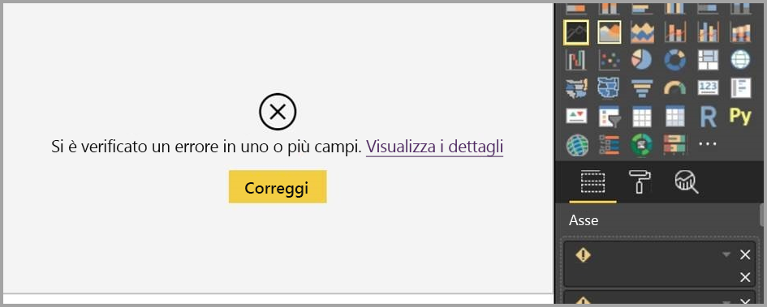

# Utilizzo di Visualizzazione report in Power BI Desktop

Se si usa già Power BI, si saprà già quanto sia facile creare report che offrono prospettive dinamiche e informazioni dettagliate sui dati. Power BI include però funzionalità più avanzate in Power BI Desktop. Power BI Desktop consente di creare query avanzate, combinare dati di più origini, creare relazioni tra tabelle e altro ancora.

Power BI Desktop include una *visualizzazione report*, in cui è possibile creare un numero qualsiasi di pagine di report con visualizzazioni. La visualizzazione report in Power BI Desktop offre un'esperienza di progettazione simile a quella della visualizzazione di modifica del report nel *servizio Power BI*, consentendo di spostare le visualizzazioni, nonché di copiare e incollare, unire e così via.

La differenza tra le due visualizzazioni è che quando si usa Power BI Desktop è possibile lavorare con le query e modellare i dati, per ottenere, con i dati, informazioni dettagliate di migliore qualità nei report. Il file di Power BI Desktop può quindi essere salvato in qualsiasi posizione dell'unità locale o del cloud.

## Operazioni di base

Quando si caricano i dati in Power BI Desktop per la prima volta, la visualizzazione report contiene un'area di disegno vuota.

Per spostarsi tra le visualizzazioni **Report**, **Dati** e **Relazioni** selezionare le icone nella barra di spostamento a sinistra:

Dopo avere aggiunto alcuni dati, è possibile aggiungere campi a una nuova visualizzazione nell'area di disegno.

Per modificare il tipo di visualizzazione, è possibile selezionarlo nell'area di disegno e quindi selezionare un nuovo tipo in **Visualizzazioni**.

> [!TIP]
> Esaminare i vari tipi di visualizzazione disponibili. È infatti importante che la visualizzazione scelta consenta di trasmettere chiaramente le informazioni presenti nei dati.

Un report includerà almeno una pagina vuota per iniziare. Le pagine vengono visualizzate nel pannello di navigazione a sinistra dell'area di disegno. È possibile aggiungere a una pagina tutti i tipi di visualizzazione: l'importante è non esagerare. Un numero eccessivo di visualizzazioni in un'unica pagina rende infatti quest'ultima poco chiara e impedisce l'individuazione delle informazioni corrette. È possibile aggiungere nuove pagine al report. Fare clic su **Nuova pagina** nella barra multifunzione.

Per eliminare una pagina, fare clic sulla **X** nella scheda della pagina nella parte inferiore della visualizzazione report.

> [!NOTE]
> Non è possibile aggiungere report e visualizzazioni in un dashboard da Power BI Desktop. A tale scopo, è necessario pubblicare nel sito di Power BI. Per altre informazioni, vedere [Pubblicare set di dati e report da Power BI Desktop](desktop-upload-desktop-files.md).

## Copiare e incollare tra i report

È facilmente possibile prendere un oggetto visivo da un report di Power BI Desktop e incollarlo in un altro report. Usare semplicemente la scelta rapida da tastiera CTRL+C per copiare l'oggetto visivo del report. Nell'altro report di Power BI Desktop usare CTRL+V per incollare l'oggetto visivo. È possibile selezionare un singolo oggetto visivo alla volta oppure tutti gli oggetti visivi in una pagina per copiarli e quindi incollarli nel report di Power BI Desktop di destinazione.

La possibilità di copiare e incollare gli oggetti visivi è utile per chi compila e aggiorna frequentemente più report. Quando si esegue la copia tra file, le impostazioni e la formattazione impostate in modo esplicito nel riquadro di formattazione verranno riportate, mentre gli oggetti visivi basati su un tema o sulle impostazioni predefinite vengono aggiornati automaticamente in modo che corrispondano al tema del report di destinazione. Pertanto, quando si crea un oggetto visivo con la formattazione e l'aspetto desiderati, è possibile copiarlo e incollarlo in nuovi report e conservare la formattazione valida.

Se i campi nel modello sono diversi, verranno visualizzati un errore relativo all'oggetto visivo e un avviso sui campi inesistenti. L'errore è simile all'esperienza visualizzata quando si elimina un campo nel modello usato da un oggetto visivo.

Per correggere l'errore, è sufficiente sostituire i campi interrotti con i campi che si vuole usare dal modello nel report in cui è stato incollato l'oggetto visivo. Se si usa un oggetto visivo personalizzato, è anche necessario importare tale oggetto visivo personalizzato nel report di destinazione.

## Nascondere pagine dei report

Quando si crea un report, è anche possibile nascondere pagine. Questo approccio può essere utile se è necessario creare i dati o gli oggetti visivi sottostanti per un report, ma non si vuole che queste pagine siano visibili per altri utenti, ad esempio quando si creano tabelle oppure oggetti visivi di supporto che vengono usati in altre pagine del report. Esistono molti altri motivi creativi per cui può essere necessario creare una pagina di report per poi nasconderla nel report da pubblicare.

È facile nascondere una pagina di un report. È sufficiente fare clic con il pulsante destro del mouse sulla scheda della pagina del report e scegliere **Nascondi** dal menu visualizzato.

Esistono alcune considerazioni da tenere presenti quando si nasconde una pagina di un report:

* È comunque possibile visualizzare un pagina di report nascosta in Power BI Desktop, anche se il titolo della pagina è in grigio. Nella figura seguente, la pagina 4 è nascosta.

    

* *Non* è possibile visualizzare una pagina del report nascosta quando il report viene aperto nel servizio Power BI.

* Nascondere una pagina di un report *non* è una misura di sicurezza. La pagina rimane comunque accessibile per gli utenti e il relativo contenuto è ancora accessibile tramite drill-through e altri metodi.

* Quando una pagina è nascosta, in modalità di visualizzazione non viene visualizzata alcuna freccia di navigazione.
