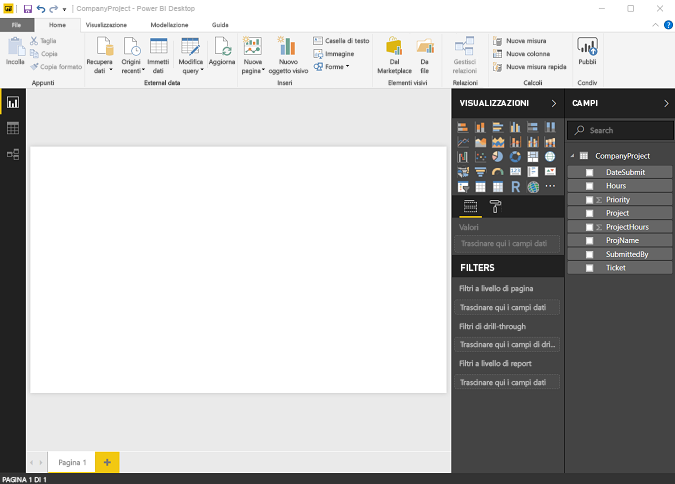
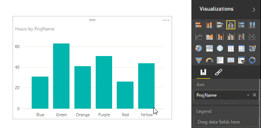
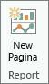
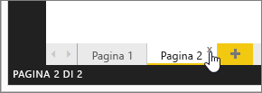
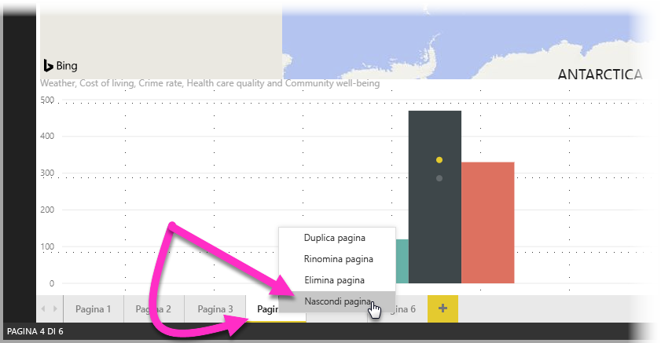
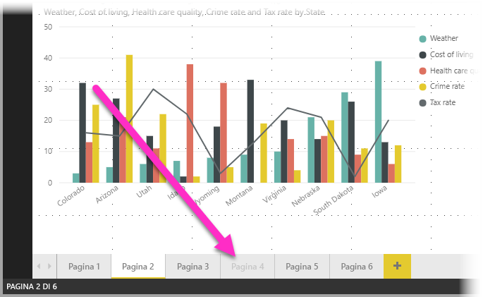

# Visualizzazione report in Power BI Desktop
Se si usa già Power BI, si saprà già quanto sia facile creare report che offrono prospettive dinamiche e informazioni dettagliate sui dati. Power BI include però funzionalità più avanzate in Power BI Desktop. Grazie a Power BI Desktop è infatti possibile creare query avanzate, combinare dati di più origini, creare relazioni tra tabelle e altro ancora.

Power BI Desktop include **Visualizzazione report**, in cui è possibile creare un numero qualsiasi di pagine di report con visualizzazioni. e che offre un'esperienza di progettazione analoga a quella della Visualizzazione di modifica di un report nel servizio Power BI, consentendo di spostare le visualizzazioni, nonché di copiare e incollare, unire e così via.

La differenza tra le due visualizzazioni è che quando si usa Power BI Desktop è possibile lavorare con le query e modellare i dati, per ottenere, con i dati, informazioni dettagliate di migliore qualità nei report. Il file di Power BI Desktop può quindi essere salvato in qualsiasi posizione dell'unità locale o del cloud.

## Operazioni di base
Quando si caricano i dati in Power BI Desktop per la prima volta, **Visualizzazione report** contiene un'area di disegno vuota.

Per spostarsi tra **Visualizzazione report**, **Visualizzazione dati** e **Visualizzazione relazioni** selezionare le icone nella barra di spostamento a sinistra:

Dopo avere aggiunto alcuni dati, è possibile aggiungere campi a una nuova visualizzazione nell'area di disegno.

Per cambiare il tipo di visualizzazione, selezionarlo nel gruppo **Visualizzazioni** della barra multifunzione oppure fare clic con il pulsante destro del mouse e scegliere un tipo diverso tramite l'icona **Cambia tipo di visualizzazione**.

> [!TIP]
> Esaminare i vari tipi di visualizzazione disponibili. È infatti importante che la visualizzazione scelta consenta di trasmettere chiaramente le informazioni presenti nei dati.
> 
> 

Un report includerà almeno una pagina vuota per iniziare. Le pagine vengono visualizzate nel pannello di navigazione a sinistra dell'area di disegno. È possibile aggiungere a una pagina tutti i tipi di visualizzazione: l'importante è non esagerare. Un numero eccessivo di visualizzazioni in un'unica pagina può infatti rendere quest'ultima poco chiara e impedire l'individuazione delle informazioni corrette. È possibile aggiungere nuove pagine al report. Fare clic su **Nuova pagina** nella barra multifunzione.

Per eliminare una pagina, fare clic sulla **X** nella scheda della pagina nella parte inferiore della Visualizzazione report.

> [!NOTE]
> Non è possibile aggiungere report e visualizzazioni in un dashboard da Power BI Desktop. A tale scopo, è necessario [pubblicare da Power BI Desktop](desktop-upload-desktop-files.md) nel sito di Power BI.

## Nascondere pagine dei report

Quando si crea un report, è anche possibile nascondere pagine. Ciò può essere utile se è necessario creare i dati o gli oggetti visivi sottostanti per un report, ma non si vuole che queste pagine siano visibili per altri utenti, ad esempio quando si creano tabelle oppure oggetti visivi di supporto che vengono usati in altre pagine del report. Esistono molti altri motivi creativi per cui può essere necessario creare una pagina di report per poi nasconderla nel report da pubblicare. 

È facile nascondere una pagina di un report. È sufficiente fare clic con il pulsante destro del mouse sulla scheda della pagina del report e scegliere **Nascondi** dal menu visualizzato.

Esistono alcune considerazioni da tenere presenti quando si nasconde una pagina di un report:

* È comunque possibile visualizzare un pagina di report nascosta in **Power BI Desktop**, anche se il titolo della pagina è in grigio. Nella figura seguente, la pagina 4 è nascosta.

    

* *Non* è possibile visualizzare una pagina del report nascosta, quando il report viene aperto nel **servizio Power BI**.

* Nascondere una pagina di un report *non* è una misura di sicurezza. La pagina rimane comunque accessibile per gli utenti e il relativo contenuto è ancora accessibile tramite drill-through e altri metodi.

* Quando una pagina è nascosta, in modalità di visualizzazione non viene visualizzata alcuna freccia di navigazione.

