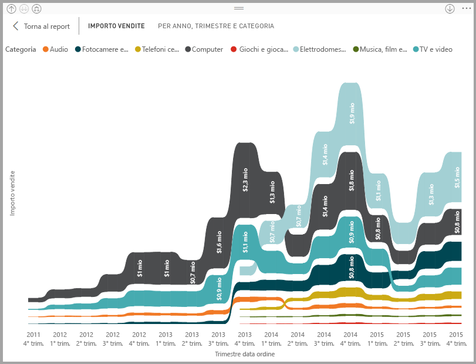
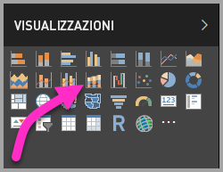
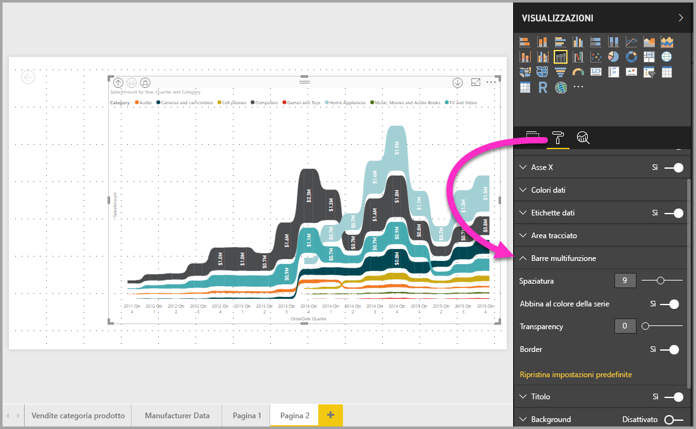

# Usare grafici a nastri in Power BI
È possibile usare grafici a nastri in **Power BI** per visualizzare i dati e determinare rapidamente la categoria di dati di livello massimo (valore più elevato). I grafici a nastri rappresentano una valida opzione nella visualizzazione delle variazioni di posizione, con il valore massimo visualizzato sempre in cima per ogni periodo di tempo. I grafici a nastri sono disponibili in **Power BI Desktop** a partire dalla versione di settembre 2017 e negli aggiornamenti successivi del **servizio Power BI**.

## Creare un grafico a nastri
Per creare un grafico a nastri, selezionare **Grafico a nastri** nel riquadro **Visualizzazioni**.

I grafici a nastro collegano una categoria di dati in relazione al periodo di tempo visualizzato tramite nastri, consentendo di osservare la posizione di una categoria lungo l'asse X del grafico, che in genere rappresenta la sequenza temporale.

## Formattare un grafico a nastri
Quando si crea un grafico a nastri, la sezione **Formato** del riquadro **Visualizzazioni** mette a disposizione opzioni di formattazione. Le opzioni di formattazione per i grafici a nastri sono simili a quelle di un istogramma in pila, con opzioni aggiuntive specifiche per i grafici a nastri.

Queste opzioni di formattazione per i grafici a nastri consentono di modificare gli elementi seguenti:

* **Spaziatura** consente di definire lo spazio tra i nastri. Il numero è la percentuale dell'altezza massima della colonna.
* **Abbina al colore della serie** consente abbinare il colore dei nastri al colore della serie. Se l'opzione è disattivata, i nastri vengono visualizzati in grigio.
* **Trasparenza** consente di specificare la trasparenza dei nastri, con il valore predefinito impostato su 30.
* **Bordo** consente di applicare un bordo scuro sulla parte superiore e inferiore dei nastri. Per impostazione predefinita, i bordi sono disattivati.

## Passaggi successivi
Per altre informazioni su **Power BI Desktop** e su come iniziare, vedere gli articoli seguenti.

* [Introduzione a Power BI Desktop](desktop-getting-started.md)
* [Panoramica delle query con Power BI Desktop](desktop-query-overview.md)
* [Origini dati in Power BI Desktop](desktop-data-sources.md)
* [Connettersi ai dati in Power BI Desktop](desktop-connect-to-data.md)
* [Effettuare il data shaping e combinare i dati con Power BI Desktop](desktop-shape-and-combine-data.md)
* [Attività di query comuni in Power BI Desktop](desktop-common-query-tasks.md)   

