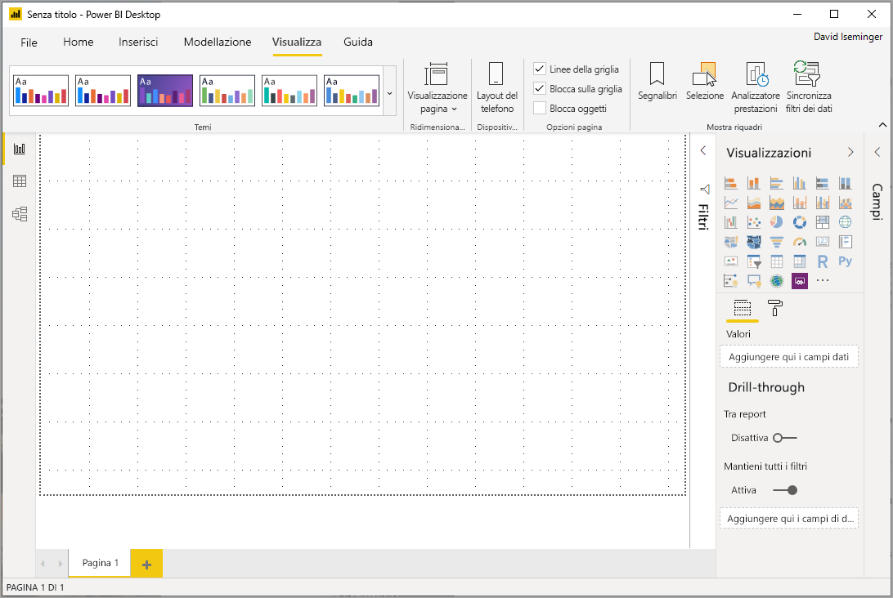
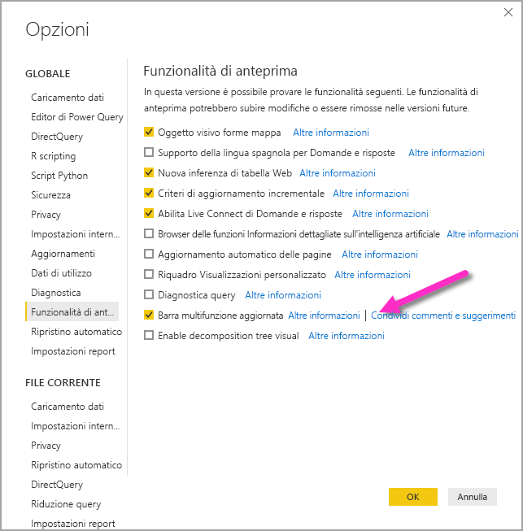
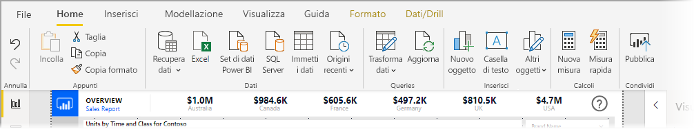
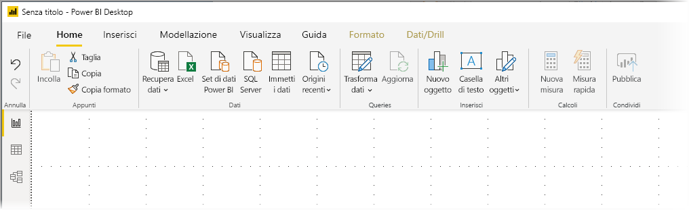
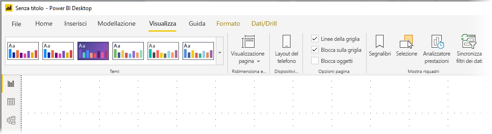
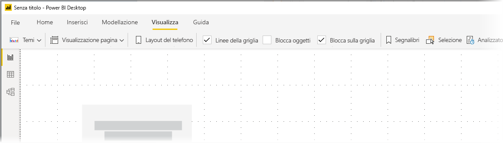

# Usare la barra multifunzione aggiornata in Power BI Desktop

A partire dall'aggiornamento di marzo 2020, Power BI Desktop sta rivedendo la barra multifunzione per allinearne meglio l'aspetto e l'esperienza con altri prodotti Microsoft, ad esempio Microsoft Office. La barra multifunzione aggiornata è stata introdotta con gli aggiornamenti mensili a partire da novembre 2019 come funzionalità di anteprima e, a partire dall'aggiornamento di marzo 2020, la nuova barra multifunzione è l'esperienza predefinita.

## Come abilitare la barra multifunzione aggiornata

A partire dall'aggiornamento di marzo 2020, la barra multifunzione aggiornata è attiva per impostazione predefinita. Per le versioni di Power BI Desktop precedenti (a partire dall'aggiornamento di novembre 2019), la barra multifunzione aggiornata in Power BI era una funzionalità di anteprima e doveva essere abilitata. Per abilitarla in questi aggiornamenti precedenti, selezionare **File > Opzioni e impostazioni > Opzioni** e quindi selezionare **Funzionalità di anteprima** dalla colonna a sinistra. Nel riquadro a destra è disponibile la selezione **Barra multifunzione aggiornata**. Selezionare la casella accanto a **Barra multifunzione aggiornata** per abilitare la funzionalità di anteprima. Per rendere effettiva la modifica relativa alla funzionalità di anteprima è necessario riavviare Power BI Desktop.

> [!NOTE]
> Per le versioni di Power BI Desktop a partire da marzo 2020 non è necessario abilitare la barra multifunzione aggiornata, perché a partire da tale data la nuova barra multifunzione è l'esperienza predefinita.

## Funzionalità della nuova barra multifunzione

Con l'aggiornamento della barra multifunzione si intende offrire i vantaggi di un'esperienza facile e familiare in Power BI Desktop, così come in altri prodotti Microsoft. 

È possibile raggruppare questi vantaggi nelle categorie seguenti:

* **Aspetto e organizzazione migliorati**: icone e funzionalità nella barra multifunzione aggiornata di Power BI Desktop sono allineate all'aspetto e all'organizzazione degli elementi della barra multifunzione disponibili nelle applicazioni di Office.

    

* **Raccolta temi intuitiva**: la raccolta temi, disponibile nella barra multifunzione **Visualizza**, ha l'aspetto familiare della raccolta temi di PowerPoint. Le immagini nella barra multifunzione visualizzano infatti l'aspetto delle modifiche al tema se applicate al report, ad esempio le combinazioni di colori e i tipi di carattere. 

    

* **Contenuto della barra multifunzione dinamico in base alla visualizzazione**: nella barra multifunzione esistente per Power BI Desktop le icone o i comandi non disponibili sono semplicemente disattivati, creando un'esperienza tutt'altro che ottimale. Con la barra multifunzione aggiornata, le icone vengono visualizzate e disposte in modo dinamico rendendo immediatamente visibili le opzioni disponibili nel contesto.

* **Barra multifunzione su una riga che, se compressa, consente di risparmiare spazio**: un altro vantaggio della barra multifunzione aggiornata è la possibilità di comprimerla su una riga, visualizzando dinamicamente gli elementi della barra multifunzione in base al contesto. 

    

* **Suggerimenti per spostarsi e selezionare i pulsanti**: per spostarsi nella barra multifunzione, è possibile premere **ALT+tasto Windows** per attivare i suggerimenti per i tasti di scelta. Dopo aver attivato i suggerimenti, per spostarsi è possibile premere sulla tastiera i tasti visualizzati.

    

* **Stringhe di formato personalizzate**: queste stringhe possono essere impostate nel riquadro *Proprietà* ma anche nella barra multifunzione. Selezionare la misura o la colonna che si vuole personalizzare. A seconda della selezione verrà visualizzata una scheda contestuale **Strumenti misura** o **Strumenti colonna**. Nella sezione della scheda relativa alla formattazione è possibile digitare la stringa di formato personalizzata direttamente nella casella a discesa.

    

* **Accessibilità**: la barra del titolo, la barra multifunzione e il menu File sono completamente accessibili. Premere CTRL+F6 per passare alla sezione della barra multifunzione. A questo punto, è possibile usare il tasto **TAB** per spostarsi tra la barra superiore e quella inferiore e usare i tasti di direzione per spostarsi tra gli elementi.

Oltre a queste modifiche visibili, una barra multifunzione aggiornata consente anche di apportare aggiornamenti futuri a Power BI Desktop e alla relativa barra multifunzione, quali ad esempio:

* Creazione di controlli più flessibili e intuitivi nella barra multifunzione, ad esempio la raccolta di oggetti visivi
* Aggiunta dei temi di Office *nero* e *grigio scuro* a Power BI Desktop
* Miglioramento dell'accessibilità

## Passaggi successivi
È possibile connettersi a molti tipi di dati usando Power BI Desktop. Per altre informazioni sulle origini dati, vedere le risorse seguenti:

* [Che cos'è Power BI Desktop?](desktop-what-is-desktop.md)
* [Origini dati in Power BI Desktop](desktop-data-sources.md)
* [Effettuare il data shaping e combinare i dati con Power BI Desktop](desktop-shape-and-combine-data.md)
* [Connettersi a cartelle di lavoro di Excel in Power BI Desktop](desktop-connect-excel.md)   
* [Immettere dati direttamente in Power BI Desktop](desktop-enter-data-directly-into-desktop.md)   

