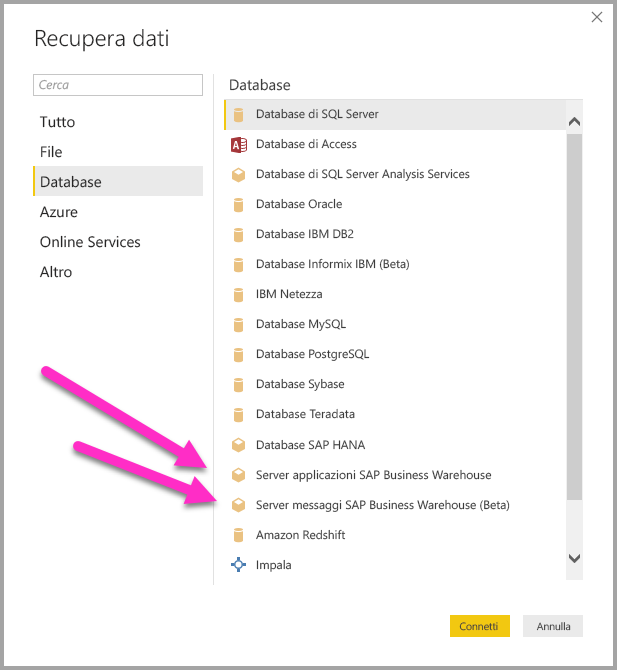
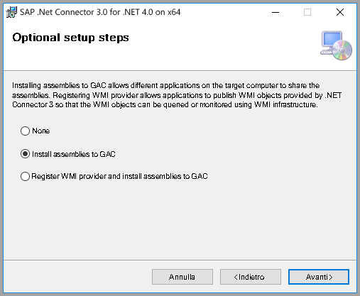
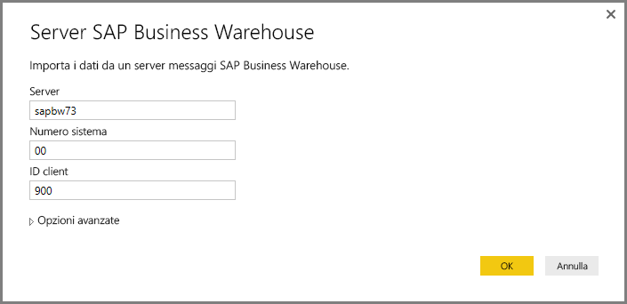
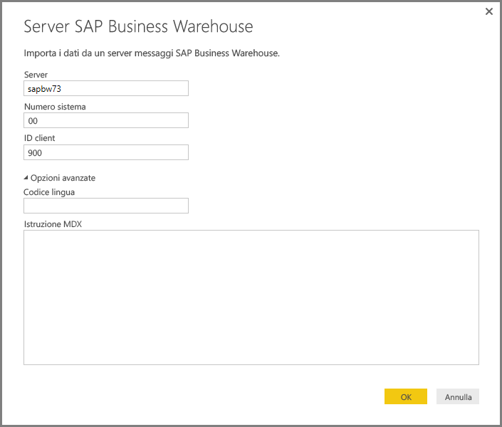
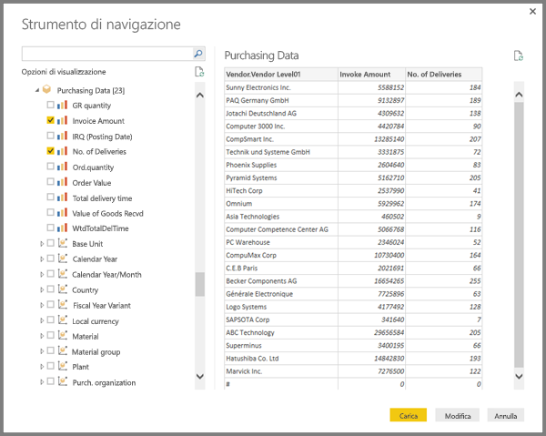
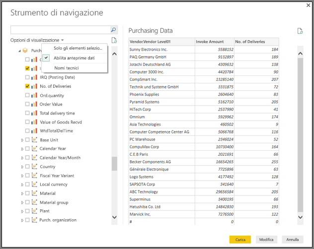
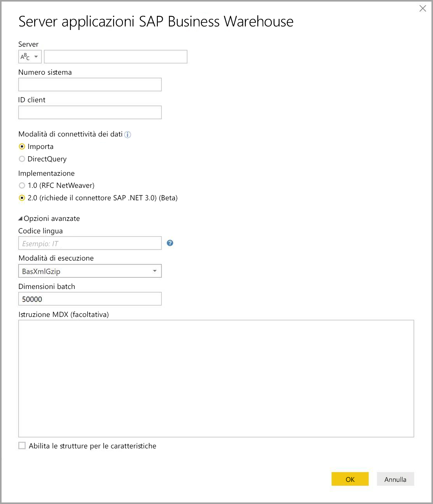
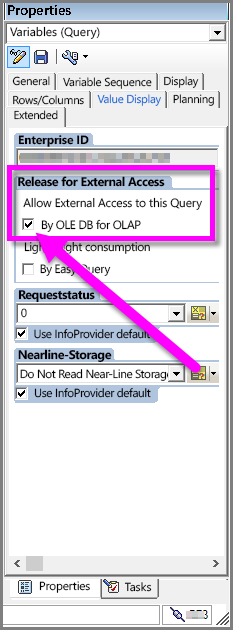

# Usare SAP BW Connector in Power BI Desktop
Con Power BI Desktop è possibile accedere ai dati **SAP BusinessWarehouse (BW)** .

Per informazioni su come i clienti SAP possono trarre vantaggio dal collegamento di Power BI ai propri sistemi SAP Business Warehouse (BW) esistenti, vedere il [white paper su Power BI e SAP BW](https://aka.ms/powerbiandsapbw). Per informazioni dettagliate sull'uso di DirectQuery con SAP BW, vedere l'articolo [DirectQuery e SAP Business Warehouse (BW)](desktop-directquery-sap-bw.md).

A partire dalla versione di giugno 2018 di **Power BI Desktop** (e con disponibilità a livello generale a partire dalla versione di ottobre 2018) è possibile usare SAP BW Connector con un'implementazione dotata di importanti miglioramenti di prestazioni e funzionalità. Questa versione aggiornata di SAP BW Connector è stata sviluppata da Microsoft ed è denominata **Implementazione 2.0**. È possibile selezionare la versione 1 (v1) di **Connector per SAP BW**  o l'**implementazione 2.0 di Connector per SAP**. Le sezioni seguenti illustrano l'installazione delle diverse versioni. È possibile scegliere uno dei due connettori al momento della connessione a SAP BW da Power BI Desktop.

Quando possibile, è consigliabile usare l'**implementazione 2.0 di SAP Connector**.

## Installazione della versione 1 di Connector per SAP BW
Quando possibile, è consigliabile usare l'implementazione 2.0 di SAP Connector (vedere le istruzioni nella sezione seguente). Questa sezione descrive l'installazione della versione 1 di **Connector per SAP BW** con la procedura seguente:

1. Installare la libreria **SAP NetWeaver** nel computer locale. È possibile ottenere la libreria **SAP Netweaver** dall'amministratore di SAP o direttamente da [SAP Software Download Center](https://support.sap.com/swdc). Dal momento che **SAP Software Download Center** cambia struttura di frequente, non sono disponibili indicazioni più specifiche per la navigazione. La libreria **SAP NetWeaver** solitamente è inclusa anche nell'installazione di Strumenti client SAP.
   
   Si potrebbe cercare la *nota SAP 1025361* per ottenere il percorso di download per la versione più recente. Assicurarsi che l'architettura per la libreria **SAP NetWeaver** (a 32 o 64 bit) corrisponda all'installazione di **Power BI Desktop**, quindi installare tutti i file inclusi in **SAP NetWeaver RFC SDK** secondo la nota SAP.
2. La finestra di dialogo **Recupera dati** include voci **Server applicazioni SAP Business Warehouse** e **Server messaggi SAP Business Warehouse** nella categoria **Database**.
   
   

## Installazione dell' implementazione 2.0 di SAP Connector

L'**implementazione 2.0** di SAP Connector richiede SAP .NET Connector 3.0. È possibile [scaricare SAP .NET Connector 3.0](https://support.sap.com/en/product/connectors/msnet.html) dal sito Web SAP usando il collegamento seguente:

* [SAP .NET Connector 3.0](https://support.sap.com/en/product/connectors/msnet.html)

Per l'accesso al download è necessario avere un ID utente SAP valido. I clienti sono invitati a contattare il team SAP Basis per ottenere SAP .NET Connector 3.0. 

Il connettore è disponibile in versioni a 32 bit e a 64 bit e gli utenti *devono* scegliere la versione che corrisponde alla versione di Power BI Desktop installata. Al momento della stesura di questo documento il sito Web include due versioni (per .NET 4.0 Framework):

* SAP Connector per Microsoft .NET 3.0.20.0 per Windows a 32 bit (x86) come file con estensione zip (6.896 KB), 16 gennaio 2018
* SAP Connector per Microsoft .NET 3.0.20.0 per Windows a 64 bit (x64) come file con estensione zip (7180 KB), 16 gennaio 2018

Durante l'installazione, nella finestra **Optional setup steps** (Operazioni di installazione aggiuntive) selezionare l'opzione *Install assemblies to GAC* (Installa assembly in GAC) come illustrato nella figura seguente.

> [!NOTE]
> La prima versione dell'implementazione di SAP BW richiede le DLL Netweaver. Se si usa l'implementazione 2.0 di Connector per SAP anziché la prima versione, le DLL Netweaver non sono necessarie.

## Funzionalità della versione 1 di Connector per SAP BW
La versione 1 di **Connector per SAP BW** in Power BI Desktop consente di importare dati dai cubi **Server SAP Business Warehouse** o di usare DirectQuery. 

Per altre informazioni su **SAP BW Connector** e su come usarlo con DirectQuery, vedere l'articolo [DirectQuery e SAP Business Warehouse (BW)](desktop-directquery-sap-bw.md).

Per stabilire la connessione è necessario specificare valori per *Server*, *Numero sistema* e *ID client*.

È anche possibile specificare altre due **Opzioni avanzate**: Codice lingua e un'istruzione MDX personalizzata da eseguire nel server specificato.

Se non è stata specificata alcuna istruzione MDX, viene visualizzata la finestra **Strumento di navigazione** che visualizza l'elenco dei cubi disponibili nel server e offre la possibilità di eseguire il drill-down e di selezionare gli elementi dai cubi disponibili, tra cui dimensioni e misure. Power BI espone le query e i cubi esposti dai [BAPI OLAP dell'interfaccia di analisi aperta BW](https://help.sap.com/saphelp_nw70/helpdata/en/d9/ed8c3c59021315e10000000a114084/content.htm).

Quando si seleziona uno o più elementi dal server, viene creata un'anteprima della tabella di output in base alla loro selezione.

La finestra **Strumento di navigazione** offre anche alcune **Opzioni di visualizzazione** che consentono di eseguire le operazioni seguenti:

* **Visualizzare *Solo gli elementi selezionati* anziché *Tutti gli elementi* (visualizzazione predefinita):** questa opzione è utile per verificare il set finale degli elementi selezionati. Un approccio alternativo a questa modalità di visualizzazione consiste nel selezionare i *Nomi colonne* nell'area *Anteprima*.
* **Abilita anteprime dati (comportamento predefinito):** è possibile controllare anche se visualizzare le anteprime dei dati in questa finestra di dialogo. La disabilitazione delle anteprime dei dati riduce la quantità di chiamate al server, perché non richiede dati per le anteprime.
* **Nomi tecnici:** SAP BW supporta il concetto di *nomi tecnici* per gli oggetti all'interno di un cubo. I nomi tecnici consentono al proprietario di un cubo di esporre nomi *descrittivi* per gli oggetti cubo, anziché esporre solo i *nomi fisici* per tali oggetti nel cubo.

Dopo aver selezionato tutti gli oggetti necessari nella finestra **Strumento di navigazione**, è possibile decidere cosa fare successivamente, selezionando uno dei pulsanti seguenti nella parte inferiore della **finestra**:

* Se si seleziona **Carica** verrà attivato il caricamento dell'intero set di righe per la tabella di output nel modello di dati di Power BI Desktop, quindi viene visualizzata la vista **Report**, in cui è possibile iniziare a visualizzare i dati o ad apportare ulteriori modifiche usando le viste **Dati** o **Relazioni**.
* Se si seleziona **Modifica** viene visualizzato l'**Editor di query**, in cui è possibile eseguire passaggi aggiuntivi di trasformazione e filtro dei dati prima di importare l'intero set di righe nel modello di dati di Power BI Desktop.

Oltre a importare dati dai cubi **SAP BW**, tenere presente che è anche possibile importare dati da un'ampia gamma di altre origini dati in Power BI Desktop, che quindi è possibile combinare in un singolo report. Questa operazione presenta ogni tipo di scenario interessante per i report e l'analisi oltre ai dati **SAP BW**.

## Uso dell'implementazione 2.0 di SAP BW Connector

Per usare l'implementazione 2.0 di SAP BW Connector è necessario creare una nuova connessione. Per creare una nuova connessione seguire questa procedura.

1. Nella finestra **Dati** selezionare **Server applicazioni SAP Business Warehouse** o **Server messaggi SAP Business Warehouse**.

2. Viene visualizzata la finestra di dialogo della nuova connessione, che consente di selezionare l'implementazione. Se si seleziona **Implementazione > 2.0** come illustrato nella figura seguente, vengono abilitate le opzioni Modalità di esecuzione, Dimensioni batch e Abilita le strutture per le caratteristiche.

    

3. Selezionare **OK**. Da questo punto in poi il funzionamento della finestra **Strumento di navigazione** è identico a quello descritto nella sezione precedente per la versione 1 di Connector per SAP BW. 

### Nuove opzioni per l'implementazione 2.0 

L'implementazione 2.0 supporta le seguenti opzioni:

1. **ExecutionMode**: specifica l'interfaccia MDX usata per eseguire query nel server. I valori validi sono i seguenti:

        a. SapBusinessWarehouseExecutionMode.BasXml
        b. SapBusinessWarehouseExecutionMode.BasXmlGzip
        c. SapBusinessWarehouseExecutionMode.DataStream

    Il valore predefinito per questa opzione è SapBusinessWarehouseExecutionMode.BasXmlGzip.

    L'uso di *SapBusinessWarehouseExecutionMode.BasXmlGzip* può migliorare le prestazioni quando si verifica una latenza elevata per set di dati di grandi dimensioni.

2. **BatchSize**: specifica il numero massimo di righe recuperate in una singola operazione quando si esegue un'istruzione MDX. Un numero di righe ridotto implica un numero maggiore di chiamate al server durante il recupero di un set di dati di grandi dimensioni. Un numero di righe elevato può migliorare le prestazioni, ma può anche causare problemi di memoria nel server SAP BW. Il valore predefinito è 50000 righe.

3. **EnableStructures**: valore logico che indica se le strutture di caratteristiche vengono riconosciute. Il valore predefinito di questa opzione è false. L'opzione ha effetto sull'elenco degli oggetti disponibili per la selezione. Non è supportata in modalità Query nativa.

L'opzione **ScaleMeasures** è stata deprecata in questa implementazione. Il comportamento è ora uguale all'impostazione *ScaleMeasures = false*, ovvero vengono visualizzati sempre valori non in scala.

### Altri miglioramenti per l'implementazione 2.0 

L'elenco seguente descrive alcuni miglioramenti aggiuntivi inclusi nella nuova implementazione:

* Miglioramento delle prestazioni
* Possibilità di recuperare vari milioni di righe di dati e ottimizzazione tramite il parametro delle dimensioni batch.
* Possibilità di cambiare la modalità di esecuzione.
* Supporto della modalità compressa. Particolarmente vantaggioso per le connessioni con latenza elevata o set di dati di grandi dimensioni.
* Rilevamento migliorato delle variabili di data
* [Sperimentale] Visualizzazione di valori Data (tipo ABAP DATS) e Ora (tipo ABAP TIMS) come date e ore, anziché come valori di testo.
* Gestione delle eccezioni migliorata. Gli errori che si verificano nelle chiamate BAPI vengono ora rilevati.
* Riduzione delle colonne nelle modalità BasXml e BasXmlGzip. Se ad esempio la query MDX generata recupera 40 colonne ma la selezione corrente ne richiede solo 10, questa richiesta viene passata al server per il recupero di un set di dati più piccolo.

### Modifica dei report esistenti per l'uso dell'implementazione 2.0 

La modifica dei report esistenti per l'uso dell'**implementazione 2.0** è possibile solo in modalità importazione e richiede la seguente procedura manuale.

1. Aprire un report esistente, selezionare **Modifica query** nella barra multifunzione e quindi selezionare la query di SAP Business Warehouse che si vuole aggiornare.

2. Fare clic con il pulsante destro del mouse sulla query e selezionare **Editor avanzato**.

3. Nell'**Editor avanzato** modificare la chiamata SapBusinessWarehouse.Cubes come segue: 

    a. Determinare se la query contiene già un record di opzione, come quello visualizzato nell'esempio seguente:

    

    b. Se sì, aggiungere l'opzione Implementation 2.0 e rimuovere l'opzione ScaleMeasures (se presente), come indicato:

    

    c. Se la query non include un record opzioni, aggiungere il record. Se ad esempio include i seguenti elementi:

    

    d. Modificarla nel modo seguente:

    

4. La compatibilità tra l'implementazione 2.0 di Connector per SAP BW e la versione 1 di Connector per SAP BW è stata elaborata con il massimo impegno. Tuttavia possono essere presenti alcune differenze, originate dalle diverse modalità di esecuzione MDX usate in SAP BW. Per risolvere eventuali discrepanze, provare ad alternare tra le diverse modalità di esecuzione.

## Risoluzione dei problemi
Questa sezione include situazioni (e soluzioni) di risoluzione dei problemi per l'uso di questa versione di anteprima di **SAP BW** Connector.

1. I dati numerici da **SAP BW** restituiscono decimali anziché virgole. Ad esempio, 1,000,000 viene restituito come 1.000.000.
   
   **SAP BW** restituisce dati decimali con una *,* (virgola) o un *.* (punto) come separatore decimale. Per specificare quali di questi **SAP BW** dovrebbe usare come separatore decimale, il driver usato da **Power BI Desktop** effettua una chiamata a *BAPI_USER_GET_DETAIL*. Questa chiamata restituisce una struttura denominata **DEFAULTS**, con un campo denominato *DCPFM* che archivia *Decimal Format Notation* (Notazione in formato decimale). È necessario uno dei tre valori seguenti:
   
       ‘ ‘ (space) = Decimal point is comma: N.NNN,NN
       'X' = Decimal point is period: N,NNN.NN
       'Y' = Decimal point is N NNN NNN,NN
   
   I clienti che hanno segnalato questo problema hanno riscontrato che la chiamata a *BAPI_USER_GET_DETAIL* non riesce per un determinato utente (quello per cui sono visualizzati i dati non corretti), con un messaggio di errore simile al seguente:
   
       You are not authorized to display users in group TI:
           <item>
               <TYPE>E</TYPE>
               <ID>01</ID>
               <NUMBER>512</NUMBER>
               <MESSAGE>You are not authorized to display users in group TI</MESSAGE>
               <LOG_NO/>
               <LOG_MSG_NO>000000</LOG_MSG_NO>
               <MESSAGE_V1>TI</MESSAGE_V1>
               <MESSAGE_V2/>
               <MESSAGE_V3/>
               <MESSAGE_V4/>
               <PARAMETER/>
               <ROW>0</ROW>
               <FIELD>BNAME</FIELD>
               <SYSTEM>CLNTPW1400</SYSTEM>
           </item>
   
   Per risolvere questo errore, gli utenti devono chiedere all'amministratore SAP di concedere all'utente SAPBW usato in Power BI il diritto di eseguire *BAPI_USER_GET_DETAIL*. Vale anche la pena verificare che l'utente abbia il valore *DCPFM* richiesto, come descritto in precedenza in questa soluzione.
   
2. **Connettività per le query BEx SAP**
   
   È possibile eseguire query **BEx** in Power BI Desktop abilitando una proprietà specifica, come illustrato nella figura seguente:
   
   
   
3. La finestra **Strumento di navigazione** non visualizza un'anteprima dei dati e visualizza invece il messaggio di errore *Riferimento oggetto non impostato su un'istanza di un oggetto*.
   
   Gli utenti SAP devono accedere a moduli di funzione BAPI specifici per ottenere i metadati e recuperare dati da InfoProvider di SAP BW. Tra queste sono incluse:
   * BAPI_MDPROVIDER_GET_CATALOGS
   * BAPI_MDPROVIDER_GET_CUBES
   * BAPI_MDPROVIDER_GET_DIMENSIONS
   * BAPI_MDPROVIDER_GET_HIERARCHYS
   * BAPI_MDPROVIDER_GET_LEVELS
   * BAPI_MDPROVIDER_GET_MEASURES
   * BAPI_MDPROVIDER_GET_MEMBERS
   * BAPI_MDPROVIDER_GET_VARIABLES
   * BAPI_IOBJ_GETDETAIL

   Per risolvere questo problema, verificare che l'utente abbia accesso ai vari moduli *MDPROVIDER*, oltre a *BAPI_IOBJ_GETDETAIL*. Per procedere ulteriormente con la risoluzione di questo problema o di problemi simili, selezionare *Abilitare la traccia* nella finestra *Diagnostica* all'interno delle *Opzioni* di Power BI Desktop. Tentare il recupero dei dati da SAP BW mentre è attiva la traccia ed esaminare il file di traccia per altri dettagli.

## Supporto della connessione SAP BW

La tabella seguente illustra il supporto corrente per SAP BW.

|Product  |Modalità  |Autenticazione  |Connettore  |Libreria SNC  |Supportato  |
|---------|---------|---------|---------|---------|---------|
|Power BI Desktop     |Qualsiasi         | Utente/Password  | Server applicazioni | N/D  | Sì  |
|Power BI Desktop     |Qualsiasi         | Windows          | Server applicazioni | sapcrypto + gsskrb5/gx64krb5  | Sì  |
|Power BI Desktop     |Qualsiasi         | Windows tramite rappresentazione | Server applicazioni | sapcrypto + gsskrb5/gx64krb5  | Sì  |
|Power BI Desktop     |Qualsiasi         | Utente/Password        | Server messaggi | N/D  | Sì  |
|Power BI Desktop     |Qualsiasi         | Windows        | Server messaggi | sapcrypto + gsskrb5/gx64krb5  | Sì  |
|Power BI Desktop     |Qualsiasi         | Windows tramite rappresentazione | Server messaggi | sapcrypto + gsskrb5/gx64krb5  | Sì  |
|Power BI Gateway     |Importa      | La stessa di Power BI Desktop |         |   |   |
|Power BI Gateway     |DirectQuery | Utente/Password        | Server applicazioni | N/D  | Sì  |
|Power BI Gateway     |DirectQuery | Windows tramite rappresentazione (utente fisso, no SSO) | Server applicazioni | sapcrypto + gsskrb5/gx64krb5  | Sì  |
|Power BI Gateway     |DirectQuery | SSO tramite Kerberos per l'opzione query DirectQuery | Server applicazioni | *solo con* gsskrb5/gx64krb5   | Sì  |
|Power BI Gateway     |DirectQuery | Utente/Password        | Server messaggi | N/D  | Sì  |
|Power BI Gateway     |DirectQuery | Windows tramite rappresentazione (utente fisso, no SSO) | Server messaggi | sapcrypto + gsskrb5/gx64krb5  | Sì  |
|Power BI Gateway     |DirectQuery | SSO tramite Kerberos per l'opzione query DirectQuery | Server messaggi | sapcrypto + gsskrb5/gx64krb5  | No  |

## Passaggi successivi
Per altre informazioni su SAP e DirectQuery, vedere le risorse seguenti:

* [DirectQuery and SAP HANA](desktop-directquery-sap-hana.md) (DirectQuery e SAP HANA)
* [DirectQuery e SAP Business Warehouse (BW)](desktop-directquery-sap-bw.md)
* [DirectQuery in Power BI](desktop-directquery-about.md)
* [Data sources supported by DirectQuery](desktop-directquery-data-sources.md) (Origini dati supportate da DirectQuery)
* [White paper su Power BI e SAP BW](https://aka.ms/powerbiandsapbw)
