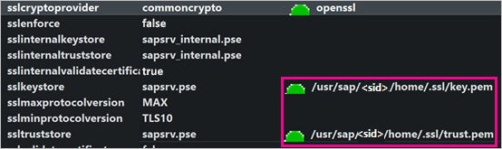
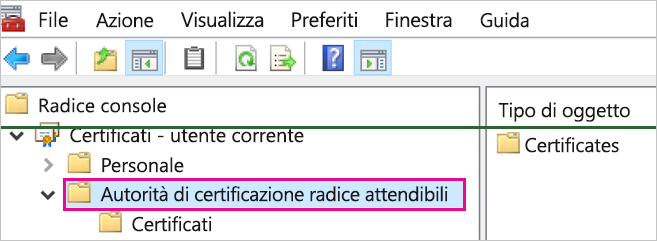
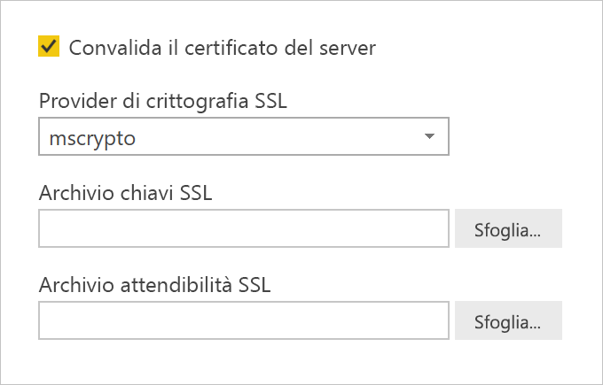
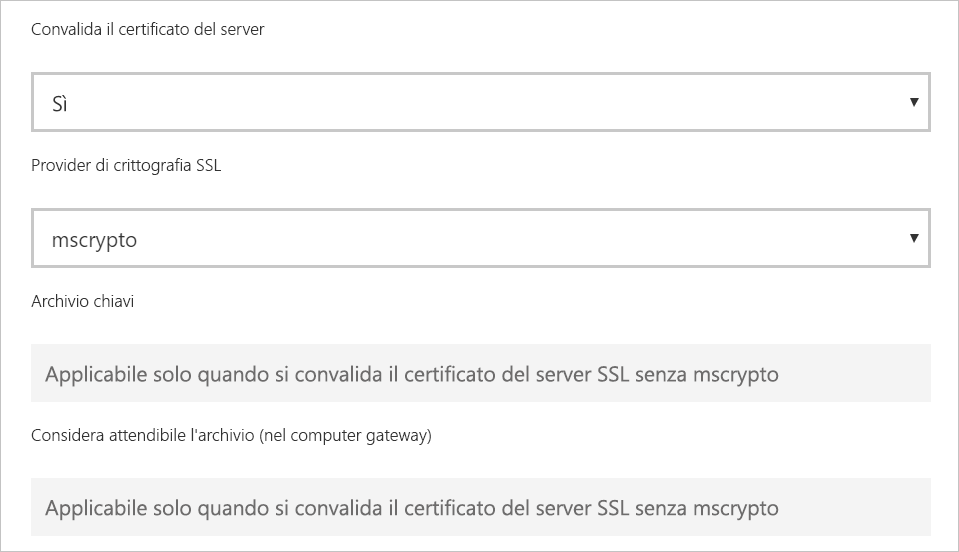

# <a name="enable-encryption-for-sap-hana"></a>Abilitare la crittografia per SAP HANA

È consigliabile crittografare le connessioni a un server SAP HANA da Power BI Desktop e dal servizio Power BI. È possibile abilitare la crittografia HANA usando sia OpenSSL che la libreria CommonCryptoLib (precedentemente nota come sapcrypto) proprietaria di SAP. SAP consiglia di usare CommonCryptoLib, ma le funzionalità di crittografia di base sono disponibili con entrambe le librerie.

Questo articolo fornisce una panoramica dell'abilitazione della crittografia con OpenSSL e fa riferimento ad alcune aree specifiche della documentazione SAP. Il contenuto e i collegamenti vengono aggiornati periodicamente, ma per istruzioni e supporto completi, vedere sempre la documentazione SAP ufficiale. Per configurare la crittografia usando CommonCryptoLib invece di OpenSSL, vedere [Come configurare TLS/SSL in SAP HANA 2.0](https://blogs.sap.com/2018/11/13/how-to-configure-tlsssl-in-sap-hana-2.0/). Per i passaggi per la migrazione da OpenSSL a CommonCryptoLib, vedere la [nota SAP 2093286](https://launchpad.support.sap.com/#/notes/2093286) (è necessario un account utente SAP).

> [!NOTE]
> La procedura di configurazione per la crittografia descritta in modo dettagliato in questo articolo si sovrappone ai passaggi di impostazione e configurazione per l'accesso SSO SAML. Sia che si scelga OpenSSL o CommonCryptoLib come provider di crittografia del server HANA, assicurarsi che la scelta sia coerente in tutte le configurazioni di crittografia e SAML.

L'abilitazione della crittografia per SAP HANA tramite OpenSSL prevede quattro fasi. Queste fasi sono descritte di seguito.  Per altre informazioni, vedere [Protezione delle comunicazioni tra SAP HANA Studio e SAP HANA Server tramite SSL](https://blogs.sap.com/2015/09/28/securing-the-communication-between-sap-hana-studio-and-sap-hana-server-through-ssl/).

## <a name="use-openssl"></a>Usare OpenSSL

Assicurarsi che il server HANA sia configurato per l'uso di OpenSSL come provider di crittografia. Sostituire le informazioni sul percorso mancanti con l'ID server (SID) del server HANA.



## <a name="create-a-certificate-signing-request"></a>Creare una richiesta di firma del certificato

Creare una richiesta di firma del certificato X509 per il server HANA.

1. Usando SSH, connettersi al computer Linux in cui viene eseguito il server HANA come \<sid\>adm.

1. Passare alla home directory _/__usr/sap/\<sid\>/home_.

1. Creare una directory nascosta con il nome _.__ssl_ se non ne esiste già una.

1. Eseguire il comando seguente:

    ```
    openssl req -newkey rsa:2048 -days 365 -sha256 -keyout Server\_Key.pem -out Server\_Req.pem -nodes
    ```

Questo comando crea una richiesta di firma del certificato e una chiave privata. Una volta firmato, il certificato è valido per un anno (vedere il parametro -days). Quando viene richiesto il nome comune (CN), immettere il nome di dominio completo (FQDN) del computer in cui è installato il server HANA.

## <a name="get-the-certificate-signed"></a>Ottenere il certificato firmato

Ottenere il certificato firmato da un'autorità di certificazione (CA) ritenuta attendibile dai client che verranno usati per connettersi al server HANA.

1. Se si ha già un'autorità di certificazione aziendale attendibile (rappresentata da CA\_Cert.pem e CA\_Key.pem nell'esempio seguente), firmare la richiesta di certificato eseguendo questo comando:

    ```
    openssl x509 -req -days 365 -in Server\_Req.pem -sha256 -extfile /etc/ssl/openssl.cnf -extensions usr\_cert -CA CA\_Cert.pem -CAkey CA\_Key.pem -CAcreateserial -out Server\_Cert.pem
    ```

    Se non si ha già un'autorità di certificazione che è possibile usare, è possibile creare una CA radice seguendo la procedura illustrata in[Protezione delle comunicazioni tra SAP HANA Studio e SAP HANA Server tramite SSL](https://blogs.sap.com/2015/09/28/securing-the-communication-between-sap-hana-studio-and-sap-hana-server-through-ssl/).

1. Creare la catena di certificati del server HANA combinando il certificato del server, la chiave e il certificato della CA (il nome key.pem rappresenta la convenzione per SAP HANA):

    ```
    cat Server\_Cert.pem Server\_Key.pem CA\_Cert.pem \> key.pem
    ```

1. Creare una copia di CA\_Cert.pem denominata trust.pem (il nome trust.pem rappresenta la convenzione per SAP HANA):

    ```
    cp CA\_Cert.pem trust.pem
    ```

1. Riavviare il server HANA.

1. Verificare la relazione di trust tra un client e la CA usata per firmare il certificato del server SAP HANA.

    Il client deve considerare attendibile l'autorità di certificazione usata per firmare il certificato X509 del server HANA affinché sia possibile stabilire una connessione crittografata al server HANA dal computer del client.

    Ci sono diversi modi per assicurarsi che questa relazione di trust esista, usando Microsoft Management Console (MMC) o la riga di comando. È possibile importare il certificato X509 della CA (trust.pem) nella cartella **Autorità di certificazione radice disponibile nell'elenco locale** per l'utente che stabilirà la connessione o nella stessa cartella del computer client, se necessario.

    

    Per poter importare il certificato nella cartella Autorità di certificazione radice disponibile nell'elenco locale, è necessario innanzitutto convertire trust.pem in un file con estensione crt, ad esempio eseguendo il comando OpenSSL seguente:

    ```
    openssl x509 -outform der -in your-cert.pem -out your-cert.crt
    ```
    
    Per informazioni sull'uso di OpenSSL per la conversione, vedere la [documentazione di OpenSSL](https://www.openssl.org/docs/manmaster/man1/x509.html).

## <a name="test-the-connection"></a>Testare la connessione

Testare la connessione in Power BI Desktop o nel servizio Power BI.

1. In Power BI Desktop o nella pagina **Gestisci gateway** del servizio Power BI verificare che l'opzione **Convalida il certificato del server** sia abilitata prima di provare a stabilire una connessione al server SAP HANA. Per **Provider di crittografia SSL**, selezionare mscrypto se è stata seguita la procedura di configurazione di OpenSSL e commoncrypto se tale libreria è stata configurata come provider di crittografia. Lasciare vuoti i campi Archivio chiavi SSL e Archivio attendibilità SSL.

    - Power BI Desktop

        

    - Servizio Power BI

        

1. Verificare che sia possibile stabilire una connessione crittografata al server con l'opzione **Convalida il certificato del server** abilitata, caricando i dati in Power BI Desktop o aggiornando un report pubblicato nel servizio Power BI.
