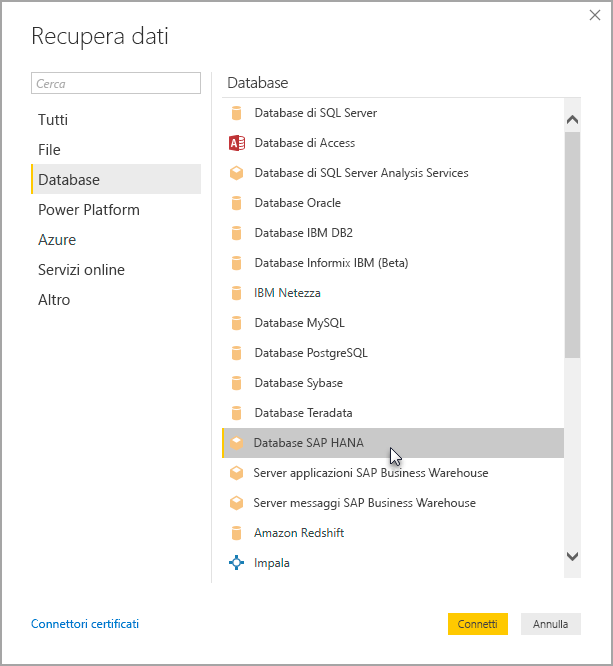
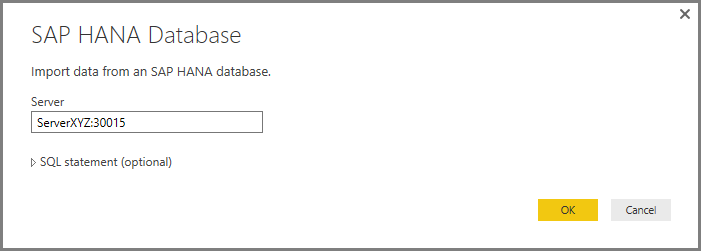

# Usare SAP HANA in Power BI Desktop
Con Power BI Desktop è ora possibile accedere ai database **SAP HANA** . Per usare **SAP HANA**, il driver ODBC di SAP HANA deve essere installato nel computer client locale in modo che la connessione dati **SAP HANA** di Power BI Desktop funzioni correttamente. È possibile scaricare il driver ODBC di SAP HANA da [SAP Software Download Center](https://support.sap.com/swdc). Da qui, cercare il CLIENT SAP HANA per i computer Windows. Dal momento che **SAP Software Download Center** cambia struttura di frequente, non sono disponibili indicazioni più specifiche per la navigazione.

Per connettersi a un database **SAP HANA**, selezionare **Recupera dati > Database > Database SAP HANA**, come illustrato nella figura seguente.

Quando ci si connette a un database SAP HANA, specificare il nome del server e la porta nel formato *server:porta*. L'immagine seguente mostra un esempio con un server denominato *ServerXYZ* e la porta *30015*.

In questa versione, **SAP HANA** in modalità [DirectQuery](desktop-use-directquery.md) è supportato in Power BI Desktop e nel servizio Power BI ed è possibile pubblicare e caricare report che usano **SAP HANA** in modalità DirectQuery nel servizio Power BI. È anche possibile pubblicare e caricare i report nel servizio Power BI se non si usa **SAP HANA** nella modalità DirectQuery.

### Funzionalità supportate per SAP HANA
Questa versione presenta molte funzionalità per **SAP HANA**, come illustrato nell'elenco seguente:

* Il connettore di Power BI per **SAP HANA** utilizza il driver ODBC di SAP, per fornire la migliore esperienza di utilizzo
* **SAP HANA** supporta le opzioni di DirectQuery e Import
* Power BI supporta modelli informativi HANA (ad esempio viste analitiche e di calcolo) e dispone di una struttura ottimizzata
* Con **SAP HANA** è possibile utilizzare anche la funzionalità SQL diretta per la connessione alle tabelle di Riga e Colonna
* Esso include la struttura ottimizzata per i modelli HANA
* Power BI supporta le variabili e i parametri di input di **SAP HANA**

### Installazione del driver ODBC di SAP HANA
### Limitazioni di SAP HANA
Esistono inoltre alcune limitazioni all'uso di **SAP HANA**, come illustrato di seguito:

* Le stringhe NVARCHAR vengono troncate alla lunghezza massima di 4000 caratteri Unicode
* SMALLDECIMAL non è supportato
* VARBINARY non è supportato
* Le date valide sono comprese tra 30/12/1899 e 31/12/9999

