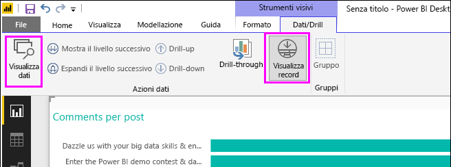
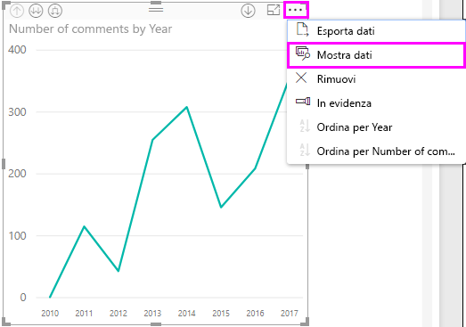
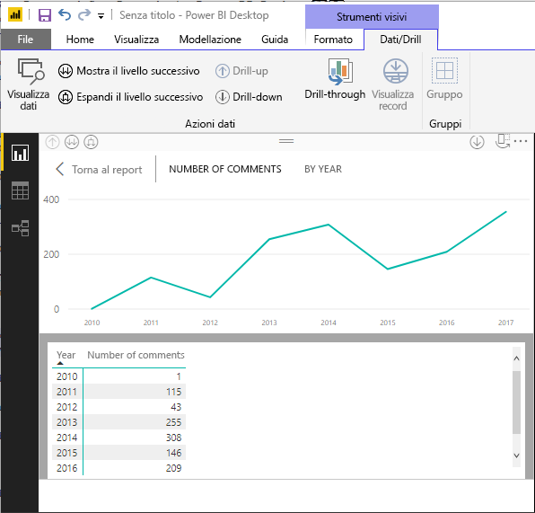
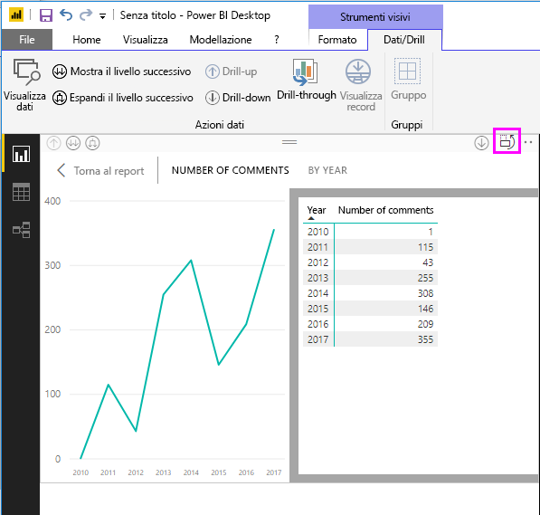
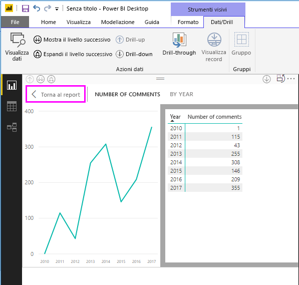
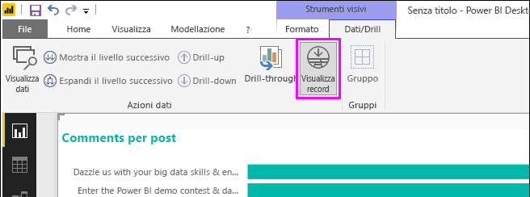
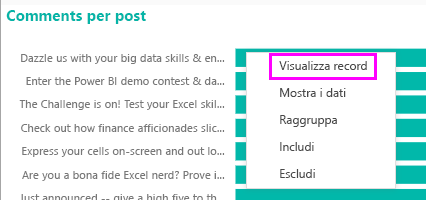
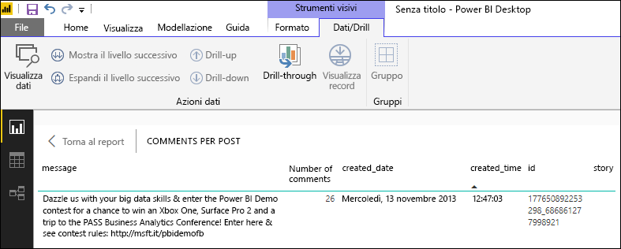
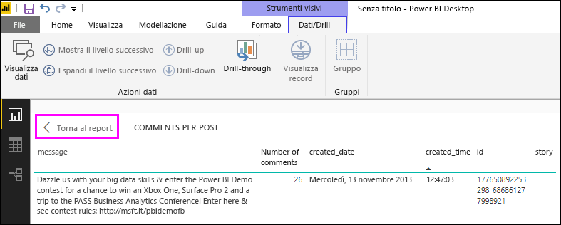

# Usare Visualizza dati e Visualizza record in Power BI Desktop
In **Power BI Desktop** è possibile esaminare i dettagli di una visualizzazione e visualizzare rappresentazioni testuali dei dati sottostanti o dei singoli record di dati per un oggetto visivo selezionato. Queste funzionalità vengono talvolta definite *click-through*, *drill-through* o *drill-through dei dettagli*.

È possibile usare **Visualizza dati** per visualizzare una versione testuale dei valori usati dalla visualizzazione selezionata o **Visualizza record** per visualizzare tutti i dati di un record o un punto dati selezionato. 

>[!IMPORTANT]
>**Visualizza dati** e **Visualizza record** supportano solo i tipi di visualizzazione seguenti:
>  - Grafico a barre
>  - Istogramma
>  - Grafico ad anello
>  - Mappa colorata
>  - Grafico a imbuto
>  - Mappa
>  - Grafico a torta
>  - Mappa ad albero

## Usare Visualizza dati in Power BI Desktop

**Visualizza dati** mostra i dati sottostanti una visualizzazione. Il pulsante **Visualizza dati** viene mostrato nella scheda **Dati/Drill** nella sezione **Strumenti visivi** della barra multifunzione quando viene selezionata una visualizzazione.

È possibile visualizzare i dati anche facendo clic con il pulsante destro del mouse su una visualizzazione e selezionando **Mostra dati** nel menu visualizzato oppure selezionando i puntini di sospensione (...) **Altre opzioni** nell'angolo superiore destro di una visualizzazione e quindi **Mostra dati**.

&nbsp;&nbsp;

> [!NOTE]
> Per rendere disponibile il menu di scelta rapida, posizionare il mouse su un punto dati nell'oggetto visivo.

Quando si seleziona **Visualizza dati** o **Mostra dati**, nel canvas di Power BI Desktop vengono visualizzate le rappresentazioni testuali e visive dei dati. Nella *visualizzazione orizzontale* l'oggetto visivo viene visualizzato nella metà superiore del canvas e i dati in quella inferiore. 

È possibile passare dalla visualizzazione orizzontale alla *visualizzazione verticale* selezionando l'icona nell'angolo in alto a destra del canvas.

Per tornare al report, selezionare **< Torna al report** nell'angolo in alto a sinistra del canvas.

## Usare Visualizza record in Power BI Desktop

È anche possibile concentrarsi su un solo record di dati in una visualizzazione e analizzare i dati sottostanti. Per usare **Visualizza record**, selezionare una visualizzazione, quindi **Visualizza record** nella scheda **Dati/Drill** nella sezione **Strumenti visivi** della barra multifunzione e infine selezionare un punto dati o una riga nella visualizzazione. 

> [!NOTE]
> Se il pulsante **Visualizza record** nella barra multifunzione è disabilitato e inattivo, significa che la visualizzazione selezionata non supporta **Visualizza record**.

È anche possibile fare clic con il pulsante destro del mouse su un elemento dati e selezionare **Visualizza record** nel menu visualizzato.

Quando si seleziona **Visualizza record** per un elemento dati, nel canvas di Power BI Desktop vengono visualizzati tutti i dati associati all'elemento selezionato. 

Per tornare al report, selezionare **< Torna al report** nell'angolo in alto a sinistra del canvas.

> [!NOTE]
>**Visualizza record** presenta le limitazioni seguenti:
> - Non è possibile modificare i dati nella vista **Visualizza record** e salvarli nel report.
> - Non è possibile usare **Visualizza record** quando l'oggetto visivo usa una misura calcolata.
> - Non è possibile usare **Visualizza record** quando si è connessi a un modello multidimensionale (MD) dinamico.

## Passaggi successivi
In **Power BI Desktop** esistono moltissime funzionalità di gestione dati e formattazione dei report. Dare un'occhiata alle risorse seguenti per alcuni esempi:

* [Usare il raggruppamento e la creazione di contenitori in Power BI Desktop](desktop-grouping-and-binning.md)
* [Usare le linee della griglia, il blocco alla griglia, l'ordine Z, l'allineamento e la distribuzione nei report di Power BI Desktop](desktop-gridlines-snap-to-grid.md)

