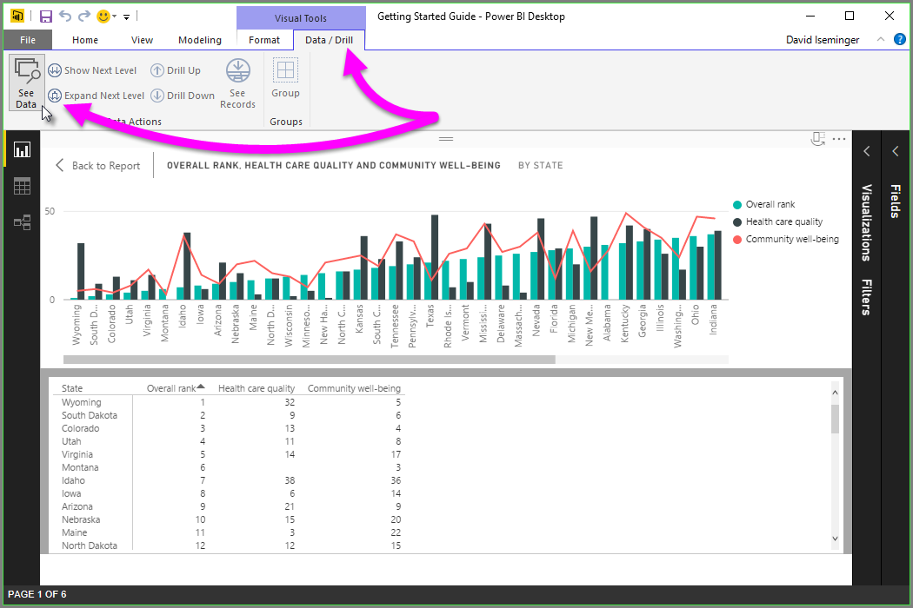
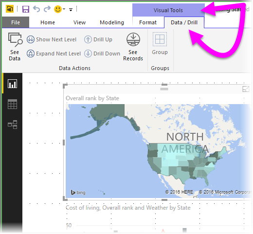
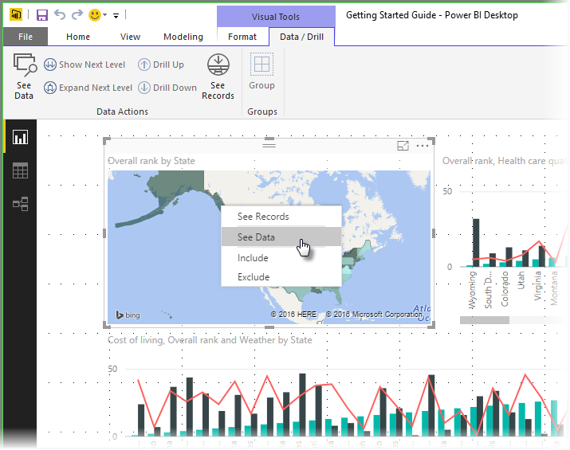
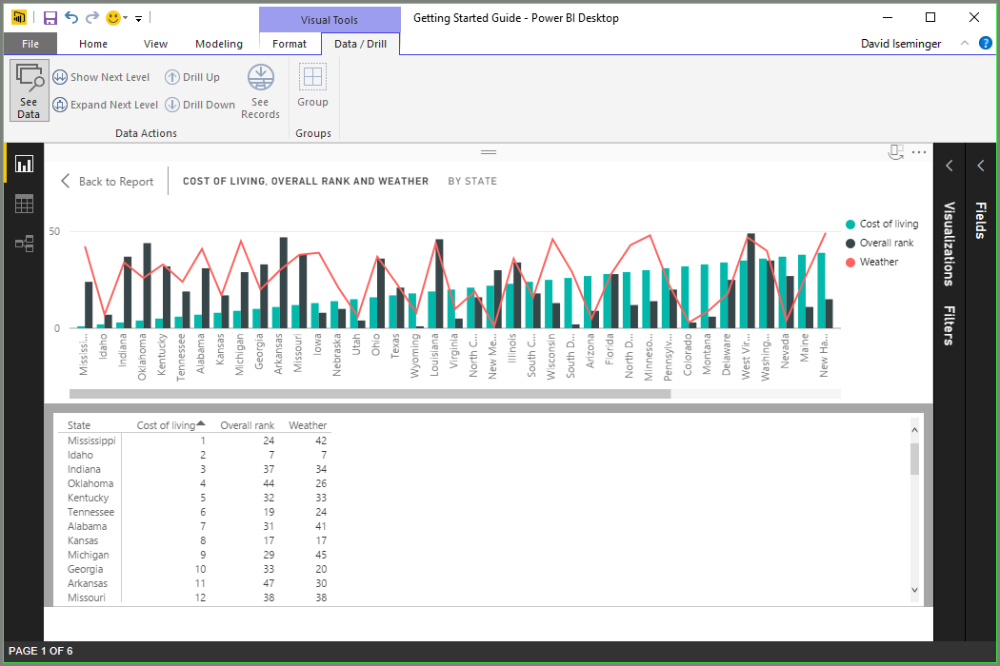
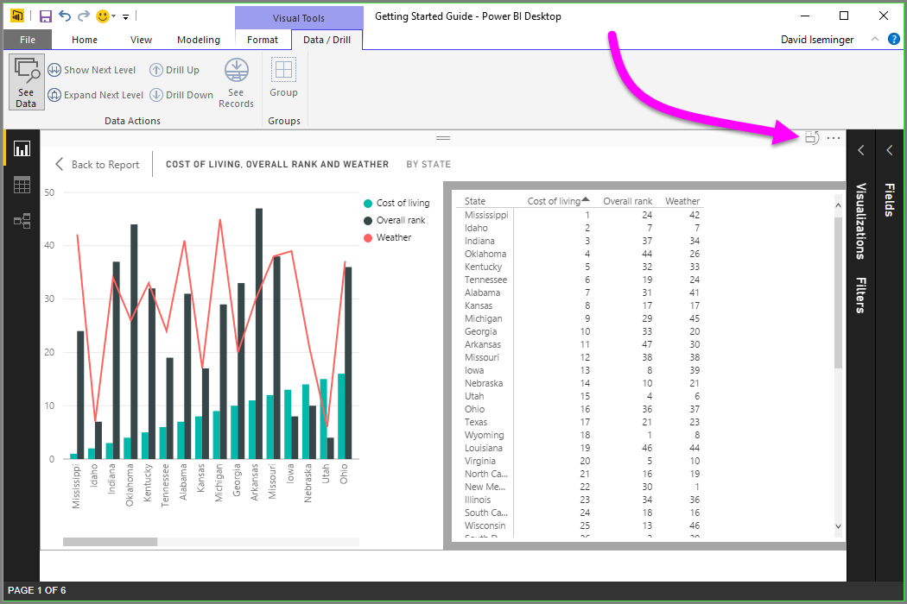
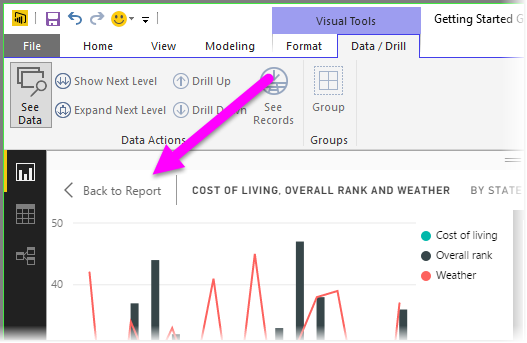
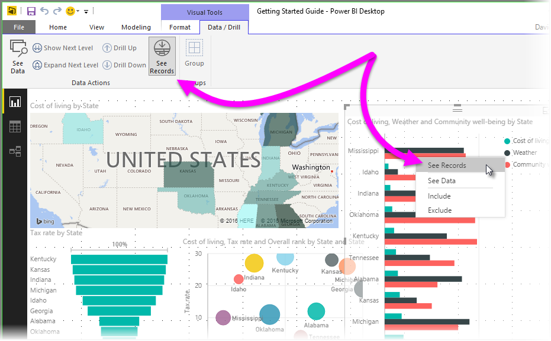
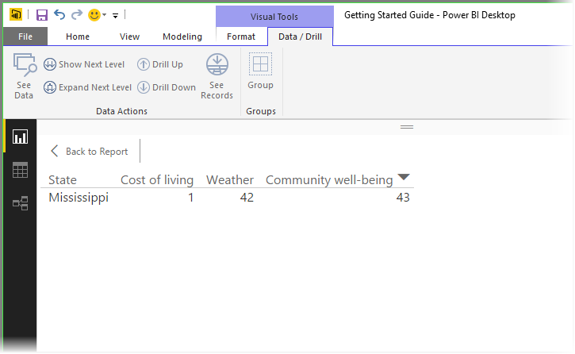

# Usare Visualizza dati e Visualizza record in Power BI Desktop
In **Power BI Desktop** è possibile esaminare i dettagli di qualsiasi oggetto visivo e visualizzare una rappresentazione testuale dei dati o dei singoli elementi di dati per un oggetto visivo selezionato. Queste funzionalità vengono talvolta definite come *click-through* o *drill-through* o *drill-through dei dettagli*.

È possibile usare **Visualizza record** per visualizzare le righe sottostanti per un elemento dati selezionato da un oggetto visivo o usare **Visualizza dati** per visualizzare una versione testuale dei valori usati nell'oggetto visivo. Esistono alcune limitazioni all'uso di **Visualizza dati** e **Visualizza record**, che sono descritte alla fine di questo articolo.

## Uso di Visualizza dati in Power BI Desktop
Il pulsante **Visualizza dati** si trova nella scheda **Dati/Drill** nella sezione **Strumenti visivi** della barra multifunzione.

È anche possibile scegliere **Visualizza dati** facendo clic su un oggetto visivo, quindi selezionando **Visualizza dati** dal menu visualizzato.

> [!NOTE]
> Per rendere disponibile il menu di scelta rapida, posizionare il mouse su un punto dati nell'oggetto visivo.
> 
> 

Quando si seleziona **Visualizza dati**, **Power BI Desktop** si concentra sull'oggetto visivo e sui dati selezionati e dedica lo spazio dell'area di disegno alla visualizzazione dell'oggetto visivo e della rappresentazione testuale dei dati. L'oggetto visivo è visualizzato nella metà superiore dell'area di disegno e i dati vengono visualizzati nella metà inferiore, come illustrato nella figura seguente. Si tratta della visualizzazione *orizzontale*.

È anche possibile passare a una *visualizzazione verticale* (o tornare alla *visualizzazione orizzontale*), selezionando l'icona nell'angolo in alto a destra.

Per tornare al report, selezionare **< Torna al report** nell'angolo in alto a sinistra dell'area di disegno.

## Uso di Visualizza record in Power BI Desktop
È anche possibile concentrarsi su un solo elemento dati in un oggetto visivo e analizzare i dati sottostanti. Dopo aver selezionato un oggetto visivo esistono due modi per usare **Visualizza record**; è possibile abilitare il commutatore **Visualizza record** nella barra multifunzione **Dati/Drill** e quindi fare clic su un elemento dati oppure è possibile fare clic con il pulsante destro del mouse su un elemento dati e selezionare **Visualizza record** dal menu visualizzato.

> [!NOTE]
> Se l'oggetto visivo selezionato non supporta **Visualizza record** il pulsante della barra multifunzione è inattivo.
> 
> 

Dopo aver selezionato **Visualizza record**, **Power BI Desktop** si concentra sul singolo elemento dati e dedica l'area di disegno alla visualizzazione dei dati per questo elemento, come illustrato nella figura seguente.

Per tornare al report, selezionare il pulsante **Torna al report** nell'angolo in alto a sinistra dell'area di disegno.

## Limitazioni
Esistono alcune limitazioni da considerare quando si usa **Visualizza dati** o **Visualizza record**:

* Sono supportati solo i tipi di oggetto visivo seguenti:
  * **Grafico a barre**
  * **Colonna**
  * **Mappa**
  * **Mappa ad albero**
  * **Mappa colorata**
  * **Grafico a torta**
  * **Grafico ad anello**
  * **Grafico a imbuto**
* Non è possibile usare **Visualizza record** quando l'oggetto visivo usa una misura calcolata
* Non è possibile usare **Visualizza record** quando si è connessi a un modello multidimensionale (MD) live

## Passaggi successivi
In **Power BI Desktop** esistono moltissime funzionalità di gestione dati e formattazione dei report. Dare un'occhiata alle risorse seguenti per alcuni esempi:

* [Usare il raggruppamento e la creazione di contenitori in Power BI Desktop](desktop-grouping-and-binning.md)
* [Usare le linee della griglia, il blocco alla griglia, l'ordine Z, l'allineamento e la distribuzione nei report di Power BI Desktop](desktop-gridlines-snap-to-grid.md)

