# Data shaping e combinazione di dati in Power BI Desktop
Con **Power BI Desktop**è possibile connettersi a molti tipi diversi di origini dati e quindi eseguire il data shaping in base alle esigenze. Per *data shaping* si intende la trasformazione dei dati, ad esempio rinominando colonne o tabelle, cambiando il testo in numeri, rimuovendo righe, impostando la prima riga come intestazione e così via. Per *combinazione* dei dati si intende la connessione di due o più origini dati, il data shaping necessario e quindi il consolidamento dei dati in un'unica query utile.

Questo articolo descrive come creare una query per il data shaping usando Power BI Desktop ed evidenzia alcune delle attività più comuni. La query usata in questo esempio viene descritta in modo più dettagliato, con indicazioni anche su come creare la query partendo da zero, in [Introduzione a Power BI Desktop](desktop-getting-started.md).

È utile sapere che l' **Editor di query** in Power BI Desktop usa ampiamente i menu di scelta rapida e la barra multifunzione. La maggior parte delle opzioni che è possibile selezionare nella scheda **Trasforma** della barra multifunzione è disponibile anche facendo clic con il pulsante destro del mouse su un elemento, ad esempio una colonna, e scegliendo un'opzione dal menu visualizzato.

## Data shaping
Quando si eseguono operazioni di data shaping nell'Editor di query, si forniscono istruzioni dettagliate, eseguite automaticamente dall'Editor di query, che permettono di modificare i dati durante la fase di caricamento e di presentazione nell'Editor di query. L'origine dati originale non subisce alcuna modifica. Viene modificata, o sottoposta a *data shaping*, solo questa vista specifica dei dati.

I passaggi specificati (ad esempio rinominare una tabella, trasformare un tipo di dati o eliminare colonne) vengono registrati dall'Editor di query ed eseguiti ogni volta che questa query si connette all'origine dati, in modo che i dati abbiano sempre la forma specificata. Questo processo si verifica ogni volta che si usa la funzionalità Editor di query di Power BI Desktop oppure per chiunque usi la query condivisa, ad esempio nel servizio **Power BI** . Questi passaggi vengono acquisiti, in sequenza, nel riquadro **Impostazioni query** in **Passaggi applicati**.

La figura seguente illustra il riquadro **Impostazioni query** per una query sottoposta a data shaping. Ogni passaggio verrà esaminato nei prossimi paragrafi.

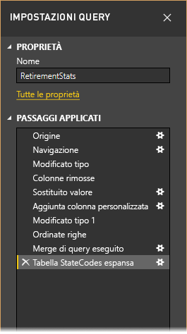

Usando i dati relativi al pensionamento disponibili in [Introduzione a Power BI Desktop](desktop-getting-started.md), ottenuti con una connessione a un'origine dati Web, verrà eseguito il data shaping in base alle esigenze.

Per i principianti, è possibile iniziare aggiungendo una colonna personalizzata per calcolare il rango in base al presupposto che tutti i dati siano fattori uguali e confrontarlo con la colonna esistente _Rank_.  Di seguito è illustrata la barra multifunzione **Aggiungi colonna** con una freccia rivolta verso il pulsante **Colonna personalizzata** che consente di aggiungere una colonna personalizzata.

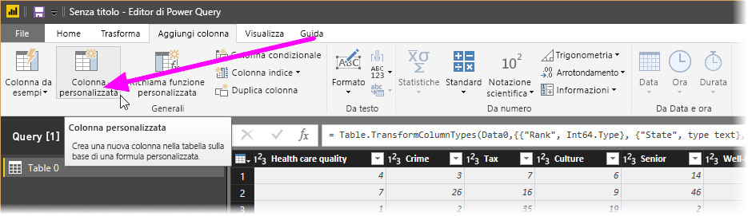

Nella finestra di dialogo **Colonna personalizzata**, in **Nome nuova colonna**, immettere _New Rank_ e in **Formula colonna personalizzata** immettere quanto segue:

    ([Cost of living] + [Weather] + [Health care quality] + [Crime] + [Tax] + [Culture] + [Senior] + [#"Well-being"]) / 8

Assicurarsi che il messaggio di stato sia _'Non sono stati rilevati errori di sintassi.'_ e fare clic su **OK**.

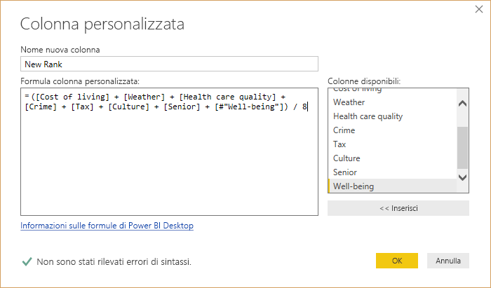

Per mantenere la coerenza dei dati della colonna, i nuovi valori della colonna verranno trasformati in numeri interi. È sufficiente fare clic con il pulsante destro del mouse sull'intestazione di colonna e quindi scegliere **Modifica tipo \> Numero intero** per modificarli. 

Se è necessario scegliere più di una colonna, selezionare prima di tutto una colonna e quindi, tenendo premuto **MAIUSC**, selezionare altre colonne adiacenti, infine fare clic con il pulsante destro del mouse su un'intestazione di colonna per modificare tutte le colonne selezionate. È anche possibile usare **CTRL** per selezionare colonne non adiacenti.

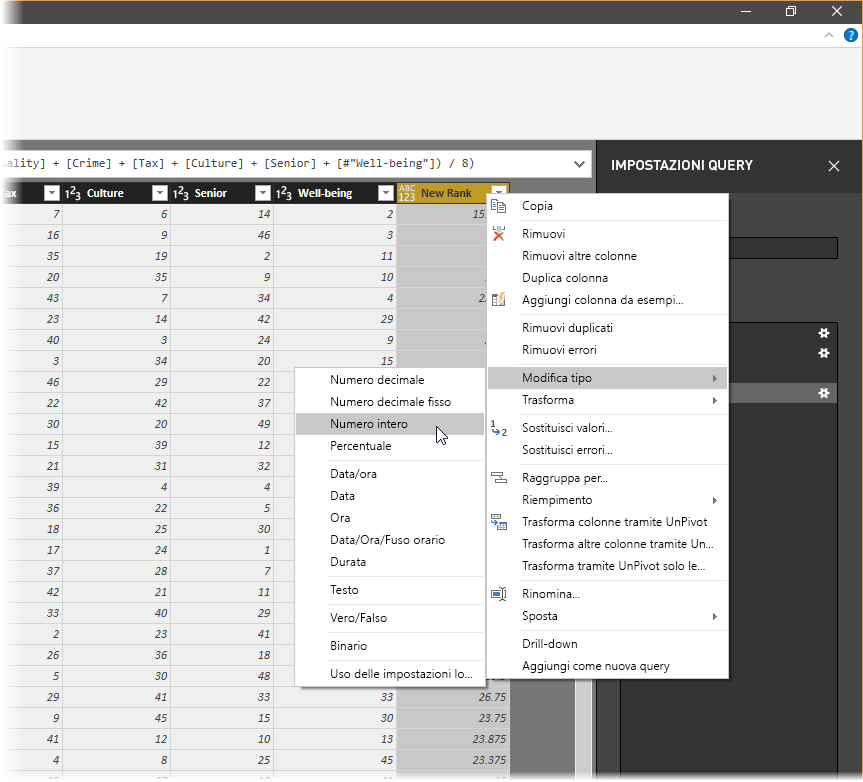

È anche possibile *trasformare* i tipi di dati delle colonne dalla barra multifunzione **Trasforma**. Di seguito è illustrata la scheda **Trasforma** della barra multifunzione, con una freccia che indica il pulsante **Tipo di dati** , che permette di trasformare il tipo di dati corrente in un altro.

Notare che in **Impostazioni query**la sezione **Passaggi applicati** riflette tutti i passaggi di data shaping applicati ai dati. Per rimuovere eventuali passaggi dal processo di data shaping, è sufficiente selezionare la **X** a sinistra del passaggio. Nell'immagine seguente la sezione **Passaggi applicati** riflette i passaggi eseguiti fino a questo punto: connessione al sito Web (**Origine**), selezione della tabella (**Navigazione**) e modifica automatica delle colonne di numeri basate su testo da *Testo* a *Numero intero* da parte dell'Editor di query durante il caricamento della tabella (**Modificato tipo**). Gli ultimi due passaggi mostrano le azioni precedenti con **Aggiunta colonna personalizzata** e **Tipo modificato 1**. 

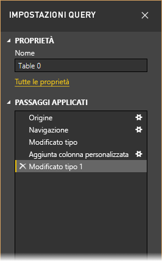

Prima di poter usare questa query, è necessario apportare alcune modifiche per ottenerne i dati nel punto desiderato:

* *Modificare il rango rimuovendo una colonna* - Si è deciso che **Cost of living** non è un fattore significativo nei risultati. Dopo la rimozione di questa colonna emerge un problema, ovvero i dati rimangono invariati. Si tratta di un problema semplice da risolvere con Power BI Desktop e in questo modo è possibile dimostrare una funzionalità interessante di **Passaggi applicati** nella query.
* *Correggere alcuni errori* - Dato che è stata rimossa una colonna, è necessario adattare i calcoli nella colonna **New Rank**. Ciò comporta la modifica di una formula.
* *Ordinare i dati* - In base alle colonne **New Rank** e **Rank**. 
* *Sostituire i dati* - Verrà illustrato come sostituire un valore specifico ed evidenziata la necessità di inserire un **passaggio applicato**.
* *Modificare il nome della tabella* - Il valore **Table 0** non è un descrittore utile, ma può essere modificato facilmente.

Per rimuovere la colonna **Cost of living**, è sufficiente selezionare la colonna e scegliere la scheda **Home** della barra multifunzione, quindi **Rimuovi colonne**, come mostrato nella figura seguente.

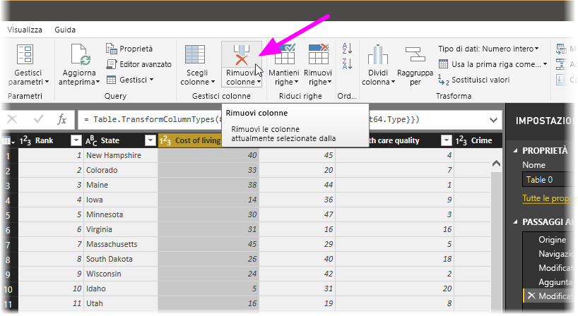

Si noti che i valori di _New Rank_ non sono cambiati, a causa dell'ordine dei passaggi. Poiché l'Editor di query registra i passaggi in sequenza, ma indipendentemente uno dall'altro, in **Passaggi applicati** è possibile spostare ogni passaggio applicato verso l'alto o verso il basso nella sequenza. È sufficiente fare clic con il pulsante destro del mouse su qualsiasi passaggio per visualizzare un menu in cui è possibile eseguire queste operazioni: **Rinomina**, **Elimina**, **Elimina** **fino alla fine** (per rimuovere il passaggio corrente insieme a tutti i passaggi successivi), **Sposta su**o **Sposta giù**. Procedere e passare all'ultimo passaggio _Rimosse colonne_ subito sopra il passaggio _Aggiunta colonna personalizzata_.

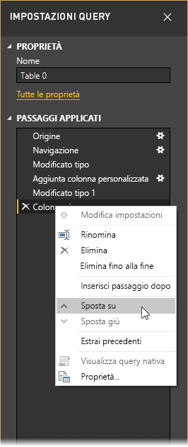

Selezionare quindi il passaggio _Aggiunta colonna personalizzata_. Si noti che i dati ora mostrano un _errore_ che sarà necessario risolvere. 

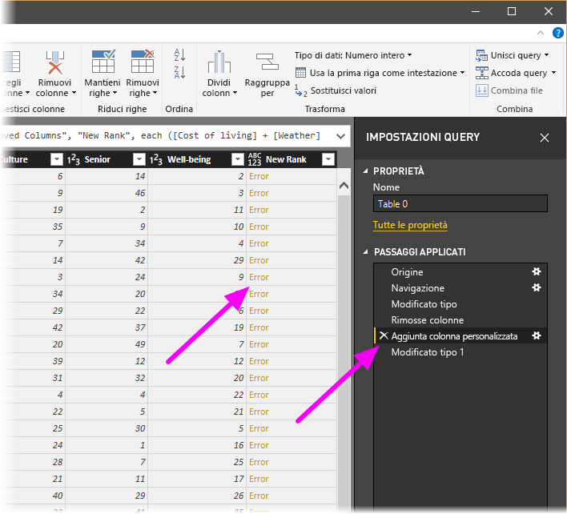

È possibile ottenere altre informazioni su ogni errore in diversi modi. È possibile selezionare la cella (senza fare clic sulla parola **Errore**) oppure fare clic direttamente sulla parola **Errore** . Se si seleziona la cella *senza* fare clic direttamente sulla parola **Errore**, l'Editor di query visualizza le informazioni sull'errore nella parte inferiore della finestra.

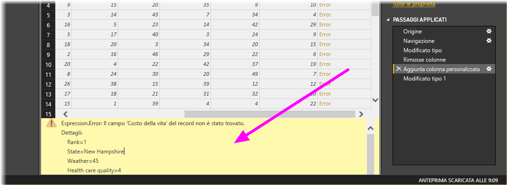

Se si fa clic direttamente sulla parola *Errore* , l'Editor di query crea una sezione **Passaggi applicati** nel riquadro **Impostazioni query** e visualizza le informazioni sull'errore. Questa non è la direzione prevista in questo caso, quindi selezionare **Annulla**.

Per risolvere gli errori, selezionare la colonna _New Rank_, quindi visualizzare la formula dei dati della colonna aprendo la scheda **Visualizza** della barra multifunzione e selezionando la casella di controllo **Barra della formula**. 

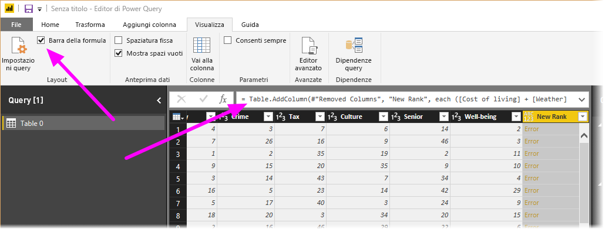

È ora possibile rimuovere il parametro _Cost of living_ e decrementare il divisore, modificando la formula come segue: 

    Table.AddColumn(#"Removed Columns", "New Rank", each ([Weather] + [Health care quality] + [Crime] + [Tax] + [Culture] + [Senior] + [#"Well-being"]) / 7)

Selezionare il segno di spunta verde a sinistra della casella della formula o premere **INVIO**. I dati dovrebbero essere sostituiti con i valori modificati e il passaggio **Aggiunta colonna personalizzata** dovrebbe essere ora completato *senza errori* .

> [!NOTE]
> È anche possibile usare **Rimuovi errori** (usando la barra multifunzione o il menu di scelta rapida), che rimuove tutte le righe che contengono errori. In questo caso, verrebbero rimosse tutte le righe dai dati, ma non è questo lo scopo, in quanto l'obiettivo è mantenere tutti i dati nella tabella.

È ora necessario ordinare i dati in base alla colonna **New Rank**. Selezionare prima di tutto l'ultimo passaggio applicato, **Tipo modificato 1** per ottenere i dati più recenti. Selezionare quindi l'elenco a discesa accanto all'intestazione di colonna **New Rank** e selezionare **Ordinamento crescente**.

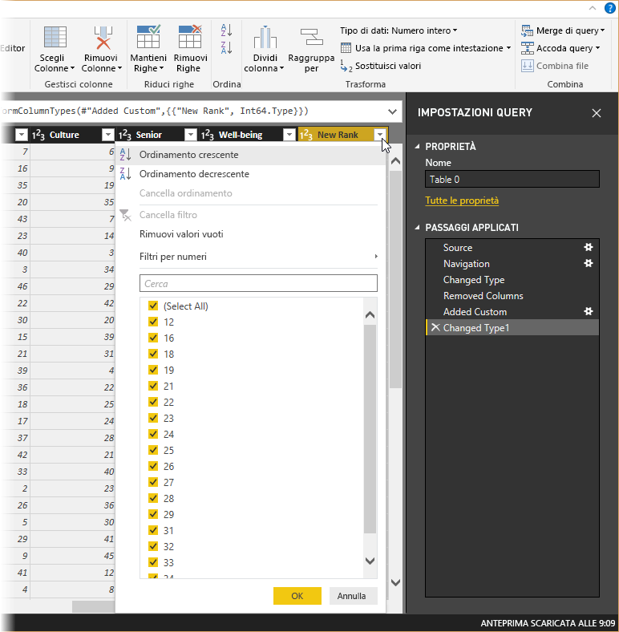

Si noti che i dati sono ora ordinati in base a **New Rank**.  Tuttavia, se si osserva la colonna **Rank**, si noterà che i dati non sono ordinati correttamente nei casi in cui il valore di **New Rank** è un valore equivalente. Per risolvere questo problema, selezionare la colonna **New Rank** e modificare la formula nella **Barra della formula** come segue:

    = Table.Sort(#"Changed Type1",{{"New Rank", Order.Ascending},{"Rank", Order.Ascending}})

Selezionare il segno di spunta verde a sinistra della casella della formula o premere **INVIO**. Le righe dovrebbero ora essere ordinate sia un base a _New Rank_ che a _Rank_.

In **Passaggi applicati** è anche possibile selezionare un passaggio in un punto qualsiasi dell'elenco e continuare con il data shaping in questo punto della sequenza. L'Editor di query inserirà automaticamente un nuovo passaggio dopo quello attualmente selezionato in **Passaggi applicati**. Verrà ora eseguito un tentativo.

Selezionare prima di tutto il **passaggio applicato** prima di aggiungere la colonna personalizzata. Dovrebbe trattarsi del passaggio _Rimosse colonne_. In questo esempio verrà sostituito il valore del rango _Weather_ in Arizona. Fare clic con il pulsante destro del mouse sulla cella appropriata che contiene il rango _Weather_ dell'Arizona e scegliere *Sostituisci valori* dal menu visualizzato. Notare il **passaggio applicato** attualmente selezionato, ovvero il passaggio prima del passaggio _Aggiunta colonna personalizzata_.

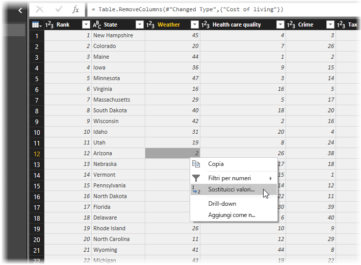

Poiché si sta inserendo un passaggio, l'Editor di query avvisa del pericolo di questa operazione: i passaggi successivi potrebbero causare l'interruzione della query. È necessario prestare estrema attenzione. Poiché si tratta di un'esercitazione e si sta evidenziando una funzionalità molto interessante dell'Editor di query per mostrare come creare, eliminare, inserire e riordinare i passaggi, continuare e selezionare **Inserisci**.

Modificare il valore in _51_. I dati per l'Arizona vengono sostituiti. Quando si crea un nuovo passaggio applicato, l'Editor di query assegna al passaggio un nome in base all'azione, in questo caso **Sostituito valore**. Quando sono presenti più passaggi con lo stesso nome nella query, l'Editor di query aggiunge un numero (in sequenza) a ogni passaggio **applicato successivo** per distinguerli.

Selezionare ora l'ultimo **passaggio applicato**, _Ordinate righe_e notare che i dati sono cambiati per il nuovo rango dell'Arizona.  Questo perché è stato inserito il passaggio _Sostituito valore_ nella posizione corretta, prima del passaggio _Aggiunta colonna personalizzata_.

Questo è un buon esempio delle potenzialità e della versatilità dell'Editor di query.

Infine, vien ora modificato il nome della tabella in uno più descrittivo. Per la creazione dei report, è particolarmente utile usare nomi di tabella descrittivi, soprattutto nel caso di una connessione a più origini dati, elencate tutte nel riquadro **Campi** della vista **Report** .

È facile modificare un nome di tabella: in **Proprietà** nel riquadro **Impostazioni query**è sufficiente digitare il nuovo nome della tabella, come mostrato nella figura seguente, e quindi premere **INVIO**. Questa tabella verrà denominata *RetirementStats*.

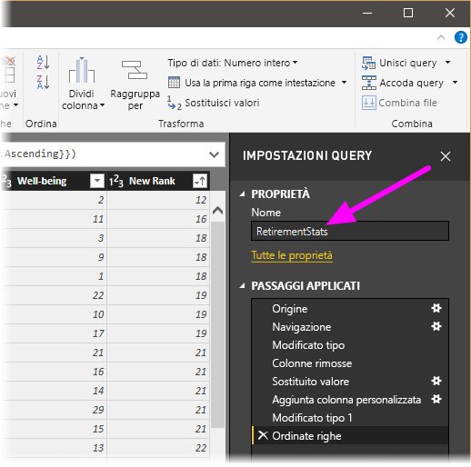

Il data shaping è stato completato nel modo desiderato. Ci si connetterà ora a un'altra origine dati per combinare i dati.

## Combinare i dati
I dati sui diversi stati sono interessanti e saranno utili per la creazione di analisi e query aggiuntivi. Esiste tuttavia un problema: la maggior parte dei dati usa un'abbreviazione di due lettere per i codici relativi allo stato, non il nome completo dello stato. È necessario trovare un modo per associare i nomi degli stati e le rispettive abbreviazioni.

Fortunatamente, è disponibile un'altra origine dati pubblica che esegue proprio questa operazione, ma è necessaria una quantità elevata di data shaping prima che sia possibile connettersi alla tabella relativa al pensionamento. La risorsa Web per le abbreviazioni dei nomi degli stati è la seguente:

<http://en.wikipedia.org/wiki/List_of_U.S._state_abbreviations>

Nella scheda **Home** della barra multifunzione nell'Editor di query selezionare **Nuova origine \> Web**, digitare l'indirizzo e selezionare **Connetti**. La finestra Strumento di navigazione mostrerà i dati trovati nella pagina Web.

 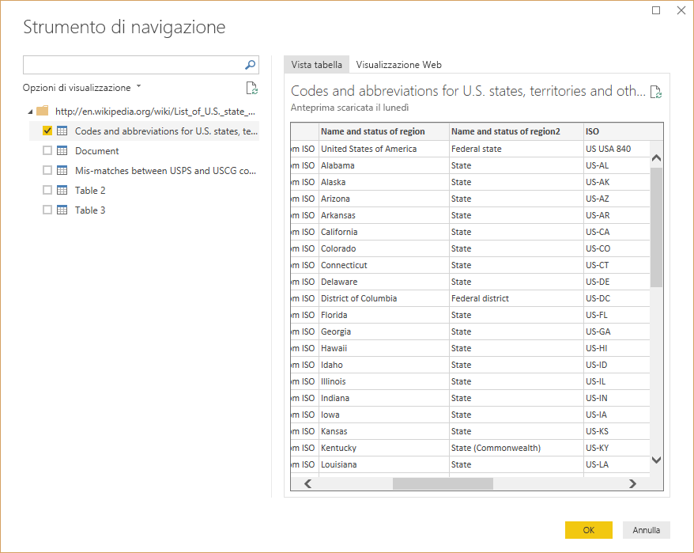

Selezionare **Codes and abbreviations** (Codici e abbreviazioni), perché include i dati desiderati, ma saranno necessarie alcune operazioni di data shaping per ridurre la quantità di dati della tabella nel modo desiderato.

> [!TIP]
> Esiste un modo più veloce o più semplice per eseguire la procedura seguente e cioè creare una *relazione* tra le due tabelle e modellare i dati in base a tale relazione. È comunque sufficiente apprendere le procedure seguenti per utilizzare le tabelle: occorre però tenere a mente che le relazioni possono aiutare a usare rapidamente i dati provenienti da più tabelle.
> 
> 

Per modellare questi dati, eseguire queste operazioni:

* Rimuovere la prima riga che è il risultato del modo in cui è stata creata la tabella della pagina Web, ma non è necessaria. Nella scheda **Home** della barra multifunzione selezionare **Riduci righe \> Rimuovi righe \> Rimuovi prime righe**.

Viene visualizzata la finestra **Rimuovi prime righe** , in cui è possibile specificare il numero di righe da rimuovere.

>[!NOTE]
>Se Power BI Importa accidentalmente le intestazioni di tabella come una riga nella tabella dati, è possibile selezionare **Usa la prima riga come intestazione** dalla scheda **Home** o dalla scheda **Trasforma** sulla barra multifunzione per correggere la tabella.

* Rimuovere le ultime 26 righe: sono relative a tutti i territori, che non è necessario includere. Nella scheda **Home** della barra multifunzione selezionare **Riduci righe \> Rimuovi righe \> Rimuovi ultime righe**.

* Dal momento che la tabella RetirementStats non contiene informazioni per Washington DC, è necessario escluderla dall'elenco con un filtro. Selezionare la freccia a discesa accanto alla colonna Region Status, quindi deselezionare la casella di controllo accanto a **Federal district**.

* Rimuovere alcune colonne superflue: poiché è necessario solo il mapping dello stato alla rispettiva abbreviazione di due lettere ufficiale, è possibile rimuovere queste colonne: **Column1**, **Column3**, **Column4** e quindi da **Column6** a **Column11**. Selezionare prima **Column1** e, tenendo premuto **CTRL**, selezionare le altre colonne da rimuovere (in questo modo, è possibile selezionare più colonne non contigue). Nella scheda Home della barra multifunzione selezionare **Rimuovi colonne \> Rimuovi colonne**.

>[!NOTE]
>È utile notare che la *sequenza* dei passaggi applicati nell'Editor di query è importante e può influire sul data shaping. È anche importante valutare l'eventuale impatto di un passaggio su un passaggio successivo. Se si rimuove un passaggio in Passaggi applicati, i passaggi successivi potrebbero non dare gli stessi risultati previsti inizialmente, a causa dell'impatto della sequenza di passaggi della query.

>[!NOTE]
>Quando si ridimensiona la finestra dell'Editor di query per ridurne la larghezza, alcuni elementi della barra multifunzione vengono compressi per ottimizzare l'uso dello spazio visibile. Quando si aumenta la larghezza della finestra dell'Editor di query, gli elementi della barra multifunzione vengono estesi per ottimizzare l'uso dell'area ingrandita.

* Rinominare le colonne e la tabella stessa: come al solito, esistono alcuni modi per rinominare una colonna: selezionare prima la colonna e quindi selezionare **Rinomina** nella scheda **Trasforma** della barra multifunzione oppure fare clic con il pulsante destro del mouse e scegliere **Rinomina**. dal menu visualizzato. L'immagine seguente contiene delle frecce che puntano a entrambe le opzioni; è sufficiente sceglierne solo una.

Rinominare le colonne in *State Name* e *State Code*. Per rinominare la tabella, è sufficiente digitare il nome nella casella **Nome** nel riquadro **Impostazioni query** . Rinominare la tabella in *StateCodes*.

Una volta eseguito il data shaping della tabella StateCodes nel modo desiderato, è possibile combinare le due tabelle o query in una sola. Poiché le tabelle ora disponibili sono il risultato delle query applicate ai dati, vengono spesso chiamate *query*.

È possibile combinare le query in due modi principali, ovvero tramite *merge* e *accodamento*.

Quando sono presenti una o più colonne da aggiungere a un'altra query, è consigliabile eseguire il **merge** delle query. Quando sono presenti righe aggiuntive di dati da aggiungere a una query esistente, è consigliabile **accodare** la query.

In questo caso verrà eseguita l'unione delle query. Per iniziare, dal riquadro sinistro dell'Editor di query è necessario selezionare la query *in cui* si vuole eseguire il merge dell'altra query, che in questo caso è *RetirementStats*. Selezionare quindi **Combina \> Merge di query** nella scheda **Home** della barra multifunzione.

Potrebbe essere richiesto di impostare i livelli di privacy, per garantire che i dati vengano combinati senza includere o trasferire dati che non devono essere trasferiti.

Verrà quindi visualizzata la finestra **Merge**, che richiede di selezionare la tabella di cui eseguire il merge nella tabella selezionata e quindi le colonne corrispondenti da usare per il merge. Selezionare State nella tabella (query) *RetirementStats* e quindi la query *StateCodes*. L'operazione è molto semplice in questo caso perché è presente solo un'altra query. In caso di connessione a molte origini dati, le query tra cui scegliere sono numerose. Quando si selezionano le colonne corrispondenti corrette, ovvero **State** di *RetirementStats* e **State Name** di *StateCodes*, la finestra **Merge** avrà un aspetto analogo al seguente e il pulsante **OK** sarà abilitato.

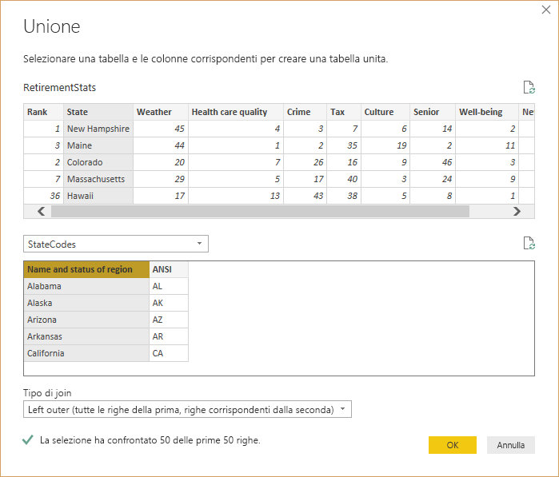

Alla fine della query viene creato un oggetto **NewColumn** , che include i contenuti della tabella (query) dopo il merge con la query esistente. Tutte le colonne della query sottoposta a merge vengono condensate in **NewColumn**, ma è possibile selezionare **Espandi** per la tabella e includere le colonne desiderate.

Per espandere la tabella sottoposta a merge e selezionare le colonne da includere, selezionare l'icona di espansione (). Verrà visualizzata la finestra **Espandi** .

Poiché in questo caso è necessaria solo la colonna **State Code**, selezionare solo questa colonna e quindi scegliere **OK**. Deselezionare la casella di controllo Usa il nome della colonna originale come prefisso, perché non è necessario. Se si lascia selezionata questa opzione, la colonna sottoposta a merge verrà denominata **NewColumn.State Code** (con il nome della colonna originale, **NewColumn**, seguito da un punto e quindi dal nome della colonna da inserire nella query).

>[!NOTE]
>È possibile scegliere diversi modi per inserire la tabella **NewColumn**. È possibile fare alcune prove e, se i risultati non sono quelli desiderati, sarà sufficiente eliminare il passaggio dall'elenco **Passaggi applicati** nel riquadro **Impostazioni query**. La query tornerà allo stato precedente all'applicazione del passaggio **Espandi**. È possibile ripetere più volte l'operazione, fino a ottenere il risultato desiderato dal processo di espansione.

È ora disponibile una singola query (tabella) che combina due origini dati, ognuna delle quali è stata sottoposta a data shaping per soddisfare le esigenze specifiche. Questa query può essere usata come base per connessioni dati aggiuntive e interessanti, ad esempio le statistiche relative ai costi delle abitazioni, i dati demografici o le opportunità di lavoro in ogni stato.

Per applicare le modifiche e chiudere l'Editor di query, selezionare **Chiudi e applica** nella scheda **Home** della barra multifunzione. Il set di dati trasformato viene visualizzato in Power BI Desktop, pronto per l'uso nella creazione di report.

## Passaggi successivi
Power BI Desktop offre infinite possibilità. Per altre informazioni sulle capacità disponibili, vedere le risorse seguenti:

* [Introduzione a Power BI Desktop](desktop-getting-started.md)
* [Panoramica delle query con Power BI Desktop](desktop-query-overview.md)
* [Origini dati in Power BI Desktop](desktop-data-sources.md)
* [Connettersi ai dati in Power BI Desktop](desktop-connect-to-data.md)
* [Attività di query comuni in Power BI Desktop](desktop-common-query-tasks.md)   

