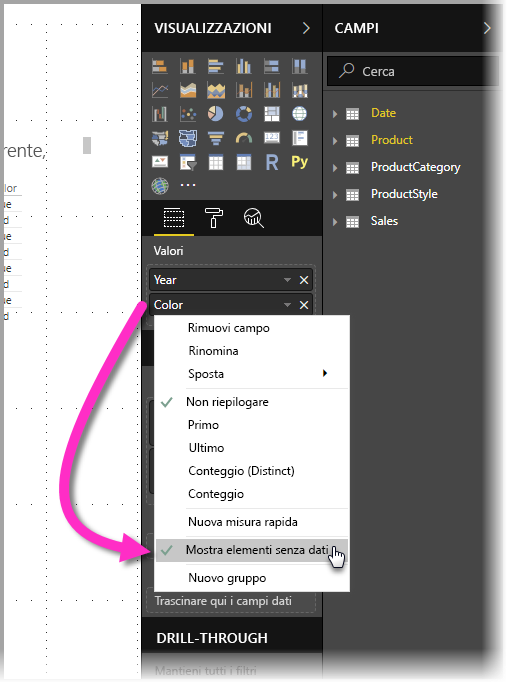
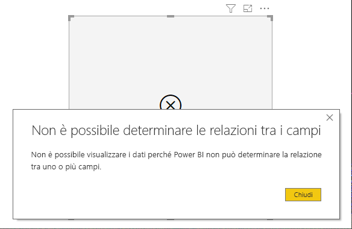
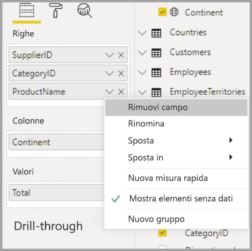

# Visualizzare elementi senza dati in Power BI

Power BI consente di visualizzare tutti i tipi di dati da varie origini. Quando si crea un oggetto visivo, Power BI mostra solo i dati rilevanti in modo da poter gestire correttamente la modalità di presentazione e visualizzazione dei dati. Power BI determina quali dati sono rilevanti in base alla configurazione dell'oggetto visivo e al modello di dati sottostante. Questo articolo descrive il comportamento di Power BI per determinare i dati rilevanti, con esempi che illustrano come vengono prese queste decisioni.

## Determinare i dati rilevanti

Per iniziare a comprendere come Power BI determina quali dati sono rilevanti per la visualizzazione, si consideri una tabella come semplice esempio. Usando il modello rappresentato nel [modello di dati di esempio](#example-data-model), alla fine di questo articolo, prendere in considerazione la creazione di una tabella con le impostazioni seguenti:

**1. Gruppi dalla stessa tabella:** *Prodotto[Colore] - Prodotto[Misura]*

|*Prodotto[Colore]*  |*Prodotto[Misura]*  |
|---------|---------|
|Blu     |Grande         |
|Blu     |Media         |
|Blu     |Piccola         |
|Rosso     |Grande         |

In questo esempio, Power BI visualizza le combinazioni di *[Colore-Misura]* presenti nella tabella *[Prodotto]* . 

Si esamini ora una diversa combinazione:

**2. Gruppi da tabelle diverse ma correlate direttamente e una misura:** *StileProdotto[Finitura] - Prodotto[Colore] - Somma(Vendite[Quantità])*

|*StileProdotto[Finitura]*  |*Prodotto[Colore]*  |*[SommaQuantità]*  |
|---------|---------|---------|
|Lucido     |Blu         |10         |
|Opaco     |Blu         |15         |

In questo esempio, Power BI visualizza solo le combinazioni esistenti. Ad esempio, non visualizzerà ("Nessuno" + "Blu") o ("Opaco" + "Rosso") perché queste combinazioni non esistono nel modello. La condizione che determina quali combinazioni esistono è un valore non vuoto per *Somma(Vendite[Quantità])* .

Si esamini ora un caso diverso: 

**3. Gruppi da tabelle diverse ma correlate e nessuna misura:** *StileProdotto[Finitura] - Prodotto[Colore]*

|*StileProdotto[Finitura]*  |*Prodotto[Colore]*  |
|---------|---------|
|Lucido     |Blu         |
|Lucido     |Rosso         |
|Opaco     |Blu         |

Poiché non è presente alcuna misura esplicita e le due tabelle sono direttamente correlate, Power BI tenta di inserire una misura per vincolare le combinazioni risultanti. In questo caso, Power BI inserisce una misura *CALCULATE(COUNTROWS('Prodotto'))* che non deve essere vuota, perché *Prodotto* è la tabella comune a entrambe le tabelle.

Power BI visualizza quindi le combinazioni con elementi nella tabella Prodotto, escludendo pertanto le combinazioni *("Nessuno" + "Blu")* e *("Opaco" + "Rosso")* .

**4. Gruppi da tabelle diverse e non correlate**

Il modello di esempio non include questa combinazione, ma se esistessero gruppi da tabelle diverse e non correlate, Power BI non sarebbe in grado di correlare due colonne e il risultato sarebbe un crossjoin di tutti i valori di ogni colonna. In un caso come questo, Power BI genera un errore di tipo *join senza vincoli*, perché tali cross join sono onerosi per il calcolo nel database e non offrono molte informazioni agli utenti. 

## Visualizzazione degli elementi senza dati

Nella sezione precedente è stato descritto come Power BI determina quali dati sono rilevanti per la visualizzazione. A volte, tuttavia, può essere *necessario* mostrare gli elementi senza dati. 

La funzionalità **Mostra elementi senza dati** consente di ottenere esattamente questo risultato: includere le righe di dati e le colonne che non contengono dati di misura (valori di misura vuoti).

Per abilitare la funzionalità **Mostra elementi senza dati**, selezionare un oggetto visivo e quindi nel riquadro **Campi** fare clic con il pulsante destro del mouse sul campo e scegliere **Mostra elementi senza dati** dal menu visualizzato, come illustrato nell'immagine seguente:

La funzionalità **Mostra elementi senza dati** *non* ha effetti nei casi seguenti:

* Non è stata aggiunta una misura all'oggetto visivo e le colonne di raggruppamento provengono dalla stessa tabella
* I gruppi non sono correlati. Power BI non esegue query per gli oggetti visivi con gruppi non correlati
* La misura non è correlata ad alcun gruppo, questo perché la misura non sarà mai vuota solo per alcune combinazioni di gruppi
* È presente un filtro di misura definito dall'utente che esclude le misure vuote, ad esempio: *ImportoVendite > 0*

### Come funziona la funzionalità Mostra elementi senza dati

I casi d'uso più interessanti della funzionalità **Mostra elementi senza dati** si verificano in presenza di misure. Esaminiamo la situazione in cui i gruppi provengono dalla stessa tabella o possono essere correlati tramite un percorso nel modello. Ad esempio, *StileProdotto* è direttamente correlato a *Prodotto* e indirettamente correlato a *Vendite*, *StileProdotto* e *CategoriaProdotto* possono essere correlati tramite la tabella *Prodotto* e così via.

Di seguito verranno esaminati un paio di casi interessanti, confrontando i risultati con la funzionalità **Mostra elementi senza dati** attivata o non attivata. 

**1. Raggruppamento di colonne dalla tabella stessa:** *Prodotto[Colore] - Prodotto[Misura] - Somma(Vendite[Quantità])*

Visualizzazione con la funzionalità **Mostra elementi senza dati** disattivata:

|*Prodotto[Colore]*  |*Prodotto[Misura]*  |*[SommaQuantità]*  |
|---------|---------|---------|
|Blu     |Media         |15         |
|Blu     |Piccola         |10         |

Visualizzazione con la funzionalità **Mostra elementi senza dati** attivata:

|*Prodotto[Colore]*  |*Prodotto[Misura]*  |*[SommaQuantità]*  |
|---------|---------|---------|
|Blu     |Grande         |         |
|Blu     |Media         |15         |
|Blu     |Piccola         |10         |
|Rosso     |Grande         |         |

Si noti che vengono visualizzate due nuove combinazioni quando la funzionalità è attivata: *Blu - Grande* e *Rosso - Grande*. Per entrambi questi elementi non è disponibile un valore *Quantità* corrispondente nella tabella *Vendite*. Tuttavia, compaiono nella tabella *Prodotto*.

**2. Raggruppamento di colonne da tabelle correlate:** *StileProdotto[Finitura] - Prodotto[Colore] - Somma(Vendite[Quantità])*

Visualizzazione con la funzionalità **Mostra elementi senza dati** disattivata:

|*StileProdotto[Finitura]*  |*Prodotto[Colore]*  |*[SommaQuantità]*  |
|---------|---------|---------|
|Lucido     |Blu         |10         |
|Opaco     |Blu         |15         |

Visualizzazione con la funzionalità **Mostra elementi senza dati** attivata:

|*StileProdotto[Finitura]*  |*Prodotto[Colore]*  |*[SommaQuantità]*  |
|---------|---------|---------|
|Lucido     |Blu         |10         |
|Lucido     |Rosso         |         |
|Opaco     |Blu         |15         |
|Nessuna     |         |         |

Si noti che *(Lucido-Rosso)* e *(Nessuno, vuoto)* sono state visualizzate come combinazioni. Ecco il motivo per che cui sono state visualizzate:
* Power BI ha preso prima di tutto in considerazione StileProdotto[Finitura] e selezionato tutti i valori per la visualizzazione, con il risultato Lucido, Opaco, Nessuno.
* Usando ognuno di questi valori, Power BI ha selezionato tutti gli elementi *Prodotto [Colore]* corrispondenti 
* Dato che *Nessuno* non corrisponde ad alcun *Prodotto[Colore]* , per tale valore viene visualizzato uno spazio vuoto

È importante notare che il meccanismo di selezione dei valori per le colonne è dipendente dall'ordine e può essere paragonato a un'operazione di *outer join sinistro* tra tabelle. Se viene modificato l'ordine delle colonne, cambieranno anche i risultati.

Di seguito verrà esaminato un esempio di modifica dell'ordine e del relativo impatto sui risultati. L'esempio è lo stesso dell'elemento **2** in questa sezione, con modifica dell'ordinamento.

**Prodotto[Colore] - StileProdotto[Finitura] - Somma(Vendite[Quantità])**

Visualizzazione con la funzionalità **Mostra elementi senza dati** attivata:

|*Prodotto[Colore]* |*StileProdotto[Finitura]*  |*[SommaQuantità]*  |
|---------|---------|---------|
|Blu     |Lucido         |10         |
|Blu     |Opaco         |15         |
|Rosso     |Lucido         |         |

In questo caso, si noti che*StileProdotto[Finitura]=Nessuno* non compare nella tabella. Il motivo è che, in questo caso, Power BI ha prima di tutto selezionato tutti i valori *Colore* nella tabella *Prodotto*. Per ogni colore, Power BI ha selezionato i valori *Finitura* corrispondenti contenenti dati. Dato che *Nessuno* non compare in alcuna combinazione di *Colore*, non viene selezionato.

## Comportamento degli oggetti visivi in Power BI

Quando l'opzione **Mostra elementi senza dati** è abilitata in un unico campo di un oggetto visivo, la funzionalità viene abilitata automaticamente per tutti gli altri campi presenti nella stessa gerarchia o nello stesso *bucket dell'oggetto visivo*. Una gerarchia o un bucket di un oggetto visivo può essere costituito dal relativo **Asse** o **Legenda** oppure da **Categoria**, **Righe** o **Colonne**.

In un oggetto visivo Matrice con quattro campi nel bucket **Righe**, se l'opzione **Mostra elementi senza dati** è abilitata per un campo, lo è anche per tutti gli elementi della matrice. Nell'immagine seguente l'opzione **Mostra elementi senza dati** è abilitata nel primo campo del bucket **Righe**, ovvero il campo *SupplierID*. L'opzione è quindi abilitata automaticamente anche negli altri campi del bucket **Righe**.

Al contrario, per il campo *Continent* visualizzato nel bucket **Colonne**, l'opzione **Mostra elementi senza dati** *non* è abilitata automaticamente. 

Questo comportamento viene riscontrato spesso quando un oggetto visivo viene convertito in un tipo diverso, ad esempio da Matrice a Tabella. In tali conversioni, l'opzione **Mostra elementi senza dati** viene abilitata automaticamente per i campi spostati in un bucket che contiene un campo in cui è abilitata la funzionalità. Nell'esempio precedente, se per il campo *SupplierID* è abilitata la funzionalità **Mostra elementi senza dati** e l'oggetto visivo viene convertito in una tabella, il campo *Continent* del bucket **Colonne** viene spostato (insieme ai campi del bucket **Righe**) nell'unico bucket usato in un oggetto visivo Tabella, ovvero il bucket **Valori**. Di conseguenza, per tutti i campi del bucket **Valori** sarà abilitata l'opzione **Mostra elementi senza dati**.

### Esportazione dei dati

Quando si usa la funzionalità per l'**esportazione dei dati di riepilogo**, il comportamento di **Mostra elementi senza dati** equivale a quello riscontrato quando l'esportazione viene convertita in un oggetto visivo Tabella. Di conseguenza, quando si esporta un oggetto visivo, ad esempio di tipo Matrice di grafico, i dati esportati possono apparire in modo diverso rispetto all'oggetto visivo visualizzato. Ciò è dovuto al fatto che la conversione in un oggetto visivo Tabella, come parte del processo di esportazione, consentirebbe di abilitare **Mostra elementi senza dati** per tutti i campi esportati. 

## Modello di dati di esempio

In questa sezione viene illustrato il modello di dati di esempio usato negli esempi in questo articolo.

**Modello**: 

**Dati**:

|Prodotto[IdProdotto]|    Prodotto[NomeProdotto]|   Prodotto[Colore]| Prodotto[Misura]|  Prodotto[IdCategoria]|    Prodotto[IdStile]|
|---------|---------|---------|---------|---------|---------|
|1  |Prod1  |Blu   |Piccola  |1  |1 |
|2  |Prod2  |Blu   |Media |2  |2 |
|3  |Prod3  |Rosso    |Grande  |1  |1 |
|4  |Prod4  |Blu   |Grande  |2  |2 |

|CategoriaProdotto[IdCategoria]|   CategoriaProdotto[NomeCategoria]|
|---------|---------|
|1  |Layout   |
|2  |Fotocamera |
|3  |TV |

|StileProdotto[IdStile]| StileProdotto[Finitura]|   StileProdotto[Lucido]|
|---------|---------|---------|
|1  |Lucido  |Sì |
|2  |Opaco  |No |
|3  |Nessuna   |No |

|Vendite[IdVendita]| Vendite[IdProdotto]|   Vendite[Data]|    Vendite[Quantità]|
|---------|---------|---------|---------|
|1  |1  |1/1/2012 0:00| 10 |
|2  |2  |1/1/2013 0:00| 15 |

## Passaggi successivi

In questo articolo è stato descritto come abilitare la funzionalità **Mostra elementi senza dati** di Power BI. Potrebbero essere interessanti anche gli articoli seguenti: 

* [Membro predefinito nei modelli multidimensionali in Power BI Desktop](desktop-default-member-multidimensional-models.md)
