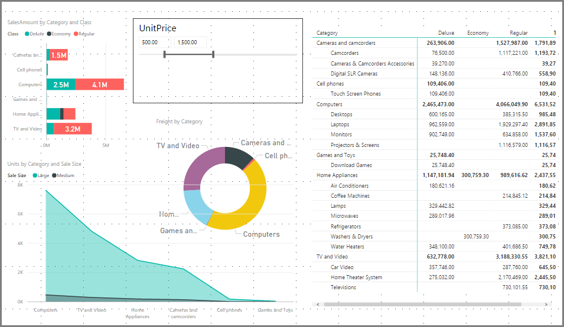
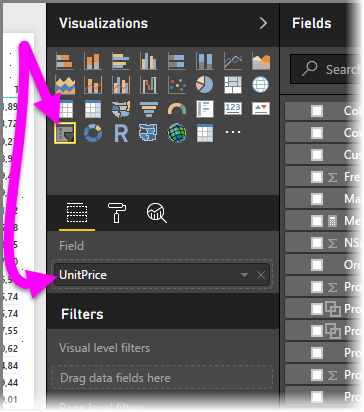
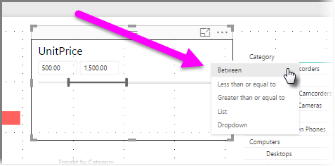
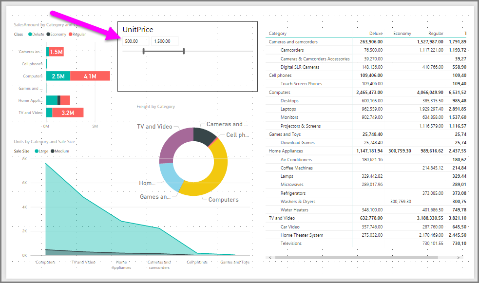
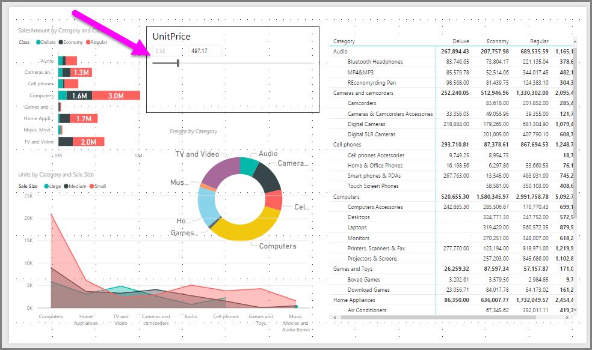
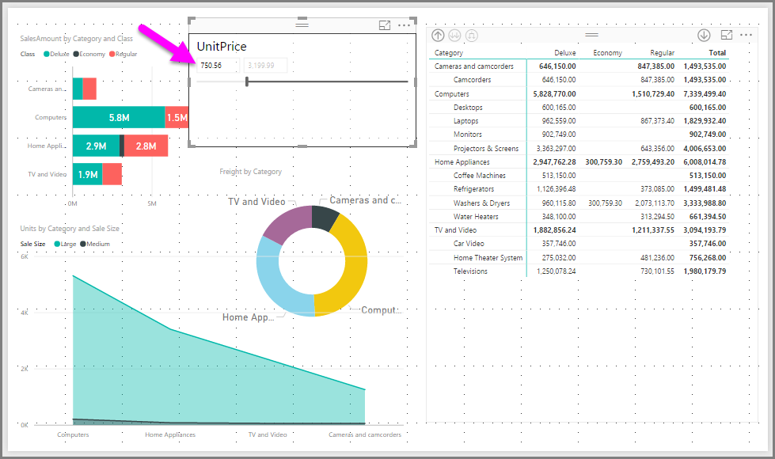

# Usare il filtro dei dati per l'intervallo numerico in Power BI Desktop
Con il **filtro dei dati per l'intervallo numerico**, è possibile applicare qualsiasi filtro a qualsiasi colonna numerica nel modello di dati. Si può decidere di usare il filtro **Tra** su più numeri oppure **Minore o uguale a** o **Maggiore o uguale a** rispetto a un numero. Anche se può sembrare semplice, è un modo molto efficace per filtrare i dati.

## Uso del filtro dei dati per l'intervallo numerico
È possibile usare il filtro dei dati per l'intervallo numerico come qualsiasi altro filtro dei dati. È sufficiente creare un oggetto visivo **filtro dei dati** per il report e quindi selezionare un valore numerico per il valore **Campo**. Nell'immagine seguente è selezionato il campo *UnitPrice*.

Selezionare la freccia in giù nell'angolo in alto a destra del **filtro dei dati per l'intervallo numerico** per visualizzare un menu.

Per l'intervallo numerico è possibile selezionare una delle tre opzioni seguenti:

* Tra
* Minore o uguale a
* Maggiore o uguale a

Quando si seleziona **Tra**, viene visualizzato un dispositivo di scorrimento che consente di applicare il filtro ai valori numerici compresi tra i numeri specificati. Oltre a usare la barra del dispositivo di scorrimento, è possibile fare clic nelle due caselle e digitare i valori. Questo risulta utile quando occorre filtrare in base a specifici numeri interi ma la granularità del dispositivo di scorrimento rende difficile selezionare il numero esatto.

Nell'immagine seguente la pagina del report è filtrata in base ai valori *UnitPrice* compresi tra 500 e 1500.

Quando si seleziona **Minore o uguale a**, il punto di controllo a sinistra (valore più basso) della barra del dispositivo di scorrimento scompare ed è possibile modificare solo il limite superiore della barra stessa. Nell'immagine seguente la barra del dispositivo di scorrimento è impostata su 497,17.

Infine, quando si seleziona **Maggiore o uguale a**, il punto di controllo a destra (valore più alto) della barra del dispositivo di scorrimento scompare ed è possibile modificare solo il valore inferiore, come mostrato nell'immagine seguente. A questo punto, negli oggetti visivi nella pagina del report vengono visualizzati solo gli elementi il cui valore *UnitPrice* è superiore o uguale a 750,56.

## Allineamento ai numeri interi con il filtro dei dati per l'intervallo numerico (anteprima)

A partire dalla versione di febbraio 2018 di **Power BI Desktop**, il filtro dei dati per l'intervallo numerico verrà allineato ai numeri interi. In questo modo il filtro dei dati sarà allineato correttamente ai numeri interi. L'allineamento ai numeri interi non si applica ai filtri decimali.

## Limitazioni e considerazioni
Per il **filtro dei dati per l'intervallo numerico** è opportuno tenere presenti queste limitazioni e considerazioni.

* Il **filtro dei dati per l'intervallo numerico** attualmente filtra tutte le righe sottostanti nei dati, non i valori aggregati. Ad esempio, se si usa un filtro *Sales Amount*, viene filtrata ogni transazione basata su *Sales Amount*, non la somma di *Sales Amount* per ogni punto dati di un oggetto visivo.
* Attualmente non funziona con le misure
* Al momento il **filtro dei dati per l'intervallo numerico** è disponibile solo in **Power BI Desktop**. Se un report che usa il **filtro dei dati per l'intervallo numerico** viene pubblicato nel **servizio Power BI**, il filtro verrà comunque applicato ma verrà visualizzato come filtro dei dati elenco.

