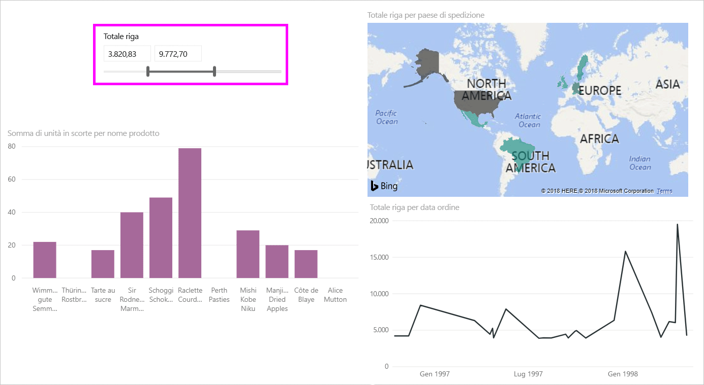
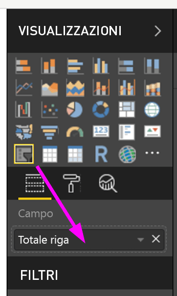
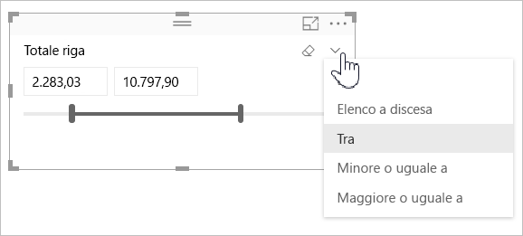
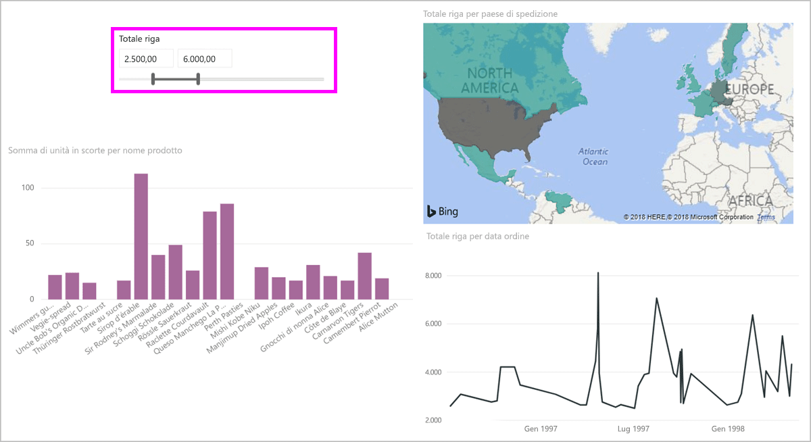
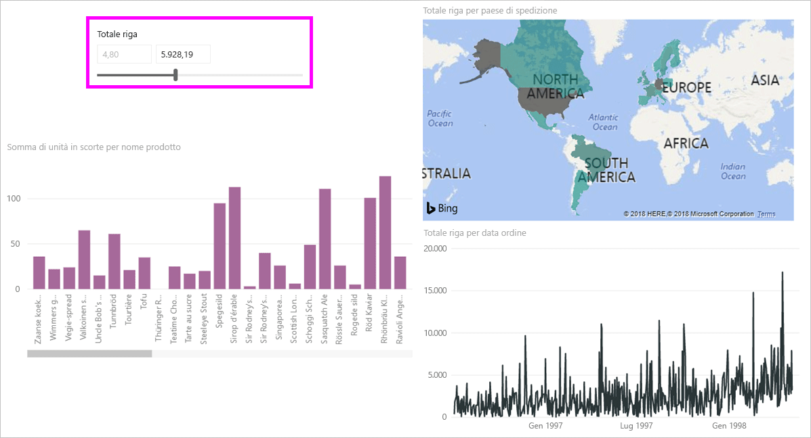
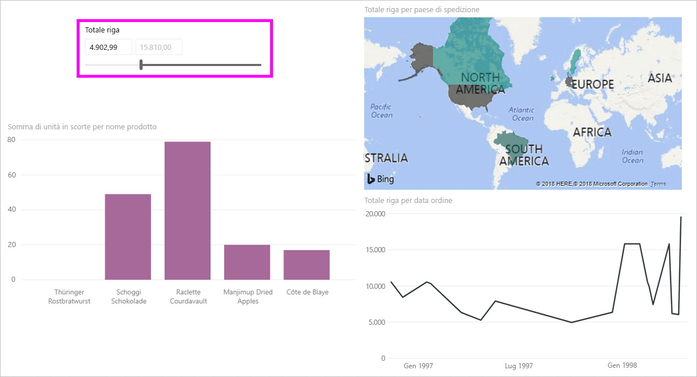

# Usare il filtro dei dati per l'intervallo numerico in Power BI

[!INCLUDE [applies-to](includes/applies-to.md)] [!INCLUDE [yes-desktop](includes/yes-desktop.md)] [!INCLUDE [yes-service](includes/yes-service.md)]

Con il filtro dei dati per l'intervallo numerico è possibile applicare qualsiasi filtro a qualsiasi colonna numerica nel modello di dati. Per filtrare i dati numerici sono disponibili tre opzioni: tra numeri, minore o uguale a un numero oppure maggiore o uguale a un numero. Questa semplice tecnica è un modo efficace per filtrare i dati.

## video

In questo video verrà illustrata la creazione di un filtro dei dati per l'intervallo numerico.

> [!NOTE]
> Questo video usa una versione precedente di Power BI Desktop.

<iframe width="560" height="315" src="https://www.youtube.com/embed/zIZPA0UrJyA" frameborder="0" allowfullscreen></iframe> 

## Aggiungere un filtro dei dati per l'intervallo numerico

È possibile usare il filtro dei dati per l'intervallo numerico proprio come si userebbe qualsiasi altro filtro dei dati. È sufficiente creare un oggetto visivo **filtro dei dati** per il report e quindi selezionare un valore numerico per il valore **Campo**. Nell'immagine seguente è stato selezionato il campo **LineTotal**.

Selezionare la freccia verso il basso nell'angolo in alto a destra del filtro dei dati per l'intervallo numerico per visualizzare un menu.

Per l'intervallo numerico è possibile selezionare una delle tre opzioni seguenti:

* **Tra**
* **Minore o uguale a**
* **Maggiore o uguale a**

Quando si seleziona **Tra** dal menu, viene visualizzato un dispositivo di scorrimento. È possibile usare il dispositivo di scorrimento per selezionare i valori numerici compresi tra i numeri. A volte la granularità del dispositivo di scorrimento rende difficile selezionare il numero esatto. È anche possibile usare il dispositivo di scorrimento e selezionare una delle caselle per digitare i valori desiderati. Questa opzione è utile quando si vuole filtrare i dati in base a numeri specifici.

Nell'immagine seguente la pagina del report filtra i valori **LineTotal** compresi tra 2500,00 e 6000,00.

Quando si seleziona **Minore o uguale a**, il punto di controllo a sinistra (valore più basso) della barra del dispositivo di scorrimento scompare ed è possibile modificare solo il limite superiore della barra stessa. Nell'immagine seguente il valore massimo della barra del dispositivo di scorrimento è impostato su 5928,19.

Infine, quando si seleziona **Maggiore o uguale a**, il punto di controllo a destra (valore più alto) della barra del dispositivo di scorrimento scompare. È quindi possibile modificare il valore più basso, come illustrato nell'immagine seguente. A questo punto, negli oggetti visivi della pagina del report vengono visualizzati solo gli elementi il cui valore **LineTotal** è maggiore o uguale a 4902,99.

## Allineamento ai numeri interi con il filtro dei dati per l'intervallo numerico

Un filtro dei dati per l'intervallo numerico si allinea a numeri interi se i dati del campo sottostante sono di tipo *Numero intero*. Questa funzionalità consente al filtro dei dati di allinearsi correttamente ai numeri interi. I campi *Numero decimale* consentono di immettere o selezionare le frazioni di un numero. La formattazione impostata nella casella di testo corrisponde a quella impostata nel campo, anche se è possibile digitare o selezionare numeri più precisi.

## Visualizzare la formattazione con il filtro dei dati dell'intervallo di date

Quando si usa un filtro dei dati per visualizzare o impostare un intervallo di date, queste vengono visualizzate nel formato *Data breve*. Il formato della data è determinato dalle impostazioni locali del browser o del sistema operativo dell'utente. Di conseguenza, sarà il formato di visualizzazione indipendentemente dalle impostazioni del tipo di dati per il modello o i dati sottostanti.

È possibile, ad esempio, avere un formato di data estesa per il tipo di dati sottostante. In questo caso, un formato di data quale ad esempio *gggg, MMMM g, aaaa* determinerebbe la formattazione di una data in altri oggetti visivi o in altre circostanze come *Mercoledì, Marzo 14, 2001*. Ma nel filtro dei dati per l'intervallo di date, questa data viene visualizzata come *03/14/2001*.

La visualizzazione del formato Data breve nel filtro dei dati assicura che la lunghezza della stringa rimanga coerente e compatta nel filtro.

## Limitazioni e considerazioni

Per il filtro dei dati per l'intervallo numerico è opportuno tenere presenti queste limitazioni e considerazioni:

* Il filtro dei dati per l'intervallo numerico filtra tutte le righe sottostanti nei dati, non i valori aggregati. Si supponga, ad esempio, di usare un campo *Sales Amount* (Importo vendite). Il filtro dei dati filtrerà ogni transazione in base all'importo delle vendite, non alla somma dell'importo delle vendite per ogni punto dati di un oggetto visivo.
* Attualmente non funziona con le misure.
* È possibile digitare qualsiasi numero in un filtro dei dati numerico, anche se non è compreso nell'intervallo di valori nella colonna sottostante. Questa opzione consente di configurare filtri se si sa che in futuro i dati possono cambiare.
