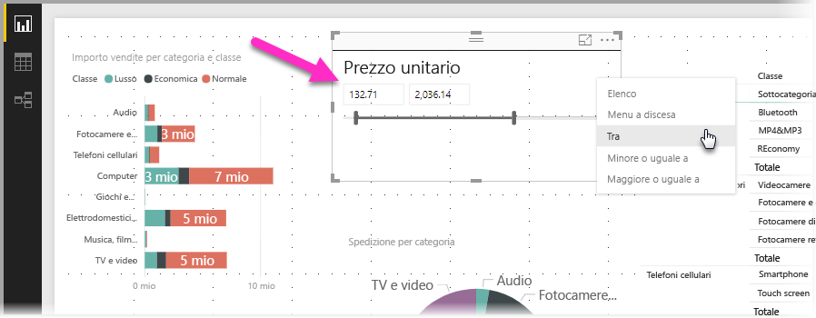
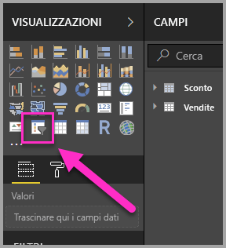
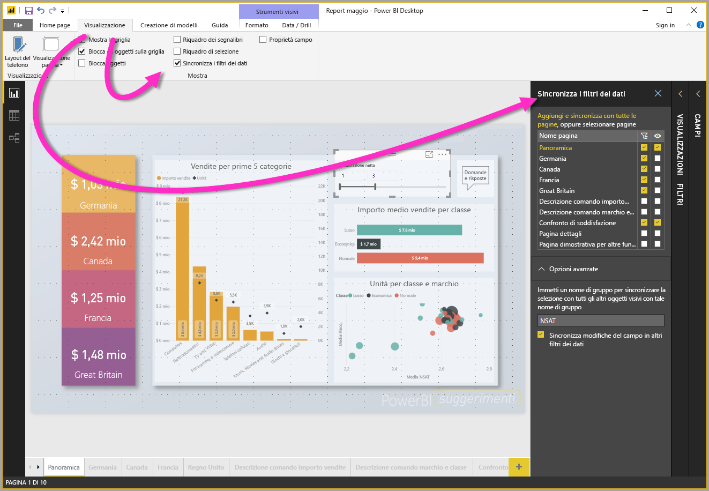
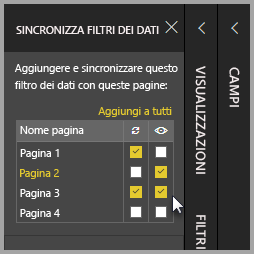

# Uso dei filtri dei dati in Power BI Desktop

È possibile usare un **filtro dei dati** in **Power BI Desktop** per filtrare i risultati degli oggetti visivi nella pagina del report. Con i filtri dei dati è anche possibile modificare facilmente il filtro applicato interagendo con il filtro dei dati stesso. È anche possibile specificare opzioni per la modalità di visualizzazione del filtro dei dati e le modalità di interazione. La figura seguente mostra un filtro dei dati con il relativo menu a discesa del *tipo* visibile. 

Un filtro dei dati può essere visualizzato da uno di vari tipi:

* Elenco
* Menu a discesa
* Tra
* Minore o uguale a
* Maggiore o uguale a

È possibile aggiungere un filtro dei dati a un report facendo clic sull'oggetto visivo **filtro dei dati** nel riquadro **Visualizzazioni**.

I filtri dei dati hanno un comportamento analogo in **Power BI Desktop** e nel **servizio Power BI**. Per un'esercitazione sull'uso dei filtri dei dati, vedere [Filtri dei dati nel servizio Power BI (esercitazione)](power-bi-visualization-slicers.md).

## Sincronizzare i filtri dei dati nelle pagine del report

In **Power BI Desktop** è possibile sincronizzare i filtri dei dati in più pagine del report. Per sincronizzare i filtri dei dati, nel riquadro **Visualizza** nella barra multifunzione selezionare **Sincronizza filtri dei dati**. Quando si sincronizzano i filtri dei dati, viene visualizzato il riquadro **Sincronizza filtri dei dati**, come illustrato nella figura seguente.

Nel riquadro **Sincronizza filtri dei dati** è possibile specificare la modalità di sincronizzazione del filtro dei dati nelle pagine del report. È possibile specificare se ogni filtro dei dati deve essere **applicato** a ogni singola pagina del report e se il filtro dei dati deve essere **visibile** in ogni singola pagina del report.

Ad esempio, è possibile inserire un filtro dei dati nella **pagina 2** del report, come illustrato nella figura seguente. È quindi possibile specificare se tale filtro dei dati si *applica* a ogni pagina selezionata e se deve essere *visibile* in ogni pagina selezionata nel report. È possibile applicare qualsiasi combinazione di queste opzioni per ogni filtro dei dati. 

Se si usa il collegamento **Aggiungi a tutti** nel riquadro, il filtro dei dati selezionato viene applicato a tutte le pagine nel report.

Si noti che le selezioni visualizzate nel riquadro **Sincronizza filtri dei dati** si applicano solo al *filtro dei dati selezionato*. È possibile applicare più filtri dei dati a varie pagine e usare il riquadro per definire come applicare ogni filtro dei dati singolarmente nelle varie pagine del report. 

Anche se è possibile sincronizzare i filtri dei dati selezionati, altre selezioni *non* vengono sincronizzate, ad esempio l'applicazione di stili, le modifiche e l'eliminazione. 

## Passaggi successivi

Potrebbero essere interessanti anche gli articoli seguenti:

* [Filtri dei dati nel servizio Power BI (esercitazione)](power-bi-visualization-slicers.md)
* [Usare il filtro dei dati per l'intervallo numerico in Power BI Desktop](desktop-slicer-numeric-range.md)
* [Usare un filtro dei dati e un filtro per la data relativa in Power BI Desktop](desktop-slicer-filter-date-range.md)

